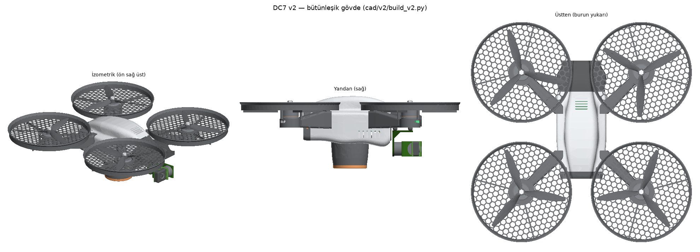

# cad/ — DC7 parametrik 3B modelleri

Gövde (GEPRC MOZ7 V2), motorlar ve elektronik hazır alınır; **kendimize özel parçaların** hepsi burada
kodla (CadQuery) tanımlanır. Ölçüyü değiştirip yeniden üretmek tek komuttur. Ayrıntılı yaklaşım:
[docs/11 §5](../docs/11-yazilim-oncesi-hazirlik.md).

| Dosya | İçerik |
|---|---|
| `params.py` | Tüm ölçüler (mm): gövde, pervane, koruma, tutamak, kamera, gimbal, üst katlar, malzeme yoğunlukları |
| `layout.py` | CadQuery gerektirmez: ağırlık merkezi, batarya konumu, devrilme açısı, kamera/sensör görüş alanı kontrolleri |
| `prop_guard.py` | Pervane koruması: halka + alt ağ (≤ 10 mm göz) ve motor bağlantı parçası (×4) |
| `palm_grip.py` | Avuç tutamağı: tüp, sensör tablası (CM3 Wide + VL53L8CX, tabandan 25 mm içeride), TPU tampon |
| `gimbal_2axis.py` | 2 eksen gimbal: beşik (kızaklı), roll kolu, üst parça, taşıyıcı kol; denge ve çakışma kontrolü |
| `top_deck.py` | Companion tepsisi (Pi 5 + AI HAT+), batarya plakası ve isteğe bağlı havalandırmalı kabuk |
| `analysis.py` | CadQuery gerektirmez: gimbal taşıyıcı kolu ve sönümleyici titreşimi, koruma direği dayanımı |
| `standins.py` | Satın alınan parçaların görsel temsilleri (gövde, motor, pervane, Pi, batarya, GNSS …) |
| `visual.py` | Renk–malzeme–yüzey (CMF) tanımları |
| `build.py` | Hepsini üretir: `out/stl/*.stl` (baskı), `out/step/*.step` (CAD), `out/dc7_assembly.glb` (Blender), `out/report.md`, önizlemeler |
| `render_blender.py` | Fotogerçekçi render (Blender 4.5 / Cycles): GLB + `visual.py` malzemeleri → `out/render/*.png`; `--model v1 \| v2` |
| [`v2/`](v2/) | **Bütünleşik (DJI tarzı) gövde**: kalıplanabilir kabuklar, tek kalıptan 4 kol–kanal modülü, burun bölmesinde gimbal, akıllı batarya — [docs/12](../docs/12-butunlesik-govde-ve-seri-uretim.md) |

## Çalıştırma

```bash
python3 cad/layout.py                 # yalnızca PyYAML: ağırlık merkezi + görüş alanı + tasarım kuralları
pip install cadquery matplotlib       # Windows / macOS / Linux, Python 3.10–3.12
python3 cad/build.py                  # ≈ 30 s: STL + STEP + rapor + önizleme
python3 -m unittest tests.test_cad    # CadQuery varsa parça testleri de çalışır
```

STL dosyaları ve önizlemeler depoya eklenmiştir; STEP dosyaları (≈ 6 MB) `build.py` ile üretilir.

## v2 — bütünleşik gövde (`cad/v2/`)

```bash
python3 cad/v2/layout_v2.py       # yalnızca PyYAML: yerleşim, ağırlık merkezi, 10 kural
python3 cad/v2/analysis_v2.py     # kol–kanal modülü titreşimi ve düşme dayanımı
python3 cad/v2/build_v2.py        # CadQuery, ≈ 5 dk: STL/STEP/GLB, çakışma + DFM kontrolleri, v2/out/report.md
pip install bpy==4.5.3 && python cad/render_blender.py --model v2 --samples 96   # render (Python 3.11)
python3 -m unittest tests.test_v2 # CadQuery varsa parça testleri de çalışır
```

| Dosya | İçerik |
|---|---|
| `v2_params.py` | Gövde kesit istasyonları, burun (gimbal) bölmesi, batarya, kanal, kol, malzemeler, CAD ağırlık merkezleri |
| `layout_v2.py` | Bileşen yerleşimi, batarya konumu çözümü (CG = motor merkezi), kanal/EMI/IMU/avuç kontrolleri |
| `analysis_v2.py` | Değişken kesitli kol + uç kütlesi (Stodola): dikey/yanal frekans, kesit taraması, düşme |
| `airframe.py` | Üst kabuk, alt kabuk (taşıyıcı), burun kapağı, kol–kanal modülü, avuç ayağı, akıllı batarya |
| `build_v2.py` | Montaj, çakışma (kol, batarya, gimbal hareketi, pervane, kartlar) ve DFM kuralları, kütle ↔ profil |




## Güncel sonuçlar (`out/report.md`)

| Parça grubu | Bütçe | Model | Not |
|---|---:|---:|---|
| Pervane koruması (4 takım) | 110 g | 101,6 g (PA-CF) | Çan ağızlı halka, konik ayaklı direkler; ağ, pervane alanının %20'sini kapatır → itki kaybı itki standında ölçülür. `MESH_SECTOR_DEG = 180` (yalnızca gövdeye bakan yarı): 92,6 g, %13 |
| Avuç tutamağı | 40 g | 42,7 g | Belli PETG tüp, yuvarlak köşeli pencereler, yuvarlak kenarlı TPU tampon; PA-CF tüple ≈ 39 g |
| 2 eksen gimbal (motorlar dahil) | 85 g | 88,6 g | Radyuslu L parçalar, köşebentli üst parça, 8 mm kaburgalı taşıyıcı kol; çakışma yok; pitch dengesizliği 0,28 mm |
| Üst plakalar + kabuk | 60 g* | 45,1 g | Kabuk isteğe bağlı (13,5 g); *bütçe kablolama ve bağlantıları da kapsar |

Yerleşim: ağırlık merkezi yatayda merkezde (batarya x = −15,4 mm). Gimbal kamerasının görüşü
−90…+15° arası temiz → `behavior.yaml` yazılım sınırı +15°. Motorlar kapalıyken tutamak tabanında
devrilme açısı 14,6° → avuçta düz tutun, temastan sonra tutamağı kavrayın. Yerden kalkış için
Ø150 mm sökülebilir ayak (29°) önerilir.

## Baskı önerileri

| Parça | Malzeme | Ayar |
|---|---|---|
| Koruma halkası, bağlantı, gimbal, plakalar | PA-CF (veya PETG: ≈ %15 daha ağır) | 0,4 mm nozul, 3 çevre çizgisi, %40 dolgu (ince duvarlar zaten tam dolu) |
| Tutamak tüpü, sensör tablası | PETG / PA-CF | Tüp ters (flanş tablada), destek yok |
| Tampon | TPU 95A | Yavaş (20–30 mm/s) |

PA-CF için sertleştirilmiş nozul ve kurutulmuş filament gerekir. Delikler M3 3,3 mm, M2 2,3 mm,
M2 kendinden kılavuzlu vida pilot deliği 1,8 mm olarak modellenmiştir; yazıcınıza göre `params.py`
içinde ayarlayın.

## Ölç → güncelle → yeniden üret

`params.py` içinde "tahmini" yazan ölçüler gerçek parçalardan kumpasla ölçülmelidir: motor delik
deseni (16 / 19 mm), motor çanı çapı, pervane düzlemi yüksekliği, kamera kartı delikleri, gövde
alt plakası delikleri (gimbal taşıyıcı kolu), batarya ölçüleri. Sonra `python3 cad/build.py` ve
`python3 -m unittest discover -s tests` — kontrollerden biri bozulursa rapor ❌ gösterir.
