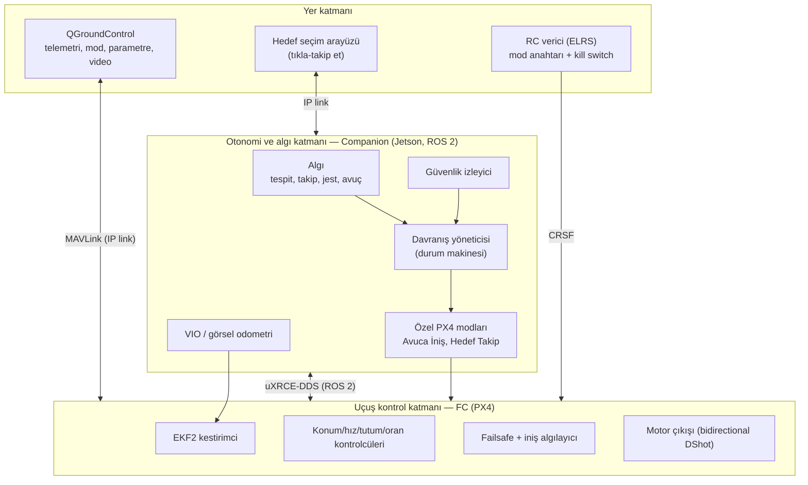
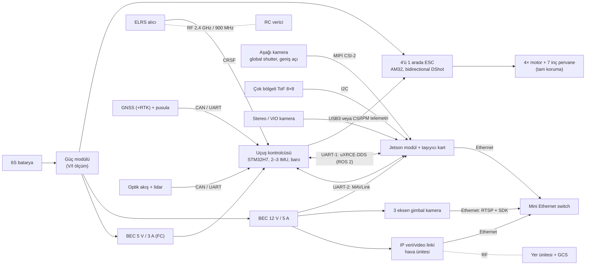
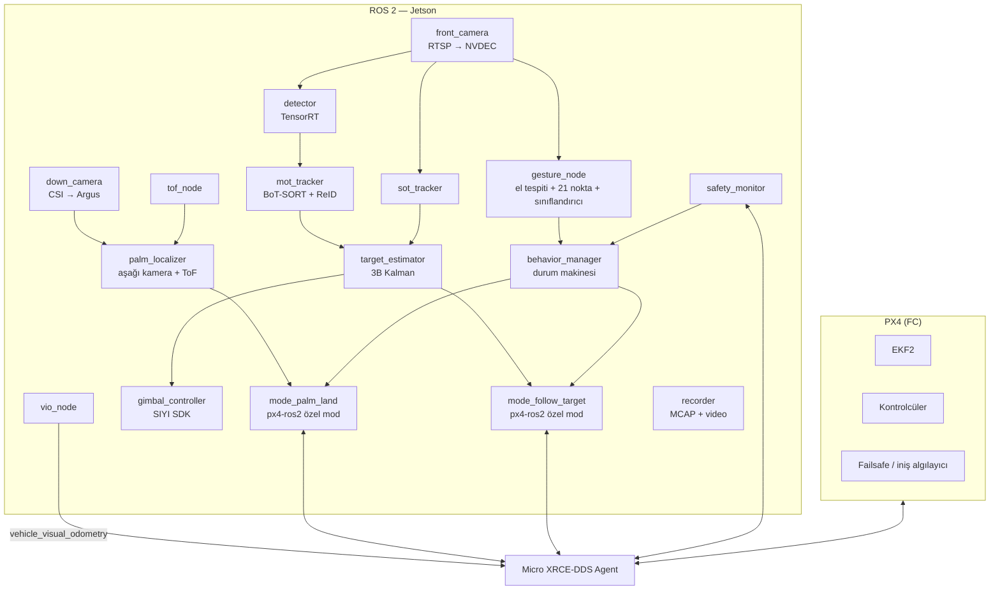
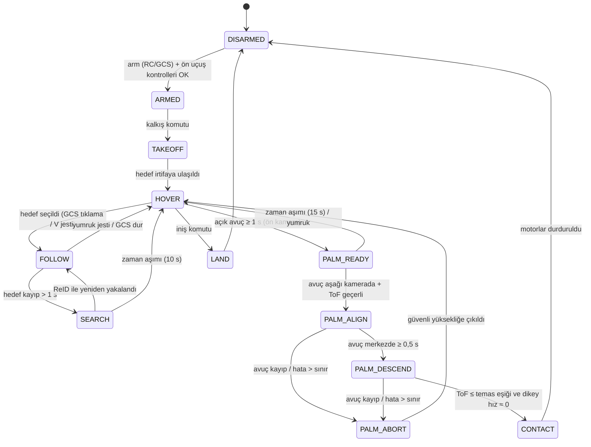

# 04 — Sistem Mimarisi

## 1. Tasarım ilkeleri

1. **"YZ önerir, uçuş kontrolcüsü karar verir."** Motorlara yalnızca uçuş kontrolcüsü (FC, PX4)
   komut verir. Companion bilgisayar (Jetson) yalnızca *setpoint* (hız/konum/yaw) üretir; PX4'ün
   failsafe'leri, iniş algılayıcısı ve RC önceliği hiçbir durumda devre dışı bırakılmaz.
2. **RC her zaman kazanır.** Mod anahtarı ve kill switch, companion'dan bağımsız olarak çalışır.
3. **Katmanlı güvenlik.** Her riskli davranış (avuca iniş, takip) en az iki bağımsız sensörle
   doğrulanır ve kendi iptal (abort) mantığına sahiptir.
4. **Gerçek zamanlılık ayrımı.** Sert gerçek zamanlı işler (kestirim, stabilizasyon, motor) FC'de;
   yumuşak gerçek zamanlı işler (algı, davranış, 10–50 Hz) companion'da.
5. **Simülasyon önce.** Her davranış önce PX4 SITL + Gazebo'da, sonra pervanesiz tezgâhta,
   sonra bağlı (tether) uçuşta test edilir.

## 2. Katmanlar

## 3. Donanım blok diyagramı

Notlar:
- FC'de Ethernet varsa (ör. Pixhawk 6X ailesi) uXRCE-DDS ve MAVLink tek Ethernet kablosu
  üzerinden UDP ile taşınabilir; 30×30 FC'lerde iki UART kullanılır.
- ELRS alıcısı "MAVLink" modunda çalıştırılırsa RC linki üzerinden **yedek telemetri** de alınır.
- Jetson ve FC farklı BEC'lerden beslenir; Jetson'un ani akım çekişi FC'yi resetlememelidir.
- Gimbal, Jetson ve link aynı Ethernet anahtarındadır; gimbal videosu hem Jetson'a (YZ) hem de
  doğrudan yere (düşük gecikmeli ham video) gidebilir.

### 3.1 Arayüz tablosu

| Bağlantı | Fiziksel | Protokol | Hız / Frekans | Not |
|---|---|---|---|---|
| FC ↔ Jetson (ROS 2) | UART (TELEM2) | uXRCE-DDS | 921 600 baud (PX4 varsayılanı; gerekirse 3 000 000) | RTS/CTS akış kontrolü önerilir |
| FC ↔ Jetson (GCS köprüsü) | UART (TELEM1) | MAVLink 2 | 921 600 baud | `mavlink-router` → UDP → link |
| FC → ESC | 4 sinyal + GND | Bidirectional DShot600 | — | RPM → dinamik notch filtresi |
| RX → FC | UART | CRSF | 420 000 baud | RC failsafe |
| GNSS/pusula → FC | CAN veya UART+I2C | DroneCAN / UBX | 5–20 Hz | Pusula motor/ESC kablolarından uzak |
| Optik akış → FC | CAN veya UART | DroneCAN / MAVLink | 50–100 Hz | Lidar aynı modülde |
| Gimbal ↔ Jetson | Ethernet | RTSP H.264/H.265 + SIYI SDK (UDP) | 30 FPS | Gimbal varsayılan IP 192.168.144.25 |
| Aşağı kamera → Jetson | MIPI CSI-2 | Argus / V4L2 | 60 FPS | Global shutter → hareket bulanıklığı yok |
| ToF → Jetson | I2C | VL53L8CX / VL53L1X ULD | 15 Hz (8×8) | Avuç mesafesi + baş üstü boşluk |
| Link ↔ Jetson | Ethernet | UDP MAVLink, RTSP/RTP, ROS 2 (Zenoh köprüsü) | — | |

## 4. Yazılım mimarisi

### 4.1 ROS 2 düğüm grafiği

### 4.2 Planlanan ROS 2 paket yapısı (Faz 1'de oluşturulacak)

| Paket | Dil | Sorumluluk |
|---|---|---|
| `dc7_interfaces` | msg | `GestureEvent`, `PalmTarget`, `TrackedTarget`, `TargetState`, `BehaviorState` |
| `dc7_bringup` | launch/yaml | Seviyeye göre launch dosyaları, `config/` altındaki parametrelerin yüklenmesi |
| `dc7_perception` | C++/Python | Kamera girişi, TensorRT tespit, MOT, SOT |
| `dc7_gesture` | C++/Python | El tespiti, landmark, jest sınıflandırma, zamansal filtre |
| `dc7_palm_landing` | C++ | Avuç konumlandırma + **Avuca İniş** PX4 özel modu |
| `dc7_follow` | C++ | Hedef durum kestirimi + **Hedef Takip** PX4 özel modu |
| `dc7_gimbal` | C++ | SIYI SDK sürücüsü, piksel hatası → gimbal hız kontrolü |
| `dc7_behavior` | C++ | Davranış yöneticisi (durum makinesi / BehaviorTree.CPP) |
| `dc7_safety` | C++ | Güvenlik izleyici, watchdog, kişi mesafe kısıtları |
| `dc7_vio` | launch | VIO paketinin PX4 `VehicleOdometry` formatına bağlanması |

### 4.3 Konu (topic) isimlendirmesi

| Konu | Tip | Hz |
|---|---|---|
| `/dc7/cam/front/image` | `sensor_msgs/Image` (GPU'da NITROS) | 30 |
| `/dc7/cam/down/image` | `sensor_msgs/Image` | 60 |
| `/dc7/tof/down` | `sensor_msgs/PointCloud2` (8×8) | 15–30 |
| `/dc7/perception/detections` | `vision_msgs/Detection2DArray` | 30 |
| `/dc7/perception/tracks` | `dc7_interfaces/TrackedTargetArray` | 30 |
| `/dc7/perception/target` | `dc7_interfaces/TargetState` (3B konum/hız, kovaryans) | 30 |
| `/dc7/gesture/events` | `dc7_interfaces/GestureEvent` | olay |
| `/dc7/palm/target` | `dc7_interfaces/PalmTarget` (gövde çerçevesinde xyz, güven) | 30 |
| `/dc7/behavior/state` | `dc7_interfaces/BehaviorState` | 10 |
| `/fmu/out/vehicle_odometry`, `/fmu/out/vehicle_status` | `px4_msgs` | 50–100 |
| `/fmu/in/vehicle_visual_odometry` | `px4_msgs/VehicleOdometry` | 30 |

> PX4 v1.16 ile gelen mesaj sürümlemesi nedeniyle bazı PX4 konularının adı `_v1` gibi sürüm eki
> alabilir; `px4_msgs` sürümü FC firmware sürümüyle **aynı** tutulmalıdır.

## 5. Görev dağılımı

| İşlev | FC (PX4) | Companion (Jetson) | Yer |
|---|---|---|---|
| Durum kestirimi | EKF2: IMU, GNSS, baro, akış, lidar, VIO | VIO odometrisini üretir | — |
| Stabilizasyon / hover | ✔ (Position modu) | — | — |
| Hedef takip | Setpoint takibi, sınırlar | Hedef kestirimi + Hedef Takip modu | Hedef seçimi |
| Avuca iniş | Setpoint takibi, iniş algılayıcı (yedek) | Avuç konumu, Avuca İniş modu, temas algılama | İzleme |
| Failsafe | **Nihai otorite** | Erken uyarı, iptal önerisi | RTL/Land komutu |
| Kill switch | ✔ (RC kanalı) | — | — |

### 5.1 Neden özel PX4 modları?

PX4'ün ROS 2 arayüz kütüphanesi (`px4-ros2-interface-lib`) ile ROS 2'de yazılan modlar FC'ye
**gerçek uçuş modu** olarak kaydedilir:
- QGroundControl ve RC mod anahtarında normal mod gibi görünür.
- PX4 failsafe'leri bu modlarda da geçerlidir; companion çökerse PX4 bunu algılar ve failsafe
  uygular (klasik Offboard moduna göre çok daha güvenli).
- Pilot herhangi bir anda Position moduna geçerek kontrolü geri alır.

ArduPilot alternatifinde aynı davranış GUIDED modu + Lua betikleri + companion MAVLink komutları
ile kurulur (bkz. [`config/ardupilot`](../config/ardupilot/)).

## 6. Davranış durum makinesi

Her durumdan PX4 failsafe'ine (RC kaybı, batarya, geofence, companion kaybı) geçiş vardır; bu
geçişlerin sahibi PX4'tür ve davranış yöneticisi yalnızca durumunu `HOVER`/`DISARMED`'a eşitler.

## 7. Gecikme bütçesi (hedef: 30 FPS)

| Aşama | CSI yolu (aşağı kamera) | RTSP yolu (gimbal) |
|---|---|---|
| Pozlama + okuma | 8–16 ms | 15–30 ms |
| Kodlama + ağ + çözme (NVDEC) | — | 40–90 ms |
| Ön işleme (GPU) | 1–2 ms | 1–2 ms |
| Çıkarım (TensorRT FP16/INT8) | 3–8 ms | 5–12 ms |
| Takip / landmark | 2–6 ms | 2–8 ms |
| Davranış + kontrol | < 2 ms | < 2 ms |
| DDS → PX4 | 2–5 ms | 2–5 ms |
| **Toplam** | **≈ 20–40 ms** | **≈ 65–150 ms** |

Sonuçlar:
- Avuca iniş, düşük gecikmeli **CSI yolunu** kullanır (aşağı kamera).
- Takip kontrolcüsü RTSP gecikmesini hedef durum kestiriminde (Kalman tahmini) telafi eder;
  kazançlar gecikmeye göre düşük tutulur.

## 8. Yer istasyonu ve video

- **QGroundControl 5.x**: telemetri, parametre, özel modların seçimi, video.
- **YZ katmanlı video**: Jetson, tespit kutularını görüntüye işler ve NVENC (H.265) ile yeniden
  kodlayıp RTSP/UDP üzerinden gönderir. Daha düşük gecikme için gimbal'ın ham videosu doğrudan
  linke verilip kutular metaveri olarak gönderilebilir (Faz 3).
- **Tıkla-takip et**: Companion, MAVLink kamera protokolü v2'nin izleme komutlarını
  (`MAV_CMD_CAMERA_TRACK_RECTANGLE` / `MAV_CMD_CAMERA_TRACK_POINT` / `MAV_CMD_CAMERA_STOP_TRACKING`,
  durum: `CAMERA_TRACKING_IMAGE_STATUS`) destekleyen bir "MAVLink kamera" bileşeni sunar ve SOT
  izleyiciyi başlatır. Kullanılan QGroundControl sürümünün bu komutları video penceresinden
  gönderip göndermediği Faz 1'de doğrulanacaktır; desteklemiyorsa Jetson üzerinde barındırılan
  basit bir web arayüzü (video + tıklama) kullanılır.

## 9. Kayıt ve gözlemlenebilirlik

- PX4 ulog (SD kart); ayar uçuşlarında yüksek frekanslı profil.
- ROS 2 bag (**MCAP**): algı çıktıları, durum, setpoint'ler, seyreltilmiş görüntüler.
- 4K kayıt gimbal SD kartında, YZ katmanlı 720p kayıt Jetson'da.
- Analiz: PX4 Flight Review / PlotJuggler / Foxglove.

## 10. Dağıtım (deployment)

- Jetson: JetPack + Docker; servisler `docker compose` ile ayağa kalkar, `systemd` ile açılışta
  başlar (bkz. [`config/companion`](../config/companion/)).
- Modeller TensorRT motoru (`.engine`) olarak **hedef cihazda** derlenir ve sürüm etiketlenir.
- Güç modu açılışta sabitlenir (`nvpmodel`, `jetson_clocks`), sıcaklık izlenir.
