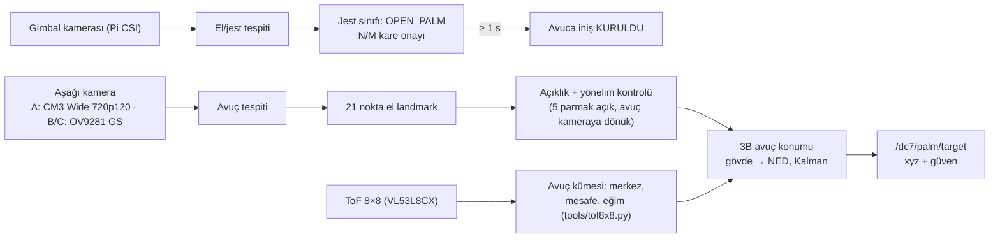

# 05 — Avuca İniş ("Ele Kon") Tasarımı

Kullanıcı avucunu açıp gösterdiğinde drone'un kullanıcının eline güvenle konması. Bu, projenin
**en yüksek riskli** özelliğidir; tasarım önce güvenlik, sonra kullanıcı deneyimi önceliğiyle
yapılmıştır. Parametreler: [`config/mission/behavior.yaml`](../config/mission/behavior.yaml) →
`palm_landing` bölümü.

## 1. Referanslar ve fark

Avuca inişi ticari olarak sunan ürünlerin hepsi **≤ 250 g ve tam pervane korumalıdır**:

| Ürün | Kütle | Algılama | Avuç davranışı |
|---|---|---|---|
| DJI Neo | 135 g | Aşağı görüş + IR, tam koruma | Yalnızca hover'dan, **hareketsiz ve düz** el, drone'un hemen altında ≤ 0,7 m; DJI: "el hareket ederken motorları durduramayabilir", "kavramayın" |
| DJI Neo 2 (11/2025) | 151 g | Çok yönlü görüş, ön LiDAR, aşağı IR | Avuçtan kalkış, avuca dönüş-iniş, jest kontrolü |
| HoverAir X1 ProMax | 192 g | — | Avuca iniş |

Bizim platformumuz ≈ 1,5–1,7 kg ve 6S 7 inç pervanelidir: **8–10 kat ağır**, pervane uç hızı
hover'da ≈ 76 m/s. Bu nedenle aşağıdaki mekanik önlemler **isteğe bağlı değil, zorunludur**;
yazılım bu önlemler takılı değilse özelliği kilitler (`palm_landing.require_guards: true`).
Çıkarılan dersler: hafif ve tam korumalı ol; aşağı görüş + IR/ToF kullan; yalnızca hover'dan,
yakındaki **hareketsiz ve düz** bir ele in; temas ve motor durdurmayı en zayıf halka kabul et.

## 2. Tehlike analizi (özet FMEA)

| # | Tehlike | Olası neden | Önlem | Kalan risk |
|---|---|---|---|---|
| H1 | Parmakların pervaneye değmesi | El pervane düzlemine yükselir; parmaklar yayık | Tam halka koruma + alt ağ; tutamak pervane düzleminin ≥ 120 mm altında; "parmaklar bitişik" kullanım talimatı | Düşük |
| H2 | Yanlış pozitif avuç | Yüz, beyaz nesne, zemin deseni | İki kamera onayı (ön kamerada jest + aşağı kamerada avuç), ToF mesafe tutarlılığı, zamansal onay | Düşük |
| H3 | İniş sırasında avucun çekilmesi | Kullanıcı elini çeker | ToF mesafe artış hızı izlenir → iptal ve tırmanış | Düşük |
| H4 | Erken motor durdurma (el yokken) | Hatalı temas kararı | Temas için ≥ 2 bağımsız ipucu + 100 ms süreklilik | Çok düşük |
| H5 | Geç motor durdurma | Algılama gecikmesi | Companion zorlamalı disarm + PX4 iniş algılayıcı yedeği + RC kill | Düşük |
| H6 | Tırmanış sırasında kafaya çarpma | Kullanıcı drone'un üzerine eğilmiş | Yukarı bakan ToF ile boşluk kontrolü; boşluk yoksa tırmanma, yerinde bekle | Düşük |
| H7 | Rüzgârda sürüklenme | Hamle, türbülans | Rüzgâr/eğim sınırı aşılırsa avuca iniş reddedilir | Orta → test ile doğrulanır |
| H8 | Başkasının eline inme | Kalabalık | Yalnızca jesti yapan kişi (operatör kilidi, Faz 3) | Orta → operasyonel kural |
| H9 | Gözlere aşağı akış/parça | Yakın mesafe | Test sırasında koruyucu gözlük; drone kişiye kendisi yaklaşmaz | Düşük |

## 3. Mekanik tasarım

### 3.1 Geometri (7 inç, GEPRC MOZ7 V2: 336 mm dingil mesafesi)

```
             yan görünüş (ölçek yaklaşık)

   ┌──────── pervane koruma halkası + alt ağ ────────┐
   ║  ≈≈≈≈ pervane ≈≈≈≈     [gövde]     ≈≈≈≈ pervane ≈≈≈≈  ║   ← pervane düzlemi
                              │
                              │  ≥ 120 mm dikey ayrım
                              │
                        ┌─────┴─────┐
                        │  tutamak  │  Ø 65–75 mm TPU + köpük
                        │ [kam][ToF]│  ← kamera ve ToF tutamak tabanında, 25 mm içeride
                        └───────────┘
                     ~~~~ avuç (yukarı bakar) ~~~~
```

- Motor–merkez mesafesi ≈ 168 mm, pervane yarıçapı 89 mm → pervane diskinin merkeze en yakın
  noktası ≈ 79 mm (300 mm'lik gövdelerde ≈ 61 mm). Açık bir yetişkin eli (parmaklar dahil
  ≈ 180–200 mm) bu diskin altına taşar; bu yüzden **dikey ayrım** (tutamak tabanı pervane
  düzleminin ≥ 120 mm altında, pervaneler elin ≥ 10 cm üstünde) ve **alt ağ** asıl korumadır.
- Tutamak, drone tutulurken taşıma kolu görevi de görür; batarya üstte/arka taraftadır.
- Aşağı kamera ve ToF tutamak tabanının 25 mm içine gömülür: temas anında ToF ≈ 25–35 mm okur.
- Yukarı bakan tek bölgeli ToF (≈ 4 m menzil) tırmanış öncesi baş üstü boşluğunu ölçer.

### 3.2 Pervane koruması
- 7 inç için tam halka koruma (karbon/PA12-CF) + **alt yüzeyde ağ** (parmak girişini engeller).
- Koruma ve ağın itki kaybı (tipik olarak %5–15) itki testiyle ölçülüp bütçe hesabına
  (`tools/budget_calc.py`) yansıtılmalıdır.
- Koruma takılı olduğu bir donanım anahtarı/kimlik direnci veya en azından ön uçuş kontrol
  listesiyle doğrulanır; doğrulanmazsa avuca iniş devre dışıdır.
- 7 inç için hazır tam koruma/duct kiti bulunamadı → 3B baskı (PA12-CF) halka + ağ tasarlanacak;
  `config/hardware` profillerinde ≈ 110 g ve %10 itki kaybı (`installation_factor: 0.90`)
  varsayılmıştır, itki standında ölçülecektir.

### 3.3 Aşamalı ürün yaklaşımı: önce işaretli iniş pedi
Çıplak avuca inişten önce aynı yazılımla, kullanıcının elinde tuttuğu **20–25 cm'lik işaretli
iniş pedi** (veya avuç içine AprilTag dikili eldiven) desteklenir:
- İşaret (AprilTag) → yanlış pozitif neredeyse sıfır, 6-serbestlik dereceli hassas poz.
- Ped, parmakları pervane diskinden fiziksel olarak uzak tutar.
- Çıplak avuç modu (`target: bare_palm`) ancak T4 kabul testlerinden sonra açılır.

## 4. Algılama hattı



### 4.1 3B avuç konumu
1. Avuç merkezi piksel `(u, v)` → balıkgözü modeliyle distorsiyonsuz ışın `r_c`.
2. ToF: avuç kümesi (en yakın bitişik bölgeler) → mesafe `d`, merkez ve düzlem eğimi
   (`tools/tof8x8.py`, docs/10 §5); kamera kutusuyla tutarlılık kontrolü.
3. Gövde çerçevesi: `p_b = R_bc · (r_c / r_c,z) · d + t_bc` (kamera–gövde kalibrasyonu, Kalibr).
4. Yerel NED: `p_n = R_nb(q) · p_b + p_drone`; sabit hızlı Kalman filtresi + inovasyon kapısı.
5. 12 cm'nin altında kamera görüşü doyar → yatay hizalama ToF bölge merkezine (centroid) geçer.

### 4.2 Doğrulama kuralları (alçalma başlamadan önce hepsi)
- Ön kamerada jest güveni ≥ 0,7 ve son 30 karenin ≥ 24'ünde OPEN_PALM.
- Aşağı kamerada avuç güveni ≥ 0,6 **ve** ToF ile kamera mesafeleri ±8 cm içinde tutarlı.
- ToF bölgeleri **düz bir yüzey** gösteriyor; optik akış/lidar ölçümü ile çelişmiyor.
- El **≥ 1 s hareketsiz** (avuç hızı ≤ 0,15 m/s).
- Landmark tabanlı açıklık: 5 parmağın uç–taban açıları "açık" eşiğinde; yumruk/yarım el reddedilir.
- **Operatör onayı**: RC izin anahtarı açık veya başparmak yukarı jesti.

## 5. Kontrol akışı

| Durum | Ne yapar | Çıkış koşulu |
|---|---|---|
| `PALM_READY` | Yerinde kalır; sunum yüksekliğine (vars. 1,1 m AGL) ≤ 0,3 m/s ile iner/çıkar. **Kişiye yaklaşmaz.** | Avuç aşağı kamerada + ToF geçerli → `PALM_ALIGN`; 15 s → `HOVER` |
| `PALM_ALIGN` | Yatay görsel servo (≤ 0,25 m/s, kurulum noktasından en fazla ±0,20 m) | Hata ≤ 3 cm, ≥ 0,5 s → `PALM_DESCEND` |
| `PALM_DESCEND` | `v_z = sat(k·(d − d_temas), v_yakın, v_uzak)`; yatay servo devam | Temas → `CONTACT`; iptal koşulu → `PALM_ABORT` |
| `CONTACT` | Motor durdurma komutu | Disarm doğrulandı → `DISARMED` |
| `PALM_ABORT` | Yatay konumu tut, boşluk varsa 0,5 m tırman (≤ 0,4 m/s) | Güvenli yükseklik → `HOVER` |

### 5.1 Temas kararı (en az iki bağımsız ipucu, ≥ 100 ms sürekli)

| İpucu | Koşul |
|---|---|
| ToF mesafesi | Merkez bölgeler ≤ `contact.tof_contact_m` (vars. 0,035 m) |
| Dikey hız | Alçalma komut edilirken kestirilen `|v_z|` ≤ 0,05 m/s |
| İtki düşümü | Normalize itki < 0,6 × hover itkisi (el ağırlığı taşıyor) |
| IMU darbe | Dikey ivmede > 0,3 g sıçrama (yalnızca ToF ≤ 0,06 m iken sayılır) |

Karar: **ToF zorunlu** + diğer üçünden en az biri. Eylem sırası:
1. Companion → PX4: `VEHICLE_CMD_COMPONENT_ARM_DISARM` (param1 = 0, param2 = 21196 zorlamalı) —
   motorlar anında durur; ESC'de (AM32) "durunca fren" açık olduğundan pervaneler hızla durur.
2. Yedek: PX4 iniş algılayıcısı + `COM_DISARM_LAND` (kısa süre) — companion komutu ulaşmazsa.
3. Son yedek: RC kill switch (emniyet pilotu).

### 5.2 İptal koşulları

| Koşul | Eşik (vars.) |
|---|---|
| Avuç kaybı (kamera **ve** ToF) | > 0,3 s |
| Yatay hata | > 6 cm (`PALM_DESCEND`), > 20 cm (`PALM_ALIGN`) |
| Avuç uzaklaşma hızı | ToF mesafe artışı > 0,3 m/s (el çekiliyor) |
| Eğim / rüzgâr | Tutum > 15° veya kestirilen rüzgâr > 5 m/s |
| Avuca iniş geofence'i | Kurulum noktasından > 10 m (mod boyunca dar zarf) |
| Yumruk jesti, GCS iptal, RC mod değişimi | Anında |

## 6. Neden "drone kişiye yaklaşmaz"?

Kişiye doğru hareket eden 1,5 kg'lık bir drone, yanlış tespit veya gecikme durumunda doğrudan
yüze/gövdeye çarpabilir. Bu tasarımda yakınlığı **insan** kontrol eder: drone sunum yüksekliğinde
bekler, kullanıcı avucunu altına getirir. Drone yalnızca ±20 cm içinde hizalama yapar. Bu yaklaşım
DJI'ın avuca iniş kullanım akışıyla da uyumludur.

## 7. Test ve kabul prosedürü

| Aşama | Ortam | Kabul ölçütü |
|---|---|---|
| T1 | PX4 SITL + Gazebo; rastgele hareket eden "el platformu" modeli, Monte Carlo (≥ 1000 deneme) | %100 doğru durum geçişi, iptal senaryoları çalışır |
| T1b | Kapalı, fileli test hücresi; işaretli iniş pedi çubuğa sabit | Arka arkaya 50 başarılı iniş |
| T2 | Tezgâh, pervanesiz; gerçek el + kamera/ToF | Temas → disarm gecikmesi p99 ≤ 150 ms |
| T3 | Bağlı (tether) uçuş, çubuğa takılı köpük/silikon el modeli | Arka arkaya 50 başarılı iniş, temas hızı ≤ 0,1 m/s |
| T4 | Kesilmeye dayanıklı eldiven (EN 388 seviye F) + gözlük/yüz siperi, emniyet pilotu | Arka arkaya 50 başarılı iniş, 0 yanlış temas |
| T5 | Çıplak el, yalnızca eğitimli yetişkin operatör | Saha kabul testi; rüzgâr ≤ 5 m/s |

Ölçülecek KPI'lar: başarı oranı (≥ %98), yanlış temas (0), disarm gecikmesi, temas hızı,
temas anındaki yatay hata (≤ 3 cm), iptal sonrası güvenli tırmanış.
