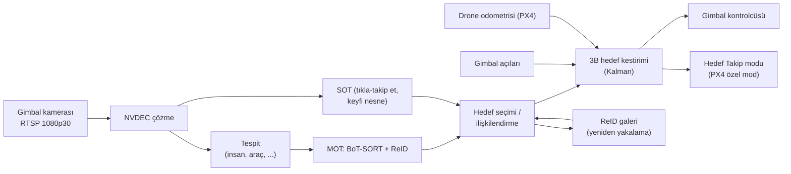

# 06 — Hedef Tespiti ve Takip Tasarımı

Parametreler: [`config/mission/behavior.yaml`](../config/mission/behavior.yaml) → `follow`,
`gimbal`; model ayarları: [`config/ai/perception.yaml`](../config/ai/perception.yaml).

## 1. Hat (pipeline)

## 2. Hedef seçimi

| Yöntem | Akış |
|---|---|
| GCS tıklama | Tıklanan noktayı içeren MOT izi hedef olur; iz yoksa SOT, `MAV_CMD_CAMERA_TRACK_RECTANGLE` kutusuyla başlatılır |
| "Beni takip et" jesti | V işareti ≥ 1 s → el kutusu, kişi kutusuyla ilişkilendirilir → o kişi hedef olur; başparmak yukarı ile onay (opsiyonel) |
| Doğal dil (Faz 4) | "Kırmızı montlu kişiyi takip et" → VLM bir anahtar karede kutu üretir → MOT iziyle eşlenir → GCS'de onay |

Hedef seçildiğinde ReID galerisi (son N görünümden gömme vektörleri) başlatılır; galeri,
yalnızca yüksek güvenli ve örtülmemiş karelerle güncellenir (sürüklenmeyi önler).

## 3. 3B hedef kestirimi

1. **Zemin düzlemi kesişimi**: kişi için kutunun alt-orta noktası (ayak), araç için kutu merkezi.
   Işın: kamera iç parametreleri → gimbal açıları → drone tutumu → NED. Işın zemin düzlemiyle
   (AGL'den) kesiştirilir. Gimbal eğimi ≥ 10° iken güvenilir.
2. **Boyut önsel bilgisi**: `d ≈ f · H / h_piksel` (insan için H ≈ 1,7 m). Sığ açılarda ağırlığı artar.
3. **Kalman filtresi**: sabit hız modeli (x, y, ẋ, ẏ; z = zemin). Ölçüm kovaryansı geometrinin
   açı hatasına duyarlılığından türetilir. Çıkış: konum, hız, kovaryans, görünürlük.
4. **Gecikme telafisi**: RTSP gecikmesi (≈ 80–120 ms) kadar ileri tahmin yapılır.

## 4. Gimbal kontrolü

- Piksel hatası → açısal hata: `e_yaw = atan(e_x / f)`, `e_pitch = atan(e_y / f)`.
- Komut: `ω = Kp·e + Kd·ė + ω_ff` (ileri besleme: hedefin drone'a göre açısal hızı), doyumlu.
- **Gövde yaw'ı gimbal'ı izler**: `yaw_rate = K_yaw · gimbal_yaw_göreli` → gimbal yaw'ı merkezde
  kalır, gimbal'ın mekanik yaw sınırına dayanılmaz.
- Takip sırasında yakınlaştırma 1× sabit tutulur (iç parametreler değişmesin) veya zoom'a göre
  odak uzaklığı güncellenir.

## 5. Takip modları

| Mod | Hedef konum | Yaw | Not |
|---|---|---|---|
| **Tripod** | Yerinde hover | Gimbal + gövde yaw ile hedefe bakar | En güvenli; ilk test edilen mod |
| **Arkadan takip** | `p_hedef − d·û_hareket + h·ẑ` | Hedefe | `û_hareket`: hız > 0,5 m/s ise hareket yönü, değilse mevcut kerteriz |
| **Yörünge (orbit)** | Yarıçap `R`, açısal hız `ω` | Hedefe | Hedef hareketliyse merkez hedefle kayar |
| **Önden (lead)** | `p_hedef + d·û_hareket` | Hedefe (geriye bakar) | Drone geri geri uçar → yalnızca açık alan, Faz 4 |

Hız setpoint'i: `v_sp = sat(v_hedef + Kp·(p_istenen − p_drone), v_maks)`. Yumuşak hareket için
PX4'ün yörünge üretecine (goto setpoint, hız/ivme/jerk sınırlı) bırakılır.

## 6. Hedef kaybı

| Süre | Davranış |
|---|---|
| < 1 s | Kalman tahminiyle devam (coast), gimbal tahmini konuma bakar |
| 1–10 s | `SEARCH`: hover + tahmini kerteriz etrafında gimbal taraması; ReID galerisi ile eşleşme (kosinüs benzerliği ≥ eşik **ve** Kalman kapısı içinde) |
| > 10 s | `HOVER`, GCS'ye bildirim |

## 7. Güvenlik kısıtları

- Hedef kişiye ve diğer kişilere ≥ 3 m yatay mesafe (avuca iniş hariç).
- Hedef dışında bir kişi 5 m içindeyse hız ≤ 3 m/s.
- Takip sırasında minimum irtifa 2,5 m AGL; geofence her zaman geçerli.
- İleri yönde derinlik kamerası: hareket yönünde fren mesafesi + pay içinde engel → dur ve bekle.
  (PX4'ün *collision prevention* özelliği yalnızca Position modunda çalıştığından özel modda
  frenleme companion tarafından yapılır.)

## 8. Ölçütler

| Ölçüt | Hedef |
|---|---|
| Takip başarısı (hedefin kilitli olduğu kare oranı) | ≥ %95 |
| Kadraj hatası RMS | ≤ görüntü genişliğinin %10'u |
| ID değişimi (MOT) | ≤ 1 / dk |
| Yeniden yakalama süresi (2–5 s örtülme sonrası) | ≤ 2 s |
| Setpoint düzgünlüğü | jerk ≤ 5 m/s³ (rahat video) |
