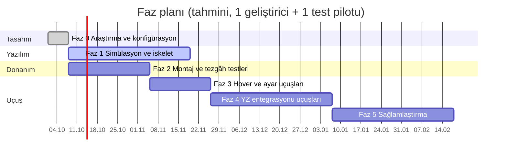

# 09 — Yol Haritası ve Test Planı

Her faz, bir sonraki faza geçmeden önce sağlanması gereken **çıkış kriterleriyle** biter.
Gereksinim kimlikleri için bkz. [01-gereksinimler.md](01-gereksinimler.md).

## Faz 0 — Araştırma, mimari, konfigürasyon (bu çalışma)
- Çıktılar: `docs/01–11`, `config/` altındaki tüm profiller ve parametreler, sensör kataloğu ve
  bütçe senaryoları, `tools/`, `cad/` (parametrik 3B modeller), `tests/`.
- Çıkış kriteri: donanım seviyesi seçildi (öneri: **Seviye A — Ekonomik, Raspberry Pi** + "önerilen"
  kesinti paketi, docs/11 §3), BOM siparişe hazır.
- Yazılım öncesi hazırlık listesi (baskı, itki standı, sensör tezgâhı, gecikme, veri toplama, EMI,
  mevzuat, güvenlik ekipmanı): [11 §6](11-yazilim-oncesi-hazirlik.md).

## Faz 1 — Simülasyon ve yazılım iskeleti
- ROS 2 çalışma alanı ve paketler ([04 §4.2](04-sistem-mimarisi.md)).
- PX4 SITL + Gazebo: kütle/atalet/motor sabitleri DC7'ye uyarlanmış quad modeli, aşağı kamera,
  ToF ve "el platformu" modeli.
- Özel modlar: `PalmLand`, `FollowTarget` (px4-ros2-interface-lib).
- Algı hattı kayıtlı videolarda: TensorRT motorları, MOT, SOT, jest.
- Jest veri seti: HaGRIDv2 alt kümesi + aşağı kameradan toplanan özel avuç verisi.
- CI: `colcon build`, birim testler, `tests/test_configs.py`.
- **Gimbal tasarımı (CAD)**: ilk parametrik model hazır (`cad/gimbal_2axis.py`: kızaklı beşik, roll
  ekseni ağırlık merkezinde, çakışma kontrolü); FFC yolu, ilk baskı ve tezgâh dengesi
  ([10 §3](10-kamera-gimbal-ve-sensorler.md), [11 §5](11-yazilim-oncesi-hazirlik.md)).
- **8×8 ToF**: `tools/tof8x8.py` mantığı ROS 2 düğümüne taşınır; gerçek sensörle radyal/dik mesafe
  doğrulaması.
- **Çıkış**: SITL'de avuca iniş Monte Carlo (≥ 1000 deneme) %100 doğru durum geçişi (T1);
  SITL'de tripod ve arkadan takip çalışıyor.

## Faz 2 — Montaj ve tezgâh testleri
- Seviye A montajı (Raspberry Pi 5 + AI HAT+ 2); kablolama ve EMI düzeni (pusula, GNSS anteni ↔
  ESC/companion ayrımı; STorM32'nin 868/915 MHz paraziti için ELRS menzil testi).
- Gimbal: denge → motor gücü → PID → pervaneli titreşim testi.
- İtki standı ölçümü (serbest ve koruma + ağ takılı) → `tools/thrust_stand.py` → `config/hardware/*.yaml`
  eğrisi ve `installation_factor` güncellenir.
- FC kurulumu: `config/px4` parametreleri, motor yönü/sırası, ESC telemetri, IMU sıcaklık kalibrasyonu.
- Companion: termal test (30 dk tam yük; Pi 5 0–70 °C), kamera–IMU kalibrasyonu (Kalibr).
- Avuç temas algılama tezgâh testi (T2): disarm gecikmesi p99 ≤ 150 ms.
- **Çıkış**: tüm sensörler ROS 2'de, PX4 ön uçuş kontrolleri yeşil, titreşim seviyeleri kabul edilebilir.

## Faz 3 — Hover ve ayar uçuşları
- Manuel → Altitude → Position modları; otomatik ayar (autotune); notch filtre doğrulaması (FFT).
- Hover KPI uçuşları: F-01…F-05 (log analizi ile 2σ hatalar).
- Failsafe testleri: RC kaybı, companion'ı kapatma, veri linki kaybı, düşük batarya, geofence.
- VIO doğrulaması (GNSS'siz kapalı alan) → F-03.
- **Çıkış**: hover gereksinimleri sağlandı, tüm failsafe senaryoları beklendiği gibi.

## Faz 4 — YZ entegrasyonu uçuşları
1. Tripod takip (yalnızca gimbal + yaw) → 2. arkadan takip → 3. yörünge.
2. Uzaktan jest komutları (yumruk = dur, V = beni takip et), ≥ 5 m mesafede.
3. Avuca iniş: T3 (köpük el, bağlı uçuş) → T4 (eldivenli el) → T5 (çıplak el).
- **Çıkış**: F-10…F-26 ölçütleri sağlandı; avuca iniş T4'te arka arkaya 50 başarılı.

## Faz 5 — Sağlamlaştırma ve ürünleştirme
- Veri seti genişletme (gün batımı, ters ışık, farklı zeminler), INT8 kalibrasyonu.
- Operatör kilidi (ReID), doğal dil ile hedef seçimi (VLM), avuçtan kalkış değerlendirmesi.
- Uzun süre testleri, bakım ve kontrol listeleri, mevzuat (kayıt, sigorta) tamamlanması.

## Gereksinim → test eşleşmesi

| Gereksinim | Test | Ortam | Ölçüm |
|---|---|---|---|
| F-01, F-02 | 60 s hover × 10 | Açık alan, RTK / GNSS | ulog konum hatası 2σ |
| F-03 | 5 dk hover | Kapalı alan, VIO + akış | Drift (m/dk), dış referans (işaretler) |
| F-04 | Rüzgâr uçuşu | Rüzgârlı gün | Konum hatası, eğim, motor doygunluğu |
| F-10, F-11 | Jest veri seti + saha | Kayıt + uçuş | TPR, FP/saat |
| F-12…F-16 | T1–T5 | SITL → saha | [05 §7](05-avuca-inis-tasarimi.md) |
| F-20…F-26 | Takip senaryoları | Saha | [06 §8](06-hedef-takip-tasarimi.md) |
| S-01…S-07 | Failsafe matrisi | Saha | Tepki süresi, davranış |
| N-01, N-02 | Gecikme ölçümü | Tezgâh (LED + yüksek hızlı kamera) | uçtan uca ms |
