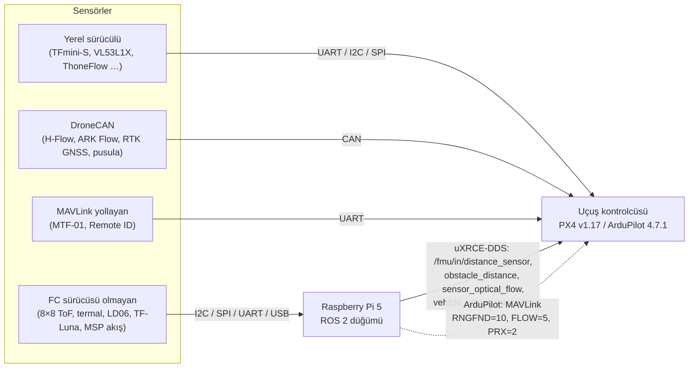

# 11 — Yazılımdan Önce: Sensör Alternatifleri, Bütçe, Uyumluluk ve 3B Model

Durum tarihi: **2 Ekim 2026**. Bu belge yazılım (Faz 1) başlamadan önce verilecek kararları ve
yapılabilecek işleri toplar. Her sayı bir araçla yeniden üretilebilir:

| Konu | Veri | Araç |
|---|---|---|
| Sensör alternatifleri ve uyumluluk | [`config/sensors/catalog.yaml`](../config/sensors/catalog.yaml) | `python3 tools/sensor_matrix.py [--markdown]` |
| Bütçe kesinti senaryoları | [`config/budget/scenarios.yaml`](../config/budget/scenarios.yaml) | `python3 tools/scenarios.py [--markdown]` |
| 3B modeller | [`cad/`](../cad/README.md) | `python3 cad/layout.py` · `python3 cad/build.py` |
| İtki standı ölçümü | [`config/hardware/thrust/`](../config/hardware/thrust/ornek-f90-hq7x4x3.csv) | `python3 tools/thrust_stand.py` |

## 1. Kısa cevaplar

| Soru | Cevap |
|---|---|
| Sensör alternatifi var mı? | Evet. 9 görev için **26 seçenek** kataloglandı; her birinin PX4 v1.17 ve ArduPilot 4.7.1 parametreleri resmi referansa göre test ediliyor. Seviye A seçimi zaten en ekonomik akıllı set: **MTF-01** tek modülde akış + 8 m lazer, $35 (§2) |
| Bütçe kısılabilir mi? | Evet. **Yetenek kaybı olmadan −$275 (%16)**: Pi 5 4GB, AI HAT+ 26 TOPS (görüntü modellerinde AI HAT+ 2 ile eşdeğer), parçaları kendimiz basmak, küçük kumanda. Ar-Ge MVP **$1.185 (−%31)**, en düşük **$1.034 (−%40)**; tüm paketler ağırlık, T/W ve hover limitlerini koruyor (§3) |
| Sensör uyumluluğu ne kadar geniş? | Çok geniş. FC'ye doğrudan: PX4'te **15 mesafe + 5 akış** sürücüsü, ArduPilot'ta **46 mesafe, 8 akış, 12 engel (360°), 22 GNSS** tipi. Üstüne DroneCAN ve MAVLink ile üreticiden bağımsız sensörler, ve **Pi'nin okuyabildiği her sensör** ROS 2 → PX4 DDS köprüsüyle (4 giriş konusu) bağlanır (§4) |
| 3B modeli kendimiz yapabilir miyiz? | **Evet, yaptık.** `cad/` altında 11 parametrik parça (pervane koruması, avuç tutamağı, 2 eksen gimbal, üst katlar), basıma hazır STL, kütle–bütçe raporu, çakışma ve görüş alanı kontrolleri. Modeller şimdiden 5 gerçek tasarım sorununu yakaladı (§5) |
| Yazılımdan önce başka ne yapılabilir? | 12 maddelik hazırlık listesi: baskı ve montaj, itki standı, sensör tezgâh testleri, gecikme ölçümü, el tipi veri toplama, EMI/port planı, mevzuat, güvenlik ekipmanı, SITL modeli (§6) |

## 2. Sensör alternatifleri

Tam matris (arayüz, parametreler, kütle, fiyat): `python3 tools/sensor_matrix.py --markdown`.
"doğrulanmadı" notlu fiyatlar sipariş öncesi kontrol edilmelidir.

| Görev | Seviye A seçimi | Ucuz alternatif | Kaliteli alternatif | Not |
|---|---|---|---|---|
| **Hareket (optik akış)** | MicoAir MTF-01 — akış + 8 m ToF, UART/MAVLink, 4,5 g, ≈ $35 | Matek 3901-L0X (≈ $20; MSP — ArduPilot yerel, PX4'te köprü; lidarı ≤ 1,2 m) · ThoneFlow-3901U (≈ $20; PX4 yerel `SENS_TFLOW_CFG`) | Holybro H-Flow ($145, DroneCAN) · ARK Flow MR ($350, lidar 50 m) | PX4: akış için aşağı bakan mesafe sensörü şart → ucuz akış + TF-Luna ≈ $42 |
| **Lazer irtifa** | MTF-01 içindeki ToF (8 m; 60 klux'ta 5 m) | Benewake TF-Luna (≈ $22, 8 m; ArduPilot `RNGFND1_TYPE`=27/25; PX4'te köprü) | Benewake TFmini-S (≈ $45, 12 m, 70 klux; PX4 yerel `SENS_TFMINI_CFG`) | Güneşli / yüksek uçuşta MTF-01'e TFmini-S eklenir |
| **Avuç (8×8 ToF)** | VL53L8CX, $24,95 | VL53L5CX (≈ $20, yalnızca I2C, önceki nesil) | VL53L7CX (90° D → yakında avucun tamamını görür) | `python3 tools/tof8x8.py --demo --sensor vl53l7cx` |
| **Avuç: termal doğrulama** (yeni, opsiyonel) | — | AMG8833 8×8 (≈ $40) | MLX90640 32×24 (≈ $60) | Sıcak el (≈ 30–35 °C) ↔ soğuk zemin: "gerçekten bir el mi?" ek ipucu; pedden çıplak avuca geçişte yararlı |
| **Baş üstü** | VL53L1X (≈ $15) | Açık alan MVP'sinde çıkarılabilir | TF-Luna (8 m) | Tavan algılama: iç mekânda şart |
| **Engel** | — (Seviye A'da yok) | VL53L7CX ileri (3,5 m, ≈ $25) · LDROBOT LD06 360° (≈ $80; ArduPilot yerel, PX4'te köprü) | OAK-D Lite ($269, B) · OAK-D Pro W ($529, C) · LightWare SF45/B (iki yığında yerel) | PX4 çarpışma önleme yalnızca Position modunda → özel modda frenleme companion'da |
| **GNSS** | Holybro M10 + IST8310 ($44) | Matek M10Q-5883 (≈ $30) | H-RTK F9P ($279) · ARK X20 RTK ($740, DroneCAN) | |
| **Remote ID** | PX4 listesindeki modül (Holybro Remote ID, BlueMark Db201/Db202mav, Cube ID), ≈ $60 | ESP32 + ArduRemoteID (≈ $12, Ar-Ge) | — | PX4 belgesi: BlueMark modülleri ArduRemoteID ile gelir → ESP32 sürümü çalışması beklenir, doğrulanmadı |

**Seçim ilkeleri**
- Uçuş için kritik sensörler (irtifa, akış, GNSS) **FC'ye doğrudan** bağlanır: companion çökse de
  EKF beslenmeye devam eder. Kararı companion'da verilen sensörler (8×8 ToF, termal, kamera)
  companion'dadır.
- ToF sensörlerinin menzili güneşte düşer (VL53L8CX: 5 klux'ta 2,8 m). Açık alanda irtifa için
  lazer (TFmini-S, MTF-01) kullanılır. Ultrasonik sensörler pervane gürültüsü yüzünden önerilmez.
- **Port planı**: Seviye A'da FC'ye DDS (TELEM2), MAVLink (TELEM1), GNSS, ELRS, MTF-01 ve
  Remote ID bağlanır. ARK FPV'nin UART sayısı Faz 2'de pin çıkışından doğrulanmalı. Port yetmezse
  önce Remote ID CAN'e (DroneCAN), sonra MTF-01 Pi'ye (köprü) alınır.
- PX4 tabanında `COM_ARM_ODID=1` (Remote ID yoksa uyarı) ayarlandı; operasyonda `2` (modülsüz
  kalkış yok) yapılır ([`30-failsafe.params`](../config/px4/base/30-failsafe.params)).

## 3. Bütçe kısma senaryoları

Temel: **Seviye A — hava aracı $1.488 + yer ekipmanı $240** (vergi ve kargo hariç). Her senaryo
temel profile ayrı ayrı uygulanır, paketler sırayla; kütle, hover süresi, T/W ve limitler
`tools/budget_calc.py` ile yeniden hesaplanır.

| Senaryo | Maliyet farkı | Δ kütle | Δ hover | Risk | Kapsam | Etki |
|---|---:|---:|---:|---|---|---|
| Raspberry Pi 5 8GB → 4GB | −$65 | 0 g | 0 | düşük | kalıcı | Seviye A'da VLM/LLM yok; ROS 2 + iki kamera hattı 4 GB'a sığar (bellek izlenmeli) |
| AI HAT+ 2 (Hailo-10H, $200) → AI HAT+ 26 TOPS (Hailo-8, $119,95) | −$80 | 0 g | 0 | düşük | kalıcı | Raspberry Pi duyurusu: YOLO, poz ve segmentasyonda AI HAT+ 2 ≈ 26 TOPS AI HAT+; kaybedilen yalnızca üretken YZ (VLM) |
| AI HAT+ 2 → AI HAT+ 13 TOPS (Hailo-8L, $76,95) | −$123 | 0 g | 0 | orta | kalıcı | Hızlandırıcı verimi ≈ yarıya iner → daha küçük giriş çözünürlüğü veya daha düşük tespit hızı |
| ARK FPV → Holybro Pixhawk 6C Mini | −$64 | +35 g | −0,6 dk | orta | kalıcı | IMU ısıtıcısı yok → sıcaklık kalibrasyonu şart; 2 TELEM + 2 GPS portu |
| ARK FPV → Matek H743-SLIM V4 | −$81 | 0 g | 0 | orta | kalıcı | ArduPilot yolunda güçlü; PX4 desteği topluluk düzeyinde → önce doğrulanmalı |
| 2 eksen fırçasız gimbal → tek eksen servo tilt + EIS | −$80 | −60 g | +1,3 dk | orta | Ar-Ge | Takip için yeterli, video kalitesi düşer; fırçasız gimbal sonra eklenir |
| WFB-ng → Pi 5 dahili Wi-Fi (yakın) + ELRS telemetri | −$125 | −20 g | +0,6 dk | düşük | Ar-Ge | Kontrollü sahada onlarca metre için yeterli; uzun menzil yok |
| Remote ID modülü → ESP32 + ArduRemoteID | −$48 | −5 g | +0,1 dk | orta | Ar-Ge | Geliştirme için; operasyonda uygunluk belgeli modül (docs/08) |
| Koruma, ağ ve tutamak kendi 3B yazıcımızda | −$40 | 0 g | 0 | düşük | kalıcı | Yalnızca filament (§5) |
| Baş üstü VL53L1X çıkarılır | −$15 | −1 g | 0 | düşük | Ar-Ge | Açık alanda gerekmez |
| Holybro M10 → Matek M10Q-5883 | −$14 | 0 g | 0 | orta | kalıcı | QMC5883L pusulanın PX4'te otomatik başlatılması doğrulanmalı |
| RadioMaster TX15 → küçük ELRS kumanda | −$90 | — | — | düşük | kalıcı | Ergonomi ve ekran küçülür |
| Hazır batarya → kendi 6S1P P50B paketimiz | −$30 | 0 g | 0 | **yüksek** | kalıcı | Punta kaynağı ve yalıtım deneyimi ister; hatalı paket yangın riski |

| Paket | Hava aracı | Yer ekipmanı | Toplam | Tasarruf | Kütle | Hover | T/W (batarya) | Limitler |
|---|---:|---:|---:|---:|---:|---:|---:|---|
| Temel (Seviye A) | $1.488 | $240 | $1.728 | — | 1456 g | 20,1 dk | 2,77 | ✅ |
| **Önerilen — yetenek kaybı olmadan** | $1.303 | $150 | $1.453 | **$275 (%16)** | 1456 g | 20,1 dk | 2,77 | ✅ |
| **MVP — ilk uçuş prototipi (Ar-Ge)** | $1.115 | $70 | $1.185 | **$543 (%31)** | 1370 g | 22,2 dk | 2,95 | ✅ |
| En düşük maliyet (riskli kalemler dahil) | $964 | $70 | $1.034 | $694 (%40) | 1405 g | 21,4 dk | 2,88 | ✅ |

**Öneri**: "Önerilen" paket hemen uygulanabilir. Ar-Ge'nin ilk uçuşları "MVP" ile yapılır, sonra
Ar-Ge kalemleri ürün yapılandırmasına döner (fırçasız gimbal, WFB-ng, belgeli Remote ID).

**Kısılmayacaklar**: pervane koruması ve ağ, avuç tutamağı, ELRS RC linki, GNSS, akış + lazer,
VL53L8CX, en az bir Remote ID cihazı. `tests/test_scenarios.py` hiçbir paketin bunları
kaldırmadığını test eder. Hover kalitesi için endüstriyel IMU'lu ARK FPV önerilen pakette korunur.

## 4. Sensör uyumluluğu ne kadar geniş?

| Kanal | PX4 v1.17 | ArduPilot 4.7.1 |
|---|---|---|
| Yerel sürücü (parametreyle açılır) | Mesafe **15** (12 lazer/radar + 3 ultrasonik), akış **5**, döner lidar **1**, GNSS protokolü **6** | Mesafe **46** tip, akış **8**, engel/360° **12**, GNSS **22**, gimbal **13** |
| Standart veriyolu | DroneCAN: mesafe, akış, GNSS, pusula, barometre, IMU aboneliği | DroneCAN + MSP + Lua betiğiyle sürücü |
| MAVLink mesajı | `DISTANCE_SENSOR`, `OPTICAL_FLOW_RAD`, `OBSTACLE_DISTANCE`, Open Drone ID | `RNGFND1_TYPE`=10, `FLOW_TYPE`=5, `PRX1_TYPE`=2 |
| Companion köprüsü | 4 DDS giriş konusu (yukarıdaki şema) | MAVLink (mavlink-router üzerinden) |

Sayılar resmi parametre referanslarından `tools/sensor_matrix.py` ile sayılır (simülasyon ve betik
tipleri hariç; "tip" bazen bir protokolü, ör. MAVLink veya DroneCAN, temsil eder).

**Pratik sonuç**: Pi 5'e I2C, SPI, UART, USB veya CSI ile bağlanabilen ve Linux'ta okunabilen her
sensör kullanılabilir. Sınır donanım değil, ROS 2 düğümü yazma emeğidir.
Köprü kullanılırken:
1. **Zaman damgası**: ölçüm anı (`timestamp_sample`) doğru verilmeli. ROS 2 + DDS gecikmesi
   birkaç ms düzeyindedir, EKF bunu telafi eder.
2. **EKF ayarları**: köprüden gelen mesafe/akış için `EKF2_RNG_*`, `EKF2_OF_*` ve konum ofsetleri
   (`EKF2_RNG_POS_*`, `EKF2_OF_POS_*`) girilir.
3. **Arıza durumu**: companion durursa köprü sensörleri de durur. Bu yüzden uçuş için kritik
   sensörler FC'ye doğrudan bağlanır (§2).

Yeni bir sensör eklemek için `catalog.yaml`'a bir girdi yeterli. Parametre adı, enum değeri ve seri
protokol `tests/test_sensors.py` ile otomatik doğrulanır.

## 5. 3B model: kendimiz yapabilir miyiz? — Evet

Gövde (GEPRC MOZ7 V2), motorlar ve elektronik hazır alınır. **Bize özel parçaların hepsi**
kodla tanımlı parametrik modellerdir ([`cad/`](../cad/README.md), CadQuery). Bir ölçü
değiştirildiğinde tek komutla STL/STEP yeniden üretilir. Kütle, sığma, çakışma ve görüş alanı
kontrolleri otomatik çalışır; yerleşim testleri CI'da her değişiklikte koşar.

| Parça grubu | Parçalar | Model | Bütçe | Sonuç |
|---|---|---:|---:|---|
| Pervane koruması (×4) | halka + ≤ 10 mm ağ (tablada desteksiz) · X biçimli motor bağlantısı | 97,6 g (PA-CF) | 110 g | ✅ ağ, pervane alanının %20'sini kapatır |
| Avuç tutamağı | pencereli tüp (Ø70, tabanı pervane düzleminin 125 mm altında) · sensör tablası (tabandan 25 mm) · TPU tampon | 43,1 g | 40 g | +%8 (PA-CF tüple ≈ 39 g) |
| 2 eksen gimbal | kızaklı beşik · roll kolu · üst parça · taşıyıcı kol | 28,9 g basılan, motorlarla 85,9 g | 85 g | ✅ |
| Üst katlar | companion tepsisi (Pi 5) · batarya plakası | 31,6 g | 60 g* | *kablolama dahil bütçe |

**Modellerin yakaladığı tasarım sorunları** (yazılımdan, hatta siparişten önce):
1. **Koruma ağırlığı**: ilk taslak 182 g (PETG) çıktı. Halka, ağ, kol ve göbek inceltilerek
   97,6 g'a indi. Yalnızca gövdeye bakan yarım ağ seçeneği (`MESH_SECTOR_DEG = 180`) 88 g ve
   %13 alan oranı verir. Ağın itki kaybı itki standında ölçülecek (§6).
2. **Yazdırılabilirlik**: tek parça koruma, havada asılı ağ yüzünden desteksiz basılamıyordu. Ağ +
   halka ve motor bağlantısı ayrı parçalara bölündü. Tutamağın sensör tablası da ayrı parça yapıldı,
   iç basamak 45° pahlı.
3. **Gimbal görüşü**: gimbal x = 115 mm'de iken pitch +15° üstünde ön korumalar kadraja giriyor.
   Mekanik aralık −90…+30° kaldı, **yazılım sınırı +15°** yapıldı
   ([`behavior.yaml`](../config/mission/behavior.yaml)). Üst plaka, sönümleyici ve taşıyıcı kol için
   gimbal z = −56 mm'ye indirildi.
4. **Gimbal dengesi**: yandaki pitch motoru yüzünden roll ekseni kamera merkezinden 21,4 mm kaydırıldı
   (dönen grubun ağırlık merkezi). Pitch dengesizliği 0,26 mm, kızakla ayarlanır. Pitch −90…+30° ve
   roll ±30° boyunca çakışma 0 mm³.
5. **Yerleşim**: GNSS direği bataryayla çakışıyordu, arka uca (x = −75 mm, Pi'nin USB3/Wi-Fi
   gürültüsünden uzak) taşındı.

Bunlara ek olarak model şu yerleşim sonuçlarını verdi:
- Batarya x = −15,4 mm'de iken ağırlık merkezi yatayda tam merkezde; düşey olarak pervane
  düzleminin 9 mm üstünde.
- Motorlar kapalıyken tutamak tabanında **devrilme açısı 14,6°**: avuç düz tutulmalı, temastan
  sonra tutamak kavranmalı. Yerden kalkış için Ø150 mm sökülebilir ayak önerilir (29°).
- Atalet (SITL başlangıcı): Ixx 0,0095, Iyy 0,0108, Izz 0,0129 kg·m².

**CAD araçları**

| Araç | Ücret / lisans | Parametrik | STEP | Ne zaman |
|---|---|---|---|---|
| **CadQuery** (seçimimiz) | Ücretsiz, açık kaynak (Python) | Kodla | ✔ | Ölçüleri koddan yönetmek, CI'da test, tekrar üretilebilirlik |
| build123d | Ücretsiz, açık kaynak (Python) | Kodla | ✔ | CadQuery alternatifi, aynı OCCT çekirdeği |
| FreeCAD 1.x | Ücretsiz, açık kaynak | Arayüz + elektronik tablo | ✔ | `out/step` dosyalarını görsel düzenlemek, montaj |
| Fusion (Autodesk) | Kişisel / ticari olmayan kullanım için kısıtlı ücretsiz | Arayüz | ✔ | Hızlı görsel tasarım, render; ticari kullanımda lisans gerekir |
| Onshape Free | Ücretsiz, belgeler herkese açık | Arayüz (tarayıcı) | ✔ | Ekip içi hızlı paylaşım; gizli tasarım için uygun değil |
| OpenSCAD | Ücretsiz, açık kaynak | Kodla (CSG) | ✘ (STL) | Basit parçalar; pah/radyus ve STEP zayıf |

**İş akışı**: `cad/params.py` → `python3 cad/build.py` → STL → dilimleyici (PrusaSlicer,
OrcaSlicer vb.) → baskı → kumpasla ölç → `params.py` güncelle → yeniden üret. Karbon plakalar
gerekirse (ileride kendi gövdemiz) aynı modellerden DXF alınıp CNC hizmetine gönderilir.
**Malzeme**: PA-CF ≈ 158 g, PETG ≈ 38 g, TPU ≈ 5 g. Fire dahil filament maliyeti yaklaşık
$15–20. PA-CF sertleştirilmiş nozul ve kuru filament ister. Baskı ayarları:
[`cad/README.md`](../cad/README.md).

## 6. Yazılımdan önce yapılacaklar

| # | İş | Çıktı / kabul | Araç / belge |
|---|---|---|---|
| 1 | Parçaları bas, gövdeye uydur (koruma, tutamak, gimbal, plakalar) | Ölçülen değerlerle `params.py`; rapor ✅ | `cad/` |
| 2 | **İtki standı**: motor + pervane serbest ve koruma + ağ takılı | `thrust_curve`, `installation_factor`, `THR_MDL_FAC` → `config/hardware` | `tools/thrust_stand.py`, şablon `config/hardware/thrust/` (5 kg yük hücresi + HX711 + güç ölçer) |
| 3 | **Sensör tezgâh testleri**: VL53L8CX (iç/dış ışık, avuç ve ped, eğim), MTF-01 farklı zeminlerde, TF-Luna / TFmini-S güneşte, termal sensör denemesi | Menzil–ışık tablosu, `tof8x8.py` doğrulaması (radyal/dik) | `tools/tof8x8.py`, docs/10 §5 |
| 4 | **Kamera gecikmesi**: LED + 240 fps telefon kamerası ile CSI → ekran ve → YZ çıktısı | N-01, N-02 ölçümleri | docs/09 |
| 5 | **Gimbal tezgâhı**: denge → STorM32 motor gücü → PID → titreşim | Kararlı görüntü, motor sıcaklığı | docs/10 §3.6 |
| 6 | **El tipi veri toplama**: Pi 5 + aşağı kamera + VL53L8CX bir çubukta; avuç, işaretli ped, farklı zeminler | MCAP kayıtları → jest/avuç veri seti (HaGRIDv2 ile) | docs/03 §5 |
| 7 | **Elektrik ve EMI**: güç dağıtımı, Pi için 5 V/5 A BEC, kablo demeti; Pi USB3/Wi-Fi açık–kapalı GNSS C/N0 ve motor akımıyla pusula sapması | GNSS ve pusula temiz; direk konumu onayı | `cad/layout.py` (GNSS arka direkte) |
| 8 | **Port planı**: ARK FPV UART/CAN eşlemesi (DDS, MAVLink, GNSS, RC, MTF-01, Remote ID) | Bağlantı şeması | §2, `config/companion/README.md` |
| 9 | **Mevzuat**: İHATTYS kaydı, P2 lisans yolu, kontrollü Ar-Ge sahası izni, sigorta, Remote ID uygunluğu | Belgeler | docs/08 |
| 10 | **Güvenlik ekipmanı**: fileli test hücresi, ip bağlı (tether) uçuş düzeneği, koruyucu gözlük ve eldiven, yanmaz batarya şarj kutusu | Test hücresi hazır | docs/08 §3 |
| 11 | **SITL modeli**: kütle, atalet (§5) ve motor sabitleri (madde 2) ile PX4 Gazebo modeli — Faz 1'in ilk işi | SITL'de DC7 hover | docs/09 |
| 12 | **Tedarik**: uzun teslimli kalemler (AI HAT+, ARK FPV); karşılaştırma için ucuz sensör seti (TF-Luna, VL53L5CX, VL53L7CX, Matek 3901-L0X, AMG8833 ≈ $130) | Sipariş listesi | §2, §3 |

## 7. Kaynaklar
- PX4 v1.17 belgeleri: [parametre referansı](https://docs.px4.io/v1.17/en/advanced_config/parameter_reference.html),
  [optik akış](https://docs.px4.io/v1.17/en/sensor/optical_flow.html),
  [mesafe sensörleri](https://docs.px4.io/v1.17/en/sensor/rangefinders.html),
  [Remote ID](https://docs.px4.io/v1.17/en/peripherals/remote_id.html)
- ArduPilot Copter 4.7.1: [parametreler](https://ardupilot.org/copter/docs/parameters-Copter-stable-V4.7.1.html),
  [mesafe sensörleri](https://ardupilot.org/copter/docs/common-rangefinder-landingpage.html),
  [Benewake (TF-Luna dahil)](https://ardupilot.org/copter/docs/common-benewake-tf02-lidar.html),
  [MicoAir MTF-01](https://ardupilot.org/copter/docs/common-mtf-01.html),
  [Matek 3901-L0X](https://ardupilot.org/copter/docs/common-mateksys-optflow-3901L0X.html),
  [LD06](https://ardupilot.org/copter/docs/common-ld06.html)
- [Holybro Pixhawk 6C Mini teknik özellikler](https://docs.holybro.com/autopilot/pixhawk-6c-mini/technical-specification)
- [Raspberry Pi AI HAT+ 2 duyurusu](https://www.raspberrypi.com/news/introducing-the-raspberry-pi-ai-hat-plus-2-generative-ai-on-raspberry-pi-5/)
- [ArduRemoteID](https://github.com/ArduPilot/ArduRemoteID) · [CadQuery](https://cadquery.readthedocs.io)
