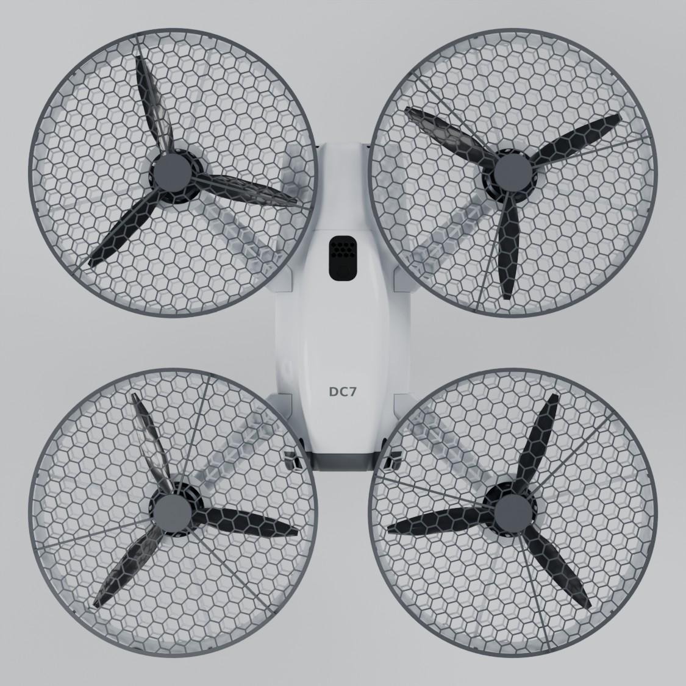
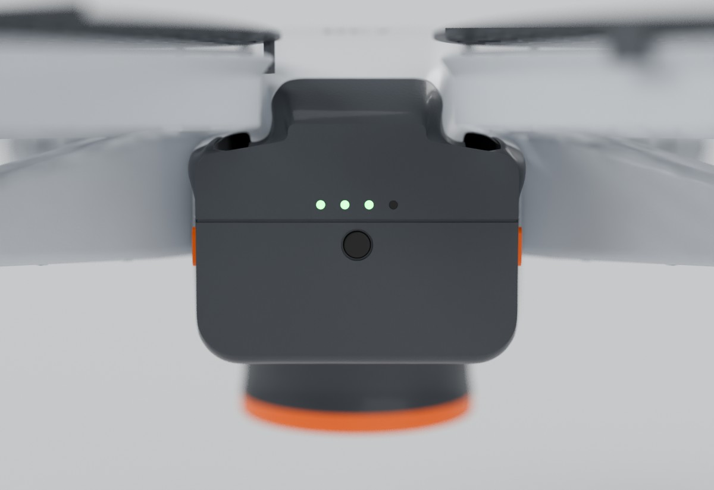

# 12 — Bütünleşik Gövde (v2), 3B Modelleme Yöntemi ve Seri Üretim

Durum tarihi: **3 Ekim 2026**. Bu belge iki soruyu yanıtlar:

1. 3B modelleme iyileştirilebilir mi, Blender'da yapılsa daha kaliteli ve estetik olur mu?
2. DJI tarzı **bütünleşik** bir gövde daha iyi olmaz mı? Kamera ön bölmede olsun, sensör ve diğer
   bileşenler ağırlık merkezine göre yerleşsin, tasarım estetik, endüstriyel ve seri üretime uygun olsun.

Her sayı bir araçla yeniden üretilir:

| Konu | Veri / kod | Araç |
|---|---|---|
| v2 ölçüleri | [`cad/v2/v2_params.py`](../cad/v2/v2_params.py) | — |
| Yerleşim ve ağırlık merkezi | [`cad/v2/layout_v2.py`](../cad/v2/layout_v2.py) | `python3 cad/v2/layout_v2.py` |
| Kol titreşimi ve dayanımı | [`cad/v2/analysis_v2.py`](../cad/v2/analysis_v2.py) | `python3 cad/v2/analysis_v2.py` |
| Parçalar, çakışma, kütle, STL/STEP/GLB | [`cad/v2/airframe.py`](../cad/v2/airframe.py), [`gimbal_v2.py`](../cad/v2/gimbal_v2.py), [`build_v2.py`](../cad/v2/build_v2.py) | `python3 cad/v2/build_v2.py` (CadQuery) → [`cad/v2/out/report.md`](../cad/v2/out/report.md) |
| v2 bütçesi | [`config/hardware/variants/tier-a-entegre.yaml`](../config/hardware/variants/tier-a-entegre.yaml) | `python3 tools/budget_calc.py config/hardware/variants/tier-a-entegre.yaml` |
| Render | [`cad/render_blender.py`](../cad/render_blender.py), [`cad/visual.py`](../cad/visual.py) | `python cad/render_blender.py --model v2` (Blender 4.5 / `bpy`) |


## 1. Kısa cevaplar

| Soru | Cevap |
|---|---|
| Modelleme iyileştirilebilir mi? | **Evet, iki adımda yapıldı.** Önce v1 parçaları rafine edildi: radyuslar, çan ağızlı koruma halkası, konik direk ayakları, belli tutamak, kabuk, kaburgalı gimbal kolu, titreşim analizi. Sonra tamamen yeni **v2 bütünleşik gövde** tasarlandı (bu belge). Modeller ve render incelemesi tasarım sırasında **17 gerçek sorun** yakaladı (§7) |
| Blender'da daha kaliteli ve estetik olur mu? | **Görselde evet, mühendislikte hayır.** Blender bir çokgen ağı (mesh) aracıdır. Kalıpçının istediği STEP (tam B-rep yüzey) Blender'da yoktur; et kalınlığı, kalıp açısı, kütle ve tolerans kontrolü de yoktur. Doğru yol **hibrittir**: geometri CadQuery'de (ölçü ve üretim gerçeği), malzeme, ışık ve render Blender'da. Bu hat kuruldu: CadQuery → GLB → `cad/render_blender.py` (Cycles) (§2) |
| Bütünleşik gövde daha iyi mi? | **Ürün için evet.** v2 şunlardan oluşur: kalıplanabilir kabuklar (üst, alt, iki yarım burun), **tek kalıptan 4 özdeş kol–kanal modülü**, burnun ortasında sarkmayan ön gimbal, avuç ayağı ve kuyruktan takılan akıllı batarya. Pervaneler üstten ve alttan ≤ 10 mm ızgarayla tam kapalıdır. Avuçta devrilme açısı 14,6° → **27,4°**; ağırlık merkezi yatayda 0,3 mm içinde. Kalkış ağırlığı **1594 g** (v1: 1456 g, +%9); fark akıllı batarya kabuğu, üst ızgaralar, kablo demeti ve ön gimbalın burnundan gelir (§8). İlk uçuş geliştirmesi v1 (hazır FPV gövde) ile sürer; v2 MJF baskıyla paralel prototiplenir (§10) |
| Kamera ön bölmede olabilir mi? | **Evet, burnun ortasında (§3.2).** Kamera, burnun önündeki siyah astarlı ağızdadır: gövdenin orta hattında, orta yüksekliğinde. Kartı, mercek halkalı ve camlı bir kamera başlığı örter; arkadaki perde elektronik bölmesini kapatır. Görüş −90…+20° arası temiz (yazılım sınırı +15°). Pitch −90…+30° × roll ±30° aralığında çakışma yoktur |
| Gimbal yatay ve ortada olsa, aşağı sarkmasa daha iyi olmaz mı? | **Evet, öyle yapıldı (§3.2).** Pitch ekseni yanaklar arasında yataydır: motor sağ yanakta, rulman sol yanakta. Roll motoru kameranın tam arkasındadır, kamera kendi ekseni etrafında döner. Ön görünüş simetriktir ve karşı ağırlık gerekmez. Kamera z = −46,8 → **−9 mm**'ye çıktı (ağırlık merkezinin 8 mm altı). Gimbalın en alçak noktası −62 → −31 mm oldu, yani burnun alt çizgisi. Bedeli: +25 g ve hover −0,3 dk. Ayrıca kamera aşağı baktıkça gövde roll'ünün bir kısmını EIS düzeltir |
| Gövde daha estetik ve profesyonel olabilir mi? | **Evet (§3.3).** Tek parça okunan açık renk paleti; kaba yarıklar yerine ızgaralarla aynı dilde bal peteği havalandırma (kanopide parlak siyah vizör, tabanda emiş panelleri); köşeleri yuvarlatılmış, pahlı kamera ağzı; parça ayrımlarında eşit ayrım çizgileri; logo, ToF penceresi ve kuyrukta 4 LED'li batarya göstergesi. Yan yarıklar kalktığı için alt kalıpta kayar maça gerekmez. Bu turda hacim hesabındaki bir hata da düzeltildi; tüm kütleler hassas hesaplandı |
| Yerleşim ağırlık merkezine göre planlanabilir mi? | **Evet, kodla.** Her bileşen bir kutu ya da CAD'den gelen ağırlık merkezli bir kütle olarak yerleşir. Batarya konumu, ağırlık merkezini motor merkezine getirecek şekilde **çözülür** (hücre merkezi x = −36,8 mm). Ardından 12 yerleşim kuralı, 3 titreşim/dayanım kontrolü ve 33 CAD kontrolü çalışır; hepsi geçiyor (§4–§6) |
| Pervanenin üstü de korunup avuç ayağı kısaltılabilir mi? | **Evet (§3.1).** Üst ızgara ve motor çanı eteğiyle pervane her yönden kapalı; ayak 49 → 26 mm kısaldı, gimbal 10 mm yükseldi. Üç sensör sığıyor, ayak ağzından kırpılmadan görüyor ve temas mesafesini ölçebiliyor. Avuçta denge 20° → 27,8°. Bedeli: +57 g ve girişte tahmini %5 itki → hover 19,2 → 16,9 dk (o adımda; bugün 16,5 dk, §3.2–3.3) |
| Seri üretime uygun mu? | **Tasarım kuralları kodda.** PC/ABS 2,0 mm et, PA6-GF30 1,6–2,2 mm, kaburga ≤ 0,6 × et, ≥ 1° kalıp açısı, maçasız U kesit kol, ayrım düzlemine açık yarım soketler, tek kalıp ×4. Hiçbir parça yan maça gerektirmez. Kalıp maliyeti kaba tahminle: alüminyum (pilot) ≈ $64–102 bin, çelik (seri) ≈ $183–308 bin — **teklif alınmalı** (§5) |

## 2. CAD mi, Blender mı? — İkisi, ayrı işler için

| | Parametrik CAD (CadQuery, FreeCAD, Fusion 360, Onshape, SolidWorks) | Blender (mesh / subdivision) | Plasticity, Rhino, Fusion Form (NURBS / SubD → B-rep) |
|---|---|---|---|
| Geometri | Tam B-rep yüzey (STEP, IGES, Parasolid) | Çokgen ağı | NURBS; STEP verir |
| Ölçü ve tolerans | Birinci sınıf: her ölçü bir parametre | Zayıf: ağ ölçü tutmaz | İyi (doğrudan modelleme) |
| Kalıpçıya teslim | **STEP ✔** | ✘ (mesh kalıp için kabul edilmez) | STEP ✔ |
| Et kalınlığı, kalıp açısı, kütle, FEA | ✔ (FreeCAD FEM / CalculiX, Fusion) | ✘ | Kısmen |
| Parametrik değişiklik (ör. kol kesiti 24 → 34 mm) | Bir satır + yeniden üret (kontroller dahil) | Elle yeniden modelleme | Kısmen |
| Serbest form, yüzey estetiği | Spline loft ve G1 geçişler iyi; serbest form zahmetli | Çok kolay | **En iyi** (endüstriyel tasarım aracı) |
| Render, CMF, pazarlama görseli, animasyon | Zayıf | **En iyi** (Cycles, PBR) | Orta |
| Bu projede | Tüm parçalar (`cad/`, `cad/v2/`) | Render (`cad/render_blender.py`) | Gerekirse kanopi yüzeylerinin rötuşu; sonuç STEP olarak geri alınır |

Aynı v1 geometrisi, iki farklı sunum:

| matplotlib önizleme (`cad/build.py`) | Blender Cycles (`cad/render_blender.py --model v1`) |
|---|---|
|  |  |

**"Kaliteli ve estetik" nereden gelir?** İki kaynaktan gelir:

- **Tasarım dili:** oranlar, yüzey sürekliliği, ayrım çizgileri, renk–malzeme–yüzey (CMF). Bu turda v2 ile ele alındı.
- **Render kalitesi:** malzeme ve ışık. Blender'ın katkısı budur: aynı geometriyi fotogerçekçi gösterir.

Blender modeli "daha kaliteli" yapmaz; ama kalitesini görünür kılar. Ters yönde bir risk de vardır: Blender'da güzel görünen bir mesh, kalıp için sıfırdan CAD'de yeniden kurulmak zorundadır.

**Kurulan hat:**

1. **CadQuery:** ölçüler (`v2_params.py`) → parçalar (`airframe.py`) → kontroller → çıktılar. Çıktılar üç biçimdedir: STEP (kalıpçı), STL (baskı), GLB (adlı parçalar, mm).
2. **`visual.py`:** tek CMF tablosu (renk, pürüzlülük, vernik, doku, LED ışıması). GLB renkleri ve Blender malzemeleri aynı kaynaktan üretilir.
3. **`render_blender.py`:** GLB'yi alır; ölçeği (0,001) uygular ve Z-yukarı yönünü kendisi algılar. Ardından malzemeleri atar ve sahneyi kurar:
   - stüdyo ışıkları (anahtar ışık ≈ 3 W/m²);
   - gölge yakalayan zemin;
   - AgX renk dönüşümü;
   - Cycles + OpenImageDenoise;
   - kadrajı kutu köşelerinin izdüşümüyle otomatik ayarlar.

   v2 görünümleri: `hero, front, rear, side, top, under, nose, tail`.

İlk denemelerde koyu plastikler beyaz görünüyordu; nedeni Blender değil, ışık kurgusuydu. Büyük bir tepe ışığı yukarı bakan tüm yüzeylerde yansıyordu ve pozlama ≈ 4 kat fazlaydı. Işık enerjileri fiziksel olarak (E = P / πd²) hesaplanınca renkler doğru çıktı.

**Blender'da geometri ne zaman yapılır?** Konsept aşamasında hızlı form denemeleri (blockout) ve kalıplanmayacak dekoratif parçalar için. Seçilen form CAD'de yeniden kurulur ya da Plasticity'de modellenip STEP alınır.

## 3. v2 tasarım konsepti


Ölçüler: gövde 235 × 98 mm, kanallarla birlikte **441 × 441 × 120 mm** (v1 korumalarla ≈ 436 × 436 mm).

| Parça | İşlev | Seri üretim | Prototip | Kütle (CAD) |
|---|---|---|---|---:|
| Üst kabuk (kanopi) | Elektronik kapağı; kol yarım soketleri; GNSS ve anten penceresi; siyah vizör (ToF penceresi + bal peteği çıkış delikleri); logo | PC/ABS enjeksiyon, ince doku; vizör 2K (parlak siyah PC) | MJF PA12 + boya | 56 g |
| Alt kabuk (taşıyıcı) | V uçlu kol soketleri, batarya tüneli rayları, 6 vida kulesi; Pi ve ESC tablası; tabanda bal peteği havalandırma (maçasız) | PC/ABS enjeksiyon | MJF PA12 | 62 g |
| Burun (iki yarım) | Alın, yanaklar (içte pitch motoru ve rulman), siyah ağız astarı; alt yarıda sönümleyici perdesi. Ayrım düzlemi pitch ekseni (z = −9) | PC/ABS 1,6 mm, **2K**: dış gövde renginde, astar siyah | MJF PA12 + boya | 19 + 23 g |
| Kol–kanal modülü ×4 | U kesit kol, motor yuvası, çan ağızlı kanal, alt bal peteği ızgara, 3 radyal kaburga, motor çanı eteği | **PA6-GF30, tek kalıp ×4** | MJF PA12 | 4 × 76,6 g |
| Üst ızgara ×4 | Pervane üstü parmak koruması; göbekte somun kapağı; 6 ayak + 3 geçme tırnak (pervane değişiminde çıkar); kenarda ≈ 4 mm yan hava girişi | PC, tek kalıp ×4 | MJF PA12 | 4 × 11,2 g |
| Avuç ayağı + uç + cam | Kısa silindir (Ø74, karından 26 mm); sensör tablası (CM3 Wide, VL53L8CX, MTF-01) IR geçirgen camın arkasında; avuca değen TPU uç; üst kenarı gövdeye oturur | PC/ABS + TPU 95A (2K) + PC cam | MJF PA12 + TPU baskı | 23 + 4 + 4,5 g |
| Akıllı batarya | Paket kabuğu + kuyruk kapağı (gövde çizgisini tamamlar) + 2 kilit düğmesi | PC/ABS (V-0) + POM | MJF PA12 | 46 g (+ ≈ 10 g konnektör ve BMS) |
| **Toplam (gövde)** | | | | **588 g** (MJF prototip: 473 g) |
| Ön gimbal (ayrı tablo, §3.2) | Sönümlü taşıyıcı, pitch çerçevesi, beşik, kamera başlığı + 2 motor, kontrolcü, IMU, sönümleyiciler | PA6-GF30 + PC | MJF PA12 / PA-CF | 85 g |

**Form dili**

- **Omuzlu kesit.** Alt "şasi" 96–98 mm geniştir; batarya, Pi ve ESC burada, kanal yüksekliğinin altında durur. Üst "kanopi" 50–66 mm geniştir ve kanallar arasındaki koridora sığar. Gövde ↔ kanal halkası boşluğu 3,0 mm'dir (CAD); kanallar gövdeye gömülü görünür (DJI Avata benzeri).
- **Sürekli yüzey.** Kesitler 10 istasyonda tanımlıdır. Her kesit köşeleri yuvarlatılmış bir 8 köşeli çokgendir. Her köşe yayı ve her kenar, tüm kesitlerde aynı sayıda noktayla örneklenir (96 nokta, alt ortadan başlar). Böylece k. nokta her kesitte aynı özelliğe düşer: loft yüzeyi kıvrılmaz, parlak yüzeyde dalgalı yansıma oluşmaz. Sonuç: y = 0'a göre simetrik, kırıksız yüzey (§7).
- **Burun ve kuyruk.** Burun gövde renginde bir "yüz"dür: iki yanak, düz bir alın ve ortada siyah astarlı ağız. Kamera ağzın içinde, ortadadır (DJI Neo/Avata benzeri); burun ucu yuvarlatılmıştır ve kamerayı 3 mm geride korur. Kuyrukta batarya kapağı gövde çizgisini tamamlar (Mavic/Air tarzı).
- **CMF (tek parça okunan açık palet, §3.3).** Gövde ve burun beyaz-gri, kol–kanal modülleri bir ton koyu açık gri (ince doku): drone dört siyah halka ile bir gövde değil, tek bir ürün gibi okunur. Üst ızgara, avuç ayağı ve batarya grafit; ağız astarı, kanopi vizörü ve kamera başlığı siyah. Güvenlik turuncusu yalnızca ayak ucunda ve batarya kilidinde kullanılır, böylece avuç noktası uzaktan görünür. Seyir lambaları: sol ön kırmızı, sağ ön yeşil (motor yuvalarının altında), arka beyaz.
- **Ayrım çizgileri.** Parça ayrımları (üst/alt kabuk z = −4, burun yarıları z = −9, burun ve batarya ek yerleri) 0,8 × 0,4 mm'lik eşit kanallardır: kalıp ayrımı rastgele bir çizgi değil, gövdeyi saran bilinçli bir tasarım çizgisi olur.

**Kanal (pervane koruması)**

- İç çap 189,8 mm (pervane + 2 × 6 mm). Çan ağızlı giriş: 4 mm yükseklik, 3 mm dışa açılma. İç duvarda 1,5° kalıp açısı vardır.
- Alt ızgara bal peteğidir: hücre 10 mm (parmak geçmez), kaburga 1,2 mm.
- 3 radyal kaburga (60°/180°/300°) halkayı motor göbeğine bağlar; kalıpta da göbekteki yolluktan halkaya akış yolu olur.
- Pervane ↔ alt ızgara mesafesi 10 mm; CAD çakışma kontrolü temiz.
- **Üst ızgara** (çıkarılabilir): kanattan 5,4 mm, somun ve milden 3,8 mm uzakta (CAD). Hücre yine ≤ 10 mm, kaburga 1,0 mm (PC); halka ile ızgara arasındaki ≈ 4 mm yan aralık ek hava girişidir ve parmak geçirmez.
- **Motor çanı eteği:** alt ızgaranın göbeğinden motor yuvasına inen, 3 mm yarıklı silindir. Dönen çanın yanı da kapanır (çana 3 mm).
- Avuç ayağının tabanı pervane düzleminin **102 mm** altındadır (tam kapalı pervanede kural ≥ 100 mm; açık üstte 120) ve drone'un **en alçak noktasıdır**: sonraki en alçak nokta alt kabuktur (−52 mm, 20 mm yukarıda); gimbal artık burnun alt çizgisinde kalır. Böylece avuca yalnızca ayak değer.

**Kamera ve burun**


- **Ön gimbal (§3.2):** kamera merkezi (129,4, 0, −9) mm'de, burnun orta hattında ve orta yüksekliğindedir. Pitch ekseni yanaklar arasında yataydır, roll motoru kameranın arkasındadır; gimbal aşağı sarkmaz.
- **Kamera başlığı:** kartı ve mercek bloğunu 1 mm'lik PC bir kapak örter. Önde eloksal görünümlü bir mercek halkası ve koruyucu cam vardır (toplam 2,2 g). Kapak öne doğru 30 × 28 mm'den 21 × 20 mm'ye daralır; bu, kapsülün süpürme yarıçapını ve dolayısıyla ağzı küçültür.
- **Ağız ve perde:** ağız siyah astarlıdır (2K'nın ikinci enjeksiyonu). Astar lense yansıma yapmaz ve kabuğun içini kapatır; pitch motoru ve rulman pimi astardaki deliklerden geçer. Burun perdesi (1,2 mm, cıvatalarda 2,4 mm pul) elektronik bölmesini ayırır. Kamera FFC şeridi ile motor kabloları 20 × 7 mm'lik geçişten girer.
- **Görüş:** −90…+20° arası temizdir; +25°'de ön üst ızgaralar kadraja girer. Yazılım sınırı +15°'dir ve [`behavior.yaml`](../config/mission/behavior.yaml) ile aynıdır.

**Avuç ayağı (alttaki yuvarlak gövde) ne işe yarar?**


Avuca iniş için şarttır ve beş işi aynı anda yapar:

1. **Avuca değen tek nokta:** turuncu TPU uç yumuşaktır ve uzaktan görünür. CAD kontrolü ayağın en alçak nokta olduğunu her derlemede doğrular.
2. **Güvenlik mesafesi:** avuç, pervane düzleminin 102 mm altında kalır (tam kapalı pervanede ≥ 100 mm, [05](05-avuca-inis-tasarimi.md)); pervane rüzgârı avuçta zayıflar.
3. **Aşağı bakan sensörler:** tabandan 22 mm içeride, IR geçirgen camın arkasında; darbe, toz ve sudan korunur.
   - CM3 Wide: avuç ve jest tespiti.
   - VL53L8CX 8×8 ToF: avuç mesafesi, eğimi ve temas.
   - MTF-01: optik akış + lazer; konum tutma ve irtifa.
4. **Ağırlık merkezinin tam altında:** avuç dönme ekseni olur; motorlar durunca drone avuçta ≈ 28°'ye kadar devrilmez.
5. **İniş takımı:** masada ve zeminde de bu ayağın üzerinde durur.

Çapı (74 mm) sensörlerden ve görüş açılarından, boyu güvenlik kuralından gelir (gimbal artık sarkmadığı için ayağın boyunu sınırlamaz); tamamen kaldırılırsa avuca iniş güvenliği bozulur. Pervanenin üstü de kapatılınca 49 mm'den 26 mm'ye kısaldı (§3.1).

### 3.1 Pervane üstü koruma ve kısa avuç ayağı

| | Önce | Sonra (o adımda; güncel değerler §3.2 ve §4) |
|---|---:|---:|
| Pervane koruması | Kanal + alt ızgara | Kanal + alt ızgara + **üst ızgara** + **motor çanı eteği** (her yönden kapalı) |
| Ayak tabanı ↔ pervane düzlemi | 125 mm (kural ≥ 120) | **102 mm** (tam kapalı pervanede kural ≥ 100) |
| Ayak boyu (karından) | 49 mm, Ø74 → Ø66 konik | **26 mm**, Ø74 silindir |
| Gimbal bağlantısı | z = −12 mm | **z = −2 mm** (gimbal 10 mm yukarı) |
| Sensörler | Tabandan 25 mm, açık | **Tabandan 22 mm, IR geçirgen camın arkasında** |
| Avuçta devrilme açısı | 20,0° | **27,8°** |
| Kalkış ağırlığı / hover | 1507 g / 19,2 dk | 1564 g / 16,9 dk |

**Neden kısalabildi?** docs/05'teki 120 mm kuralının amacı, açık üstlü korumada yayık parmakların halkanın üstünden pervaneye uzanmasını önlemekti. Üst ızgara (≤ 10 mm hücre) ve motor çanı eteğiyle el hiçbir yönden dönen parçaya ulaşamaz. Dikey ayrım artık yalnızca aşağı akış ve parmak payı için gerekir: ≥ 100 mm.

Asıl sınır gimbaldı: ayak kısalınca avuca önce kamera değecekti. Gimbal önce 10 mm yükseltildi; ardından burnun ortasına alındı (§3.2) ve bu sınır tamamen kalktı. CAD kontrolü ayağın en alçak nokta olduğunu her derlemede doğrular.

**Sensörler sığıyor ve profesyonelce çalışıyor mu?** Evet; her madde kodla kontrol edilir:

- **Sığma:** ayak çapı değişmedi (Ø74); tabla aynı üç sensörü taşır. Sensörlerin üstü Pi'ye ve bataryaya 6,8 mm uzak (CAD).
- **Görüş:** her sensör ayak ağzından kırpılmadan görür:
  - CM3 Wide: 57° ≥ 51° (102° yatay görüş).
  - VL53L8CX: 37° ≥ 32,5° (köşe bölgeleri dahil).
  - MTF-01: 34° ≥ 21°.

  Ayak silindir yapıldığı için ağız genişledi; eski konik ayakta ToF'un köşe bölgeleri kırpılırdı.
- **Ölçüm aralığı:** temas anında avuç sensörlerden 22 mm uzaktadır. VL53L8CX ve MTF-01'in ölü bölgesi ≈ 2 cm olduğundan temas mesafesi hâlâ ölçülür. Yine de "≥ 2 bağımsız temas ipucu" kuralı geçerlidir ([05](05-avuca-inis-tasarimi.md)).
- **Koruyucu cam:** sensörler 1 mm'lik IR geçirgen PC/PMMA camın arkasındadır (siyah IR mürekkep maskeli, DJI alt sensörleri gibi).
  - Cam sensörlere sıfır hava boşluğuyla değer; ToF verici ile alıcı arasında köpük ışık bariyeri olur.
  - VL53L8CX ve MTF-01'de cam için çapraz konuşma (crosstalk) kalibrasyonu yapılır.
  - Cam toz, su ve parmak izine karşı korur; avuca cam değil TPU halka değer.
- **Optik akış:** MTF-01 akışı ≥ 8 cm'de çalışır. Avuca son 8 cm'de akış yerine lazer ve 8×8 ToF kullanılır ([05](05-avuca-inis-tasarimi.md) durum makinesi). Ayak boyu bunu değiştirmez.

**Bedeli ve seçenekler:**

- Üst ızgaralar 4 × 11 g ve girişte ≈ %17 tıkanma getirir. İtki kurulum katsayısı 0,90 → 0,85 alındı (tahmini, itki standında ölçülecek). Toplam etki: +57 g, hover 19,2 → 16,9 dk (limit ≥ 15 dk).
- Üst ızgara çıkarılabilir (pervane değişimi için 3 geçme tırnak). Her ızgaradaki mıknatıs, kanal halkasındaki hall sensörüyle algılanır; dördü takılı değilse avuca iniş kilitlenir.
- Ayak ayrı bir parça olduğu için **iki ayak seçeneği** sunulabilir:
  - Kısa ayak: üst ızgaralı, avuç modu.
  - Uzun ayak (−95 mm, 125 mm ayrım): üst ızgarasız açık alan uçuşu, ≈ +2 dk.

  Ayak konnektörüne direnç kodu konur; yazılım hangi ayağın takılı olduğunu bilir.

### 3.2 Gimbal ortada ve yatay: ön ağız

Soru: *"Gimbal direk yatay olarak ortada olsa daha iyi olmaz mı, aşağı doğru sarkmış olmasa?"* — **Evet.** Daha
estetik, avuca iniş için daha güvenli (aşağıda çıkıntı kalmaz) ve kamera çarpmalara karşı daha korunaklıdır.
Kamera artık burnun önündeki ağızdadır: gövdenin orta hattında ve orta yüksekliğinde.

| | Önce (başlık altında asılı) | Şimdi (ön ağız) |
|---|---:|---:|
| Kamera merkezi (x, y, z) | (128, 0, −46,8) mm | **(129,4, 0, −9) mm** |
| Kamera ↔ ağırlık merkezi yüksekliği | 45 mm altta | 8 mm altta |
| Gimbalın en alçak noktası | −62 mm (burnun 40 mm altında) | **−31 mm** (−90°'de bile burnun alt çizgisinde) |
| Eksen sırası | dışta roll, içte pitch | **dışta pitch, içte roll** |
| Roll ekseni | kameranın 21 mm yanında (asimetrik) | optik eksen (simetrik) |
| Görüş (temiz) | −90…+25° | −90…+20° (yazılım sınırı +15°) |
| Burun / gimbal | 25 g / 79 g | 41 g / 85 g |
| Kalkış ağırlığı / hover | 1564 g / 16,9 dk | 1589 g / 16,6 dk (o adımda; hassas kütlelerle 1594 g / 16,5 dk, §3.3) |
| Avuçta devrilme açısı | 27,8° | 27,4° |

**Neden eski gimbalı yukarı taşımak yetmedi?** v1 gimbalında roll motoru kameranın arkasındaydı ama dengeyi
sağlamak için 21 mm yana kaymıştı; pitch motoru yan koldaydı. Roll ±30°'de pitch motoru kameranın çevresinde
döner ve ±30 mm'lik bir süpürme yüksekliği gerekir. Gimbal yığını (üst plaka + sönümleyiciler) da kameranın 45 mm
üstüne çıkar. Ön kanal halkaları burnun iki yanında z = 20'den başladığı için bu hacim kanalların arasına sığmaz.

**Yeni mimari** ([`cad/v2/gimbal_v2.py`](../cad/v2/gimbal_v2.py)):

```
  burun perdesi ── 4 sönümleyici ── U taşıyıcı ─┬─ [PITCH motoru] sağ yanakta ─┐
                                                └─ 685 rulman sol yanakta ─────┴─ U çerçeve ── [ROLL motoru] ── beşik ── CM3 + IMU
                                                       (pitch −90…+30°)            (kameranın tam arkasında, roll ±30°)
```

- **Kapsül** (pitch ile döner): U çerçeve + roll motoru + beşik + kamera başlığı + kamera. Roll motoru optik
  eksenle eş eksenli olduğu için kamera kendi ekseni etrafında döner. Roll grubunun ağırlık merkezi optik
  eksenden 0,02 mm uzaktadır; karşı ağırlık gerekmez.
- **Pitch ekseni** kapsülün ağırlık merkezinden geçer (kamera kartının 10,0 mm arkası, CAD). Motorlar yük
  tutmaz, yalnızca ivmelendirir. Pitch motoru sağ yanakta; karşısında, sol yanakta 685 rulman ve pim vardır.
  İki yanak dıştan aynı görünür.
- **Sönümlü U taşıyıcı** (PA6-GF30, 14,9 g): yan plakaları yanakların içinde motoru ve rulmanı taşır. Arka
  plakası 4 sönümleyiciyle burun perdesine bağlanır. Taşıyıcı ile burun arasında her yerde ≥ 1,5 mm boşluk
  vardır (sönümleyici yolu).
- **Ağız:** kapsülün süpürmesi 22,1 mm yarıçap içinde kalır; ağız buna ≥ 2 mm pay ekler (24,5 mm). Arkası pitch
  ekseni etrafında bir yaydır, üstü düz bir alındır; önü ve altı açıktır, böylece kamera −90°'de aşağıyı görür.
  CAD, pitch −90/−45/0/+15/+30° × roll −30/0/+30° pozlarında kapsülü burna, taşıyıcıya ve ön kanallara karşı
  tarar: çakışma 0 mm³, en yakın boşluk 2,0 mm.
- **Burun iki yarımdır**, ayrım düzlemi pitch eksenidir (z = −9). Gimbal ve sönümleyiciler alt yarıya (perde)
  takılır, üst yarı kapanır. Seri üretimde 2K enjeksiyon kullanılır: dış gövde renginde, ağız astarı siyah.
- **Gimbal kontrolcüsü** (10 g) uçuş kontrolcüsünün üstüne, kanopi altına taşındı. Burun ağırlaştığı için
  ağırlık merkezine yakın olmalıydı; GNSS'ten 77 mm uzaktadır.

**Neden kamera tam z = 0'da değil?** Üst sınırı kanallar belirler. Ön kanal halkaları z = 20'den başlar ve
gövdenin kenarına 17–20 mm yaklaşır. Ağzın alnı ve yanak omuzları bu halkalara ≥ 2 mm boşluk bırakmalıdır (CAD:
2,7 mm). Kapsül +30°'de pitch ekseninin 20,9 mm üstüne çıktığı için eksen z = −9'dadır. Bu konum burnun orta
yüksekliğinin 7 mm, ağırlık merkezinin 8 mm altıdır; eski konumda kamera 45 mm alttaydı.

**Bedeli ve sınırlar:**

- **Eksen sırası.** Dışta pitch, içte roll kullanılır. Kamera θ kadar aşağı baktığında gövde roll'ünün sin θ
  kadarı mekanik olarak düzeltilemez ve görüntüde küçük bir yatay kayma (pan) olarak kalır. Takip çekimlerinde
  (θ = 0…−20°) bu kayma roll'ün ≤ %34'üdür; EIS (%10 kırpma payı, [10 §3.4](10-kamera-gimbal-ve-sensorler.md))
  ve gövde yaw'ı bunu giderir. θ = 0'da düzeltme tamdır. Tepeden çekimde (−90°) iç eksen yatay döndürme (pan)
  ekseni olur. v1'in sırası bu kaybı yaşamaz, ama ortaya sığmaz.
- **Kütle.** Burun 25 → 41 g, gimbal 79 → 85 g oldu (kalıp parçaları PA6-GF30). Burun öne ağırlık eklediği
  için et kalınlığı 1,6 mm'ye, astar 1,2 mm'ye indirildi ve kontrolcü geriye alındı. Toplam etki: +25 g,
  hover 16,9 → 16,6 dk (sınır ≥ 15 dk). Batarya dengede kalmak için 2,4 mm geri kaydı; kuyruk payı +2,2 mm.
- **Görüş.** Üst sınır +25° → +20° oldu, çünkü kamera kanalların arasına biraz daha gömüldü. Yazılım sınırı
  (+15°) değişmedi.
- **Alternatif: tek eksen (pitch) + EIS** (DJI Neo gibi). Roll motoru kalkar (−20 g) ve kapsül küçülür; roll
  ise yalnızca dijital olarak düzeltilir. Mekanik roll gerekmiyorsa daha hafif ve daha yüksek bir kamera konumu
  sağlar.

### 3.3 Estetik ve profesyonel ayrıntılar

Soru: *"Gövde tasarımını optimize et, daha estetik ve profesyonel bir tasarım olsun."* Mühendislikten ödün
verilmedi: tüm yerleşim, titreşim ve CAD kontrolleri geçiyor. İyileştirmeler beş başlıkta toplandı:

| | Önce | Şimdi | Neden |
|---|---|---|---|
| Renk–malzeme (CMF) | Beyaz gövde + dört siyah halka | Tek parça okunan açık palet: beyaz-gri gövde, bir ton koyu açık gri kanallar, grafit ızgara/ayak/batarya, siyah vurgular | Göz gövdeyi ve halkaları tek ürün olarak görür. Siyah yalnızca işlev bildirir: kamera, sensör, ızgara |
| Havalandırma | Kanopide 5, yanlarda 12 düz yarık ("radyatör" görünümü); alt kalıpta 2 kayar maça | Kanopide siyah parlak vizör içinde bal peteği çıkış delikleri ve ToF penceresi; tabanda iki çukur bal peteği emiş paneli | Izgaralarla aynı tasarım dili. Yanlar temiz kalır. Kalıp maçasızdır (çelik alt kabuk kalıbı ≈ $4–6 bin ucuzlar) |
| Kamera ağzı | Keskin dikdörtgen kesim | Üst köşeleri R4, kenarı pahlı (kalıplanmış dudak) | Işık kenarda yumuşak kırılır; ağız kesilmiş değil, kalıplanmış görünür |
| Ayrım çizgileri | Görünmez ya da rastgele ek yerleri | 0,8 × 0,4 mm eşit kanallar (gövde, burun, batarya) | Ek yeri farkları gölgede kalır ve gövdeyi saran bir tasarım çizgisi oluşur |
| Ürün ayrıntıları | — | Kanopide "DC7" (çukur + tampon baskı), kuyrukta 4 LED'li yakıt göstergesi ve düğme, yukarı bakan ToF için cam pencere | Ürün tamamlanmış görünür; akıllı batarya gerçek işlevini gösterir |

| Üstten: vizör, logo, tek parça palet | Kuyruk: akıllı batarya göstergesi |
|---|---|
|  |  |

- **Vizör ve pencere:** yukarı bakan VL53L1X, vizördeki 9 mm'lik IR geçirgen camın altındadır; bal peteği
  delikleri (3,2 mm hücre, 1,2 mm kaburga) Pi bölmesinin sıcak havasını kanopiden atar. Hava tabandaki iki
  panelden girer (baca etkisi).
- **Kalıp:** tüm delikler dikeydir; üst kabuk +z, alt kabuk −z yönünde çıkar. 2K vizör ve ağız astarı aynı
  kalıpta ikinci enjeksiyondur (boya ve yapıştırma yok).
- **Kütle:** görsel değişikliklerin toplam etkisi 1 g'ın altındadır.
- **Ölçüm düzeltmesi:** çalışma sırasında hacim integralinin ince kabuklarda %1–7 hata verdiği ortaya çıktı
  (§7, #16). Tüm kütle ve ağırlık merkezleri hassas integralle yeniden hesaplandı, profil buna göre güncellendi.

## 4. Ağırlık merkezi odaklı yerleşim


| Bileşen | Konum (x, z) mm | Kütle | Gerekçe |
|---|---|---:|---|
| Batarya (6S1P 21700) | x = −36,8 (çözülen), z −34…+12 | 451 g | En ağır kütle; CG'yi motor merkezine getiren konum çözülür. Kuyruktan takılır; kapağı gövdenin kuyruğudur |
| Batarya kabuğu | Kapak kuyrukta (sabit), paket kabuğu boyunca, konnektör + BMS ön uçta | 56 g | Kabuk üç kütleye ayrılarak modellenir (kapak, paket kabuğu, ön uç) |
| FC (IMU) | (0, +20) | 7,5 g | CG'nin hemen üstünde: IMU ofseti yalnızca düşeyde (+21 mm) |
| ESC (4'ü 1 arada) | (26, −1) | 13,8 g | Merkezde: 4 motora eşit kablo boyu; kanopi emişinden hava alır |
| Pi 5 + AI HAT+ 2 | (36, −24), 90° döndürülmüş | 90 g | Ön alt şasi: gimbal CSI kablosu kısa, yan havalandırma yarıklarının önünde |
| BEC, WFB-ng | (56, 0), (58, +10) | 25 + 20 g | Pi'ye yakın; WFB antenleri kanopi önünde |
| GNSS + pusula | (−66, +18,5), kanopi altında | 10 g | Gürültü kaynaklarından ≥ 70 mm uzakta (en yakını batarya konnektörü, 75 mm) |
| ELRS / Remote ID | (−36, +20) / (28, +20) | 5 / 10 g | Kanopi altı; antenler üst kabukta |
| VL53L1X (yukarı) | (50, +33) | 1 g | Kanopi tepesindeki pencere |
| Gimbal (taşıyıcı, motorlar, kapsül) + kamera | (113, −9) / (129,4, −9) | 75 + 4 g | Burnun ortasındaki ağızda; pitch ekseni kapsülün ağırlık merkezinde (§3.2) |
| Gimbal kontrolcüsü | (10, +30,5), FC'nin üstünde | 10 g | Ağır burnu dengeler (ağırlık merkezine yakın); GNSS'ten 77 mm |
| Avuç ayağı sensörleri | (0, −50) | 9,5 g | CG'nin tam altında: avuç = dönme ekseni |
| Gövde parçaları | CAD ağırlık merkezleri ([`v2_params.PART_CG`](../cad/v2/v2_params.py)) | 588 g | Test, CAD ile ±3 mm uyumu doğrular |

**Sonuç:** ağırlık merkezi (0,0, +0,3, −0,8) mm'dedir, yani pervane düzleminin 31 mm altında. Avuçta devrilme açısı **27,4°**'dir (v1: 14,6°); motorlar durduktan sonra ayak avuçta çok daha kararlı durur. Gimbal yükselince ağırlık merkezi 1,2 mm yukarı çıktı; kamera artık ağırlık merkezinin yalnızca 8 mm altındadır.

**EKF montaj ofsetleri** — ilk değerler; montajdan sonra ölçülerek güncellenir ([07](07-hover-ayar-rehberi.md)). PX4 gövde ekseni FRD'dir (x ileri, y sağ, z aşağı):

| Parametre | X | Y | Z | Not |
|---|---:|---:|---:|---|
| `EKF2_IMU_POS_*` (m) | 0,000 | 0,000 | −0,021 | IMU, CG'nin ≈ 21 mm üstünde |
| `EKF2_GPS_POS_*` | −0,066 | 0,000 | −0,019 | Kanopi altı, arka |
| `EKF2_OF_POS_*` (MTF-01) | −0,005 | +0,019 | +0,049 | Avuç ayağı, sensör camı |

## 5. Seri üretime uygunluk (DFM)

### 5.1 Kurallar (`build_v2.py` raporunda kontrol edilir)

| Kural | Değer | Neden |
|---|---|---|
| Et kalınlığı | PC/ABS 2,0 mm (burun 1,6; ağız astarı ve perde 1,2); PA6-GF30: kol 2,2, kanal 1,6, gimbal parçaları 3,0 mm | 1,5–2,5 mm aralığı dolum ile çöküntü arasındaki dengedir |
| Kaburga | ≤ 0,6 × et (1,2 / 1,3 mm) | Yüzeyde çöküntü izi (sink mark) oluşmaz |
| Kalıp açısı | ≥ 1° (kanal iç duvarı 1,5°) | Parça kalıptan çıkar |
| Alttan kesik yok | Kol U kesit (altı açık); soketler ayrım düzlemine açık; havalandırma delikleri dikey (kanopide ve tabanda) | Hiçbir parçada yan maça gerekmez. Eski yan yarıklar (2 kayar maça) tabana taşındı (§3.3) |
| İki renkli (2K) parçalar | Burun yarıları: gövde rengi + siyah ağız astarı; üst kabuk: gövde rengi + siyah parlak vizör | İkinci enjeksiyon aynı kalıpta (döner tabla); boya ve yapıştırma yok |
| Ayrım çizgisi | 0,8 × 0,4 mm kanal, her iki kalıp yarısında pah | Ek yeri farkı (boşluk, kademe) kanalın gölgesinde kalır; görünüm parçadan parçaya tutarlı olur |
| Ortak kalıp | 4 kol–kanal modülü özdeş (C4 simetri) | Tek kalıp. V uçlu kol kökünün yüzleri her konumda gövde eksenlerine paraleldir: arkada batarya tüneline, önde Pi'ye |
| Ayrım düzlemi | Gövde z = −4 mm, kol köklerinin içinden; burun z = −9 mm (pitch ekseni) | Kollar iki kabuk arasında sıkışır; vidalar alttan, görünmez yüzeydedir. Gimbal burnun iki yarısı arasına oturur: motor ve rulman delikleri ayrım düzleminde ikiye bölünür |
| Boşluklar | Kol kökü 0,3 mm/yüz, batarya tüneli 0,6 mm, gimbal taşıyıcısı ↔ burun ≥ 1,5 mm, kapsül ↔ ağız ≥ 2 mm | Montaj payı ve sönümleyici yolu. CAD'de çakışma 0 mm³: kol ↔ gövde, batarya ↔ gövde ve kollar, kartlar ↔ kabuklar, gimbal kapsülü (pitch −90…+30° × roll ±30°) ↔ burun, taşıyıcı ve kanallar |
| Bağlantı | 6 × M2,5 vida, Ø6,4 mm kuleler (alt Ø2,8 geçiş, üst Ø2,2 pilot) | Kol köklerinden, tünelden ve kartlardan uzak |
| Malzeme nemi | PA6-GF30 su alır: E ≈ %70'e düşer, boyut ≈ %0,2 büyür | Analiz nemli durumu da kapsar; kalıp ölçüleri koşullandırılmış numuneyle doğrulanır |

### 5.2 Kalıp maliyeti (kaba tahmin — teklif alınmalı)

| Parça | Alüminyum kalıp (EVT/DVT, ≈ 1–10 bin baskı) | Çelik kalıp (seri, ≥ 300 bin baskı) | Not |
|---|---:|---:|---|
| Üst kabuk | $10–15 bin | $30–48 bin | Tekstürlü yüzey; 2K vizör |
| Alt kabuk | $9–14 bin | $26–44 bin | Maçasız (havalandırma tabanda) |
| Burun (2 yarım) | $10–16 bin | $30–48 bin | 2K (gövde rengi + siyah astar), iki kalıp |
| Gimbal parçaları (taşıyıcı, çerçeve, beşik, kamera başlığı) | $6–10 bin | $16–28 bin | Küçük parçalar, aile kalıbı |
| Kol–kanal modülü | $9–15 bin | $25–45 bin | İnce bal peteği; 1 kalıp ×4 parça |
| Avuç ayağı + TPU uç + sensör camı | $6–10 bin | $18–30 bin | 2K enjeksiyon (veya ayrı TPU parça); cam hazır kesim |
| Üst ızgara | $6–10 bin | $18–30 bin | İnce bal peteği (1,0 mm kaburga), 1 kalıp ×4 parça |
| Batarya kabuğu + kapak + kilit | $8–12 bin | $20–35 bin | Kabuk iki parça, ultrasonik kaynak; gösterge ışık boruları |
| **Toplam** | **≈ $64–102 bin** | **≈ $183–308 bin** | |

**Prototip seti:** MJF PA12 ile ≈ 465 cm³, kabaca **$270** (serviste değişir; profilde tahmini fiyat). PA12 hafiftir (1,01 g/cm³), bu yüzden prototip gövde seti seri üretimden ≈ 115 g hafif çıkar (470 ↔ 584 g). Uçuş testlerinde bu fark balastla telafi edilir.

### 5.3 EVT → DVT → PVT

| Aşama | Gövde | Amaç |
|---|---|---|
| **EVT** (mühendislik doğrulama) | MJF PA12 baskı + mevcut elektronik | Uydurma, kablo demeti, ilk uçuşlar; IMU FFT ile kol frekansı (beklenen 210–333 Hz); üst ızgaralı/ızgarasız itki standı karşılaştırması; Pi 5 ısıl kısma kontrolü |
| **DVT** (tasarım doğrulama) | Alüminyum kalıptan gerçek malzeme | Düşme (1 m, 6 yön), titreşim, sıcaklık (−10…+45 °C), yağmur (IPX3 hedefi), batarya UN38.3, EMC ve telsiz ön testleri; çöküntü ve çarpılma ölçümü |
| **PVT** (üretim doğrulama) | Çelik kalıp, pilot seri (≈ 50–200 adet) | Montaj fikstürleri, uçuş sonu test istasyonu (otomatik kalibrasyon), kalite planı |

## 6. Titreşim ve dayanım — kol kesiti nasıl seçildi?

Kol, gövde soketinde ankastre, değişken kesitli bir konsoldur. Ucunda motor, pervane, motor yuvası, ızgara göbeği ve motor çanı eteği vardır (77 g). Kanal halkası (21 g), alt ızgara (11 g) ve halkaya oturan üst ızgaranın (11 g) bir kısmı da kolla birlikte salınır.

**Belirsizlikler iki eksende taranır:**

- **Halka + ızgaraların katılımı (p = 0…1):** Izgaralar düzlem dışında esnek olduğu için bu kütlenin ne kadarının kolla salındığı bilinmez.
- **Malzeme:** PA6-GF30 nemli (E %70) ile kuru (E %100) arasında.

**Hedef:** frekans aralığının tamamı iki bandın ±%20 paylarının arasında kalmalı. Bu, v1 gimbal kolundaki ölçütün aynısıdır.

- Motor dönüş bandı (1×): 145–170 Hz
- Kanat geçiş bandı (3×): 435–510 Hz
- Güvenli pencere: **204–348 Hz**

| Kök yüksekliği (genişlik 22 mm) | Dikey eğilme frekansı | Sonuç |
|---:|---:|---|
| 24 mm (ilk tasarım; 20 mm genişlikle de aynı sonuç) | 124–197 Hz | **1× bandına giriyor — rezonans riski** |
| 28 mm | 154–244 Hz | Bant payına giriyor |
| **35 mm (seçili)** | **210–333 Hz** | Pencerede |
| 38 mm | 235–373 Hz | 3× payına giriyor |

**Diğer sonuçlar:**

- Yanal mod 208 Hz'tir (p = 0,5, nemli). Izgaralar düzlem içinde rijit olduğundan gerçek değer daha yüksektir.
- Kanal kenarına düşme kontrolü (10 g, tek kanal, F ≈ 153 N) kol kökünde σ ≈ 27 MPa verir; emniyet katsayısı **3,4**.

**Doğrulama:**

1. STEP dosyasından FreeCAD FEM (CalculiX) ile modal analiz yapılır. Özellikle kanal ve ızgaranın yerel modları kiriş modelinde yoktur.
2. İlk numunelerde vurma testi yapılır.
3. Uçuşta IMU FFT ile kontrol edilir ([07](07-hover-ayar-rehberi.md)).

## 7. Modellerin yakaladığı tasarım sorunları

Her biri bir kontrolle bulundu ve düzeltildi. Düzeltmeler artık kalıcı kontrol olarak her derlemede çalışır.

| # | Sorun | Nasıl bulundu | Çözüm |
|---|---|---|---|
| 1 | Arka kol kökleri batarya tüneline giriyordu (265 mm³) | CAD çakışma | Kol kökü 90° V uçlu. Tek kalıp ×4 korunur: yüzler her konumda gövde eksenlerine paraleldir |
| 2 | Kolun eğimli alt yüzü ve kaburga köşeleri soketten taşıyordu (7 mm³) | CAD çakışma | Soket bölgesinde sabit kesitli kök; kaburgalar dış yüzeye kırpıldı |
| 3 | Vida göbekleri havada asılıydı (kabuğa bağlı değildi) | Tek katı kontrolü (5 parça) | Tabandan omuza uzanan vida kuleleri, kol köklerinden uzak yeni konumlar |
| 4 | Gimbal roll ±30°'de burun yanaklarına değiyordu (9 mm³) | Hareket aralığı taraması | Bölme 82 → 88 mm |
| 5 | İlk kol kesiti (20 × 24 mm) motor dönüş bandında rezonansa girerdi | `analysis_v2.py` | 22 × 34 mm kök (sonra 35 mm, #11) |
| 6 | Gimbal sönümleyicilerinin bağlanacağı yüzey yoktu; bölme gövde içine açıktı | Render incelemesi | Tavan plakası + arka perde. Ardından perde gimbalın arka plakasına değince (1229 mm³) gimbal 4 mm öne alındı |
| 7 | Gövde yüzeyi burunda 2,6 mm asimetrikti ve alt çizgi 9 mm taşıyordu | Kütle merkezi y ≠ 0 | Kesitler simetrik örneklendi; 2 ara istasyon eklendi |
| 8 | CAD kütleleri tahminden yüksek çıktı: modül 35 → 72 g, batarya kabuğu 26 → 42 g | Kütle ↔ profil karşılaştırması | Profil CAD'den güncellendi. Denge için batarya geri kaydı, kuyruk 4 mm uzatıldı (−88 → −92 mm) |
| 9 | Burun bölmesi ağırlaşınca GNSS–batarya konnektörü mesafesi sınıra indi (70 mm) | EMI kuralı | GNSS 4 mm geri alındı |
| 10 | Kamera bölgesi kötü görünüyordu: çıplak yeşil kart, kutu gibi siyah bölme ve yanaklar, parlak burunda buruşuk yansımalar | Render + kullanıcı geri bildirimi | Kamera başlığı (mercek halkası + cam); yanaksız açık burun; öne doğru incelen alt şasi; köşe hizalı kesitler (aynı nokta sayısı); saten-mat siyah. Buruşuk yansımaların ana nedeni köşelerin kesitten kesite kaymasıydı; parlak siyah yüzey kalan küçük eğrilik farklarını da büyüttüğünden yüzey saten-mata alındı (parlak yüzey için G2 rötuşu: §10) |
| 11 | Üst ızgara halkayla birlikte salındığı için kolun en düşük frekansı 202 Hz'e indi (pencere ≥ 204) | `analysis_v2.py` (katılım taraması) | Kol kökü 34 → 35 mm: 210–333 Hz |
| 12 | Kamera aşağı sarkıyordu: gimbal burnun 40 mm altına iniyordu. v1 gimbalı ortaya sığmıyordu (roll ±30°'de ±30 mm süpürme, yığın kameranın 45 mm üstünde) | Kullanıcı geri bildirimi + süpürme hesabı | Yeni ön gimbal: dışta pitch (yanaklarda), içte eş eksenli roll; burun ağzı (§3.2) |
| 13 | Yükselen yanak omuzları ön kanal halkasının alt kenarına 1,4 mm yaklaştı | CAD mesafe kontrolü (≥ 2 mm) | Pitch ekseni z = −8 → −9, omuzlar 1 mm aşağı: 2,7 mm |
| 14 | Burun ağırlaşınca (25 → 49 g) batarya dengede kalmak için kuyruktan 1,7 mm taşıyordu | Yerleşim kuralı (batarya kuyruktan takılıyor) | Burun eti 1,6 mm, astar 1,2 mm, perde 1,2 mm + pullar (41 g); gimbal kontrolcüsü FC'nin üstüne alındı: kuyruk payı +2,2 mm |
| 15 | Batarya geri kayınca sağ batarya rayı bir ucunda tabandan ayrıldı (alt kabuk 2 katı) | Tek katı kontrolü | Raylar tüm boyunca en alçak tabana göre kurulur ve kabuk etine 0,3 mm gömülür |
| 16 | CadQuery'nin varsayılan hacim integrali spline loft'lu ince kabuklarda %1–7 hata veriyordu (kuyruk kapağında %6); simetrik alt kabuğun ağırlık merkezini 2 mm yana koyuyordu | Bir kesim eklenince batarya kabuğunun hacmi **arttı** (fiziksel olarak imkânsız); üç yöntemle karşılaştırma (integral, birleşim hesabı, ağ hacmi) | Uyarlamalı integral (göreli hassasiyet 10⁻⁶): tüm kütle ve ağırlık merkezleri yeniden hesaplandı, profil güncellendi (kalkış ağırlığı +5 g) |
| 17 | Yüzey çukurları ve ayrım çizgileri için "dış zar" (loft − iç loft) işlemi uç yüzler çakışınca ince zar yerine tüm hacmi döndürdü; kesimler parçaları dilimledi (2–6 katı) | Tek katı kontrolü + zar hacmi (28 yerine 1508 cm³) | İç loft uçlardan kırpılır |

## 8. v1 ↔ v2

| | v1 (FPV gövde + baskı parçalar) | v2 (bütünleşik) |
|---|---:|---:|
| Kalkış ağırlığı | 1456 g | 1594 g |
| Hover süresi | 20,1 dk | 16,5 dk (üst ızgarasız uzun ayakla ≈ 19 dk) |
| T/W (batarya sınırlı) | 2,77 | 2,39 |
| Hava aracı maliyeti (prototip) | $1.488 | $1.570 |
| Pervane koruması | Baskı halka + alt ağ (ayrı parçalar), üstü açık | Kanal + alt ve üst ızgara + motor çanı eteği: her yönden kapalı |
| Avuçta devrilme açısı | 14,6° | **27,4°** |
| Kamera | Gimbal taşıyıcı kolda, gövde önünde, çıplak kart | Burnun ortasındaki ağızda, sarkmaz (dışta pitch, içte roll); kamera başlığıyla |
| Batarya | Kayışla, açıkta | Kuyruktan takılan akıllı batarya (kilit, yakıt göstergesi) |
| Elektronik | Açık yığın | Kapalı gövde, yönlendirilmiş hava akışı |
| Üretim | Hazır gövde + 3B baskı (el işçiliği) | 9 kalıp, vidalı montaj (seri) |
| Değişiklik esnekliği | Yüksek | Kalıptan sonra düşük → tasarım EVT/DVT'de dondurulur |

**Kütle notu.** v2'nin kabukları ve kol–kanal modülleri (468 g), v1'in gövde, korumalar ve üst plakasıyla (440 g) aynı sınıftadır. 138 g'lık farkın kaynağı:

- akıllı batarya kabuğu: +56 g (v1'de yok);
- üst ızgaralar: +44 g (v1'de üst koruma yok);
- ayrı kablo demeti: +40 g;
- kabuklar: +28 g (ön gimbalı taşıyan iki yarım burun dahil);
- buna karşılık GNSS direği (−22 g) ve kısa ayak (−8 g). Gimbal iki tasarımda da 85 g'dır.

Kol, titreşim nedeniyle büyütüldü.

Hafifletme yolları:

| Yol | Etki |
|---|---|
| PA6-CF20 (≈ 2 × E, %10 daha düşük yoğunluk) | Kol ≈ 26 mm köke iner; modül başına ≈ −11 g, aynı frekans penceresi (malzeme verisiyle doğrulanmalı) |
| Yalnızca gövdeye bakan yarım ızgara | Modül başına −5 g; güvenlik değerlendirmesi gerekir |
| Batarya kabuğu 1,0 mm | −5 g |
| Üst ızgarasız uzun ayak (açık alan seçeneği, §3.1) | −45 g ve ≈ %5 itki → ≈ +2 dk |
| FEA sonrası topoloji optimizasyonu, ölçülen katılım oranıyla kol kesitinin küçültülmesi | Belirlenecek |

## 9. Mevzuat ve sertifikasyon etkileri

- **SHT-İHA:** v2 ≈ 1,5 kg ile **M0** sınıfındadır (500 g – 4 kg); emniyet ve uygunluk beyanı gerekir ([08](08-guvenlik-ve-mevzuat.md)). Remote ID modülü gövdenin içindedir.
- **Telsiz:** BTK düzenlemeleri (5809 sayılı Kanun, KMET bant ve güç sınırları); AB için RED.
- **Lityum batarya:**
  - UN38.3 test özeti (taşıma ve kargo için şart).
  - IEC 62133-2 (güvenlik).
  - Akıllı batarya BMS'inin aşırı akım, kısa devre ve sıcaklık korumaları.
- **Malzeme:** batarya çevresinde UL94 V-0 sınıfı PC/ABS tercih edilir; RoHS ve REACH beyanları gerekir.
- **Ürün güvenliği:** kanal + ≤ 10 mm ızgara ve "avuca yalnızca ayak değer" kuralı avuca iniş için şarttır ([05](05-avuca-inis-tasarimi.md)).

## 10. Öneri ve sonraki adımlar

1. **Faz 1–2 v1 ile sürer:** yazılım ve ilk uçuşlar hazır gövdede yapılır, çünkü kaza sonrası hızlı onarılır. Elektronik v2'ye aynen taşınır.
2. **v2 EVT:** MJF PA12 seti (≈ $235) basılır. Ardından uydurma, kablo demeti ve ilk uçuşlar gelir; IMU FFT ile kol frekansı ölçülür.
3. **FEA:** STEP'ten modal analiz ve düşme simülasyonu yapılır. Gerekirse kaburga veya et kalınlığı ayarlanır (`v2_params.py` → yeniden üret).
4. **Endüstriyel tasarım rötuşu (isteğe bağlı):** kanopi yüzeyleri Plasticity veya Fusion'da G2'ye çıkarılır; ön engel sensörleri için pencereler eklenir. Sonuç STEP olarak geri alınır, renderlar Blender'da kalır.
5. **DVT hazırlığı:** 9 kalıp için teklif alınır; akıllı batarya BMS'i (yakıt göstergesi) ve konnektör seçilir; UN38.3 planlanır.
6. **Üst ızgara doğrulaması:** itki standında ızgaralı/ızgarasız ölçüm (kurulum katsayısı 0,85 tahmini), gürültü ölçümü; üst ızgara algılama (mıknatıs + hall) ve ayak kimliği (direnç kodu) yazılım kilidine bağlanır.

## 11. Dosyalar

```
cad/v2/
  v2_params.py   Gövde istasyonları, burun ağzı ve gimbal ekseni, batarya, kanal, kol, malzemeler, CAD ağırlık merkezleri (CadQuery'siz)
  layout_v2.py   Bileşen yerleşimi, CG çözümü, 12 yerleşim kontrolü, gimbal görüşü (CadQuery'siz)
  analysis_v2.py Kol titreşimi (Stodola), yanal mod, düşme dayanımı, kesit taraması (CadQuery'siz)
  airframe.py    Kabuklar, burun (ağız, astar, sönümleyici perdesi), kol–kanal modülü, avuç ayağı, akıllı batarya (CadQuery)
  gimbal_v2.py   Ön gimbal: kapsül, U çerçeve, sönümlü taşıyıcı, denge, süpürme, pozlar (CadQuery)
  build_v2.py    Montaj, çakışma ve DFM kontrolleri, kütle ve ağırlık merkezi raporu, STL/STEP/GLB, önizleme
  out/           report.md, stl/, preview_v2.png, render/*.jpg (STEP ve GLB yeniden üretilir)
config/hardware/variants/tier-a-entegre.yaml   v2 bütçe profili (gövde kütleleri CAD'den)
cad/render_blender.py                         Blender/Cycles render: --model v1 | v2
tests/test_v2.py                              Yerleşim, titreşim (her zaman) + CAD testleri (CadQuery varsa)
```
