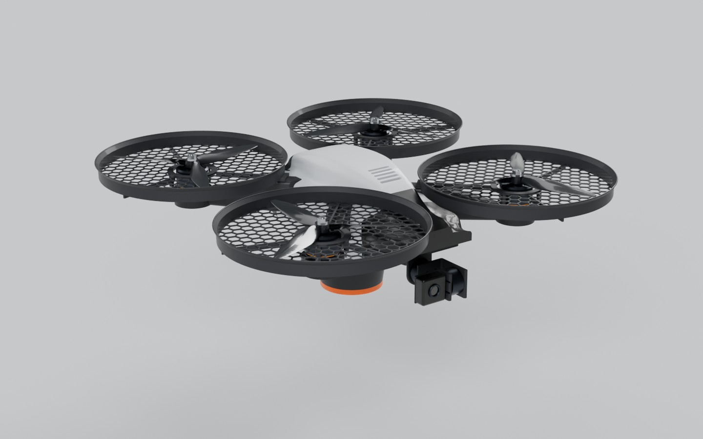
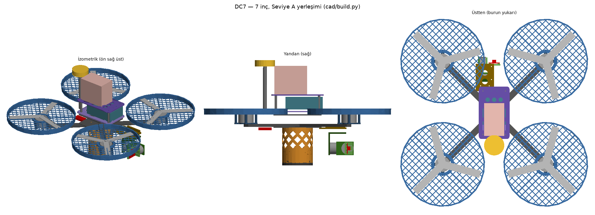
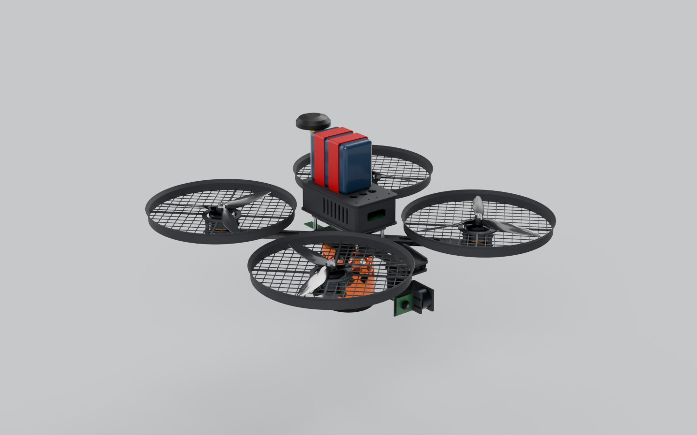
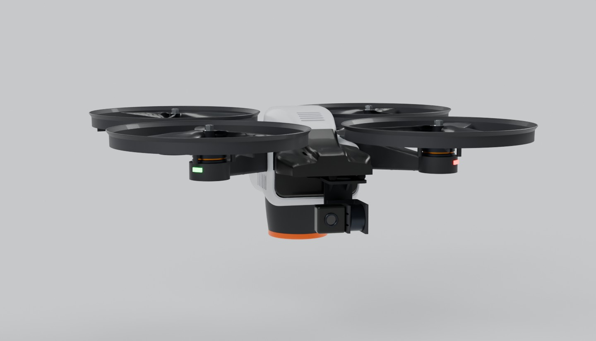
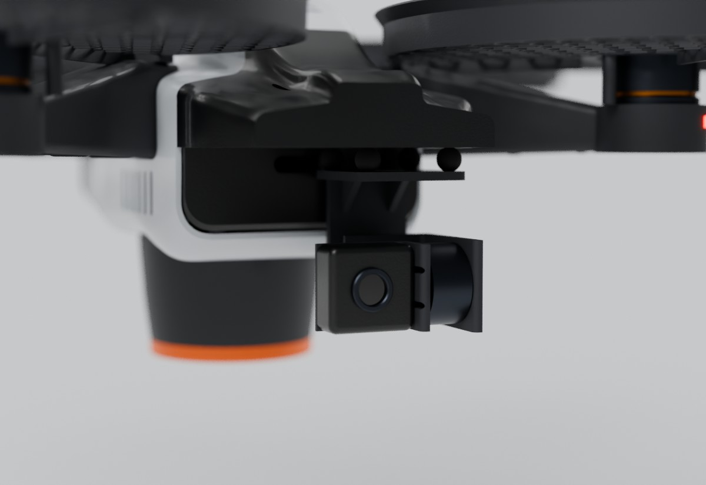
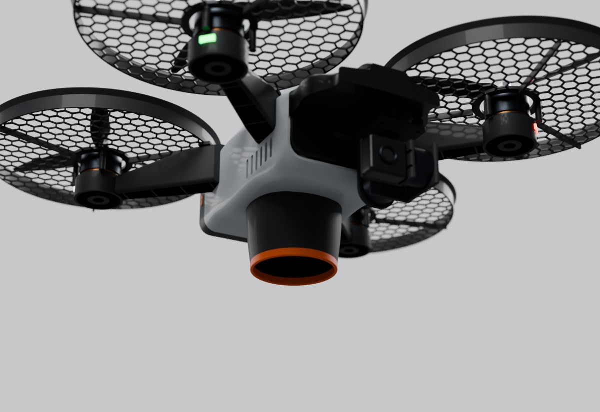
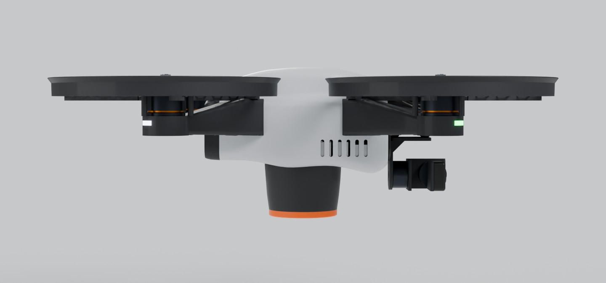

# 12 — Bütünleşik Gövde (v2), 3B Modelleme Yöntemi ve Seri Üretim

Durum tarihi: **2 Ekim 2026**. Bu belge iki soruyu yanıtlar:

1. 3B modelleme iyileştirilebilir mi, Blender'da yapılsa daha kaliteli ve estetik olur mu?
2. DJI tarzı **bütünleşik** bir gövde daha iyi olmaz mı? Kamera ön bölmede olsun, sensör ve diğer
   bileşenler ağırlık merkezine göre yerleşsin, tasarım estetik, endüstriyel ve seri üretime uygun olsun.

Her sayı bir araçla yeniden üretilir:

| Konu | Veri / kod | Araç |
|---|---|---|
| v2 ölçüleri | [`cad/v2/v2_params.py`](../cad/v2/v2_params.py) | — |
| Yerleşim ve ağırlık merkezi | [`cad/v2/layout_v2.py`](../cad/v2/layout_v2.py) | `python3 cad/v2/layout_v2.py` |
| Kol titreşimi ve dayanımı | [`cad/v2/analysis_v2.py`](../cad/v2/analysis_v2.py) | `python3 cad/v2/analysis_v2.py` |
| Parçalar, çakışma, kütle, STL/STEP/GLB | [`cad/v2/airframe.py`](../cad/v2/airframe.py), [`build_v2.py`](../cad/v2/build_v2.py) | `python3 cad/v2/build_v2.py` (CadQuery) → [`cad/v2/out/report.md`](../cad/v2/out/report.md) |
| v2 bütçesi | [`config/hardware/variants/tier-a-entegre.yaml`](../config/hardware/variants/tier-a-entegre.yaml) | `python3 tools/budget_calc.py config/hardware/variants/tier-a-entegre.yaml` |
| Render | [`cad/render_blender.py`](../cad/render_blender.py), [`cad/visual.py`](../cad/visual.py) | `python cad/render_blender.py --model v2` (Blender 4.5 / `bpy`) |



## 1. Kısa cevaplar

| Soru | Cevap |
|---|---|
| Modelleme iyileştirilebilir mi? | **Evet, iki adımda yapıldı.** Önce v1 parçaları rafine edildi: radyuslar, çan ağızlı koruma halkası, konik direk ayakları, belli tutamak, kabuk, kaburgalı gimbal kolu, titreşim analizi. Sonra tamamen yeni **v2 bütünleşik gövde** tasarlandı (bu belge). Modeller ve render incelemesi tasarım sırasında **10 gerçek sorun** yakaladı (§7) |
| Blender'da daha kaliteli ve estetik olur mu? | **Görselde evet, mühendislikte hayır.** Blender bir çokgen ağı (mesh) aracıdır. Kalıpçının istediği STEP (tam B-rep yüzey) Blender'da yoktur; et kalınlığı, kalıp açısı, kütle ve tolerans kontrolü de yoktur. Doğru yol **hibrittir**: geometri CadQuery'de (ölçü ve üretim gerçeği), malzeme, ışık ve render Blender'da. Bu hat kuruldu: CadQuery → GLB → `cad/render_blender.py` (Cycles) (§2) |
| Bütünleşik gövde daha iyi mi? | **Ürün için evet.** v2 şunlardan oluşur: kalıplanabilir 3 parçalı gövde, **tek kalıptan 4 özdeş kol–kanal modülü**, burun bölmesinde gimbal, avuç ayağı ve kuyruktan takılan akıllı batarya. Kanallar parmak korumalıdır (≤ 10 mm ızgara). Avuçta devrilme açısı 14,6° → **20,0°**; ağırlık merkezi yatayda 0,4 mm içinde. Kalkış ağırlığı **1507 g** (v1: 1456 g, +%3,5); fark büyük ölçüde akıllı batarya kabuğundan gelir (§8). İlk uçuş geliştirmesi v1 (hazır FPV gövde) ile sürer; v2 MJF baskıyla paralel prototiplenir (§10) |
| Kamera ön bölmede olabilir mi? | **Evet.** Gimbal, DJI Mavic/Air'deki gibi burun başlığının altına (z = −12 mm) 4 sönümleyiciyle asılır ve açıkta durur. Kamera kartı, mercek halkalı ve camlı bir kamera başlığıyla örtülür; arkadaki siyah perde elektronik bölmesini kapatır. Görüş −90…+25° arası temiz (yazılım sınırı +15°). Pitch −90…+30° ve roll ±30° aralığında çakışma yoktur (§3) |
| Yerleşim ağırlık merkezine göre planlanabilir mi? | **Evet, kodla.** Her bileşen bir kutu ya da CAD'den gelen ağırlık merkezli bir kütle olarak yerleşir. Batarya konumu, ağırlık merkezini motor merkezine getirecek şekilde **çözülür** (hücre merkezi x = −35,3 mm). Ardından 10 yerleşim kuralı, 3 titreşim/dayanım kontrolü ve 20 CAD kontrolü çalışır; hepsi geçiyor (§4–§6) |
| Seri üretime uygun mu? | **Tasarım kuralları kodda.** PC/ABS 2,0 mm et, PA6-GF30 1,6–2,2 mm, kaburga ≤ 0,6 × et, ≥ 1° kalıp açısı, maçasız U kesit kol, ayrım düzlemine açık yarım soketler, tek kalıp ×4. Kalıp maliyeti kaba tahminle: alüminyum (pilot) ≈ $46–73 bin, çelik (seri) ≈ $133–225 bin — **teklif alınmalı** (§5) |

## 2. CAD mi, Blender mı? — İkisi, ayrı işler için

| | Parametrik CAD (CadQuery, FreeCAD, Fusion 360, Onshape, SolidWorks) | Blender (mesh / subdivision) | Plasticity, Rhino, Fusion Form (NURBS / SubD → B-rep) |
|---|---|---|---|
| Geometri | Tam B-rep yüzey (STEP, IGES, Parasolid) | Çokgen ağı | NURBS; STEP verir |
| Ölçü ve tolerans | Birinci sınıf: her ölçü bir parametre | Zayıf: ağ ölçü tutmaz | İyi (doğrudan modelleme) |
| Kalıpçıya teslim | **STEP ✔** | ✘ (mesh kalıp için kabul edilmez) | STEP ✔ |
| Et kalınlığı, kalıp açısı, kütle, FEA | ✔ (FreeCAD FEM / CalculiX, Fusion) | ✘ | Kısmen |
| Parametrik değişiklik (ör. kol kesiti 24 → 34 mm) | Bir satır + yeniden üret (kontroller dahil) | Elle yeniden modelleme | Kısmen |
| Serbest form, yüzey estetiği | Spline loft ve G1 geçişler iyi; serbest form zahmetli | Çok kolay | **En iyi** (endüstriyel tasarım aracı) |
| Render, CMF, pazarlama görseli, animasyon | Zayıf | **En iyi** (Cycles, PBR) | Orta |
| Bu projede | Tüm parçalar (`cad/`, `cad/v2/`) | Render (`cad/render_blender.py`) | Gerekirse kanopi yüzeylerinin rötuşu; sonuç STEP olarak geri alınır |

Aynı v1 geometrisi, iki farklı sunum:

| matplotlib önizleme (`cad/build.py`) | Blender Cycles (`cad/render_blender.py --model v1`) |
|---|---|
|  |  |

**"Kaliteli ve estetik" nereden gelir?** İki kaynaktan gelir:

- **Tasarım dili:** oranlar, yüzey sürekliliği, ayrım çizgileri, renk–malzeme–yüzey (CMF). Bu turda v2 ile ele alındı.
- **Render kalitesi:** malzeme ve ışık. Blender'ın katkısı budur: aynı geometriyi fotogerçekçi gösterir.

Blender modeli "daha kaliteli" yapmaz; ama kalitesini görünür kılar. Ters yönde bir risk de vardır: Blender'da güzel görünen bir mesh, kalıp için sıfırdan CAD'de yeniden kurulmak zorundadır.

**Kurulan hat:**

1. **CadQuery:** ölçüler (`v2_params.py`) → parçalar (`airframe.py`) → kontroller → çıktılar. Çıktılar üç biçimdedir: STEP (kalıpçı), STL (baskı), GLB (adlı parçalar, mm).
2. **`visual.py`:** tek CMF tablosu (renk, pürüzlülük, vernik, doku, LED ışıması). GLB renkleri ve Blender malzemeleri aynı kaynaktan üretilir.
3. **`render_blender.py`:** GLB'yi alır; ölçeği (0,001) uygular ve Z-yukarı yönünü kendisi algılar. Ardından malzemeleri atar ve sahneyi kurar:
   - stüdyo ışıkları (anahtar ışık ≈ 3 W/m²);
   - gölge yakalayan zemin;
   - AgX renk dönüşümü;
   - Cycles + OpenImageDenoise;
   - kadrajı kutu köşelerinin izdüşümüyle otomatik ayarlar.

   v2 görünümleri: `hero, front, rear, side, top, under, nose`.

İlk denemelerde koyu plastikler beyaz görünüyordu; nedeni Blender değil, ışık kurgusuydu. Büyük bir tepe ışığı yukarı bakan tüm yüzeylerde yansıyordu ve pozlama ≈ 4 kat fazlaydı. Işık enerjileri fiziksel olarak (E = P / πd²) hesaplanınca renkler doğru çıktı.

**Blender'da geometri ne zaman yapılır?** Konsept aşamasında hızlı form denemeleri (blockout) ve kalıplanmayacak dekoratif parçalar için. Seçilen form CAD'de yeniden kurulur ya da Plasticity'de modellenip STEP alınır.

## 3. v2 tasarım konsepti



Ölçüler: gövde 234 × 98 mm, kanallarla birlikte **437 × 437 × 143 mm** (v1 korumalarla ≈ 436 × 436 mm).

| Parça | İşlev | Seri üretim | Prototip | Kütle (CAD) |
|---|---|---|---|---:|
| Üst kabuk (kanopi) | Elektronik kapağı; kol yarım soketleri; GNSS ve anten penceresi; emiş yarıkları | PC/ABS enjeksiyon, ince doku | MJF PA12 | 55 g |
| Alt kabuk (taşıyıcı) | V uçlu kol soketleri, batarya tüneli rayları, 6 vida kulesi; Pi ve ESC tablası; yan havalandırma | PC/ABS enjeksiyon | MJF PA12 | 60 g |
| Burun kapağı | Gimbal başlığı (tavan: sönümleyici bağlantısı) + arka perde (kablo geçişli); yanaksız | PC/ABS, saten-mat siyah (ince doku) | MJF PA12 + boya | 28 g |
| Kol–kanal modülü ×4 | U kesit kol, motor yuvası, çan ağızlı kanal, bal peteği ızgara, 3 radyal kaburga | **PA6-GF30, tek kalıp ×4** | MJF PA12 | 4 × 72,5 g |
| Avuç ayağı + uç | Sensör tablası (CM3 Wide, VL53L8CX, MTF-01); avuca değen TPU uç; üst kenarı gövdeye oturur | PC/ABS + TPU 95A (2K enjeksiyon) | MJF PA12 + TPU baskı | 33 + 4 g |
| Akıllı batarya | Paket kabuğu + kuyruk kapağı (gövde çizgisini tamamlar) + 2 kilit düğmesi | PC/ABS (V-0) + POM | MJF PA12 | 43 g (+ ≈ 10 g konnektör ve BMS) |
| **Toplam (gövde)** | | | | **513 g** (MJF prototip: 412 g) |

**Form dili**

- **Omuzlu kesit.** Alt "şasi" 96–98 mm geniştir; batarya, Pi ve ESC burada, kanal yüksekliğinin altında durur. Üst "kanopi" 50–66 mm geniştir ve kanallar arasındaki koridora sığar. Gövde ↔ kanal halkası boşluğu 3,0 mm'dir (CAD); kanallar gövdeye gömülü görünür (DJI Avata benzeri).
- **Sürekli yüzey.** Kesitler 10 istasyonda tanımlıdır. Her kesit köşeleri yuvarlatılmış bir 8 köşeli çokgendir. Her köşe yayı ve her kenar, tüm kesitlerde aynı sayıda noktayla örneklenir (96 nokta, alt ortadan başlar). Böylece k. nokta her kesitte aynı özelliğe düşer: loft yüzeyi kıvrılmaz, parlak yüzeyde dalgalı yansıma oluşmaz. Sonuç: y = 0'a göre simetrik, kırıksız yüzey (§7).
- **Burun ve kuyruk.** Burun saten-mat siyah bir başlıktır; gimbal altında, açıkta asılıdır (yanak paneli yok). Kuyrukta batarya kapağı gövde çizgisini tamamlar (Mavic/Air tarzı).
- **CMF.** Gövde açık gri, ince dokulu PC/ABS; kanallar, batarya ve avuç ayağı antrasit; burun ve kamera başlığı saten-mat siyah (ince doku). Güvenlik turuncusu ayak ucunda ve batarya kilidinde kullanılır, böylece avuç noktası uzaktan görünür. Seyir lambaları: sol ön kırmızı, sağ ön yeşil (motor yuvalarının altında), arka beyaz.

**Kanal (pervane koruması)**

- İç çap 189,8 mm (pervane + 2 × 6 mm). Çan ağızlı giriş: 4 mm yükseklik, 3 mm dışa açılma. İç duvarda 1,5° kalıp açısı vardır.
- Alt ızgara bal peteğidir: hücre 10 mm (parmak geçmez), kaburga 1,2 mm.
- 3 radyal kaburga (60°/180°/300°) halkayı motor göbeğine bağlar; kalıpta da göbekteki yolluktan halkaya akış yolu olur.
- Pervane ↔ ızgara mesafesi 10 mm; CAD çakışma kontrolü temiz.
- Avuç ayağının tabanı pervane düzleminin **125 mm** altındadır (kural ≥ 120 mm) ve drone'un **en alçak noktasıdır**: sonraki en alçak nokta (gimbal) 23 mm yukarıdadır. Böylece avuca yalnızca ayak değer.

**Kamera ve burun**



- **Gimbal:** v1'in 2 eksen gimbalı taşıyıcı kol olmadan kullanılır. Burun başlığının alt yüzüne (z = −12 mm) 4 sönümleyiciyle bağlanır ve DJI Mavic/Air'deki gibi açıkta asılı durur; yanak paneli yoktur. Kamera merkezi (128, 0, −56,8) mm'dedir.
- **Kamera başlığı:** kartı ve mercek bloğunu 1 mm'lik PC bir kapak örter; önde eloksal görünümlü mercek halkası ve koruyucu cam vardır (toplam 2,2 g). Kapak beşiğin hacmi içinde kalır, bu yüzden gimbalın pitch süpürme yarıçapı (17,2 < 18,4 mm) ve roll boşluğu değişmez. CAD kontrolü, pitch −90/−45/0/+30° ve roll ±30° konumlarında başlığı hem burna hem gimbalın kendi parçalarına karşı tarar: çakışma 0 mm³.
- **Arka perde:** siyah perde elektronik bölmesini toz ve sudan ayırır; kamera CSI şeridi ve gimbal beslemesi 24 × 6 mm'lik geçişten girer. Perdenin küçük kalması için alt şasi öne doğru incelir (taban −52 → −40 mm).
- **Görüş:** −90…+25° arası temizdir. Yazılım sınırı +15°'dir ve [`behavior.yaml`](../config/mission/behavior.yaml) ile aynıdır.

**Avuç ayağı (alttaki yuvarlak gövde) ne işe yarar?**



Avuca iniş için şarttır ve beş işi aynı anda yapar:

1. **Avuca değen tek nokta:** turuncu TPU uç yumuşaktır ve uzaktan görünür. CAD kontrolü ayağın en alçak nokta olduğunu her derlemede doğrular.
2. **Güvenlik mesafesi:** avuç, pervane düzleminin 125 mm altında kalır ([05](05-avuca-inis-tasarimi.md): ≥ 120 mm). Parmaklar kanallara uzanamaz; pervane rüzgârı avuçta zayıflar.
3. **Aşağı bakan sensörler:** tabandan 25 mm içeride, darbeden korunur.
   - CM3 Wide: avuç ve jest tespiti.
   - VL53L8CX 8×8 ToF: avuç mesafesi, eğimi ve temas.
   - MTF-01: optik akış + lazer; konum tutma ve irtifa.
4. **Ağırlık merkezinin tam altında:** avuç dönme ekseni olur; motorlar durunca drone avuçta 20°'ye kadar devrilmez.
5. **İniş takımı:** masada ve zeminde de bu ayağın üzerinde durur.

Çapı (74 mm) sensörlerden, boyu 120 mm kuralından gelir; kaldırılırsa avuca iniş güvenliği bozulur. Görünümü ise değiştirilebilir: daha ince ve uzun bir ayak, gövdeye yuvarlak geçiş ya da katlanır ayak (karmaşıklık artar).

## 4. Ağırlık merkezi odaklı yerleşim



| Bileşen | Konum (x, z) mm | Kütle | Gerekçe |
|---|---|---:|---|
| Batarya (6S1P 21700) | x = −35,3 (çözülen), z −34…+12 | 451 g | En ağır kütle; CG'yi motor merkezine getiren konum çözülür. Kuyruktan takılır; kapağı gövdenin kuyruğudur |
| Batarya kabuğu | Kapak kuyrukta (sabit), paket kabuğu boyunca, konnektör + BMS ön uçta | 53 g | Kabuk üç kütleye ayrılarak modellenir (kapak, paket kabuğu, ön uç) |
| FC (IMU) | (0, +20) | 7,5 g | CG'nin hemen üstünde: IMU ofseti yalnızca düşeyde (+25 mm) |
| ESC (4'ü 1 arada) | (26, −1) | 13,8 g | Merkezde: 4 motora eşit kablo boyu; kanopi emişinden hava alır |
| Pi 5 + AI HAT+ 2 | (36, −24), 90° döndürülmüş | 90 g | Ön alt şasi: gimbal CSI kablosu kısa, yan havalandırma yarıklarının önünde |
| BEC, WFB-ng | (56, 0), (58, +10) | 25 + 20 g | Pi'ye yakın; WFB antenleri kanopi önünde |
| GNSS + pusula | (−66, +18,5), kanopi altında | 10 g | Gürültü kaynaklarından ≥ 70 mm uzakta (en yakını batarya konnektörü, 76 mm) |
| ELRS / Remote ID | (−36, +20) / (28, +20) | 5 / 10 g | Kanopi altı; antenler üst kabukta |
| VL53L1X (yukarı) | (50, +33) | 1 g | Kanopi tepesindeki pencere |
| Gimbal + kamera başlığı + kamera | (128, −56,8) | 79 + 4 g | Burun başlığının altında |
| Avuç ayağı sensörleri | (0, −70) | 9,5 g | CG'nin tam altında: avuç = dönme ekseni |
| Gövde parçaları | CAD ağırlık merkezleri ([`v2_params.PART_CG`](../cad/v2/v2_params.py)) | 513 g | Test, CAD ile ±3 mm uyumu doğrular |

**Sonuç:** ağırlık merkezi (0,0, +0,4, −4,5) mm'dedir, yani pervane düzleminin 34 mm altında. Avuçta devrilme açısı **20,0°**'dir (v1: 14,6°); motorlar durduktan sonra ayak avuçta daha kararlı durur.

**EKF montaj ofsetleri** — ilk değerler; montajdan sonra ölçülerek güncellenir ([07](07-hover-ayar-rehberi.md)). PX4 gövde ekseni FRD'dir (x ileri, y sağ, z aşağı):

| Parametre | X | Y | Z | Not |
|---|---:|---:|---:|---|
| `EKF2_IMU_POS_*` (m) | 0,000 | 0,000 | −0,025 | IMU, CG'nin ≈ 25 mm üstünde |
| `EKF2_GPS_POS_*` | −0,066 | 0,000 | −0,023 | Kanopi altı, arka |
| `EKF2_OF_POS_*` (MTF-01) | −0,005 | +0,019 | +0,065 | Avuç ayağı tabanı |

## 5. Seri üretime uygunluk (DFM)

### 5.1 Kurallar (`build_v2.py` raporunda kontrol edilir)

| Kural | Değer | Neden |
|---|---|---|
| Et kalınlığı | PC/ABS 2,0 mm (bölme duvarları 1,6); PA6-GF30: kol 2,2, kanal 1,6 mm | 1,5–2,5 mm aralığı dolum ile çöküntü arasındaki dengedir |
| Kaburga | ≤ 0,6 × et (1,2 / 1,3 mm) | Yüzeyde çöküntü izi (sink mark) oluşmaz |
| Kalıp açısı | ≥ 1° (kanal iç duvarı 1,5°) | Parça kalıptan çıkar |
| Alttan kesik yok | Kol U kesit (altı açık); soketler ayrım düzlemine açık; kanopi yarıkları dikey | Yan maça gerekmez. Tek istisna: alt kabuktaki yan havalandırma yarıkları için 2 kayar maça (yarıklar tabana alınırsa kalkar) |
| Ortak kalıp | 4 kol–kanal modülü özdeş (C4 simetri) | Tek kalıp. V uçlu kol kökünün yüzleri her konumda gövde eksenlerine paraleldir: arkada batarya tüneline, önde Pi'ye |
| Ayrım düzlemi | z = −4 mm, kol köklerinin içinden | Kollar iki kabuk arasında sıkışır; vidalar alttan, görünmez yüzeydedir |
| Boşluklar | Kol kökü 0,3 mm/yüz, batarya tüneli 0,6 mm, gimbal ↔ arka perde 3 mm | Montaj payı. CAD'de çakışma 0 mm³: kol ↔ gövde, batarya ↔ gövde ve kollar, kartlar ↔ kabuklar, gimbal (tüm hareket aralığında) ↔ burun |
| Bağlantı | 6 × M2,5 vida, Ø6,4 mm kuleler (alt Ø2,8 geçiş, üst Ø2,2 pilot) | Kol köklerinden, tünelden ve kartlardan uzak |
| Malzeme nemi | PA6-GF30 su alır: E ≈ %70'e düşer, boyut ≈ %0,2 büyür | Analiz nemli durumu da kapsar; kalıp ölçüleri koşullandırılmış numuneyle doğrulanır |

### 5.2 Kalıp maliyeti (kaba tahmin — teklif alınmalı)

| Parça | Alüminyum kalıp (EVT/DVT, ≈ 1–10 bin baskı) | Çelik kalıp (seri, ≥ 300 bin baskı) | Not |
|---|---:|---:|---|
| Üst kabuk | $8–12 bin | $25–40 bin | Tekstürlü yüzey |
| Alt kabuk | $10–16 bin | $30–50 bin | 2 kayar maça |
| Burun kapağı | $5–8 bin | $15–25 bin | Parlatılmış kalıp yüzeyi |
| Kol–kanal modülü | $9–15 bin | $25–45 bin | İnce bal peteği; 1 kalıp ×4 parça |
| Avuç ayağı + TPU uç | $6–10 bin | $18–30 bin | 2K enjeksiyon (veya ayrı TPU parça) |
| Batarya kabuğu + kapak + kilit | $8–12 bin | $20–35 bin | Kabuk iki parça, ultrasonik kaynak |
| **Toplam** | **≈ $46–73 bin** | **≈ $133–225 bin** | |

**Prototip seti:** MJF PA12 ile ≈ 410 cm³, kabaca **$235** (serviste değişir; profilde tahmini fiyat). PA12 hafiftir (1,01 g/cm³), bu yüzden prototip gövde seti seri üretimden ≈ 100 g hafif çıkar (412 ↔ 513 g). Uçuş testlerinde bu fark balastla telafi edilir.

### 5.3 EVT → DVT → PVT

| Aşama | Gövde | Amaç |
|---|---|---|
| **EVT** (mühendislik doğrulama) | MJF PA12 baskı + mevcut elektronik | Uydurma, kablo demeti, ilk uçuşlar; IMU FFT ile kol frekansı (beklenen 216–327 Hz); Pi 5 ısıl kısma kontrolü |
| **DVT** (tasarım doğrulama) | Alüminyum kalıptan gerçek malzeme | Düşme (1 m, 6 yön), titreşim, sıcaklık (−10…+45 °C), yağmur (IPX3 hedefi), batarya UN38.3, EMC ve telsiz ön testleri; çöküntü ve çarpılma ölçümü |
| **PVT** (üretim doğrulama) | Çelik kalıp, pilot seri (≈ 50–200 adet) | Montaj fikstürleri, uçuş sonu test istasyonu (otomatik kalibrasyon), kalite planı |

## 6. Titreşim ve dayanım — kol kesiti nasıl seçildi?

Kol, gövde soketinde ankastre, değişken kesitli bir konsoldur. Ucunda motor, pervane, motor yuvası ve ızgara göbeği vardır (73 g). Kanal halkası (21 g) ile ızgaranın (11 g) bir kısmı da kolla birlikte salınır.

**Belirsizlikler iki eksende taranır:**

- **Halka + ızgara katılımı (p = 0…1):** Izgara düzlem dışında esnek olduğu için bu kütlenin ne kadarının kolla salındığı bilinmez.
- **Malzeme:** PA6-GF30 nemli (E %70) ile kuru (E %100) arasında.

**Hedef:** frekans aralığının tamamı iki bandın ±%20 paylarının arasında kalmalı. Bu, v1 gimbal kolundaki ölçütün aynısıdır.

- Motor dönüş bandı (1×): 145–170 Hz
- Kanat geçiş bandı (3×): 435–510 Hz
- Güvenli pencere: **204–348 Hz**

| Kök yüksekliği (genişlik 22 mm) | Dikey eğilme frekansı | Sonuç |
|---:|---:|---|
| 24 mm (ilk tasarım; 20 mm genişlikle de aynı sonuç) | 133–202 Hz | **1× bandına giriyor — rezonans riski** |
| 28 mm | 165–250 Hz | Bant payına giriyor |
| **34 mm (seçili)** | **216–327 Hz** | Pencerenin ortasında |
| 37 mm | 243–368 Hz | 3× payına giriyor |

**Diğer sonuçlar:**

- Yanal mod 217 Hz'tir (p = 0,5, nemli). Izgara düzlem içinde rijit olduğundan gerçek değer daha yüksektir.
- Kanal kenarına düşme kontrolü (10 g, tek kanal, F ≈ 150 N) kol kökünde σ ≈ 28 MPa verir; emniyet katsayısı **3,3**.

**Doğrulama:**

1. STEP dosyasından FreeCAD FEM (CalculiX) ile modal analiz yapılır. Özellikle kanal ve ızgaranın yerel modları kiriş modelinde yoktur.
2. İlk numunelerde vurma testi yapılır.
3. Uçuşta IMU FFT ile kontrol edilir ([07](07-hover-ayar-rehberi.md)).

## 7. Modellerin yakaladığı tasarım sorunları

Her biri bir kontrolle bulundu ve düzeltildi. Düzeltmeler artık kalıcı kontrol olarak her derlemede çalışır.

| # | Sorun | Nasıl bulundu | Çözüm |
|---|---|---|---|
| 1 | Arka kol kökleri batarya tüneline giriyordu (265 mm³) | CAD çakışma | Kol kökü 90° V uçlu. Tek kalıp ×4 korunur: yüzler her konumda gövde eksenlerine paraleldir |
| 2 | Kolun eğimli alt yüzü ve kaburga köşeleri soketten taşıyordu (7 mm³) | CAD çakışma | Soket bölgesinde sabit kesitli kök; kaburgalar dış yüzeye kırpıldı |
| 3 | Vida göbekleri havada asılıydı (kabuğa bağlı değildi) | Tek katı kontrolü (5 parça) | Tabandan omuza uzanan vida kuleleri, kol köklerinden uzak yeni konumlar |
| 4 | Gimbal roll ±30°'de burun yanaklarına değiyordu (9 mm³) | Hareket aralığı taraması | Bölme 82 → 88 mm |
| 5 | İlk kol kesiti (20 × 24 mm) motor dönüş bandında rezonansa girerdi (133–202 Hz) | `analysis_v2.py` | 22 × 34 mm kök → 216–327 Hz |
| 6 | Gimbal sönümleyicilerinin bağlanacağı yüzey yoktu; bölme gövde içine açıktı | Render incelemesi | Tavan plakası + arka perde. Ardından perde gimbalın arka plakasına değince (1229 mm³) gimbal 4 mm öne alındı |
| 7 | Gövde yüzeyi burunda 2,6 mm asimetrikti ve alt çizgi 9 mm taşıyordu | Kütle merkezi y ≠ 0 | Kesitler simetrik örneklendi; 2 ara istasyon eklendi |
| 8 | CAD kütleleri tahminden yüksek çıktı: modül 35 → 72 g, batarya kabuğu 26 → 42 g | Kütle ↔ profil karşılaştırması | Profil CAD'den güncellendi. Denge için batarya geri kaydı, kuyruk 4 mm uzatıldı (−88 → −92 mm) |
| 9 | Burun bölmesi ağırlaşınca GNSS–batarya konnektörü mesafesi sınıra indi (70 mm) | EMI kuralı | GNSS 4 mm geri alındı |
| 10 | Kamera bölgesi kötü görünüyordu: çıplak yeşil kart, kutu gibi siyah bölme ve yanaklar, parlak burunda buruşuk yansımalar | Render + kullanıcı geri bildirimi | Kamera başlığı (mercek halkası + cam); yanaksız açık burun; öne doğru incelen alt şasi; köşe hizalı kesitler (aynı nokta sayısı); saten-mat siyah. Buruşuk yansımaların ana nedeni köşelerin kesitten kesite kaymasıydı; parlak siyah yüzey kalan küçük eğrilik farklarını da büyüttüğünden yüzey saten-mata alındı (parlak yüzey için G2 rötuşu: §10) |

## 8. v1 ↔ v2

| | v1 (FPV gövde + baskı parçalar) | v2 (bütünleşik) |
|---|---:|---:|
| Kalkış ağırlığı | 1456 g | 1507 g |
| Hover süresi | 20,1 dk | 19,2 dk |
| T/W (batarya sınırlı) | 2,77 | 2,68 |
| Hava aracı maliyeti (prototip) | $1.488 | $1.529 |
| Pervane koruması | Baskı halka + alt ağ (ayrı parçalar) | Kanal + ızgara + kaburgalar kol modülünde |
| Avuçta devrilme açısı | 14,6° | **20,0°** |
| Kamera | Gimbal taşıyıcı kolda, gövde önünde, çıplak kart | Burun başlığının altında, kamera başlığıyla |
| Batarya | Kayışla, açıkta | Kuyruktan takılan akıllı batarya (kilit, yakıt göstergesi) |
| Elektronik | Açık yığın | Kapalı gövde, yönlendirilmiş hava akışı |
| Üretim | Hazır gövde + 3B baskı (el işçiliği) | 6 kalıp, vidalı montaj (seri) |
| Değişiklik esnekliği | Yüksek | Kalıptan sonra düşük → tasarım EVT/DVT'de dondurulur |

**Kütle notu.** v2'nin kabukları ve kol–kanal modülleri (433 g), v1'in gövde, korumalar ve üst plakasıyla (440 g) aynı sınıftadır. 51 g'lık farkın kaynağı:

- akıllı batarya kabuğu: +53 g (v1'de yok);
- ayrı kablo demeti: +40 g;
- buna karşılık GNSS direği (−22 g), gimbal taşıyıcı kolu (−6 g), gövde (−7 g) ve tutamak yerine ayak (−4 g).

Kol, titreşim nedeniyle büyütüldü.

Hafifletme yolları:

| Yol | Etki |
|---|---|
| PA6-CF20 (≈ 2 × E, %10 daha düşük yoğunluk) | Kol ≈ 26 mm köke iner; modül başına ≈ −11 g, aynı frekans penceresi (malzeme verisiyle doğrulanmalı) |
| Yalnızca gövdeye bakan yarım ızgara | Modül başına −5 g; güvenlik değerlendirmesi gerekir |
| Batarya kabuğu 1,0 mm | −5 g |
| FEA sonrası topoloji optimizasyonu, ölçülen katılım oranıyla kol kesitinin küçültülmesi | Belirlenecek |

## 9. Mevzuat ve sertifikasyon etkileri

- **SHT-İHA:** v2 ≈ 1,5 kg ile **M0** sınıfındadır (500 g – 4 kg); emniyet ve uygunluk beyanı gerekir ([08](08-guvenlik-ve-mevzuat.md)). Remote ID modülü gövdenin içindedir.
- **Telsiz:** BTK düzenlemeleri (5809 sayılı Kanun, KMET bant ve güç sınırları); AB için RED.
- **Lityum batarya:**
  - UN38.3 test özeti (taşıma ve kargo için şart).
  - IEC 62133-2 (güvenlik).
  - Akıllı batarya BMS'inin aşırı akım, kısa devre ve sıcaklık korumaları.
- **Malzeme:** batarya çevresinde UL94 V-0 sınıfı PC/ABS tercih edilir; RoHS ve REACH beyanları gerekir.
- **Ürün güvenliği:** kanal + ≤ 10 mm ızgara ve "avuca yalnızca ayak değer" kuralı avuca iniş için şarttır ([05](05-avuca-inis-tasarimi.md)).

## 10. Öneri ve sonraki adımlar

1. **Faz 1–2 v1 ile sürer:** yazılım ve ilk uçuşlar hazır gövdede yapılır, çünkü kaza sonrası hızlı onarılır. Elektronik v2'ye aynen taşınır.
2. **v2 EVT:** MJF PA12 seti (≈ $235) basılır. Ardından uydurma, kablo demeti ve ilk uçuşlar gelir; IMU FFT ile kol frekansı ölçülür.
3. **FEA:** STEP'ten modal analiz ve düşme simülasyonu yapılır. Gerekirse kaburga veya et kalınlığı ayarlanır (`v2_params.py` → yeniden üret).
4. **Endüstriyel tasarım rötuşu (isteğe bağlı):** kanopi yüzeyleri Plasticity veya Fusion'da G2'ye çıkarılır; ön engel sensörleri için pencereler eklenir. Sonuç STEP olarak geri alınır, renderlar Blender'da kalır.
5. **DVT hazırlığı:** 6 kalıp için teklif alınır; akıllı batarya BMS'i (yakıt göstergesi) ve konnektör seçilir; UN38.3 planlanır.

## 11. Dosyalar

```
cad/v2/
  v2_params.py   Gövde istasyonları, bölme, batarya, kanal, kol, malzemeler, CAD ağırlık merkezleri (CadQuery'siz)
  layout_v2.py   Bileşen yerleşimi, CG çözümü, 10 yerleşim kontrolü, görüş alanı (CadQuery'siz)
  analysis_v2.py Kol titreşimi (Stodola), yanal mod, düşme dayanımı, kesit taraması (CadQuery'siz)
  airframe.py    Kabuklar, gimbal bölmesi, kol–kanal modülü, avuç ayağı, akıllı batarya (CadQuery)
  build_v2.py    Montaj, çakışma ve DFM kontrolleri, kütle ve ağırlık merkezi raporu, STL/STEP/GLB, önizleme
  out/           report.md, stl/, preview_v2.png, render/*.jpg (STEP ve GLB yeniden üretilir)
config/hardware/variants/tier-a-entegre.yaml   v2 bütçe profili (gövde kütleleri CAD'den)
cad/render_blender.py                         Blender/Cycles render: --model v1 | v2
tests/test_v2.py                              Yerleşim, titreşim (her zaman) + CAD testleri (CadQuery varsa)
```
