# ucav/ — YELKOVAN YK-38

**YELKOVAN YK-38**, MALE görünümlü, benzinli ve itici motorlu bir **sivil gözetleme ve araştırma İHA'sıdır**.
Bu klasör uçağın tamamını kodla tanımlar. Tasarım sayıları tek bir YAML dosyasındadır. Aynı kaynaktan iki ürün
çıkar: animasyonlu, ayrıntılı bir **Blender modeli** (rig, iniş takımı, kumanda bağlantıları, render, animasyon) ve
gerçek et kalınlıklı, tablaya sığan **FDM baskı parçaları** (STL, Türkçe baskı raporu).

> **Kapsam.** YK-38 sivil bir EO/IR gözetleme ve araştırma platformudur. Tek faydalı yükü çene altındaki EO/IR
> kamera taretidir (SIYI ZT6 sınıfı). Silah, mühimmat, askı noktası, pilon ve bırakma mekanizması **yoktur**. Bunlar
> modele, spec'e ve bu depoya eklenmez. Testler (`tests/test_ucav_core.py`) spec'te bu tür anahtar olmadığını denetler.
> "UCAV görünümü" yalnız biçim dilidir (MALE oranları, chine çizgisi, U-kuyruk); işlev sivildir.

**Bağlantılar:** [spesifikasyon (`spec.yaml`)](spec.yaml) · [boyutlandırma raporu](out/sizing.md) ·
[baskı raporu (256 tabla)](out/print_report.md) · [baskı raporu (220 tabla)](out/print_220x220x250/print_report.md) ·
[sabit görüntüler](out/render/) · [gösterim animasyonu](out/anim/showcase.mp4) ·
[mekanizma döngüsü](out/anim/mechanisms.mp4) · [STL'ler](out/stl/) · [mevzuat özeti](../docs/08-guvenlik-ve-mevzuat.md).
Hazır Blender sahnesi [`out/yk38.blend`](out/yk38.blend) ve görüntüleyiciler için [`out/yk38.glb`](out/yk38.glb) de
depodadır; ikisi de tek komutla yeniden üretilir (§4).

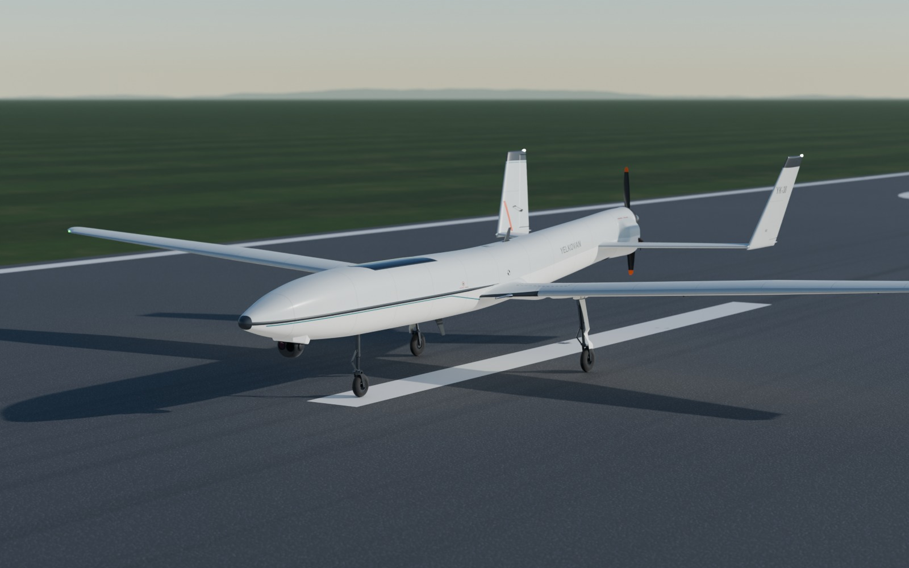

| | |
|---|---|
| 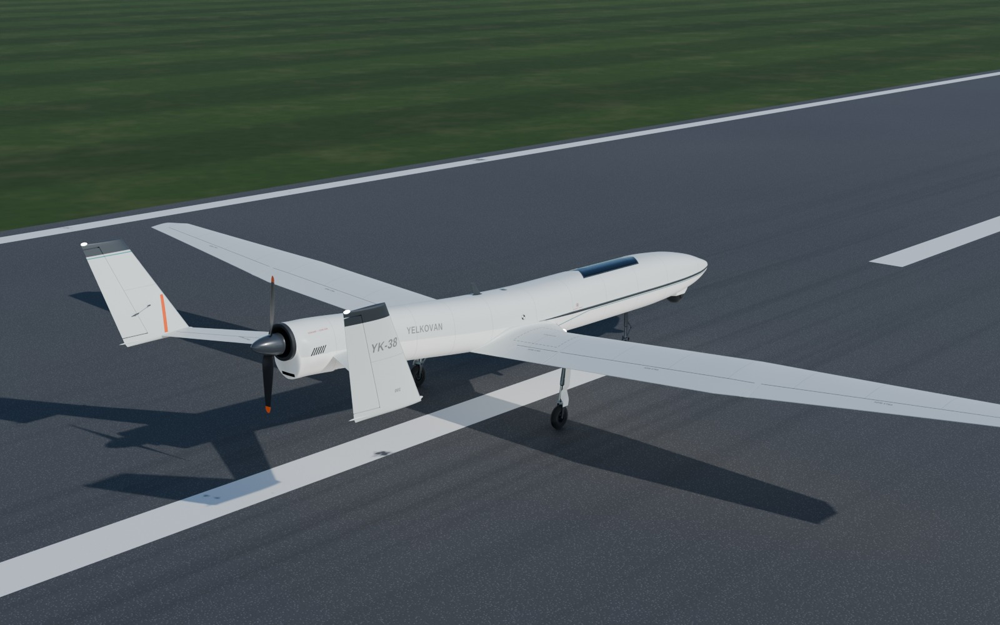 | 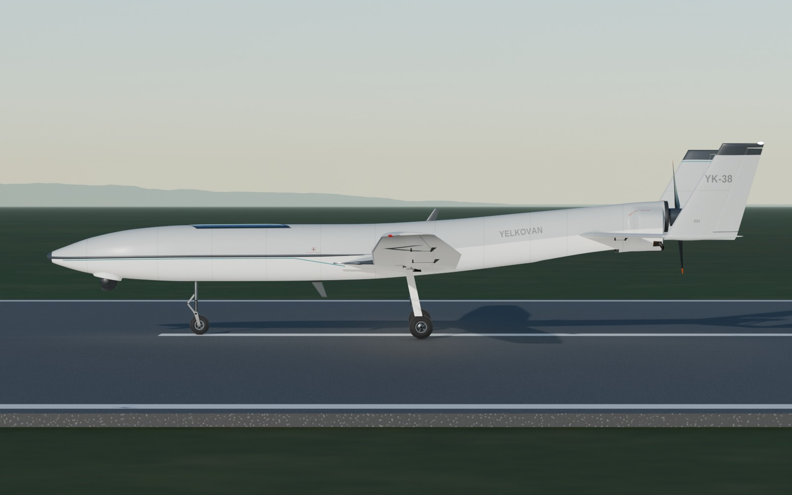 |
| 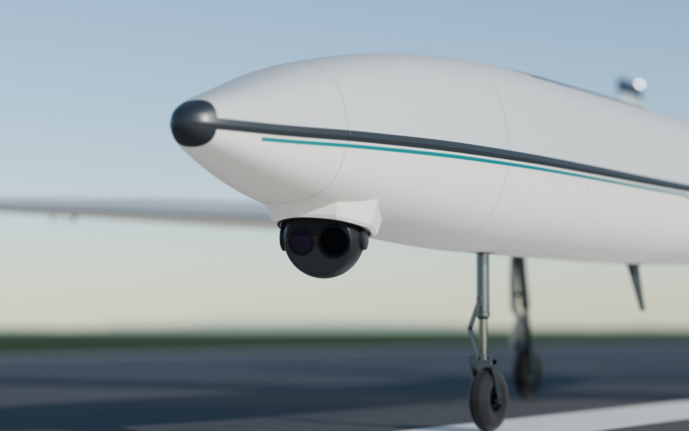 | 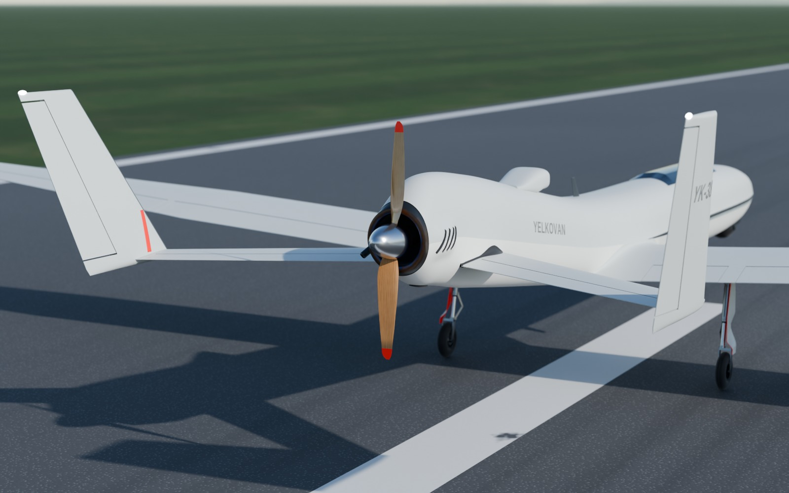 |
| 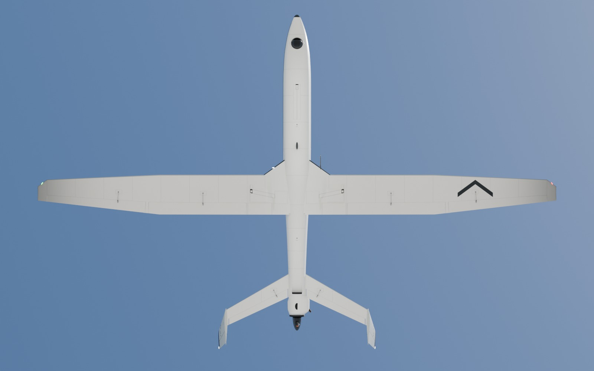 | 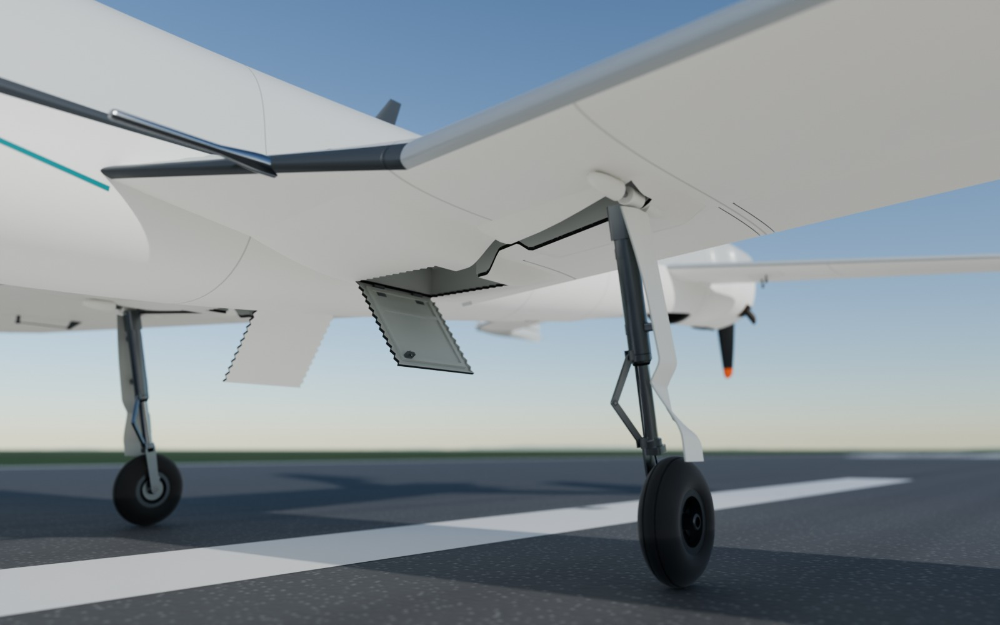 |
| 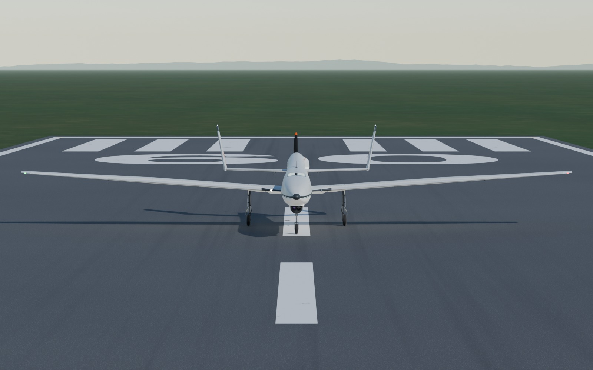 | 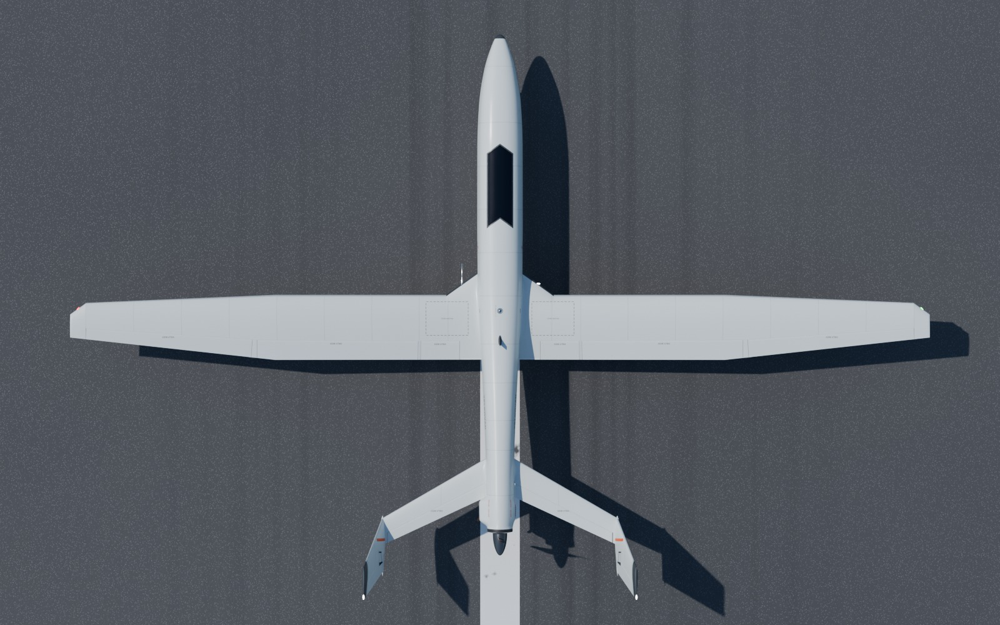 |
| 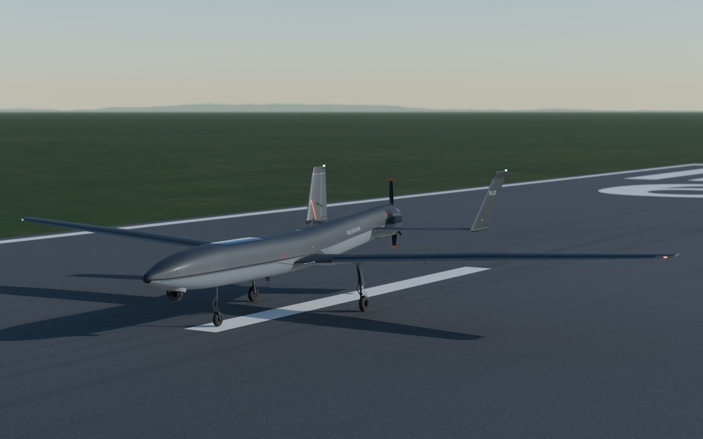 | 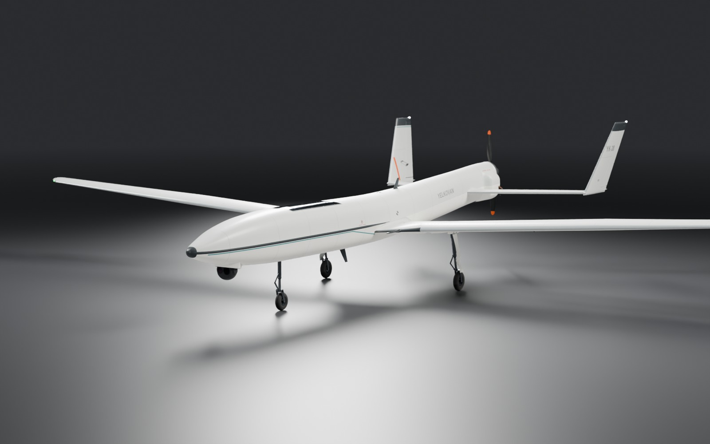 |

Diğer görüntüler: [taktik arka 3/4](out/render/yk38_rear34_taktik.jpg),
[taktik yan](out/render/yk38_side_taktik.jpg), [stüdyo yan](out/render/yk38_side_studyo.jpg).

## 1. Ana değerler

Bütün sayılar [`spec.yaml`](spec.yaml)'dandır. [`sizing.py`](sizing.py) bunları geometriden yeniden hesaplar
([`out/sizing.md`](out/sizing.md): **163/163 kontrol tolerans içinde**; kütle bütçesinin basılı kalemleri baskı
planıyla — `out/print_report.json` — karşılaştırılır).

| Büyüklük | Değer |
|---|---|
| Sınıf | SHT-İHA **M1 (4–25 kg)**, sivil gözetleme/araştırma, VLOS, izinli saha |
| Açıklık / toplam boy / yükseklik | **3,80 m** / **2,475 m** (gövde 2,205 m, spinner dahil 2,310 m) / **0,668 m** (takım açık; strobe lensiyle 0,6725 m) |
| Kanat | S 0,976 m², AR 14,8, MAC 0,265 m, λ 0,52; SD7062 → SD7032, 4° dihedral, 3° washout, 36° kök glove, 70 mm raked uç |
| Kütle | MTOW **11,71 kg** (boş 10,07 kg; yakıt 1,40 L = 1,04 kg; görev modülü 0,60 kg); kanat yüklemesi 12,0 kg/m²; basılı gövde **3,46 kg** (baskı planı), kütle artış rezervi **0,44 kg** (MTOW'un %3,8'i) |
| Motor ve pervane | DLE-20 (20 cc, 2 zamanlı benzinli, 1,86 kW) **ters** (silindir aşağıda), Xoar 16×8 **itici**, 25 mm uzatma mili; statik itki 5,57 kgf, T/W 0,476; itki ekseni 5° aşağı |
| Hızlar | Stall 12,0 m/s (temiz) / 10,8 m/s (20° flap); bekleme 15,6; seyir 20; Vne 28 m/s; (L/D)maks 18,4 @ 14,5 m/s |
| Havada kalış | 4,16 h (elektrik sınırı; yakıtla 3,6–4,25 h), menzil 233 km — **kâğıt değer**; operasyon VLOS'tur |
| Kalkış | Düz kalkış, 20° flap: V_LOF 13,2 m/s, koşu 25,5 m (asfalt) / 28 m (çim) |
| Kararlılık | Statik marj %10 MAC (η_h'ye göre %8,7–12,0); V_h 0,47, V_v 0,034; CG s = 1,232 m (aralık 1,219–1,245) |
| Kuyruk | Oklu U-kuyruk: stabilize 1,04 m, NACA 0010 → uçta %12, HK oku 30°; iki dikey 0,32 m, 12° dışa eğik; FK–pervane aralığı pala ucunda 0,128 m (0,32 D), pala süpürme hacmine en az 0,114 m (≥ 0,25 D) |
| İniş takımı | JP Hobby ER-150 ×3, elektrikli: ana bacaklar içe, burun bacağı geriye (12 mm çatal ofseti); ana teker 82,5 × 26 mm (tam en; aks 3 mm dışa kaçık); iz 0,666 m, dingil açıklığı 0,785 m; pervane çarpma açısı 13,2°, devrilme 47,7° |
| Faydalı yük | **Yalnız EO/IR taret** (SIYI ZT6 sınıfı: 4K optik + 640×512 termal, 197 g); top Ø74 mm, zemine 156 mm; 24 fasetli yaka |
| Renkler | Üst RAL 7035 (ekran değeri #BDC1BE), alt RAL 9003, vurgu RAL 7016, ince çizgi RAL 5018; kuyu/kapak içleri açık gri astar (`UM_Liner`), kapak kenarları koyu conta; uyarı turuncusu RAL 2004 **yalnız** pala uçları ve dikeylerdeki pervane bandında; uyarı yazıları RAL 3020; sert vernikli füme PETG kapak; mat siyah pervane, saten antrasit spinner |

## 2. Konfigürasyon ve neden

* **İtici motor, çene altı taret.** Taretin görüşüne pervane ve egzoz girmez, gövdeye pervane rüzgârı gelmez, uçak
  MALE kimliğini kazanır. Bedeli yüksek itki hattıdır: uçak tam güçte yerde burnunu kaldıramaz. Bu yüzden kalkış
  **düz** yapılır (2,5° kanat açısı + 20° flap → CL_yer 1,10). İtki ekseni 5° aşağı eğiktir ve CG'nin 36 mm
  üstünden geçer (tam güçte 1,95 N·m burun aşağı moment).
* **Ters motor, kambursuz sırt.** DLE-20 ters bağlanır (silindir aşağıda; DLE her konumda çalışır). Kaporta tepesi
  silindir başını değil krank karterini örter: sırt çizgisi kanattan lüle halkasına kadar tek, gergin bir rampayla
  (≤ 8°) yükselir, "deve hörgücü" yoktur. Motor, susturucu, depo ve akü zarfları sahnede `U_Env_*` tel kafesleriyle
  durur (`UCAV_Envelopes`, render ve GLB dışı). Kaporta sahnede de gerçek 1,6 mm PA-CF kabuktur, arka flanşı Ø92
  açıktır; lüle deliğinden görünen koyu boşluk ayrı, yalnız render ağıdır (`U_Cowl_Cavity`; baskı, GLB ve çakışma
  denetimi dışı). Kabuk iç yüzüne 3B paylar (`shapes.engine_bay_clearance`): silindir 6,0 mm, buji başlığı 5,3 mm
  (≥ 5), karter 9,5 mm, karbüratör 37,9 mm, rulman burnu 26,1 mm; susturucu hava boşluğu 16,4 mm (≥ 15,5),
  karbüratör–yangın perdesi 17,3 mm (≥ 15), spinner–lüle 5,5 mm. Basılı kaporta parçaları motor yasak bölgeleriyle
  (zarf + 5 mm, susturucu + 15,5 mm) kırpılır: `UP_cowl_*` ile `U_Env_*` arasında üçgen çakışması yoktur; en yakın
  uzaklıklar (yoğun yüzey örneklemesiyle) üst parça–silindir 5,1 mm, sol yanak–silindir 7,0 mm ve –susturucu 16,4 mm,
  sağ yanak–silindir 10,1 mm, lüle halkası–karter 13,5 mm, pabuç–buji başlığı 8,6 mm.
* **Gömme NACA girişi, halka lüle.** Soğutma havası karın altındaki gömme NACA ağzından (21,7 cm², boğaz s = 2,02,
  7° rampa, 40 → 75 mm ıraksak planform; dudak karın eğrisini izler) girer; spinner çevresindeki halka lüleden
  (34,3 cm²; kaportanın arka flanşı Ø92 açık) ve çene kapanışındaki 60 × 10 mm soğutma yarığından (6,0 cm², kabuğu
  boydan boya keser) çıkar: çıkış 40,3 cm², çıkış/giriş 1,86. Açıklıklar sahnede ve basılı kaportada ışın testiyle
  doğrulanır (basılı kaportanın ek flanşları Ø92 akış silindirine girmeyecek biçimde kırpılır). Sırt temizdir. Sağ
  yanakta 6 açık panjur yarığı.
* **Susturucu ve ısı (R05).** Susturucu silindir bloğunun yanında, krank ekseninin 44 mm altındadır (44 × 34 × 56 mm
  zarf, sol yanak kabartısının içinde). Gövdesi stabilize ve elevatöre 56,6 mm (elevatör ±25°'de 59,9 mm), çıkış
  borusu ve ısı kalkanı 74,9 mm uzaktadır. Boru (Ø12,4 mm) susturucu yüzünden başlar, sol yanaktaki Ø24,4 mm
  delikten 6 mm radyal boşlukla geçer — delikte ısıya dayanıklı silikon/seramik keçe geçiş halkası boruyu ortalar,
  boru yanağa değmez — ve aşağı-dışa-geriye 20 mm taşar (45° eğik kesik uç); çıktığı yerde yanak yüzüne (0,1–0,5 mm
  aralıkla) 30 × 20 × 0,5 mm Al ısı kalkanı oturur. Stabilize 1 ve elevatör 1 spec atamasıyla LW-ASA basılır; baskı
  ısı kuralı (§8; kural 3: hiçbir basılı parça boruya 5 mm'den yakın değil, sol yanak 6,0 mm) ihlalde çalıştırmayı
  durdurur.
* **Kuyruk çarpması.** Pervane 13,2°'de değer. Burun daha da kalkarsa sırayla dikey kökü firar kenarı (18,5°),
  kaporta altındaki değiştirilebilir 52 × 30 × 2 mm PA-CF sürtünme pabucu (19,26°) ve kaporta çene köşesi (19,38°)
  değer: pabuç kaportanın gerçek alt yüzünü (sol kabartı dahil) izler ve kaportadan önce değer.
* **Oklu U-kuyruk.** İki dikey, pervaneyi lir gibi çerçeveler. Stabilize firar kenarı pala ucundan 0,32 D,
  pala süpürme hacminden 0,114 m (≥ 0,25 D) uzaktadır. Stabilize kalınlığı uca doğru %10'dan %12'ye çıkar; Ø12
  kiriş boyunun tamamında profil içinde kalır. Ventral fin yoktur; pervane çarpma açısı 13,2°'dir.
* **Uzun, ince kanat.** AR 14,8, düz merkez (veter 0,29 m, y ≤ 1,00) ve konik dış panel. Seyir ve bekleme gücü düşüktür
  (238 W / 147 W). 3° washout ile perdövites kökte başlar. 36° glove, chine "ok çizgisini" kanada bağlar ve kök
  bloğuna ER-150 ünitelerini taşıyacak hacim verir. İç ve dış flap arasında 10 mm ek aralığı, hücum kenarlarında
  22 mm erozyon bandı ve kökte kano biçimli kaporta (arkada 12° rampa) vardır.
* **Gövde.** Chine çizgili, iki süperelips yarısından oluşan kesit, aşağı sarkık burun, yukarı kalkık kuyruk konisi.
  Burun modülü (s 0–0,40) ve kuyruk–motor modülü (s 1,55'te flanş) ayrılır; iki 0,70 L depo tam CG'dedir. Sırttaki
  füme aviyonik kapağı neredeyse gömmedir (en çok 1,6 mm kabarık); siyah iç (frit) bandı, 6 mm antrasit çerçevesi
  ve sert parlak verniği vardır (üstten gökyüzünü yansıtır). Taret yakası 24 fasetli, karına 10 mm konkav filetoyla
  bağlanır.
* **Yapı ve baskı.** Dış paneller 2 × 1,54 m ve sökülebilirdir. Merkezde cıvatalı G10 dihedral köprüsü (2 × 3 × 40 mm)
  kanat kutusu çerçevelerine (PA-CF) oturur; ana takım yatakları, motor halkası ve longeron kırık soketleri basılı yük
  yolu parçalarıdır. Dört CF longeronun her biri üç düz parçadır (kırıklar halka sınırlarında). Sahada kurulum 7
  parçadır. Bütün parçalar 256 mm tablaya sığar (220 mm tabla da desteklenir).
* **İniş takımı.** Üç bacak da elektrikli ER-150'dir (8,4 V'ta 5 s). Ana ünite bacak yuvasının arkasında, 3 mm G10
  plakaya bağlıdır (CF borulara 5,7–52,8 mm pay). Ana teker tam 26 mm endedir: aks 3 mm dışa kaçık (tek kollu
  konsol aks), teker 3 mm alçakta toplanır (kuyu derinliği 42 mm). Toplu teker kapağa en az 2,6 mm yaklaşır (≥ 2,5 mm
  kuralı; sahnede BVH ile ölçülür): lastik omzu kapak iç yüzündeki 1,6 mm'lik boyuna boncuğun üstündedir, tavaya
  3,2 mm; jant göbeği lastik yüzünden 0,95 mm taştığı için göbeğin altında tavada Ø17 mm sığ boşluk vardır. Burun bacağı
  s 0,53'te, sökülebilir burun modülünün arkasındadır (12 mm iz). Kapaklar deri paneli + nervürlü çerçeve, menteşe
  bilekleri, horn, conta dudağı, serbest kenarlarda 2,5 mm dönüş dudağı ve 8 mm adımlı (2,9 mm derin) testere dişli
  kenardan oluşur; burun bacağı tapa kapağı (`U_Door_N_3`) takım topluyken çentiği deriyle aynı hizada kapatır. Ana
  tekerlerde fren, burunda servo yönlendirme vardır. Kapak sırası (kapak 1 s – bacak 5 s – kapak 1 s) ArduPilot Lua
  ile yürür.

Tasarım üç konsept ve bir hakem panelinden geldi; ardından tasarım, aerodinamik, baskı ve animasyon eleştirileriyle
iyileştirildi. Panelin kararları ve kaynakları `spec.yaml → meta.sources`'ta, paneldeki sayılardan sapmalar
`# varsayım` ya da açıklama satırlarıyla işaretlidir.

## 3. Dosyalar

| Dosya | İçerik |
|---|---|
| [`spec.yaml`](spec.yaml) | **Tek doğruluk kaynağı** (Türkçe açıklamalı): ölçüler, profil, kütle, performans, takım, malzemeler (RAL), boya şemaları, işaretler, baskı planı, rig aralıkları |
| [`params.py`](params.py) | Saf Python: spec'i okur; gövde kesitleri, kanat/kuyruk kesitleri, menteşe hatları, takım geometrisi, kuyular, kapaklar, motor zarfları, CG (`python3 ucav/params.py`) |
| [`airfoils.py`](airfoils.py), [`data/airfoils/`](data/airfoils/) | UIUC SD7062/SD7032 verisi, NACA 4 haneli üretici, profil işlemleri |
| [`sizing.py`](sizing.py) | Boyutlandırma ve geometri kontrolü → [`out/sizing.md`](out/sizing.md) (`--check`: tolerans dışı varsa çıkış 1) |
| [`shapes.py`](shapes.py) | Saf numpy: kapalı, dışa dönük ağlar (gövde, kanat, kuyruk, kumanda yüzeyleri, kuyular, kapaklar, taret, NACA girişi, susturucu, ayrıntılar, 29 şablon yazı); kaporta kabuğu ve baskı katısı, motor bölmesi 3B payları, soğutma akış alanları, motor yasak bölgeleri |
| [`blender/airframe.py`](blender/airframe.py) | Gövde sahnesi: adlar, koleksiyonlar, pivotlar, yerel eksenler, EXACT boolean kuyular, `U_Stencil_*` yazıları, `U_Env_*` zarfları |
| [`blender/gear.py`](blender/gear.py) | ER-150 üniteleri, oleo bacaklar, tork bağlantıları, frenli tekerler, burun yönlendirme, kapak donanımı, çakışma raporu |
| [`blender/rig.py`](blender/rig.py) | `U_Root` kontrol paneli, 57 basit ifade sürücüsü, kumanda bağlantıları (boynuz / servo kolu / itme çubuğu; dümende 30 × 10 × 5 mm servo kaportası), bağlantı çarpışma taraması (`linkage_clearance_report`), pervane diski, pervane pişirme metin bloğu |
| [`blender/materials.py`](blender/materials.py) | 31 `UM_*` malzemesi (boya + panel çizgileri ve servis kapakları, astar, conta, PA-CF, füme PETG, ısı tonlu susturucu, mat siyah pervane, pervane diski, EO/IR camları, ışıklar), "taktik" boya şeması, CG ve kuyruk işaretleri |
| [`blender/studio.py`](blender/studio.py) | Cycles ayarları, "pist" (gökyüzü, pist, çim, yer yansıması dolgusu) ve "studyo" ortamları, 9 sabit kamera |
| [`blender/animation.py`](blender/animation.py) | `showcase` (21 s) ve `mechanisms` (16 s döngü) klipleri, kameralar, bakım sehpası |
| [`blender/render.py`](blender/render.py) | Sabit görüntü (JPG) ve animasyon (MP4/H.264, Blender'ın kendi FFMPEG'i) |
| [`blender/printprep.py`](blender/printprep.py) | Baskı segmentleri, kabuk/iç yapı, yük yolu parçaları, menteşe pimleri, ısı kuralı (`heat_rule_eval`, ihlalde çıkış 1), STL, baskı raporu |
| [`blender/build.py`](blender/build.py) | **Tek komutla kurulum ve bütün çıktılar** (bu belgenin §4'ü) |
| `out/` | `render/*.jpg`, `anim/*.mp4`, `stl/*.stl`, `print_report.md/.json`, `sizing.md`, hazır sahne `yk38.blend` ve `yk38.glb` (hepsi yeniden üretilebilir) |

Sahnedeki koleksiyonlar: `UCAV` (uçak: `UCAV_Airframe`, `UCAV_Surfaces`, `UCAV_Gear`, `UCAV_Propulsion`,
`UCAV_Payload`, `UCAV_Details`; varlık olarak işaretli), `UCAV_Envelopes` (paketleme zarfları, render dışı),
`UCAV_Print` (baskı parçaları, görünüm katmanı dışında), `UCAV_Studio` (`UCAV_Env` zemin ve ışıklar,
`UCAV_Cameras_Stills`, `UCAV_Cameras_Anim`, `UCAV_Stand` bakım sehpası).

## 4. Kurulum ve çalıştırma

Gerekenler: Python 3.11, `pip install bpy==4.5.3 numpy pyyaml` (bpy modülü Blender 4.5 LTS'tir; render Cycles ile
varsayılan olarak CPU'da, `--gpu` ile ekran kartında yapılır). Ya da Blender 4.5 uygulaması (aşağıya bakın).
Hazır sahne depodadır: `out/yk38.blend` (Blender 4.5 LTS ya da üstüyle açın; gömülü betikler Blender 5'in katmanlı
aksiyon API'siyle de çalışır) ve görüntüleyiciler için `out/yk38.glb`.

```bash
python3 ucav/sizing.py --check                         # boyutlandırma: 163 kontrol → out/sizing.md (bpy gerekmez)
python3 ucav/blender/build.py --blend                  # ≈ 35 s → out/yk38.blend (sıkıştırılmış, rig hazır)
python3 ucav/blender/build.py --blend --glb --print --stills    # sahne + GLB + STL/rapor + 9 sabit görüntü
python3 ucav/blender/build.py --stills hero side --samples 32 --res 960x600     # hızlı deneme
python3 ucav/blender/build.py --stills hero rear34 side --livery taktik        # → yk38_hero_taktik.jpg …
python3 ucav/blender/build.py --stills hero side --env studyo                  # koyu stüdyo
python3 ucav/blender/build.py --anim mechanisms --res 960x540 --samples 16     # → out/anim/mechanisms.mp4
python3 ucav/blender/build.py --anim all                                       # tam kalite: 1280×720, 24 örnek
python3 ucav/blender/build.py --anim all --gpu                                 # aynısı ekran kartında (§7)
python3 ucav/blender/build.py --anim showcase --frames 1-120 --step 2          # hızlı önizleme (süre korunur)
python3 ucav/blender/build.py --print --bed 220                                # 220×220×250 tabla raporu
python3 ucav/blender/build.py --help                                           # bütün seçenekler
```

Depodaki çıktılar şu komutlarla üretildi (toplam ≈ 3,5 saat; 2,6 saati animasyon):

```bash
python3 ucav/blender/build.py --blend --glb --print --stills --res 1600x1000 --samples 128
python3 ucav/blender/build.py --print --bed 220 --no-stl
python3 ucav/blender/build.py --stills hero rear34 side --livery taktik --res 1600x1000 --samples 128
python3 ucav/blender/build.py --stills hero side --env studyo --res 1600x1000 --samples 128
python3 ucav/blender/build.py --anim all --res 960x540 --samples 16
```

`anim/mechanisms.mp4` bu son komutun yarıda kesilmiş hâlidir: 384 karenin ilk 300'ü (16 s döngünün ilk 12,5 s'si;
takımın yeniden açılması eksik). Tamamını ve tam kalite sürümleri kendi bilgisayarınızda üretin (§7). Son inceleme
turundaki düzeltmelerden sonra `yk38.blend`, `yk38.glb`, STL'ler ve iki baskı raporu ilk iki komutun `--stills`'siz
hâliyle yeniden üretildi; görüntüler ve videolar ondan önceki sahnedendir (fark, kuyu kapaklarının iç yüzünde
0,6 mm alçalan boncuk ve göbek boşluğudur — render'da seçilmez).

Sıra her zaman aynıdır: `airframe → gear → rig → materials → studio → animation → çıktılar`. Çıktı bayrağı
verilmezse `--blend` varsayılır. Sonda çıktılar boyutlarıyla listelenir; bir sorun varsa (eksik sürücü, malzemesiz ağ,
manifold olmayan ya da tablaya sığmayan baskı parçası, ısı kuralı ihlali) çıkış kodu 1'dir.

**Blender uygulamasıyla.** `blender -b -P ucav/blender/build.py -- --blend --stills` aynı işi yapar. Blender'ın kendi
Python'unda PyYAML yoksa betik sistem Python'undaki `yaml` paketini geçici olarak ödünç alır; o da yoksa kurulum
komutunu yazdırır (`"<blender python>" -m pip install pyyaml`). **Scripting sekmesinde:** *Text → Open* ile
`ucav/blender/build.py`'yi açın ve *Run Script*'e basın. Sahne açık dosyaya kurulur, Blender kapanmaz. Argüman için
dosyanın başındaki `SCRIPTING_ARGS` satırını düzenleyin (ör. `"--blend --stills hero"`) ya da Blender'ı
`UCAV_BUILD_ARGS` ortam değişkeniyle başlatın.

**`out/yk38.blend`'i açınca.** Uçak pistte, takım açık, `showcase` klibi etkin (kare 1). Görünüm penceresi malzeme
önizlemesindedir. Zaman çizelgesinde oynatınca kameralar işaretlerle değişir (`YK38_ev_*` işaretleri olayları
gösterir, kamerasızdır). Sabit kameralar `U_Cam_hero … U_Cam_gearbay` adlıdır. Dosyada iki metin bloğu vardır:
`YK38_klip_sec.py` (`KLIP` satırına `showcase`, `mechanisms` ya da `yok` yazıp *Run Script*; `yok` animasyonu
kaldırır ve dinlenme pozuna döner — kendi animasyonunuz için) ve `YK38_pervane_pisir.py` (§5). İkisi de depoya
ihtiyaç duymaz. Klip seçici klibin ortamını da kurar: `showcase` ve `yok` → pist (`UCAV_Env`, `SW_Pist` dünyası,
−0,4 EV, yer dolgusu), `mechanisms` → stüdyo (`UCAV_Env_Studyo` koleksiyonu, `SW_Studyo` dünyası, 0 EV, bakım
sehpası görünür); kare aralığını ve render çıktı önekini (`//anim/yk38_<klip>_`) de ayarlar. Dosya arayüzden
render'a hazırdır: hareket bulanıklığı açık (pervane 64, tekerler 8 alt adım), 1280×720 %100, 24 örnek, H.264 MP4 —
komut satırındaki `--anim` ile aynı ayarlar (§7). Baskı parçaları `UCAV_Print` koleksiyonundadır; görünüm katmanından çıkarılmıştır (Outliner'da onay
kutusuyla açılır) ve render'a girmez. `UCAV` koleksiyonu başka bir dosyaya eklenebilir (*Append*/*Link* + *Library
Override*): yalnız uçak gelir, stüdyo ve baskı parçaları gelmez; uçağı kendi zemininize koyunca `ground_z`'yi o
zeminin Z'sine eşitleyin.

## 5. Kontrol paneli (`U_Root`)

`U_Root` tasarım CG'sindedir (Blender X = −1,232, Z = 0,006). Bütün uçak ona bağlıdır; onu taşıyıp döndürmek uçağı
CG etrafında hareket ettirir. Özellikler: `U_Root` seçili → *Object Properties → Custom Properties* (ya da N paneli).
Bütün hareketli parçalar bu özelliklere Blender **basit ifade** sürücüleriyle bağlıdır. Python betiği izni
(*Auto Run*) gerekmez. Animasyon yalnızca bu özelliklere, `U_Root` dönüşümüne ve pişirilmiş pervane turuna
(`U_Prop["ucav_turns"]`) anahtar kare koyar. Sürülen parçaların konum/dönüş/ölçeği kilitlidir (G/R/S ile
menteşeden kaçmaz); `U_Root` önde çizilen, adı görünen büyük bir oktur.

| Özellik | Aralık | Anlam |
|---|---|---|
| `gear` | 0…1 | 0 = toplu, 1 = açık ve kilitli. Tek değer sırayı sürer: kapaklar 0–0,15'te açılır, bacaklar 0,15–0,85'te döner, kapaklar 0,85–1'de kapanır. Bacak tapa kapağı bacakla döner |
| `gear_doors` | 0…1 | Deri kapaklarını el ile açar (otomatik sırayla büyük olan geçerli) |
| `aileron_deg` | −25…25 | + = sağa yatış (sol firar kenarı aşağı). Diferansiyel 1,67:1: yukarı en çok 20°, aşağı en çok 12° |
| `flap_deg` | 0…35 | İç ve dış flaplar birlikte, + = aşağı; mekanik sınır 30° |
| `elevator_deg` | −25…25 | + = firar kenarı aşağı (burun aşağı); sınır −25 / +20 |
| `rudder_deg` | −25…25 | + = firar kenarı sancağa (burun sağa); sınır ±22. Takım açıkken burun tekeri de döner (±30°) |
| `prop_rpm` | 0…9000 | Pervane devri (dev/dk); arkadan bakınca saat yönü tersi. 900 dev/dk üstünde pervane diski (`U_PropDisc`) görünür |
| `prop_auto` | 0/1 | Pervane açısı kipi: 1 = kare · rpm / 1440 tur (sabit devirde tam, 24 fps); 0 = pişirilmiş `U_Prop["ucav_turns"]` (devir değişen animasyonda doğru; `YK38_pervane_pisir.py` yazar). Klipler 0 kullanır |
| `turret_pan_deg` | −180…180 | + = iskeleye (sola) bakar |
| `turret_tilt_deg` | −90…20 | + = yukarı, −90 = tam aşağı (nadir) |
| `nav_lights` | 0/1 | İskele kırmızı, sancak yeşil seyrüsefer ışıkları ve iniş ışığı |
| `strobe` | 0/1 | Dikey uçlarında beyaz çakarlar: 30 karede bir çift çakış |
| `status_led` | 0/1 | Taret durum LED halkası (yalnız bakım/test). Gerçek EO/IR taretler ışımaz: uçuşta, kliplerde ve GLB'de 0 |
| `ground_z` | m | Zemin yüksekliği (dünya Z): amortisörler ve tekerler bu düzleme oturur (varsayılan −0,2904). Uçağı kendi sahnenizde başka bir zemine koyunca o zeminin Z'sine eşitleyin |
| `wheel_auto` | 0/1 | 1 = tekerler `U_Root`'un baş yönündeki yer ilerlemesiyle kaymadan döner (her başta) |
| `wheel_roll_m` | m | Ek yuvarlanma yolu: açı = (`wheel_roll_m` + `wheel_auto` · ilerleme) / R. Klipler pişirir (kalkıştan sonra yavaşlama, takım toplanırken fren) |

**Pervane açısı.** Devri sabit tutan animasyonlarda `prop_auto` = 1 yeterlidir. `prop_rpm`'e farklı değerli anahtar
kareler koyarsanız *Text Editor*'da `YK38_pervane_pisir.py`'yi çalıştırın: açıyı gerçek integral olarak
(`U_Prop["ucav_turns"]` = ∫ rpm/60 dt) pişirir ve `prop_auto` = 0 yapar; yoksa açısal hız rpm + kare·d(rpm)/dt olur
ve pervane geri dönüyormuş gibi görünür.

Ek özellikler: ışık nesnelerinde `ucav_emission` (rig sürer; malzemeler yayımı bununla çarpar, bu yüzden iniş lambası
çakarla aynı malzemeyi paylaşsa da yanıp sönmez), taret halkasında `ucav_status_gate`, `U_PropDisc`'te `ucav_disc`
(devirle 0 → 0,35), işaretlerde `ucav_decal_mix` (yazı kontrastı), statik derilerde `ucav_panel` (panel çizgisi
ailesi). Aralıklar `spec.yaml → rig.ranges_deg`'dedir.

**Kumanda bağlantıları.** Kanatçık, dış flap, elevatör ve dümende (iki yan) servis kapağından çıkan servo kolu
(`U_ServoArm_*`), Ø1,6 itme çubuğu + çatallar (`U_Pushrod_*`) ve G10 boynuz (`U_Horn_*`) vardır. Paralelkenar
bağlantıdır: servo kolu yüzeyle aynı ifadeyle döner, çubuk dönmeden öteler, ucu boynuz deliğinde kalır. İç flap ayrı
servo kullanmaz; dış flaba Ø2 bağlayıcı telle bağlıdır (toplam 8 kumanda servosu). Bağlantılar kanat ve stabilizede
alt yüzde, dümende dikeyin iç yüzündedir (pervane tarafı). Dümen servo kolu boyalı PETG kaportanın altındadır
(`U_Fairing_Servo_Rudder_L/R`, 30 × 10 × 5 mm); çubuk kaportanın koyu arka ağzından çıkar, servo ucunda Z-büküm
vardır. `rig.linkage_clearance_report()` her bağlantıyı kendi kumandasının tam aralığında BVH ile tarar: tasarım
gereği gömülü temaslar (boynuz tabanı, servo kolu–deri, çatal pimleri, kaporta tabanı ve ağzı) açık izin listesindedir
(`rig.LINK_ALLOW`); başka çakışma yoktur, en küçük açıklık 0,54 mm (dış flap boynuzu, 30°).

**Eksen kuralı.** Kumanda yüzeylerinin orijini menteşe hattının ortasındadır. Yerel X ekseni
`params.HingeLine.axis_positive_b`'dir: `rotation_euler.x` iki yanda da + = firar kenarı aşağı, dümende + = firar
kenarı sancağa. Sözleşmedeki "yerel X dışa doğru" ifadesi sol yüzeylerde bu işaretle çelişir (sağ el kuralı). Bu
yüzden sol yüzeylerde yerel X içe bakar. Yerel çerçeveler `delta_rotation_euler`'dedir; `rotation_euler` dinlenmede
(0, 0, 0)'dır ve `UCAV` ağacındaki bütün ebeveyn ters matrisleri birimdir ("Clear Parent Inverse" hiçbir şeyi
oynatmaz). `U_GearPivot_*`'ta yerel X = `GearLeg.retract_axis_b` (+ = toplar). Pervanede yerel X = mil ekseni,
geriye doğru. Taret: pan yerel Z, tilt yerel Y (`turret_tilt_deg` → −Y).

## 6. Animasyonlar

| Klip | Süre | İçerik | Kameralar |
|---|---|---|---|
| `showcase` | 21 s, 504 kare, 24 fps, pist | 0–2 s kuruluş planı (vinç alçalması + yaklaşma), motor çalışır (0 → 3600 → 3000 dev/dk). Kumanda kontrolü yakın planlarda: kanatçık ±20, flap 0 → 20°, irtifa −25/+20 ve istikamet ±22 (burun tekeri birlikte). Düz kalkış: 8600 dev/dk, 9,5 s'de 25,7 m'de teker keser (spec 25,5 m @ 13,2 m/s); amortisörler uzar, tekerler yavaşlar. Takım 12 s'de ≈ 2,8 m AGL'de gerçek sırayla toplanır (kapak 1 s + bacak 5 s + kapak 1 s), 26° yatışlı tırmanan sol dönüş, flap 0. Taret yer kamerasını izler | A kuruluş, A1 kanatçık, A1F flap, A2 kuyruk, B pist kenarı araç (teker kesince uçakla birlikte yükselir, ufuk kadraj ortasında kalır), C takip düzeneği (uçakla aynı yükseklikte), D yer kamerası + zum (zaman çizelgesi işaretleri) |
| `mechanisms` | 16 s, 384 kare, kesintisiz döngü, stüdyo | Bakım sehpasında: kanatçık, flap 0 → 30 → 0, irtifa + istikamet, burun tekeri yönlendirme ±30°, taret ±100° tarama, takım topla (kapak 0,54 s / bacak 2,52 s / kapak 0,54 s, gerçek sürenin yarısı), 0,3 s toplu bekleme, aç (3,3 s), pervane 240 dev/dk (döngüde tam 64 tur). Son kare ilk kareyle aynı | Geniş yörünge + işaretlerle kesilen yakın planlar |

Aksiyonlar adlandırılmıştır (`YK38_<klip>_Root`, `_Prop`, kamera aksiyonları) ve *fake user*'lıdır; uçuş yolu ve
kameralar seyrek BEZIER anahtarlarıyla yazılır (planın kare kare hâli `YK38_showcase_Root_pisirilmis`'tedir).
`animation.set_scene_range(ad)` klibi etkinleştirir, `animation.clear()` dinlenme pozuna döner (`.blend` içinde:
`YK38_klip_sec.py`). GLB (`out/yk38.glb`) `mechanisms` döngüsünü kare kare pişirilmiş tek animasyon olarak taşır:
takım, kapaklar, yüzeyler, bağlantılar, taret ve pervane (64 tur). Boya renkleri GLB'de basit PBR'ye çevrilir;
pervane diski, paketleme zarfları ve yalnız render kaporta boşluğu (`U_Cowl_Cavity`, `ucav_render_only`) GLB'ye
girmez, taret LED'i sönüktür.

## 7. Render

Cycles (varsayılan CPU; `--gpu` ile ekran kartı), uyarlamalı örnekleme, OpenImageDenoise, AgX (Medium High Contrast). Pozlama pistte −0,4 EV, stüdyoda 0.
Pistte uçağın altına, kameraya ve yansımalara görünmez bir yer yansıması dolgusu (`S_UnderFill`) konur; uçağı izler
ve kalkıştan sonra söner. Animasyonda hareket bulanıklığı açıktır (obtüratör 0,5 kare; pervanede 64 alt adım) ve
900 dev/dk üstünde yarı saydam açık "pus" diski (uçta yumuşak kenarlı, soluk turuncu halka) görünür.

| Görünüm | İçerik |
|---|---|
| `hero` | Ön-sol 3/4, alçak, 70 mm, f/5.6 alan derinliği, güneş 24°; iki kanat ucu kadrajın ≥ %3 içinde (izdüşüm kutusu objektif kaydırmasıyla ortalanır, uçak biraz aşağıda) |
| `rear34` | Arka-sağ 3/4, 50 mm, 15° yukarıdan; kahramanla aynı kadraj kuralı (iki kanat ucu ≥ %3 içeride) |
| `side` | Yan, 135 mm perspektif, göz hizasına yakın (0,8° yukarıdan, kamera zeminden ≈ 0,46 m): uzak kanat sırtın altında kalır, ufuk ve gökyüzü kadrajda, yakın kanadın alt yüzü ince açık bir şerit; seyrüsefer ışıkları kapalı |
| `front`, `top` | Ortografiğe yakın (135 / 85 mm) |
| `under` | Alttan, takım toplu |
| `nose` | EO/IR taret yakın plan (pan 18°, tilt −2°: pencereler ufku yansıtır), f/4 |
| `tail` | U-kuyruk ve itici pervane, f/5.6 |
| `gearbay` | Sol ana takım ve açık kuyu, 28 mm, kapaklar %60 açık |

Boya şemaları: `standart` (spec renkleri) ve `taktik` (koyu düşük görünürlüklü gri: üst ≈ RAL 7016 (#383E43), alt ≈ RAL 7046,
mat boya, açık gri işaretler). **Taktik şema yalnız render içindir:** koyu üst boya güneşte LW-PLA'yı ısıtır
(Tg ≈ 55 °C; baskı raporundaki ısı/boya kuralı: üst yüzey güneş yansıtması ≥ 0,5).

Ölçülen süreler (4 çekirdekli CPU, makine boşken; depodaki çıktılar bu ayarlarla üretildi — varsayılan sabit görüntü 64 örnektir):

| İş | Ayar | Süre |
|---|---|---:|
| Sahne kurulumu (her komutun başında) | gövde 21 s (EXACT boolean kuyular dahil), takım 1,4 s, rig + malzemeler + stüdyo + animasyon 1,4 s | ≈ 25 s |
| `--print` | 256 tabla: 65 parça, 68 STL (yeniden okunup doğrulanır) + rapor | ≈ 105 s |
| `--print --bed 220 --no-stl` | 66 parça, yalnız rapor | ≈ 105 s |
| `--glb` / `--blend` | `mechanisms` pişirme (9,8 MB) / zstd sıkıştırma, arayüz render ayarları (24,9 MB) | 2,5 s / < 1 s |
| `--stills` (9 görünüm) | 1600×1000, 128 örnek, pist | **33 dk** — görünüm başına: under 80 s, front 184, hero 196, nose 202, rear34 207, side 235, top 235, tail 267, gearbay 370 s |
| `--stills hero rear34 side --livery taktik` | 1600×1000, 128 örnek | 178 + 197 + 233 s |
| `--stills hero side --env studyo` | 1600×1000, 128 örnek | 137 + 149 s |
| `--anim showcase` | 960×540, 16 örnek, 24 fps, hareket bulanıklığı, pervane diski | **85 dk** (504 kare, 10,1 s/kare; yakın planlar 16–22 s, havada 6–7 s) → `anim/showcase.mp4` 2,5 MB |
| `--anim mechanisms` | 960×540, 16 örnek, stüdyo | **73 dk** (384 kare, 11,4 s/kare) → `anim/mechanisms.mp4`; depodaki dosya 300/384 kare (12,5 s, 0,9 MB) |
| Tam kalite animasyon (tahmin) | 1280×720, 24 örnek, hareket bulanıklığı | ≈ 2,7 × önizleme: showcase ≈ 3,8 h, mechanisms ≈ 3,3 h |

Daha yüksek kalite için: `--samples 192` (sabit görüntü), `--anim all` (1280×720, 24 örnek). Animasyon kareleri
`out/anim/<klip>_frames/`'e yazılır. Yarıda kalırsa aynı komut kaldığı yerden sürer (var olan kareler atlanır).
Kodlamadan sonra bu klasör silinir.

**Kendi bilgisayarında render (GPU).** Yukarıdaki süreler 4 çekirdekli bir sunucu CPU'sunda ölçüldü. Ekran kartıyla
çok daha kısa sürer (ölçmedik; karta göre değişir):

```bash
blender -b -P ucav/blender/build.py -- --anim all --gpu                     # Blender 4.5 uygulamasıyla
python3 ucav/blender/build.py --anim all --gpu                              # ya da bpy==4.5.3 kurulu Python 3.11
python3 ucav/blender/build.py --stills --gpu --samples 192                   # 9 sabit görüntü, yüksek kalite
python3 ucav/blender/build.py --anim mechanisms --gpu --res 1920x1080        # tek klip, Full HD
```

`--gpu` arka uçları sırayla dener: OptiX (NVIDIA RTX) → CUDA (NVIDIA) → HIP (AMD) → Metal (Apple) → oneAPI (Intel).
Bulamazsa CPU'da sürer ve bunu günlüğe yazar. **Blender arayüzünde:** `out/yk38.blend`'i açın → *Edit → Preferences →
System → Cycles Render Devices*'ta kartınızın arka ucunu seçin → *Render Properties → Device: GPU Compute* →
`YK38_klip_sec.py` metin bloğunda `KLIP`'i seçip *Run Script* (klibin ortamı, kare aralığı ve çıktı öneki kurulur) →
*Render → Render Animation* (Ctrl+F12). Dosya komut satırıyla aynı ayarlardadır (hareket bulanıklığı, 1280×720,
24 örnek) ve doğrudan H.264 MP4 yazar: `out/anim/yk38_<klip>_0001-0384.mp4` gibi. Arayüzde render yarıda kalırsa
baştan başlar; uzun işlerde komut satırı yolu daha güvenlidir (kareleri tek tek yazar, kaldığı yerden sürer, sonda
kodlar).

## 8. 3B baskı

```bash
python3 ucav/blender/build.py --print                 # 256×256×256 → out/stl/*.stl, out/print_report.md/.json
python3 ucav/blender/build.py --print --bed 220       # 220×220×250 → out/print_220x220x250/ (yalnız rapor)
python3 -m ucav.blender.printprep --only wing_panel fus_ring_1 --no-stl     # kısmi kurulum
```

Gövde sahnesi (dinlenme pozu, booleanlar uygulanmış), spec `print` segment planına göre tablaya sığan, kapalı
(manifold) katı parçalara bölünür. Her parça ikili STL (mm) olarak baskı yönünde ve tabla merkezinde yazılır. Sol yarı
üretilir; sağ eşler aynadır (dilimleyicide aynalayın).

1. **Segment kesimi:** kaynak katı ∩ bölge (EXACT boolean). Kanat dış paneli 7 × 210 mm + raked uç; 2 kök bloğu +
   glove; gövdede burun konisi (s 0–0,148), sökülebilir burun modülü (taret yuvası), 6 LW-PLA halka ve 3 LW-ASA kuyruk
   konisi halkası (ekler kuyu, eyer ve hava alığından kaydırılır); PA-CF kaporta, yanaklar ve lüle; stabilize/dikey
   ekleri %25 ok eksenine dik.
2. **Kabuk:** dış yüzey içe ötelenir. Et kalınlıkları (spec `print.zones`): kanat 0,6 mm (D-kutu 1,2), burun ve
   gövde halkaları 1–6 0,7 mm (+ 4 iç stringer, 0,8 × 5 mm), kuyruk konisi LW-ASA 1,0, kuyruk 0,5, PA-CF kaporta 1,6,
   kök kaportası ve ER-150 kabartması 1,2 mm. Ek kenarlarında 0,4 × 0,3 mm pah (panel çizgisi; render'daki çizgiler
   aynı istasyonlardadır).
3. **Birleşimler:** tabla ucunda 1,2 mm kaburga (hafifletme delikleri, boru delikleri malzemeye göre paylı çevrel
   çokgen), karşı uçta 2,0 × 6 mm yapıştırma flanşı ve Ø3 CF hizalama pimleri; gövdede 1,6 × 6 mm çerçeve.
4. **İç yapı ve yük yolları:** CF boru ve longeronlarda sürekli kovan yerine 16 mm bilezikler (≤ 55 mm aralık;
   yük bilezik ve kaburgalarla deriye geçer), kesme ağları, ±40° geodezik kafes (0,6 mm üye, 90 mm aralık, yalnız
   panel 1–4), servo yuvaları, Ø8/Ø6 kablo kanalları ve MPX cepleri. PA-CF kanat kutusu çerçeveleri (G10 köprü yuvaları), ana takım
   beşiği (ER-150, 2 × M3) ve burun takım yatağı, motor halkası (4 × M4, 60 mm kare), PETG longeron kırık soketleri.
5. **Kumanda yüzeyleri:** ayrı parçalar, basılı menteşe dilleri; pim Ø1,75 PETG filament, Ø2,1 yatak. Her yüzeyin
   tek bir pim takma yönü vardır (kanatçık uç kapağından, dış flap panel ekinden, iç flap kök bloğundan, elevatör
   stabilize ucundan dikeyler takılmadan, dümen dikey tepesinden); rapor yüzey başına pim boyunu verir.
6. **Aviyonik kapağı:** füme PETG levha ısıl biçimlendirilir (kalıp `hatch_buck_a/b`, 2° eğim, 8 mm kesim payı); PETG
   çerçeve (`hatch_frame_a/b`) düz basılır, 6 mıknatısla gövde basamağına kilitlenir.
7. **Denetim:** her parça kapalı ve tek parçadır (STL'ler tam float32 kenar eşleme, 0,1 µm kaynak ve Blender'a
   yeniden okumayla doğrulanır), tabla teması ≥ 3 cm² (gerekirse 0,4 mm düzleme ya da 1 mm kırılabilir ayak),
   tablaya bakan 45° sarkma varsa "tabla desteği" diye işaretlenir, et kalınlığı ışınla ölçülür, sığmayan parça
   otomatik bölünür; STL'lerde sıfır alanlı üçgen kalmaz (dışa aktarımda komşu üçgen bölünür, hacim ve kapalılık
   korunur). **Isı kuralı** (`printprep.heat_rule_eval`): kural 1 — silindir, buji başlığı, susturucu zarfı, çıkış
   borusu ve ısı kalkanına 150 mm içinde LW-PLA yok; kural 2 — ısıl sınırı 120 °C'nin altındaki filament bunlara
   50 mm'den yakın değil (ısıl sınır amorf filamentte camsı geçiş Tg'dir: LW-ASA 95, PETG 80, LW-PLA 55 °C; yarı
   kristal PA-CF'de ısıl eğilme sıcaklığı HDT (0,45 MPa) ≈ 150 °C, Tg'si ≈ 60 °C); kural 3 — hiçbir parça susturucu
   çıkış borusuna 5 mm'den yakın değil (sol yanaktaki boru deliği 6 mm radyal boşlukla açılır, geçiş halkası BOM'da).
   Malzeme kendiliğinden değişmez: ısı bölgesindeki parçaların filamenti spec'te adıyla atanır (`print.zones[].parts`:
   stabilize 1 ve elevatör 1 → LW-ASA, kaynağa 61 / 57 mm) ve ihlal `build.py --print`'i 1 ile bitirir.
8. **Kaporta (R01):** kaynak `shapes.cowl(print_solid=True)` kapalı dış katısıdır (fincan yok); printprep kabuğu
   oyar, arka Ø92 açıklığı (akış silindiri flanşın 26 mm önüne uzanır, ek flanşları da kırpar), boydan boya çene
   yarığını ve sol yanakta boru deliğini keser, motor yasak bölgelerini (`shapes.engine_keepouts`: zarf + 5 mm,
   susturucu + 15,5 mm) çıkarır. Sürtünme pabucu kaporta yüzünü izleyen 2 mm PA-CF katmandır, lüle halkası kaportaya
   alın alına yapışır.

**Önce tolerans kuponunu basın** (`tolerance_coupon.stl`: Ø27/16/8/6/3/1,75 delikler parçalardaki payla aynı);
gerekirse `TUBE_CLEAR`'ı ayarlayın.

**Sonuç, 256 × 256 × 256 mm tabla:** **65 benzersiz STL, 104 basılı parça** (sağ eşler aynadır), **3,46 kg** filament
(R04 hedefi ≤ 3,5 kg; önceki rapor 4,06 kg; kalın PA-CF/PETG parçalar dilimleyicideki gibi kabuk + %40 gyroid dolguyla
hesaplanır, dolu basılırsa ≈ +56 g), ≈ **256 h** baskı (kaba model), 30,9 MB STL; ayrıca 3 alet parçası (2 kapak
kalıbı + tolerans kuponu: 0,29 kg, ≈ 9 h). Bütün parçalar kapalı, tek parça ve tablaya en az 20 mm payla sığar; ısı
kuralı ihlali yoktur. Spec kütle bütçesinin "Basılı:" kalemleri bu raporun grup kütleleridir; `sizing.py --check`
ikisini karşılaştırır.

| Malzeme | Parça | Kütle | Süre |
|---|---:|---:|---:|
| LW-PLA (kanat, gövde halkaları 1–6 ve burun, kumanda yüzeyleri, stabilize/dikey dış parçaları) | 64 | 2,30 kg | 180 h |
| PA-CF (kaporta, yanaklar, lüle, NACA dudağı, sürtünme pabucu, kök kaportası, ER-150 kabartması, kanat kutusu çerçeveleri, takım yatakları, motor halkası) | 16 | 0,66 kg | 42 h |
| LW-ASA (kuyruk konisi halkaları 7–9; ısı bölgesinde stabilize 1 ve elevatör 1) | 7 | 0,31 kg | 23 h |
| PETG (burun flanşı, taret yakası, takım kapakları, aviyonik kapağı çerçevesi, longeron soketleri, panel tutma dili) | 17 | 0,19 kg | 11 h |

Gruplara göre: kanat 1,27 kg, gövde 0,77 kg, yük yolları 0,31 kg, kumanda yüzeyleri 0,31 kg, kuyruk 0,28 kg, itki
0,23 kg, kaplamalar 0,19 kg, takım kapakları 0,08 kg, taret yakası 0,02 kg (önceki raporla grup grup karşılaştırma ve
hafifletme kalemleri: raporun "Kütle tablosu").

**220 × 220 × 250 mm tabla:** 66 benzersiz STL / 105 parça, 3,46 kg, ≈ 257 h (burun modülü ikiye bölünür). Kanat paneli 1 ve iki kök bloğu 2,5–2,9 mm dar payla sığar; rapor bunları "dar pay" diye işaretler
([`out/print_220x220x250/print_report.md`](out/print_220x220x250/print_report.md)).

Basılmayan parçalar (CF borular, G10 köprü/perde/flanş/plakalar, bağlantı elemanları, 8 kumanda servosu, ER-150,
DLE-20, pervane, akü, taret), yük yolu tablosu, montaj sırası, dilimleyici ayarları (parça grubuna göre nozul,
çizgi eni, katman, Arachne sınırları) ve ısı/boya kuralı [`out/print_report.md`](out/print_report.md)'dedir.
Kanat üstü filetosu, stabilize kök filetosu ve dikey kök mermisi sıfıra inen kama olduğundan basılmaz; epoksi +
mikrobalonla doldurulur (dikey kök mermisi dikey ve stabilizeye teğet oturduğu için yandan kırpmalı bir baskı tarifi
yoktur; 0,5 mm ısıl biçimlendirilmiş levha da olur). Dümen servo kaportaları (30 × 10 × 5 mm, ≈ 0,4 g) segment
planında değildir: sahne ağından PETG basılır ya da levhadan biçimlendirilir (raporun BOM'u).

## 9. Boyutlandırma

```bash
python3 ucav/sizing.py            # out/sizing.md
python3 ucav/sizing.py --check    # tolerans dışı kontrol varsa çıkış kodu 1
```

[`out/sizing.md`](out/sizing.md) planform, kuyruk hacimleri, nötr nokta (%10 statik marj), stall hızları, itki hattı
momenti, lüle akış alanı, yer geometrisi (tip-back 17,7°, devrilme 47,7°, pervane çarpma 13,2°; kaporta temas açısı
kaporta ağından, sürtünme pabucu kaportadan önce), pervane–stabilize aralıkları (pala süpürme hacmi dahil), takım
kuyusu payları, kütle dökümü ve CF boruların profile sığmasını (stabilize kirişi boyunca) spec referanslarıyla
karşılaştırır. Kütle bütçesinde "Basılı:" kalemleri `out/print_report.json`'daki baskı planı grup kütleleriyle
(toplam ve grup başına ≤ 5 g), rezerv MTOW'un en az %3'üyle denetlenir.

## 10. Mevzuat

YK-38'in MTOW'u 11,71 kg'dır. Yeni SHT-İHA'da (30.07.2026) **M1 sınıfına (4–25 kg)** girer. Özet ve madde
numaraları: [`../docs/08-guvenlik-ve-mevzuat.md`](../docs/08-guvenlik-ve-mevzuat.md). Bu uçak için anlamı:

* Uçuşa elverişlilik için **emniyet ve uygunluk beyanı** (Md. 8(5)). Beyan dosyasına aşağıdaki test kanıtları girer.
* İHATTYS kaydı, **uzaktan tanımlama** (Remote ID), geofence, uyum yazılım modülü ve BTK'ya uygun telsiz. Mevcut
  araçlar için geçiş süresi 31.07.2027'dir.
* Yetki araca değil pilota bağlıdır: P0/P1 ile **VLOS**, ≤ 120 m, ≤ 3000 m, yeşil bölge ya da izinli saha. 4 saatlik
  havada kalış kâğıt değerdir; BVLOS ve otonom görev **P2 + SHGM yetkilendirmesi** ister.
* Benzinli motor: kill-switch (ateşleme kesici), yangın perdesi, yakıt sızdırmazlığı. Link kaybında takım iner ve uçak
  önceden belirlenmiş kurtarma alanına gider (Md. 18(1)).

Bu not mühendislik özetidir, hukuki görüş değildir. Uçuştan önce SHGM'nin güncel metni kontrol edilmelidir.

## 11. Testler ve sonraki adımlar

```bash
python3 -m unittest discover -s tests -q                 # bütün depo testleri
python3 -m unittest tests.test_ucav_core -v              # spec/params/profil/boyutlandırma/geometri (bpy gerekmez)
python3 -m unittest tests.test_ucav_blender -v           # sahne: nesneler, sürücüler, malzemeler, manifold, zemin teması,
                                                         # takım çevrimi, kapak taraması, bağlantı çarpışma taraması,
                                                         # kaporta ↔ motor zarfları (BVH), soğutma çıkışı (ışın), pervane
                                                         # açısı ve diski, döngü dikişi, append, ölçüler %1, kadrajlar,
                                                         # GLB, render; baskı: kaporta alt kümesi (zarf + açıklık), ısı
                                                         # kuralı mantığı (3 kural), STL'ler (sıfır alanlı üçgen yok,
                                                         # normaller) ve rapor; depodaki yk38.blend: arayüz render
                                                         # ayarları, klip seçici (3 kip), pervane pişirme (Blender 4/5
                                                         # yolları), toplu teker–kapak payı
```

Fiziksel doğrulama (prototipte, uçuştan önce):

1. **Kütle tartımı.** Basılı gövde planı 3,46 kg'dır; kütle bütçesinde 0,44 kg rezerv kalır (§12). İlk iş, parçaları
   basıp tartmak ve CG'yi ölçmektir; spec'teki "Basılı:" kalemleri ve rezerv tartımla güncellenir.
2. **Kum torbası testi, 6 g.** Bu ölçek, kanıtlanmış baskı RC pratiğinin çok üstündedir. Kanat, MTOW'un 6 katı yayılı
   yükle (açıklık boyunca eliptik dağılım) sınanır. Merkez G10 köprüsü, kanat kutusu çerçeveleri ve cıvatalı soket
   tek yük yoludur; ayrıca kırılma testi yapılır.
3. **Motor tezgâhı.** Ters DLE-20 + 16×8 itici: statik itki (hedef 5,57 kgf), yakıt tüketimi (havada kalış modeli
   belirsizdir), ters çalışmada buji kirlenmesi ve rölanti, titreşim spektrumu (baskı parçalar ve aviyonik), silindir
   kafası, kaporta, yanak (özellikle sol yanakta boru deliği kenarı ve ısı kalkanı) ve **stabilize kökü / elevatör 1**
   sıcaklığı (termokupl; PA-CF HDT ≈ 150 °C, LW-ASA Tg ≈ 95 °C), soğutma havası debisi (NACA girişi → halka lüle +
   çene yarığı), egzozun pervane diskine etkisi.
4. **Titreşim ve çırpınma.** Kanat ve U-kuyruk için yer titreşim testi; kumanda yüzeyi ve itme çubuğu boşlukları.
5. **Takım ve yer testleri.** ER-150 sırası (kapak–bacak–kapak), fren, burun yönlendirme ve shimmy (12 mm iz), düz
   kalkış koşusu. Ön CG'de kuyruk payı yalnız 0,16 CL_h'dir: kalkış nominal ya da daha arka CG ile yapılır.
6. **Stall testi.** clmax değerleri %5–10 iyimser olabilir. Stall hızları (12,0 / 10,8 m/s) yükseklikte, flap 0/20/30 ile
   ölçülür; washout'un kanatçık etkinliğini koruduğu doğrulanır.

## 12. Bilinen sınırlar

* **Kütle bütçesi bir modeldir.** Basılı gövde baskı planından 3,46 kg'dır (panel tahmini 3,33 kg; önceki plan
  4,06 kg). Spec kütle bütçesi bu grup kütleleriyle yeniden kuruldu (panelin basılı kalemleri yerine; ayrıca kuyruk CF
  boruları, ısıl biçimlendirilmiş kapak levhası ve epoksi dolgular ayrı kalem); fark (+0,12 kg) kütle artış
  rezervinden karşılandı, MTOW 11,71 kg'da kaldı ve rezerv **0,44 kg**'dır (MTOW'un %3,8'i; panelde 0,56 kg).
  Kütle hacim × etkin yoğunluktan gelir: LW-PLA köpürme oranı ±%10 değişirse basılı kütle ≈ ±0,23 kg oynar; kalın
  PA-CF/PETG parçalar dilimleyici dolgusu yerine dolu basılırsa +56 g. Tartım rezervi aşarsa MTOW ve ondan türeyen
  değerler (kanat yüklemesi, stall, T/W, kalkış koşusu) yeniden hesaplanmalıdır.
* **Isı (R05):** susturucu gövdesi stabilize ve elevatör 1'e 56,6 mm'dir (elevatör ±25°'de 59,9 mm); 60 mm hedefini
  yalnız çıkış borusu ve ısı kalkanı (74,9 mm) karşılar. 60 mm gövde payı, 145 mm'lik kaportada 15,5 mm hava boşluğu
  ve gerçekçi bir susturucu kutusuyla sığmaz (çene kapanışı ve kabartının arka rampası bağlar). Stabilize 1 ve
  elevatör 1 LW-ASA'dır (Tg 95 °C; ısıl sınır kuralının 50 mm sınırının dışında). Sol yanak (PA-CF, HDT ≈ 150 °C)
  boruya 6,0 mm'den yaklaşmaz: delik Ø24,4 mm, araya ısıya dayanıklı geçiş halkası girer, dışta yanağa Al kalkan
  oturur. Yine de motor tezgâhında termokuplla ölçülmeden uçulmamalıdır; stabilize kökü sıcak çıkarsa kök alt
  yüzüne 3–5 mm aralayıcılı 0,5 mm Al kalkan konur ya da stabilize 1 / elevatör 1 PA-CF basılır. Susturucu konumu
  ve kutu boyu spec varsayımıdır.
* **Kuyruk çarpması:** sürtünme pabucu kaportanın ilk değen noktasıdır, uçağın değil. Pervane 13,2°'de, dikey kökü
  firar kenarı 18,5°'de (dikey kökü stabilize ucunun 0,12 m arkasına uzanır) pabuçtan (19,26°) önce değer.
* **İnce et ve kıymıklar:** kafes üyeleri 0,6 mm (tek LW-PLA çizgisi; dilimleyicide Arachne/ince duvar algılama
  açık olmalı). Bağımsız STL denetiminde (parça başına 4000 alan ağırlıklı örnek) 0,4 mm'nin altında kalan et örneği
  iki parçada %0,5 sınırındadır: `gear_mount_N` (plaka altı ile longeron bileziklerinin teğet kaması, keskin kenar) ve
  `cowl_top` (arka flanşta üst parça–yanak ek çizgisi ile çene yanındaki ek flanşında kısa kesim kenarları; et p05
  1,49 mm); diğer bütün parçalarda ≤ %0,45. 68 STL'nin hepsi kapalı (eşlenmemiş ya da yinelenen kenar yok),
  tablada ve tek pozitif kabukludur; sıfır alanlı (dejenere) üçgen yoktur. Kaplama–deri birleşimlerinde 0,8 mm'nin altına inen tüy
  kenarlar kırpılır ve epoksi + mikrobalonla sıfırlanır (önerilen 1,2 mm basamaklı bindirme yapılmadı).
* **Destek gereken parçalar:** 27 parça tablaya bakan 45° sarkma nedeniyle "tabla desteği", 6 parça "model üstü
  destek" ister (raporun parça tablosu). En büyükleri `cowl_cheek_L` (≈ 64 cm², susturucu kabartısı), `fus_ring_1`
  (≈ 57 cm²), `fus_ring_2` (≈ 46 cm², burun kuyusu içi), `door_L_2` (≈ 39 cm²) ve `cowl_top` (≈ 36 cm²).
* **Basılmayan kaplamalar:** kanat üstü filetosu, stabilize kök filetosu ve dikey kök mermisi epoksi + mikrobalonla
  doldurulur (mermi dikey ve stabilizeye teğet oturur; dışarıda ≈ 2 × 10 cm³, yandan kırpmalı baskı tarifi yok).
  Dümen servo kaportaları segment planında değildir (BOM).
* **Sahne ağında kalan küçük kusurlar (baskıda çözülür):** burun kapağı çentik köşesinde 7 µm'lik kıymık, taret
  yakasının gömülü üst kutusunun modül derisiyle çakışması (baskıda yaka gövde dış yüzünde kesilir), panjur
  dudaklarının yarık kenarına dik olmaması ve kumanda yüzeyi oyuk dudaklarının ≈ 6° bıçak ağzı (dilimleyici çizgi
  eninin altını atar). Sahneye işlenmedi: bütün render ve animasyonları yeniden üretmeyi gerektirir, görsel etkisi yok.
* **Kapak menteşeleri** dış deri çizgisindedir; AERO-05'in "derinin ≥ 3 mm içinde" şartı karşılanmadı (kaz boynu
  menteşe toplu tekere çarpardı). Burun tapa kapağının ön kenarında ≈ 4,8 mm aralık kalır. Kapaklar 0,3 / 0,6 / 1,0
  açıklıkta gövde, kanat ve kaplamalarla çakışmaz (test).
* **Bacak kapakları** (`U_Door_L_2/R_2`, ana bacağa bağlı) `gearbay` görünüşünde ince, Z-kırıklı bir şerit gibi
  okunur: deri kapaklarındaki 2,5 mm dönüş dudağı ve tek eğrilikli profil bunlara verilmedi. Düzeltme geometri işidir
  ve `gearbay` görüntüsüyle `mechanisms` klibinin takım planlarının yeniden render'ını gerektirir (sonraki tur).
* **Dümen bağlantısı (R11):** inceleme bağlantının dikeyin dış yüzünde olduğunu söylüyordu; ölçüm iç yüzde (pervane
  tarafı) olduğunu gösterdi — `tail` ve `rear34` kameraları sancaktan bakar ve iskele dikeyinin İÇ yüzünü görür. Bu
  yüzden taşınmadı; servo kolu 30 × 10 × 5 mm kaportayla örtüldü. Kaporta yüksekliği önerilen 4 yerine 5 mm'dir:
  4 mm'de boynuz ile dikey firar dudağı arası ±22°'de 0,36 mm'ye iner, 5 mm'de 0,95 mm'dir.
* **Kuyruk uç boşlukları** (elevatör ve dümen uçları) 2,5–3,2 mm'dir. Menteşe ok açısı yüzünden ±25°'de çarpmama payı
  bu kadardır. Menteşe (oyuk) aralığı her yüzeyde 1 mm'dir.
* **Standart üst boyanın ekran değeri** (#BDC1BE) RAL 7035'in sık kullanılan #CBD0CC yaklaşığından ≈ %7 koyudur (L* 78;
  RAL 9003 L* 93): yan görünüşte alt yüz üstten 11,5 sRGB düzeyi açık okunur. Boya kodu RAL 7035'tir.
* **Yan görünüş:** seyrüsefer ışıkları kapalıdır, ama yakın (iskele) kanat ucundaki kırmızı lens kanat kökü
  kaportasının önüne ≈ 6 px'lik bir nokta olarak düşer (gerçek geometri; görünüme özel nesne gizleme yok).
* **Pervane diski stilizedir:** gerçek kamerada pala izi çok soluktur (obtüratör içinde ≈ 3 tur); disk okunurluk için
  eklenmiştir ve yalnız render'dadır. Disk açık bir pus (#9A9FA3) ve soluk turuncu uç halkasıdır; güneşe karşı arkadan
  bakışta zeminden hafifçe koyu okunur.
* **Sözleşme farkı:** kumanda yüzeylerinde yerel X, `HingeLine.axis_positive_b`'dir; sol yüzeylerde içe bakar (§5).
* Tam kalite animasyonlar (1280×720, 24 örnek; sunucu CPU'sunda tahmini 7 h) depoya eklenmedi; depodakiler
  960×540, 16 örnekli önizlemelerdir. `mechanisms.mp4` yarıda kesildi (300/384 kare, 12,5 s): takımın yeniden
  açılması videoda yok. İkisini de kendi bilgisayarınızda `--gpu` ile üretin (§7).
