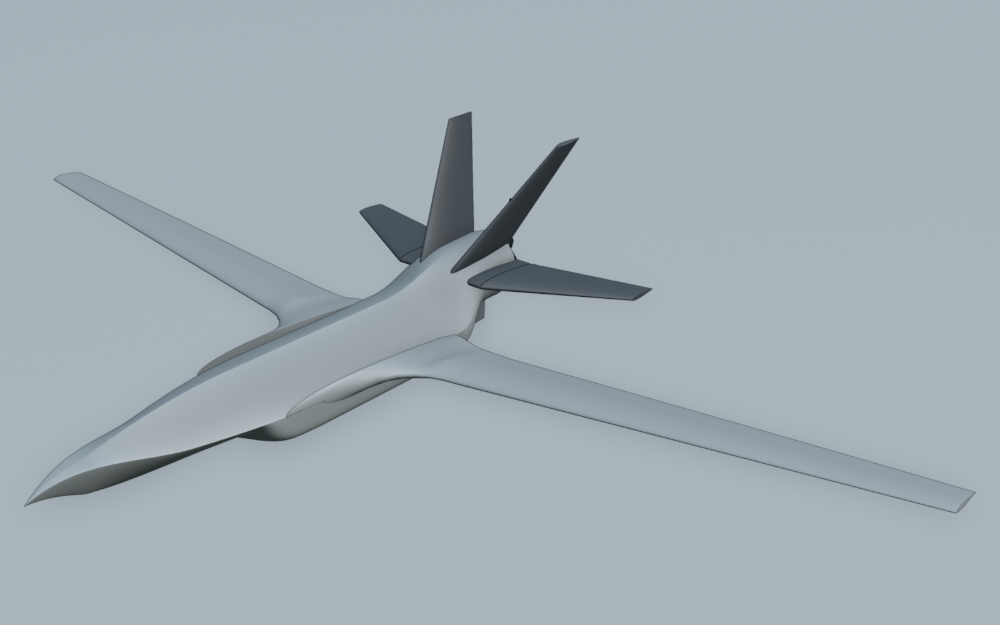

# YK-250 HANÇER — Konsept ve boyutlandırma raporu (faz 2, rev. v1.1)

**Tarih:** 6 Ekim 2026 · **Durum:** bağımsız doğrulamanın 19 bulgusu (F1–F19) işlendi, `ucav250/spec.yaml` v1.1 yazıldı. **46 gereksinimin 45'i karşılanıyor. R-02 (10 saat dayanım) dürüst modelle karşılanmıyor: 9,59 h.** Gereksinim düşürülmedi; açığın nedenleri ve kapatma seçenekleri §14'te kullanıcı kararına sunuldu.

> **Kapsam.** YK-250 HANÇER sivil bir EO/IR gözetleme ve araştırma İHA'sıdır. Faydalı yük yalnızca EO/IR taret ve
> görev donanımıdır. Silah, mühimmat, sert bağlantı noktası, pilon ya da yük bırakma mekanizması yoktur ve tasarım
> bunlar için yer ayırmaz. UCAV görünümü yalnızca biçim dilidir.


Bu raporun bütün sayıları tek kaynaktan gelir: [`spec.yaml`](../spec.yaml). Hesap [`analysis/sizing.py`](../analysis/sizing.py) içindedir; çıktıları [`out/sizing.json`](../out/sizing.json), [`out/sizing.md`](../out/sizing.md) ve [`out/sizing_trades.json`](../out/sizing_trades.json) dosyalarıdır.

```
python3 -m ucav250.analysis.sizing --check        # 46 gereksinimi ve spec'teki her türetilmiş değeri doğrular (çıkış 1 = ihlal)
python3 -m ucav250.analysis.sizing --check --out /tmp/x   # aynı kontrol, çıktılar depo dışına (depo dosyaları değişmez)
python3 -m ucav250.analysis.sizing --update-spec  # kapanış + değerlendirme; spec'teki türetilmiş değerleri yeniden yazar
python3 -m ucav250.analysis.sizing --trades       # ödünleşimler -> out/sizing_trades.json
python3 -m ucav250.analysis.sizing --render       # Workbench görüntüleri (docs/fig, bpy gerekir)
```

---

## Özet

| Büyüklük | Değer |
|---|---|
| Konfigürasyon | Köşeli (chine) taşıyıcı gövde + LERX + yüksek açıklık oranlı NLF kanat; dışa eğik ikiz dikey kuyruk (dümenli) + sabit kök parçalı tamamen hareketli yatay kuyruk (stabilatör) + ventral kanatçık/kuyruk tamponu; açık itici pervane; içeri katlanır üç tekerlekli takım; geri çekilir EO/IR taret |
| MTOM / boş / yakıt / faydalı yük | **149,9 kg** / 101,8 kg / 28,1 kg / 20,0 kg |
| Kanat | açıklık **7,20 m**, alan 3,226 m² (referans yamuk), AR 16,1, OAK 0,473 m, NLF(1)-0416 |
| Gövde | boy 4,02 m (pervane göbeğiyle 4,28 m), genişlik 0,80 m, yükseklik 0,46 m |
| Pervane | Mejzlik 31x12 3B, Ø 0,787 m, 5° aşağı itki hattı, statik uç Mach 0,712 |
| Dayanım (tasarım görevi) | **9,59 h** ✘ (gereksinim ≥ 10 h; bekleme 7,30 h, 3000 m'de taret dışarıda); feribot menzili 1.065 km |
| Aerodinamik | CD0 0,0369 (temiz), 0,0394 (taret dışarıda); (L/D)maks 17,0 / 16,4 |
| Hızlar | VS 23,9 m/s (temiz, trimli, MTOM); bekleme 28,7 m/s EAS; Vmaks 54,3 m/s |
| Tırmanma / tavan | 4,62 m/s (DS), 2,66 m/s (3000 m); servis tavanı 7.481 m |
| Pist | kalkış koşusu 191 m (en ön AM'li MTOM durumu), iniş koşusu 190 m (DS) |
| Kararlılık | statik marj %10,1–%14,7 OAK; Cnβ 0,0591 1/rad |
| Doğrulama | **45/46 gereksinim** (R-02 ✘); `--check` 1195 türetilmiş değerin 1195'ini tolerans içinde buluyor |

**Kısa sonuç.** Doğrulama, v1 boyutlandırmasında fiziği eksik ya da yanlış kuran on dokuz nokta buldu. En önemlisi kalkıştı: v1, stabilatörün burnu kaldıramadığı bir hızda "yer açısında düz kalkış" varsayıyordu. Bütün bulgular işlendi (§3). Kalkış, pervane açıklıkları, stabilatör menteşe momentleri ve kök boşlukları, dikey kuyruk kökleri, kanat kökü kiriş derinliği, rüzgâr hamlesi yükleri, elektrik bütçesi ve takımın toplanması artık hesapla doğrulanıyor ve hepsi karşılanıyor. Dürüst modelin bedeli dayanımda göründü: arka gövde kapanışının taban sürüklemesi, açık taret bölmesi, kanat-gövde birleşimi, sabit stabilatör kök parçaları, güç-bağımlı soğutma, araştırma yükünün elektrik payı ve tırmanma gereksinimini karşılayan 3 palli pervane birlikte dayanımı v1'in 10,62 saatinden 9,59 saate indirdi. MTOM, SHT-İHA M2 tavanı olan 149,9 kg'a çıkarıldı (v1'deki 0,9 kg pay yakıta verildi); açık yine de 0,41 h (%4,1) kalıyor. R-02 düşürülmedi. Kapatma seçenekleri ve bedelleri §14'tedir; seçim kullanıcınındır.

---

## 1. Başlangıç: konvansiyonel referans kavramlar

Araştırma fazından sonra aynı motor, pervane, polar ve görev denklemleriyle üç konvansiyonel kavram çalışıldı ([`data/concepts/`](../data/concepts/)). Kullanıcı bunları "yine aynı tip" bularak reddetti. Bu rapor onları **ölçüt** olarak kullanır. Hesap yöntemleri (pervane tablosu, BSFC, tripli polarlar, görev, kısıt diyagramı, yapı kütlesi) gözden geçirilmiş "Dayanım" çalışmasından alınmıştır. `tests/test_ucav250_sizing.py` itki modelinin o çalışmayla birebir aynı sonucu verdiğini, aynı pervane (32x18 2B) ve aynı elektrik yüküyle sınar.

| Kavram | Düzen | MTOM / boş / yakıt (kg) | CD0 | (L/D)maks | Dayanım | Neden reddedildi |
|---|---|---|---|---|---|---|
| Dayanım | omuz kanat AR 15, V-kuyruk, sabit kaportalı takım | 145 / 88,5 / 36,5 | 0,0331 | 16,9 | 14,77 h | klasik MALE görünümü |
| Kimlik | köşeli gövde, orta kanat, LERX tipi kök eldiveni | 145 / 90,5 / 34,5 | 0,0329 | 15,9 | 13,22 h | yine aynı tip |
| Üretim | çift kuyruk kirişi + H-kuyruk, üç parça kanat | 145 / 88,6 / 36,4 | 0,0375 | 14,7 | 13,19 h | yine aynı tip |

Ölçüt değerler `data/concepts/*/concept.yaml` dosyalarındandır. Bu kavramlar v1 yöntemiyle hesaplandı; F12 ve F16 düzeltmeleri (güç-bağımlı soğutma, kapanış taban sürüklemesi, araştırma yükü elektrik payı) onlara da uygulanırsa dayanımları da düşer. Karşılaştırma bu yüzden yönü gösterir, farkın büyüklüğünü değil.

## 2. Tasarım yönü çalışması ve kullanıcı seçimi

İkinci turda dört özgün yön aynı ön tahmin denklemleriyle karşılaştırıldı ([`data/concepts_v2/directions.yaml`](../data/concepts_v2/directions.yaml), [`compare.png`](../data/concepts_v2/compare.png); her yönün bir sayfası vardır: [MANTA](../data/concepts_v2/manta/sheet.png), [OK](../data/concepts_v2/ok/sheet.png), [HALKA](../data/concepts_v2/halka/sheet.png), [HANÇER](../data/concepts_v2/hancer/sheet.png)).

| Yön | Fikir | S (m²) | Açıklık (m) | AR | CD0 | (L/D)maks | Ön dayanım |
|---|---|---|---|---|---|---|---|
| MANTA | kanat-gövde birleşik (BWB) | 4,74 | 6,7 | 9,5 | 0,0255 | 15,8 | 17,0 h |
| OK | kanard-itici, ok kanat, kanat ucu dümenleri | 3,61 | 6,44 | 11,5 | 0,0285 | 15,9 | 15,3 h |
| HALKA | kutu / birleşik kanat | 4,77 | 5,5 | 6,3 | 0,029 | 13,1 | 13,9 h |
| **HANÇER** | köşeli taşıyıcı gövde + LERX + kanallı fan | 3,64 | 6,3 | 10,9 | 0,0312 | 14,8 | 14,3 h |

Ön tahminler kaba bir bileşen toplamı ve sabit 33 kg yakıtla yapılmıştı (±%20). **Kullanıcı D · HANÇER yönünü seçti** ve şu kararları verdi:

* biçim dili korunacak: elmas benzeri kesitli, keskin kenar çizgili taşıyıcı gövde; kenar çizgileri LERX'e akar ve
  yüksek açıklık oranlı kanada kaynaşır; dışa eğik ikiz dikey kuyruk; tamamen hareketli yatay kuyruk;
* **kanal (duct) reddedildi**: pervane açık iticidir; dikey kuyruklar ve ventral kanatçık/kuyruk tamponu onu korur;
* **iniş takımı içeri katlanır** (kütle ve hacim boyutlandırmada sayılır);
* **EO/IR taret gövde altındaki bölmeden indirilir**; bölme E180 büyüme zarfına göre boyutlanır.

Ayrıntılı boyutlandırma ön tahminden belirgin biçimde düşük dayanım verir (14,3 h → 9,59 h). Fark dört kaynaktan gelir: (1) boş kütle kalem kalem toplandı (ön tahmin 92 kg kabul etmişti, sonuç 101,8 kg); (2) bekleme taret dışarıda, 1,2 VS tabanında ve tripli polarlarla uçulur; (3) görev 2 x 100 km geçiş ve %10 yedek içerir; (4) v1.1'de doğrulamanın istediği sürükleme kalemleri ve gerçek kalkış fiziği eklendi (§3, §14).

## 3. Doğrulama bulguları ve düzeltmeler (v1 → v1.1)

Bağımsız doğrulama v1'i "henüz hazır değil" olarak değerlendirdi. Her bulgu önce yeniden üretildi, sonra düzeltildi. Kontroller hiçbir yerde gevşetilmedi; yeni bulgular için yeni gereksinimler (R-33…R-46) eklendi.

| No | Bulgu (özet) | Düzeltme | Sonuç |
|---|---|---|---|
| F1 | Kalkış koşusu R-06'yı aslında bozuyor; "düz kalkış" fiziksel değil, itki ortalaması koşuyu küçük gösteriyor | Ana teker temas noktasına göre moment dengesiyle burun kaldırma hızı V_R (η_t, Cm0_TO, itki momenti, sürtünme); zamanla integre edilen yer koşusu T(V); 1 s dönüş; bütün MTOM yüklemeleri (en ön AM belirler); tekerlek arabası kontrolü (R-35). Tasarım: 3 palli pervane, 35° kalkış flabı, 2,5° burun yukarı zemin tutumu, 5° aşağı itki | koşu 191 m ≤ 200 ✔; V_R 25,3 m/s, V_LOF 26,7 m/s; ana tekerde 103 N ✔ |
| F2 | Stabilatör mili panel AM'sinin %37,6 OAK önünde; menteşe momentleri eyleyicinin ~5 katı | Mil panel OAK'ının %20'sinde (AM %22–%30 belirsizliğiyle); VA, VD ve sürekli trim menteşe momentleri; Volz DA 30 + 2:1 bağlantı, CS-LUAS.395 1,25 katsayısı (R-37) | tepe pay 1,77 ✔, sürekli pay 2,49 |
| F3 | Stabilatör kökü öne doğru gövdeye giriyor, arkada 86 mm açılıyor | Gövdeye gömülü sabit kök parçası (stub); hareketli kök sabit 8 mm boşlukla bütün sapma aralığında (−20…+15°) gövde dışında (R-38, R-39) | boşluk 8 mm ✔, gövdeye pay 27,0 mm ✔ |
| F4 | Dikey kuyruk kökü ön %40'ta gövdeden 98 mm havada | Kök, iki yüzü de bütün veter boyunca sırt kaplamasına gömülecek şekilde yerleşir (R-40) | en az 21 mm gömülü ✔ |
| F5 | Stabilatör kuralı η_t'yi ve tam gaz itki momentini atlıyor | Yerel stabilatör CL'si (÷η_t); temiz/kalkış CLmax'ı ve tam gazda yerden kesilme (1,1 VS_TO) ile pas geçme (1,2 VS) trimi, en ön AM'ler (R-36) | en büyük yerel CL 0,705 ≤ 0,72 ✔; stabilatör 0,672 m² (v1 0,536) |
| F6 | Pervane yer açıklığı yalnız statik tutumda; CS-VLA 925(c) hiç yok | R-16 statik, yerden kesilme (amortisör statik) ve teker koyma (takım yüksüz) tutumlarının en kritiğinde; 925(c) radyal ve boyuna açıklıklar pala modeliyle (R-33, R-34); göbek ara parçası 110 mm | en az 0,185 m ✔; radyal 0,123 m, boyuna 0,021 m ✔ |
| F7 | Kök eldiveninde kiriş derinliği varsayılanın çok altında | Eldiven kalınlığı kiriş hatlarındaki gerekli derinlikten; LERX burulması kökte 0'dan rampalanır; kanat yapısı gerçek derinlikle; ana ve arka kiriş hattı kontrolü (R-43, R-44) | ana 85 mm (≥ %95 t_j), arka 38,7 mm ✔ |
| F8 | LERX/kenar çizgisi geçişi arkada 8–15 cm basamak | Kenar çizgisi kanat kökü firar kenarının 30 mm gerisine kadar kanat düzleminde tutulur; basamak kontrolü (R-45); kanat-gövde birleşim sürüklemesi eklendi | basamak 0 mm ✔ |
| F9 | Rüzgâr hamlesi yükü yanlış eğimle, yalnız MTOM'da, kökü rahatlatan Schrenk tabanıyla | Yapılandırma CLα'sı (VLM, bütün yüzeyler), kütle × irtifa matrisi, referans yamuk üzerinde Schrenk | kanat n 5,56 (v1 5,19); en hafif durumda +7,13 g |
| F10 | Eğik dikeyler açık pervaneyi yandan korumuyor | Dikey kuyruk konumu koruma kuralından: firar kenarı pervane düzlemini disk ucunun 50 mm dışında keser (R-41, R-42) | üst-yan bölgeler korunur (tepeden ±35°); göbek hizası yanları açık |
| F11 | Flap sökülebilir panel bağlantısının üzerinden geçiyor | Her dış panelde bir flap, iç ucu bağlantının 30 mm dışında, panel başına bir eyleyici (R-46) | pay 30 mm ✔ |
| F12 | Bu düzene özgü sürükleme kalemleri yok; %6 dayanım payı sağlam değil | Hoerner taban sürüklemesi (arka kapanış), açık taret bölmesi boşluk sürüklemesi, kanat-gövde birleşimi; hız ve güce bağlı soğutma sürüklemesi | CD0 0,0369 (v1 0,0337); dayanım 9,59 h ✘ (R-02, §14) |
| F13 | Taret görüş testi yalnız gövdeye bakıyor; "her yönde ufka kadar engelsiz" abartı | Pencere kenarından ışın: gövde (bölme boşluğu hariç), kuyruklar, ventral, pervane diski | üst sınır azimuta göre -2°…+24° (R-25 ≥ −5° ✔) |
| F14 | Doc 02, spec ve kısıt diyagramında eskimiş sayılar | Rapor sayıları sizing.json'dan üretildi; tail.arm_h = V_H'de kullanılan kol; kısıt diyagramında R-05 eğrisi ve pervane sınırlı kullanılabilir güç | test, belgedeki ana sayıları spec ile karşılaştırır |
| F15 | Spec, ARCHITECTURE §9 şemasından sapıyor | Kuyruk kumanda blokları (stabilatör sapma aralığı, mil, eyleyici; dümen menteşesi), üst düzey aero anahtarları, yükleme durumlarında `payload` | şema testi genişletildi ✔ |
| F16 | R-32 jeneratör payı yalnız 303 W'la | E180 sürekli ve tepe yükü + 50 W araştırma yükü payı; pay bekleme devrinde | pay 1,43 ✔ (E180 tepe 493 W da jeneratörden) |
| F17 | Kaba UIUC naca0010.dat kullanılıyor | Ventral kanatçık analitik NACA 0010 (`NACA-0010`) | ✔ |
| F18 | `--check` ve test depoya yazıyor | `--out DIR`; yazılan dosyalarda çalışma süresi yok; test geçici dizine yazar | ✔ |
| F19 | `parachute_hard_point` adı kapsamla çelişiyor | `parachute_attach_fitting`; yasak terimlere `hard_point` | ✔ |

Doğrulamanın görmediği bir hata da bu turda bulundu ve düzeltildi: **burun takımı geometrisi işaret hatası.** v1, burun aksını ana aksın üstüne yerleştiriyordu. Bu, uçağı yerde burun aşağı oturtur. Hesap ise aynı açıyı burun yukarı kabul ediyordu (kalkış CL'si ve pervane açıklığı bu açıyla hesaplanıyordu). Şimdi burun teker teması, ana teker temasının dingil açıklığı × tan(θ) kadar altındadır. Burun bacağı 326 mm'ye uzadı, taret bölmesi 40 mm geriye alındı (x = 1,22 m).

## 4. Gereksinimler

Gereksinimler `spec.yaml → requirements` altındadır; her birinin ölçütü `out/sizing.json → metrics` içindeki bir anahtardır ve kaynağı dosyada yazılıdır. R-33…R-46 doğrulama bulgularından gelen yeni kontrollerdir.

| No | Gereksinim | Hedef | Sonuç | |
|---|---|---|---|---|
| R-01 | Azami kalkış kütlesi 150 kg'ın altında (SHT-İHA M2 sınıfı, 149,9 kg tavan) | <= 149,9 kg | 149,9 kg | ✔ |
| R-02 | Tasarım görevi dayanımı ≥ 10 h (tırmanma, 2 x 100 km geçiş, 3000 m'de taret dışarıda bekleme, alçalma; %10 yedek ayrıca) | >= 10,0 h | 9,6 h | ✘ |
| R-03 | Tasarım faydalı yükü ≥ 20 kg (EO/IR taret + görev bilgisayarı + araştırma yükü payı) | >= 20,0 kg | 20,0 kg | ✔ |
| R-04 | Servis tavanı (0,5 m/s) ≥ 4500 m, MTOM | >= 4.500,0 m | 7.481,3 m | ✔ |
| R-05 | Deniz seviyesi tırmanma hızı ≥ 4,0 m/s, MTOM, tam gaz (4,9 m/s karşılaştırma hedefi pervane sınırlı; bkz. pervane ödünleşimi) | >= 4,00 m/s | 4,62 m/s | ✔ |
| R-06 | Kalkış yer koşusu ≤ 200 m (MTOM, ISA deniz seviyesi; 300 m pist / 1,5) | <= 200,0 m | 191,0 m | ✔ |
| R-07 | İniş yer koşusu ≤ 200 m (görev sonu kütlesi, ISA deniz seviyesi) | <= 200,0 m | 190,3 m | ✔ |
| R-08 | Tutunma hızı ≤ 24 m/s (temiz, trimli, MTOM, deniz seviyesi) | <= 24,0 m/s | 23,9 m/s | ✔ |
| R-09 | Statik marj ≥ %10 OAK (tüm yükleme durumları, öndeki nötr nokta) | >= 0,100 | 0,1010 | ✔ |
| R-10 | Statik marj ≤ %30 OAK (tüm yükleme durumları) | <= 0,300 | 0,1468 | ✔ |
| R-11 | Yön kararlılığı Cnβ ≥ 0,057 1/rad (0,001 1/derece) | >= 0,057 1/rad | 0,0591 1/rad | ✔ |
| R-12 | Geri devrilme açısı ≥ 15° (en arka zemin ağırlık merkezi) | >= 15,0° | 37,2° | ✔ |
| R-13 | Yana devrilme açısı ≤ 55° | <= 55,0° | 54,0° | ✔ |
| R-14 | Burun tekerleği yükü ≥ %8 (en arka ağırlık merkezi) | >= 0,080 | 0,1548 | ✔ |
| R-15 | Burun tekerleği yükü ≤ %20 (en ön ağırlık merkezi) | <= 0,200 | 0,1641 | ✔ |
| R-16 | Pervane yer açıklığı ≥ 0,18 m: statik tutum, kalkış (yerden kesilme) tutumu ve teker koyma tutumunun en kritiği (MTOM; kalkışta amortisör statik çökmede, teker koymada yüksüz) | >= 0,180 m | 0,1850 m | ✔ |
| R-17 | Sönük ana lastik + dibe oturmuş amortisörde pozitif pervane açıklığı (≥ 0,02 m) | >= 0,020 m | 0,0627 m | ✔ |
| R-18 | Kuyruk tamponu pervaneden önce yere değer (açı farkı ≥ 1°) | >= 1,00° | 4,72° | ✔ |
| R-19 | Kalkış ve flare açısında kuyruk tamponu yere değmez (pay ≥ 2°) | >= 2,00° | 2,30° | ✔ |
| R-20 | Teker koyma açısı ≥ 3° (ana tekerler önce değer) | >= 3,00° | 4,48° | ✔ |
| R-21 | Ana iniş takımı gövde içine toplanır (teker, bacak, mafsal; kanat kutusu ile çakışma yok) | == 1,00 | 1,00 | ✔ |
| R-22 | Burun iniş takımı omurga yuvasına toplanır | == 1,00 | 1,00 | ✔ |
| R-23 | Taret içeride kapakların üstünde kalır (gömülü) | >= 0,000 m | 0,0265 m | ✔ |
| R-24 | E180 büyüme zarfı (0,18 x 0,23 m) taret bölmesine sığar | == 1,00 | 1,00 | ✔ |
| R-25 | Taret dışarıda: nadirden en az −5° yükselime kadar her azimutta engelsiz görüş | >= -5,00° | -2,00° | ✔ |
| R-26 | Yerleşim bölgeleri gövdeye sığar (hata sayısı 0) | == 0,000 | 0,0000 | ✔ |
| R-27 | Yerleşim bölgeleri ve yakıt hücreleri çakışmaz (çakışma sayısı 0) | == 0,000 | 0,0000 | ✔ |
| R-28 | Yakıt hacmi gereken hacmi karşılar (pay ≥ 0) | >= 0,000 | 0,2898 | ✔ |
| R-29 | Taşıma: çıkarılabilir dış kanat paneli ≤ 3,4 m | <= 3,40 m | 2,78 m | ✔ |
| R-30 | Gövde + LERX orta kesiti ≤ 2,0 m (tek parça taşıma) | <= 2,00 m | 1,64 m | ✔ |
| R-31 | Statik pervane uç Mach sayısı ≤ 0,75 | <= 0,750 | 0,7121 | ✔ |
| R-32 | Jeneratör çıkışı beklemede en büyük sürekli elektrik yükünün ≥ 1,2 katı (E180 büyüme tareti ve araştırma yükü güç payı dahil; tepe yükler tampon bataryadan) | >= 1,20 | 1,43 | ✔ |
| R-33 | Pervane uçları ile yapı arasında radyal açıklık ≥ 0,026 m (CS-VLA 925(c)(1)) | >= 0,026 m | 0,1233 m | ✔ |
| R-34 | Pervane palaları ile sabit yapı (kaporta, kuyruk yüzeyleri) arasında boyuna açıklık ≥ 0,013 m (CS-VLA 925(c)(2)) | >= 0,013 m | 0,0208 m | ✔ |
| R-35 | Kalkışta dönme yetkisi: stabilatörler burun tekerini ana tekerler hâlâ yüklüyken kaldırır (tekerlek arabası etkisi yok; bütün MTOM yükleme durumları) | > 0,000 N | 103,119 N | ✔ |
| R-36 | Stabilatör trim gereksinimi (yerel CL, η_t dahil; temiz/kalkış CLmax ve tam güçte yerden kesilme/pas geçme, en ön ağırlık merkezleri) ≤ 0,8 × stabilatör CLmax | <= 0,720 | 0,7046 | ✔ |
| R-37 | Stabilatör eyleyicisi: tepe tork × bağlantı oranı ≥ 1,25 × en büyük menteşe momenti (CS-LUAS.395(a)(1)) | >= 1,00 | 1,77 | ✔ |
| R-38 | Stabilatör kök boşluğu ≤ 10 mm (sabit kök parçasına karşı, bütün sapma aralığında sabit) | <= 0,010 m | 0,0080 m | ✔ |
| R-39 | Stabilatör kökü bütün sapma aralığında gövdeye girmez (gövde yarı genişliği ile pay ≥ 5 mm) | >= 0,005 m | 0,0270 m | ✔ |
| R-40 | Dikey kuyruk kökü bütün kök veteri boyunca gövdeye gömülü (boşluk ≤ 0) | <= 0,000 m | -0,0213 m | ✔ |
| R-41 | Pervane koruması: eğik dikeylerin firar kenarı pervane düzlemini disk ucundan ≥ 26 mm dışarıda keser | >= 0,026 m | 0,0500 m | ✔ |
| R-42 | Pervane koruması: eğik dikeylerin firar kenarı pervane düzlemini disk ucundan ≤ 80 mm dışarıda keser (diski yakından çevreler) | <= 0,080 m | 0,0500 m | ✔ |
| R-43 | Ana kiriş hattında OML derinliği (gövde yanından dış panel bağlantısına) ≥ birleşim kalınlığının %95'i | >= 0,950 | 0,9774 | ✔ |
| R-44 | Arka kiriş hattında OML derinliği (gövde yanından dış panel bağlantısına) ≥ dış panel bağlantı kesitinin arka kiriş derinliğinin %95'i (arka kiriş kademesiz devam eder) | >= 0,950 | 1,003 | ✔ |
| R-45 | Kanat kökü ile köşe çizgisi arasında basamak ≤ 10 mm (LERX/köşe çizgisi geçişi) | <= 0,010 m | 0,0000 m | ✔ |
| R-46 | Flap, sökülebilir dış panelin üzerinde kalır (iç ucu panel bağlantısının dışında) | >= 0,000 m | 0,0300 m | ✔ |

**R-44 notu.** R-44 bu turda eklendi. İlk taslak, arka kiriş derinliğini kütle modelinin varsaydığı "0,55 × birleşim kalınlığı" ile karşılaştırıyordu. NLF(1)-0416 kesitinin %72 veterdeki kendi derinliği bunun ancak %80'i kadardır (0,44 t). Bu, geometrik bir kusur değil kütle modeli varsayımıdır. Gereksinim, kiriş hattının amacına göre yazıldı: arka kiriş derinliği, gövde yanından bağlantıya kadar, dış panel bağlantı kesitinin kendi arka kiriş derinliğinin %95'inden az olamaz (kademesiz devam). Kanat yapısındaki arka kiriş kütlesi de artık gerçek derinlikle hesaplanır.

## 5. Boyutlandırma yöntemi

Tasarım, sabit MTOM ile bir **kapanış döngüsüdür** (`sizing.design_closure`). Her yinelemede:

1. **Geometri** girdilerden üretilir. Gövde, kontrol çizgilerinin (Hermite ogive, yumuşak geçişler) yoğun `oml.Fuselage` istasyonlarına dönüşmesiyle kurulur: üst fasetler n ≈ 1,06, alt fasetler n ≈ 1,15 (keskin kenar çizgisi, sırt ve omurga). Faydalı yük bölmesi ile ana takım yuvaları arasında karın düzleşir (n 6). Kenar çizgisi, kanat kökü firar kenarının 30 mm gerisine kadar kanat düzleminde kalır, sonra motor ekseni yüksekliğine yükselir. LERX, kenar çizgisine teğet başlayıp dış kanat hücum kenarına teğet biten kübik bir Bezier'dir; eldiven kalınlığı kiriş derinliği kuralından gelir.
2. **Aerodinamik.** Taşıyıcı çizgi (NeuralFoil kesit polarları) LERX dahil gerçek kanatta çalışır; kaldırma eğimi, aerodinamik merkez ve Trefftz verimi için girdap kafesi (VLM) kullanılır. Profil sürüklemesi geçişi x/c 0,075'e zorlanmış polarlar × 1,15 kuralıyla hesaplanır. Sürüklemenin geri kalanı OML ağının açıkta kalan ıslak alanları üzerinden toplanır; v1.1'de arka kapanış taban sürüklemesi, açık taret bölmesi, kanat-gövde birleşimi ve sabit stabilatör kök parçaları eklendi. Soğutma sürüklemesi her noktada kendi hız, irtifa ve yakıt akışıyla hesaplanır.
3. **Kütle.** 45 kalem, her biri kaynaklı. Kanat kirişi başlıkları kütle × irtifa rüzgâr hamlesi matrisinin en büyük taşıma kuvvetinden, gerçek eldiven derinliğiyle; bütün kalemlere %5 büyüme payı. Yakıt = MTOM − boş kütle − faydalı yük.
4. **Kararlılık.** İki nötr nokta (klasik + bütün konfigürasyon VLM'si, stub dahil) hesaplanır, öndeki kullanılır. Kanat konumu, en arka yüklemede statik marj %10,1 olacak şekilde kaydırılır (kapanış payı 0,1 puan).
5. **Kurallar.** Kanat alanı tutunma hızı kuralından (VS = 23,9 m/s, trimli CLmax, MTOM). Stabilatör, yerel trim CL'si (η_t dahil) temiz/kalkış CLmax'ında ve tam gazda yerden kesilme/pas geçmede 0,70'i geçmeyecek boyutta (gereksinim 0,72). Dikeyler Cnβ ≥ 0,058 için boyutlanır; konumları pervane koruma kuralından gelir. Takım yüksekliği CS-VLA 925(a) tutumlarından ve tampon kurallarından; ana takım konumu geri devrilme, burun yükü ve faydalı yük bölmesi kurallarından; iz yana devrilme kuralından gelir.
6. **Görev ve performans.** Görev parça parça uçulur: ısınma, kalkış, 3000 m'ye tam gazda tırmanma, 100 km geçiş, bekleme (en düşük yakıt akışı; 26 m/s EAS ve 1,2 VS tabanı), 100 km dönüş, alçalma, iniş, %10 yedek. Her parçada pervane tablosu, motorun kısmi yük BSFC'si, jeneratör yükü ve aşağı itki bileşeni kullanılır.


Kısıt diyagramında tasarım noktası VS = 24 m/s köşesindedir. Tırmanma eğrisi R-05'in 4,0 m/s değeriyle, kesikli eğri 4,9 m/s temel hedefiyle çizildi. Yatay siyah çizgi, sabit hatveli pervanenin tırmanma hızında tam gazda emebildiği mil gücüdür (10,91 W/N); motorun 18 kW çizgisi (12,24 W/N) kullanılabilir değildir.

## 6. Sonuçlar


### 6.1 Geometri

| Kalem | Değer |
|---|---|
| Kanat | b 7,20 m · S 3,226 m² · AR 16,1 · λ 0,42 · c/4 süpürme 6° · dihedral 3° · i 3,5° · burulma 3° |
| Kanat kökü / ucu (yamuk) | 0,631 m / 0,265 m; OAK 0,473 m (ön kenar x = 2,648 m) |
| LERX | tepe x = 1,55 m (kenar çizgisinde), birleşim y = 0,82 m; taşıyıcı çizgi alanı 4,05 m² (gövde içi dahil) |
| Gövde | 4,02 m × 0,80 m × 0,46 m; hacim 0,70 m³; açıkta ıslak alan 5,98 m²; incelik 7,1 |
| Stabilatörler (çift, hareketli) | 0,672 m²; mil x = 3,710 m (panel OAK'ının %20'si); kök y = 0,346 m |
| Sabit kök parçaları (çift) | 0,178 m² (gövde içinden hareketli köke kadar) |
| Dikey kuyruklar (çift) | 0,758 m² panel (0,666 m² açıkta), 22° dışa eğik, %30 dümen, kök hücum kenarı x = 3,335 m |
| Ventral kanatçık | 0,065 m², açıklık tampon kuralından 0,204 m |
| Pervane | Mejzlik 31x12 3B, Ø 0,787 m, düzlem x = 4,08 m, göbek z = 0,22 m, 5° aşağı itki |

### 6.2 Kütle

| Grup | Kütle (kg) |
|---|---|
| Kanat (kirişler, kaburgalar, kaplamalar, panel bağlantıları; kumanda yüzeyleri hariç) | 17,27 |
| Sistemler (paraşüt, batarya, PDU, aviyonik, kablo demeti, taret kaldırma mekanizması) | 15,07 |
| İtki (kurulu motor grubu, pervane, soğutma) | 14,30 |
| İniş takımı (SAGITTA referanslı bacaklar, kapaklar, kilitler) | 13,66 |
| Şasi (omurga kirişleri, çerçeveler, kanat geçiş kutusu, bağlantılar) | 11,15 |
| Gövde kabuğu (sandviç kaplama, kenar çizgisi şeritleri) | 10,25 |
| Kumanda (eyleyiciler, kanatçık/flap/dümen yüzeyleri) | 8,17 |
| Kuyruk (stabilatörler, sabit kök parçaları, dikeyler, ventral) | 8,09 |
| Yakıt sistemi | 2,34 |
| Bağlantı elemanları | 1,51 |
| **Boş kütle (%5 büyüme payı dahil)** | **101,82** |

Boş kütle oranı 0,68'dir (benzer İHA'larda 0,55–0,62). Fazlalık kullanıcının seçtiği özelliklerden gelir: içeri katlanır takım, taret kaldırma mekanizması ve bölme çerçevesi (2,1 kg), dört hareketli kuyruk yüzeyi ve eyleyicileri, geniş taşıyıcı gövde kabuğu. v1'e göre artış (+1,6 kg) sabit kök parçaları, güç-açık kurala göre büyüyen stabilatörler ve yapılandırma CLα'sıyla ağırlaşan kanat kirişlerinden gelir. Grup bütçeleri (`mass.budget`) bu tahmine yeniden dağıtıldı.

### 6.3 Aerodinamik


| Kalem | Değer |
|---|---|
| Kaldırma eğimi | 5,81 1/rad (kanat, VLM); bütün konfigürasyon 6,37 1/rad; taşıyıcı çizgi 6,45 1/rad |
| Açıklık verimi | taşıyıcı çizgi 0,977, Trefftz 0,974; polar uyumu e = 0,839 (profil sürüklemesinin CL ile değişimi ve trim dahil) |
| CLmax | kanat 1,365 (kritik kesit η = 0,38, α = 8,1°); trimli temiz 1,302; 35° kalkış flabıyla 1,513 |
| CD0 | temiz 0,0369 · taret dışarıda 0,0394 · takım açık 0,0485 |
| (L/D)maks | 17,0 temiz, 16,4 taret dışarıda |
| Bekleme 3000 m | 33,3 m/s TAS (28,7 EAS), CL 0,909, L/D 15,4, mil gücü 4,41 kW, 4.995 rpm, η 0,726, BSFC 559 g/kWh, 2,70 kg/h |

Temiz sürükleme kalemleri (CD, S_ref'e göre): gövde 0,0074 · stabilatörler 0,0024 · dikey kuyruklar 0,0022 · arka kapanış taban sürüklemesi 0,0021 · motor soğutma 0,0019 · katlanmış takım boşlukları 0,0012 · arka gövde yukarı kıvrımı 0,0012 · sızıntı/çıkıntılar 0,0011 · kumanda yüzeyi boşlukları 0,0008 · anten/pito/ışıklar 0,0008 · kanat-gövde birleşimleri 0,0004 · stabilatör kök parçaları 0,0004 · ventral 0,0002 · taret kapak boşlukları 0,0001. Kanat profil sürüklemesi CL 0,7'de 0,0138'tür (tripli × 1,15). Bekleme polarına taret topu ve sap için +0,0017, açık bölme için +0,0007 eklenir.

**Arka kapanış (F12).** Kaporta, motor silindirlerinin bittiği yerden (x ≈ 3,90 m) 0,135 m yarıçaplı kaporta ağzına 0,12 m içinde kapanır; en dik eğim 53°. Eğimin 15°'yi geçtiği yerden (x = 3,92 m) sonrası ayrılmış taban sayılır: taban alanı 0,111 m², Hoerner taban basıncı bağıntısıyla CD 0,0021. İtici pervanenin emme etkisinden pay alınmadı (ihtiyatlı). Bu kalem tek başına dayanımdan 0,25 h götürür.

### 6.4 Kararlılık ve ağırlık merkezi


* Nötr nokta x = 2,703 m (VLM; klasik yöntem 2,722 m). Köşeli ön gövde ve LERX kanadın önünde kaldırma üretir; Multhopp gövde katkısı Cmα = +0,57 1/rad (ön gövde 0,45). Ağırlık merkezi bu yüzden referans OAK'nin ön kenarına yakındır; bu, taşıyıcı gövdeli konfigürasyonun doğal sonucudur.
* Statik marj %10,1–%14,7 OAK. En arka durum MTOM tasarım yüküdür; en öndeki E180 büyüme taretli MTOM durumudur (x = 2,633 m).
* V_H 0,474 (kol 1,076 m, tasarım AM'sinden stabilatör AM'sine; `tail.arm_h` artık bu koldur), V_V 0,0276 (kol 1,121 m). Aşağı sapma dε/dα 0,39.
* Cnβ = 0,0591: dikeyler +0,0940, ventral +0,0043, gövde -0,0392 (DATCOM; Raymer -0,0226 verir, kötüsü alındı). Clβ = -0,116.

### 6.5 Performans


| Durum | Değer |
|---|---|
| Dayanım / bekleme / menzil | 9,59 h / 7,30 h / 1.065 km |
| Tutunma (DS, MTOM) | 23,9 m/s; görev sonu iniş kütlesinde (125,2 kg) 21,8 m/s |
| Tırmanma | 4,62 m/s (DS, 30,0 m/s), 2,66 m/s (3000 m); 3000 m'ye 13,7 dk |
| Azami hız | 54,3 m/s (DS), 52,0 m/s (3000 m) |
| Tavan | servis 7.481 m, mutlak 8.677 m |
| Kalkış (DS, MTOM) | koşu 191 m, 15 m'ye 332 m (§7) |
| Kalkış (1500 m ISA) | koşu 279 m (gereksinim değil, bilgi) |
| İniş (DS, görev sonu) | koşu 190 m, teker koyma 25,1 m/s (flapsız) |
| Faydalı yük – dayanım | 0 kg 14,0 h (yakıt hacmi sınırı) · 3 kg 13,7 h (yakıt hacmi sınırı) · 10 kg 13,1 h (yakıt hacmi sınırı) · 15 kg 11,7 h · 20 kg 9,6 h · 25 kg 7,6 h |

Duyarlılıklar (dayanım, h): BSFC −%12 → 10,91; BSFC +%12 → 8,55; bütün sürükleme +%10 → 8,99; boş kütle +%5 → 7,55; bekleme 1000 m'de → 10,04; geçişsiz yalnız bekleme → 9,56; taret bütün görevde içeride → 9,80. Dayanımın yakıta eğimi 0,41 h/kg, sürüklemeye eğimi her uçuş evresinde +0,001 CD için -0,12 h'dir.

### 6.6 Yapısal yükler


VA = VC = 45 m/s EAS, VD = 57 m/s EAS. Rüzgâr hamlesi, yapılandırma kaldırma eğimiyle (6,37 1/rad) bütün kütle × irtifa matrisinde hesaplanır (F9):

| Kütle | İrtifa | n+ / n− |
|---|---|---|
| 106,4 kg | 0 m | +6,62 / -4,62 |
| 106,4 kg | 3.000 m | +6,97 / -4,97 |
| 106,4 kg | 4.500 m | +7,13 / -5,13 |
| 149,9 kg | 0 m | +5,27 / -3,27 |
| 149,9 kg | 3.000 m | +5,47 / -3,47 |
| 149,9 kg | 4.500 m | +5,56 / -3,56 |

Kanat, en büyük taşıma kuvvetine (n · m · g; MTOM, 4500 m: n = 5,56) göre boyutlanır; Schrenk dağılımı referans yamuk veteri üzerindedir (LERX veteri merkeze uzatılmaz). Nihai kök momenti 9.448 N·m, panel bağlantısında 5.170 N·m; kök kiriş başlığı 338 mm². En hafif uçuş kütlesinde rüzgâr hamlesi katsayısı +7,13 g'ye çıkar; donanım ve bağlantı noktaları bu değerle boyutlanmalıdır (`structures.derived.gust_matrix`).

## 7. Kalkış (F1, F5)

v1 kalkışı, uçağın 27,4 m/s'de yer açısında "düz" kalktığını varsayıyordu. Doğrulama bunun imkânsız olduğunu gösterdi: o hızda ana tekerler yükten kurtulurken burun tekeri yüklü kalır (tekerlek arabası). v1.1 kalkış modeli:

1. Yer koşusu 35° flap ve zemin tutumunda, zaman adımıyla integre edilir: tam gaz itki T(V) (ileri T·cos ε, aşağı T·sin ε), sürükleme (zemin etkili indüklenmiş + takım + tam güç soğutması), yuvarlanma sürtünmesi.
2. Burun kaldırma hızı V_R, ana teker temas noktasına göre moment dengesinden bulunur: gereken = W(x_mg − x_AM) + T·cos ε (z_t − z_AM) − T·sin ε (x_t − x_mg) + μN·h_AM; kapasite = q[η S_h CLt,maks (x_t − x_mg) + S CL_g (x_mg − x_ac) + S c Cm0_TO].
3. 1 s dönüş (Raymer 17.8.2); yerden kesilme hızı V_LOF = max(dönüş sonu hız, 1,1 VS_TO).
4. Kontroller: V_R'de ana tekerler hâlâ yüklü (R-35), yerden kesilmede güç-açık trim (R-36), bütün MTOM yüklemeleri; en ön AM belirler.

| Yükleme | Koşu | V_R | V_LOF | Ana tekerde yük (V_R) | Yerel stabilatör CL (V_LOF) |
|---|---|---|---|---|---|
| MTOM, tasarım yükü, taret içeride | 179 m | 24,6 m/s | 26,1 m/s | 175 N | 0,62 |
| MTOM, tasarım yükü, taret dışarıda | 179 m | 24,6 m/s | 26,1 m/s | 175 N | 0,62 |
| MTOM, E180 büyüme tareti (en ön AM) | 191 m | 25,3 m/s | 26,7 m/s | 103 N | 0,73 |

Kalkışı kısaltan tasarım değişiklikleri: (a) 2,5° burun yukarı zemin tutumu (yer koşusu CL'si 1,28); (b) 35° kalkış flabı; (c) 31x12 3B pervane (statik itki 493 N, 32x18 2B ile 447 N); (d) 5° aşağı itki (itki hattı AM'nin 59 mm üstünden geçer, v1'de ~190 mm). VS_TO 22,2 m/s; yerden kesilme tutumu 1,8°. 1500 m ISA pistte koşu 279 m'dir. Model ihtiyatlıdır: zemin tutumunda kanat ağırlığı 24,2 m/s'de taşır; otopilot uçağı 1,1 VS_TO'ya kadar yerde tutar.

## 8. Kanat kökü: LERX, kenar çizgisi ve kiriş derinliği (F7, F8, F11)

* **Kenar çizgisi geçişi.** Kenar çizgisi, kanat kökü firar kenarının (x = 3,088 m) 30 mm gerisine kadar kanat düzleminde tutulur; motor ekseni yüksekliğine yükselişi x = 3,118 m'de başlar. LERX/eldiven burulması kökte 0°'dan LERX açıklığının %60'ında tam hücum açısına (3,5°) yumuşakça çıkar; uzun kök kesitleri kenar çizgisi düzleminde kalır. Kanat üst yüzeyi ile kenar çizgisi arasındaki basamak 0 mm'dir (R-45 ≤ 10 mm).
* **Kiriş derinliği.** Eldiven kesitlerinin kalınlığı, ana kiriş hattında birleşim kalınlığına (t_j = 87,4 mm), arka kiriş hattında bağlantı kesitinin kendi derinliğine (38,6 mm) göre seçilir. Gövde yanından bağlantıya kadar en az derinlik ana kirişte 85,4 mm, arka kirişte 38,7 mm'dir (ikisi de bağlantıda; kiriş kademesiz devam eder). Kanat yapısı başlıklarını bu gerçek derinlikle hesaplar: eldivende etkin derinlik en az 71,3 mm, en büyük başlık alanı 191 mm².
* **Flap.** Her sökülebilir dış panelde bir flap vardır (η 0,236–0,58); iç ucu panel bağlantısının 30 mm dışındadır ve her flap kendi eyleyicisiyle çalışır. Kanatçıklar η 0,60–0,95 aralığındadır.

## 9. Kuyruk ve kumanda yüzeyleri (F2, F3, F4, F5, F10)

* **Stabilatör boyutu.** Kural: yerel trim CL'si (kuyruk kuvveti / η_t q S_h) en ön AM'lerde temiz ve kalkış CLmax'ında, tam gazda yerden kesilmede (1,1 VS_TO) ve pas geçmede (1,2 VS) 0,70'i aşmaz. Belirleyen durum E180 taretli MTOM'da tam gazla yerden kesilmedir (yerel CL 0,705). Sonuç 0,672 m² (v1 0,536 m²).
* **Mil ve menteşe momenti.** Mil panel OAK'ının %20'sindedir (x = 3,710 m). Panelin aerodinamik merkezi %22–%30 OAK aralığında kabul edilir, kol 9–43 mm. Yüzey her durumda milin arkasındaki AM ile kendini dengeler. Menteşe momenti VA'da tam sapmada 14,5 N·m, VD'de 7,7 N·m, sürekli trimde 6,4 N·m. Volz DA 30 (8 N·m sürekli, 16 N·m tepe) 2:1 bağlantıyla yüzeyde 32 N·m verir: CS-LUAS.395 1,25 katsayısıyla tepe pay 1,77, sürekli pay 2,49. Yüzey hareketi ±22,5°, gereken −20…+15°.
* **Kök.** Hareketli kökün içinde gövdeye gömülü sabit bir kök parçası (stub) vardır. Hareketli kök ile stub arasında bütün sapma aralığında sabit 8 mm boşluk kalır; hareketli kökün gövdeye en yakın noktası 27,0 mm uzaktadır. Stub yatay kuyruk alanının parçası olarak VLM'de ve sürükleme/kütlede sayılır.
* **Dikey kuyruk kökleri** bütün veter boyunca sırt kaplamasına en az 21 mm gömülüdür; ön kiriş ve kök bağlantısı kaplamanın altındaki çerçeveye oturur.
* **Pervane koruması.** Dikey kuyrukların konumu koruma kuralından gelir: firar kenarı pervane düzlemini disk ucunun 50 mm dışında (r = 0,444 m) keser. Kesişme, diskin tepesinden her iki yana yaklaşık 35° açıdadır; üst-yan bölgeler korunur. Alt bölgeyi ventral kanatçık ve değiştirilebilir kuyruk tamponu korur. **Göbek yüksekliğindeki yan bölgeler açıktır**; tam çevresel koruma yalnız kanal ya da yan korumalarla mümkündür (kullanıcı kanalı reddetti).
* **Dikey boyutu.** Cnβ ≥ 0,058 kuralı (gereksinim 0,057): 0,758 m² panel. Dikeyler pervane koruması için geriye alındığından kuyruk kolları uzadı.
* **Ventral kanatçık** kuyruk tamponunu taşır; açıklığı kalkış ve flare açısında yere değmeme kuralından gelir (0,204 m). Tampon pervaneden 4,7° önce yere değer.

## 10. İçeri katlanır iniş takımı (F6)



* **Pervane yer açıklığı (CS-VLA 925(a)).** Statik tutumda 0,210 m, yerden kesilme tutumunda (3,8°, amortisör statik) 0,185 m, teker koyma tutumunda (4,5°, takım yüksüz) 0,214 m; en az 0,185 m (0,18 + 5 mm). Sönük lastik ve dibe oturmuş amortisörde 0,063 m kalır. Belirleyen tutum yerden kesilmedir; yer çizgisi z = -0,430 m (v1 −0,390).
* **CS-VLA 925(c).** Pala uçlarıyla yapı arasında radyal açıklık en az 0,123 m (dikeyler); boyuna açıklık en az 20,8 mm (dikey firar kenarları; kaporta yüzüne 21,9 mm). Pala eksen boyutu, palanın veter ve hatve açısı modelinden (tahmin; Mejzlik çizimiyle değiştirilecek) hesaplanır. Göbek ara parçası 110 mm'dir.
* **Zemin tutumu.** 2,5° burun yukarı. Burun teker teması ana tekerin 102 mm altındadır (gövde ekseninde). Burun bacağı 326 mm, ana bacak 229 mm.
* **Ana takım** gövde karnındaki takım çerçevesinde boylamasına mafsallara takılır, 18° dışa açıktır ve içeri 108° döner; tekerlekler kanat kutusunun altında yan yana, 18° eğik durur. Daha uzun bacak için karın, takım yuvalarında daha dolgun yapıldı (alt süperelips n 6). Merkez boşluğu 38 mm, kanat kutusuna açıklık 35 mm; lastik zarfı, bacak ve mafsal bağlantısı gövde içinde 6 mm deri payıyla doğrulanır.
* **Konum.** Ana takım x = 3,012 m (faydalı yük bölmesinin arkası), iz 0,841 m, dingil açıklığı 2,332 m, geri devrilme 37,2°, yana devrilme 54,0°, burun yükü %15,5–%16,4.
* **Kütle:** SAGITTA referanslı bacaklar (4,0 + 4,0 + 3,5 kg × MTOM/150), kapaklar, kilitler; toplam %5 payla 13,66 kg. Satın alınabilir birim yoktur.

## 11. Geri çekilir EO/IR taret (F13)

* **Taret:** Trillium HD59-LLVV (1,55 kg + 0,20 kg bağlantı). Bölme Octopus E180 büyüme zarfına göre boyutlanır (Ø 0,18 m küre + aynı çaplı silindir, 0,23 m; üstünde 0,07 m mekanizma). Bölme x = 1,22 m'dedir.
* **İçeride:** HD59 topu kapak iç yüzünün 26,5 mm üstündedir; E180 zarfı 10 mm payla sığar.
* **Dışarıda:** strok 0,12 m; kapaklar bölme duvarları boyunca içeri katlanır. Görüş alanı, pencere merkezinden ve 20 mm yarıçaplı pencere kenarının dört noktasından çıkan ışınlarla bulunur. Engeller: gövde (açık bölme boşluğu hariç), kuyruk yüzeyleri, ventral kanatçık ve tampon, pervane diski. Azimuta göre engelsiz en yüksek yükselim (0° = ileri):

| Azimut | 0° | 10° | 20° | 30° | 40° | 50° | 60° | 70° | 80° | 90° | 100° | 110° | 120° | 130° | 140° | 150° | 160° | 170° |
|---|---|---|---|---|---|---|---|---|---|---|---|---|---|---|---|---|---|---|
| Üst sınır | -2° | 2° | 6° | 12° | 16° | 20° | 21° | 23° | 24° | 24° | 23° | 22° | 19° | 8° | 1° | -1° | -1° | -1° |

| Azimut | 180° | 190° | 200° | 210° | 220° | 230° | 240° | 250° | 260° | 270° | 280° | 290° | 300° | 310° | 320° | 330° | 340° | 350° |
|---|---|---|---|---|---|---|---|---|---|---|---|---|---|---|---|---|---|---|
| Üst sınır | -2° | -1° | -1° | -1° | 1° | 8° | 19° | 22° | 23° | 24° | 24° | 23° | 21° | 20° | 16° | 12° | 6° | 2° |

En kötü değer −2°'dir: tam ileride burun, tam geride ventral kanatçık ve pervane diski görüşü keser. Gereksinim (R-25) her azimutta nadirden en az −5°'ye kadar görüştür; karşılanır. v1'deki "her azimutta ufka kadar" ifadesi yanlıştı.

## 12. Yerleşim, yakıt ve elektrik (F16)

| Bölge | x (m) | Not |
|---|---|---|
| Burun takımı yuvası | 0,62–1,08 | omurga yuvası, tekerlek dikey |
| Aviyonik / güç bölmesi | 0,80–1,06 | uçuş bilgisayarı, GNSS/IMU, veri bağı, 14S2P batarya, PDU |
| Taret bölmesi | 1,12–1,32 | E180 zarfı + mekanizma |
| Paraşüt | 1,50–1,80 | UAVOS 200, sırt kapağı kanadın önünde |
| Görev bilgisayarı | 1,84–2,06 | |
| Yakıt (ön / eyer / arka hücre) | 2,33–3,13 | 49,9 L kullanılabilir, 38,7 L gerekli; yakıt AM x = 2,73 m |
| Faydalı yük bölmesi | 2,45–2,87 | karın, boş kütle AM'sine ortalı |
| Ana takım yuvaları | 2,90–3,12 | |
| Arka donanım bölmesi | 3,20–3,56 | ECU, jeneratör elektroniği, yakıt pompası |
| Motor | 3,70–3,95 | L 275 EF, silindirler yatay |

**Elektrik (R-32).** Sürekli yük: temel 303 W (HD59 dahil) + 50 W araştırma yükü payı = 353 W; E180 ile 373 W, E180 tepe 493 W. SG750 çıkışı devirle orantılıdır (800 W × rpm/7500); 3B pervaneyle bekleme devri 4.995 rpm, çıkış 533 W → pay 1,43 (≥ 1,2). E180 tepe yükü de jeneratörden karşılanır. 50 W pay araştırma yükü için bir paylaştırmadır; daha büyük bir yük daha büyük jeneratör gerektirir. Bu yük motor yüküne eklendiği için dayanımdan 0,10 h götürür.

## 13. Ödünleşimler

`python3 -m ucav250.analysis.sizing --trades` ([`out/sizing_trades.json`](../out/sizing_trades.json)).

**Pervane** (her pervane kendi tasarım kapanışıyla: takım yüksekliği, dikey konumu, stabilatör, kütleler):

| Pervane | Dayanım | Tırmanma (DS) | Kalkış / iniş koşusu | Statik itki | Bekleme devri | Karşılanmayan |
|---|---|---|---|---|---|---|
| Mejzlik 31x12 3B (seçilen) | 9,59 h | 4,62 m/s | 191 / 190 m | 493 N | 4.995 rpm | R-02 |
| Mejzlik 32x18 2B | 9,93 h | 3,91 m/s | 216 / 190 m | 447 N | 4.277 rpm | R-02, R-05, R-06, R-21, R-26 |

v1'in 32x18 2B pervanesi, güç-bağımlı soğutma sürüklemesiyle tırmanmada 3,91 m/s'de kalır (R-05 ≥ 4,0 ✘). Daha büyük çapı takımı uzatır ve toplanmayı bozar (R-21, R-26); kalkış koşusu da 200 m'yi aşar. 31x12 3B bunların hepsini karşılar; bedeli 0,34 h dayanımdır. İki pervaneyle de R-02 karşılanmaz. Tip Mach ≤ 0,75 sınırı (R-31) düşük hatveli büyük pervaneleri dışarıda bırakır.

**İniş takımı ve taret** (kullanıcı kararlarının bedeli; MTOM sabit, fark yakıta gider):

| Seçenek | Kütle | Dayanım | Fark |
|---|---|---|---|
| İçeri katlanır takım (seçilen) | 13,66 kg | 9,59 h | — |
| Sabit, kaportalı takım | 9,55 kg (+ D/q 0,0051 m²) | 11,09 h | +1,50 h |
| Geri çekilir taret (seçilen) | mekanizma + çerçeve 2,10 kg | 9,59 h | — |
| Sabit taret (hep dışarıda) | — | 10,26 h | +0,67 h |

**Kanat açıklığı ve kanat yüklemesi** (her satır tam bir tasarım kapanışıdır):

| Açıklık | VS hedefi | S | AR | Kanat | Boş | (L/D)maks | Dayanım | Kalkış | Dış panel |
|---|---|---|---|---|---|---|---|---|---|
| 7,20 m | 23,0 m/s | 3,477 m² | 14,9 | 18,09 kg | 103,37 kg | 16,8 | 9,07 h | 178 m | 2,78 m |
| 6,80 m | 23,9 m/s | 3,231 m² | 14,3 | 16,65 kg | 101,27 kg | 16,1 | 9,56 h | 197 m | 2,58 m |
| **7,20 m** | 23,9 m/s | 3,226 m² | 16,1 | 17,27 kg | 101,82 kg | 17,0 | **9,59 h** | 191 m | 2,78 m |
| 7,60 m | 23,9 m/s | 3,227 m² | 17,9 | 17,94 kg | 102,46 kg | 17,7 | 9,53 h | 185 m | 2,98 m |
| 7,20 m | 24,5 m/s (R-08 ✘) | 3,074 m² | 16,9 | 16,79 kg | 101,10 kg | 17,0 | 9,73 h | 199 m | 2,78 m |

7,2 m açıklık en iyi noktadır: 7,6 m'de kanat kütlesi L/D kazancını aşar. Tutunma hızı hedefi düştükçe kanat büyür ve dayanım azalır; 24,5 m/s R-08'i bozar.

**Kuyruk kolu (gövde boyu):**

| Gövde uzatma | Gövde boyu | V_H | Boş | Dayanım | Cnβ |
|---|---|---|---|---|---|
| -0,10 m | 3,92 m | 0,469 | 101,80 kg | 9,57 h | 0,0586 |
| **0,00 m** | 4,02 m | 0,474 | 101,82 kg | **9,59 h** | 0,0591 |
| 0,10 m | 4,12 m | 0,483 | 101,86 kg | 9,59 h | 0,0577 |

Etki küçüktür (0,1 m için ±0,02 h). 4,02 m korundu.

## 14. Dayanım açığı: nedenleri ve kapatma seçenekleri

Tasarım görevi dayanımı **9,59 h**, gereksinim 10 h: açık **0,41 h** (%4,1). Aynı kanat, gövde ve kuyrukla 10 saatlik görev için gereken MTOM 152,6 kg'dır (M2 tavanının 2,7 kg üstü).

**Nereden geliyor?** v1'in 10,62 saatinden bugüne, tek tek kaldırıldığında dayanıma etkisi (tasarım noktasında, diğerleri yerinde; etkiler tam toplanabilir değildir):

| Kalem (v1.1'de eklenen ya da değişen) | Dayanıma etkisi |
|---|---|
| Arka kapanış taban sürüklemesi (F12) | −0,25 h |
| 32x18 2B yerine 31x12 3B pervane (R-05, R-06, R-21) | −0,34 h |
| Araştırma yükü elektrik payı 50 W (F16) | −0,10 h |
| Açık taret bölmesi boşluk sürüklemesi (F12) | −0,06 h |
| Kanat-gövde birleşim sürüklemesi (F8/F12) | −0,05 h |
| Sabit stabilatör kök parçalarının sürüklemesi (F3) | −0,05 h |
| Güç-bağımlı soğutma sürüklemesi (F12) | +0,02 h |
| Kütle: stub'lar, büyüyen stabilatör, ağırlaşan kanat (F3, F5, F7, F9) | boş kütle +1,6 kg (eğim 0,41 h/kg) |
| MTOM 149,0 → 149,9 kg (yakıta) | +0,37 h |

**Kapatma seçenekleri** (hiçbiri uygulanmadı; hepsi kullanıcı kararıdır):

1. **Sabit taret** (bekleme dışında da dışarıda): +0,67 h → 10,26 h ✔. Kullanıcının "geri çekilir taret" kararını bozar.
2. **Sabit kaportalı takım:** +1,50 h → 11,09 h ✔. Kullanıcının "içeri katlanır takım" kararını bozar.
3. **32x18 2B pervane:** 9,93 h; yine 10 h'in altında ve R-05, R-06, R-21, R-26'yı bozar. Önerilmez.
4. **Görev tanımı:** bekleme 1000 m'de → 10,04 h ✔; faydalı yük 15 kg → 11,65 h ✔. Bunlar gereksinimin kendisini değiştirir (R-02/R-03 tanımı).
5. **Ölçümle doğrulanacak kalemler:** arka kapanış taban sürüklemesi itici pervanenin emişi nedeniyle büyük olasılıkla daha küçüktür (pay alınmadı); düşük yük BSFC haritası (±%12 → 8,5–10,9 h); kanat CLmax'ı (bekleme 1,2 VS tabanında uçulur). Rüzgâr tüneli/CFD ve motor testi bu kalemlerin her birinde 0,1–0,3 h oynatabilir; bugün kredi olarak kullanılmadı.
6. **MTOM sınıfı:** 10 h için ~152,6 kg gerekir; M2 sınıfının (< 150 kg) dışına çıkar.

Önerimiz: kullanıcı ya (1) sabit tareti kabul eder ya da (4) bekleme irtifası/faydalı yük tanımını gözden geçirir; ya da R-02 eşiği bilinçli bir kararla 9,5 h'e indirilir. Bu rapor eşiği değiştirmez.

## 15. Spec ve doğrulama

`spec.yaml` v1.1 şu bölümleri içerir: `meta`, `requirements` (46), `mission`, `engine` (+ elektrik bütçesi), `propeller` (+ pala modeli, açıklık kontrolleri), `configuration`, `wing`, `tail` (yüzeyler, sabit kök parçaları, kumanda blokları, kontroller, kollar), `fuselage`, `landing_gear`, `payload`, `aero` (+ üst düzey cd0/e/k/CLmax/(L/D)maks, polar referansları), `mass` (45 kalem, 7 yükleme durumu, grup bütçeleri), `stability`, `performance`, `structures` (+ rüzgâr hamlesi matrisi), `materials`, `adhesives`, `layups`, `processes`, `display`, `layout`, `assembly`.

`--check` kapanışı spec girdilerinden yeniden kurar ve 1195 türetilmiş değeri spec ile karşılaştırır (1195/1195 tolerans içinde); ardından 46 gereksinimi değerlendirir. R-02 karşılanmadığı için **çıkış kodu 1'dir.** `tests/test_ucav250_sizing.py` kontrolü geçici bir dizine çalıştırır (`--out`); depodaki çıktılar değişmez. Testlerden üçü (çıkış kodu, bütün gereksinimler, dayanım ≥ 10 h) R-02 nedeniyle bilerek başarısızdır; testler gevşetilmedi.

## 16. Açık konular

1. **Dayanım (R-02):** 9,59 h; karar kullanıcıda (§14).
2. **MTOM payı yok:** MTOM, M2 tavanı 149,9 kg'dadır. Her kütle artışı yakıttan düşülür (eğim 0,41 h/kg); boş kütle +%5 → 7,55 h.
3. **Çırpınma (flutter) ve burulma rijitliği:** AR 16 kanat, tek eyleyicili tamamen hareketli stabilatörler (CS-LUAS.629(f)) ve 22° eğik dikeyler analiz edilmedi. Kütle dengesi ya da çift kanallı eyleyici (Volz DA 30-D) kararı yapılar fazında verilmeli.
4. **LERX aerodinamiği:** hücum kenarı girdabının kaldırması sayılmadı; CLmax ve burun kalkması CFD/rüzgâr tüneliyle doğrulanmalı.
5. **Taşıyıcı gövde yön kararlılığı:** gövde Cnβ için DATCOM kullanıldı (Raymer'den 1,7 kat kötü).
6. **Arka kapanış:** Hoerner taban sürüklemesi itici emişi olmadan sayıldı (ihtiyatlı); 110 mm göbek ara parçası için Limbach onayı gerekir.
7. **Pala modeli:** 925(c) boyuna açıklığı (21 mm) pala veteri ve hatve açısı tahminiyle hesaplandı; Mejzlik 31x12 3B çizimiyle doğrulanmalı. Tırmanmada uç Mach 0,76'dır (statik 0,71).
8. **Kalkış modeli:** 1 s dönüş ve 1,1 VS_TO tabanı ihtiyatlıdır; yer tutumunda düz kalkış otopilot kuralıyla engellenir. Yerden kesilme tutumundaki pervane açıklığı tam 0,185 m'dir (kural sınırında).
9. **Düşük yükte BSFC:** bekleme %27 güçte; Limbach'tan düşük yük haritası istenmeli.
10. **SG750 marş/jeneratörü:** üretim durumu belirsiz; Limbach'ın 28 V alternatörlü yedeği +6,6 kg getirir.
11. **İçeri katlanır takım:** satın alınabilir birim yok; bacak rijitliği, kilitler, acil indirme ve kapak sırası ayrıntı fazında tasarlanmalı.
12. **Taret bölmesi:** bekleme boyunca açık kalan bölme için ayrıntı fazında top etrafında kapanan bir yaka plakası değerlendirilmeli (boşluk sürüklemesi 0,06 h).
13. **Yerleşim fazı:** `layout.zones_preliminary` kutuları ön yerleşimdir; çerçeve istasyonları, bağlantı noktaları ve parça numaraları `spec.yaml → layout` altına eklenecek.
