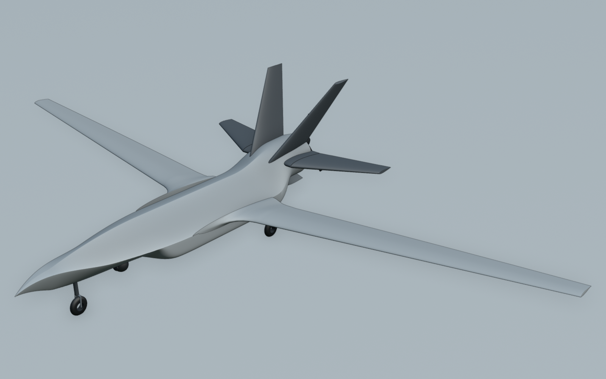
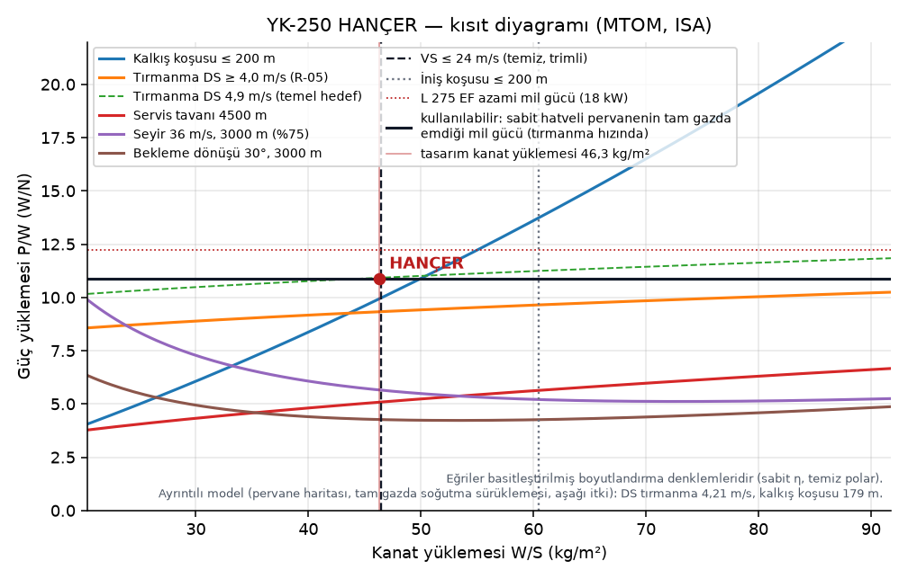
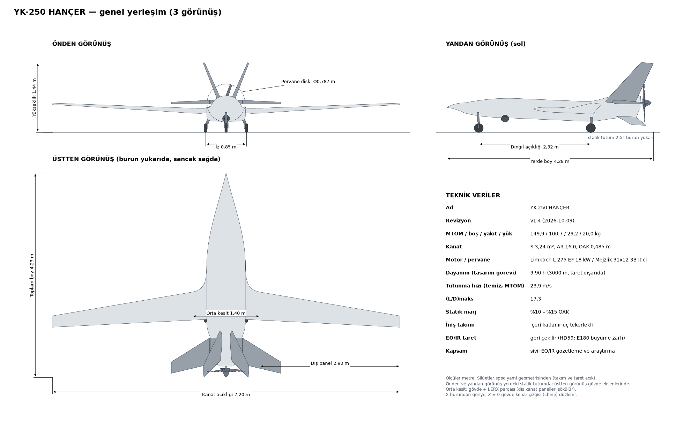
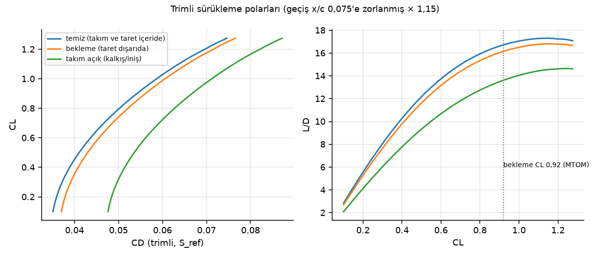
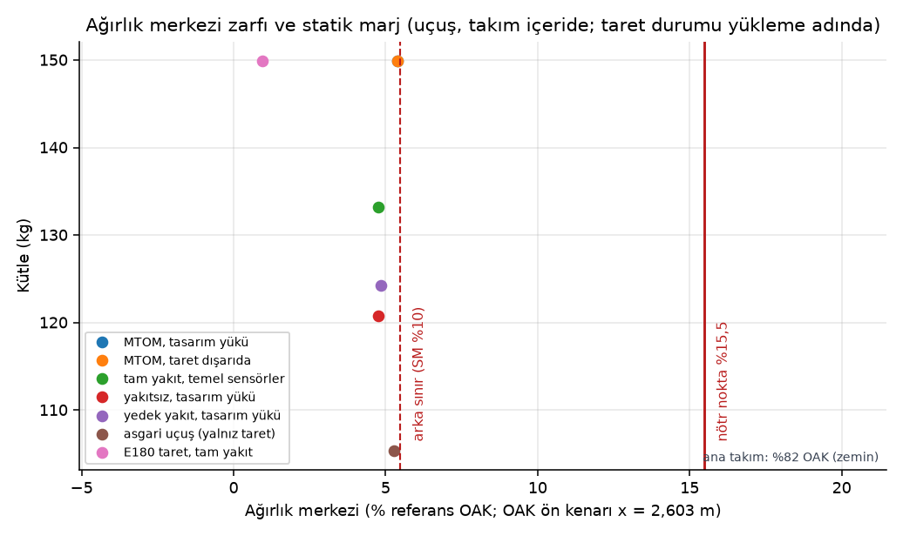
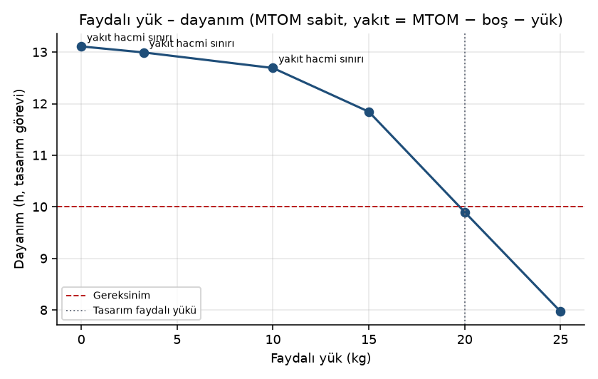
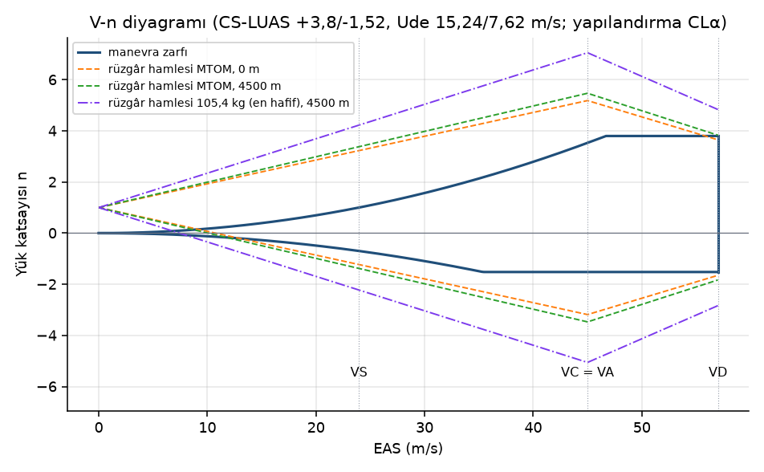
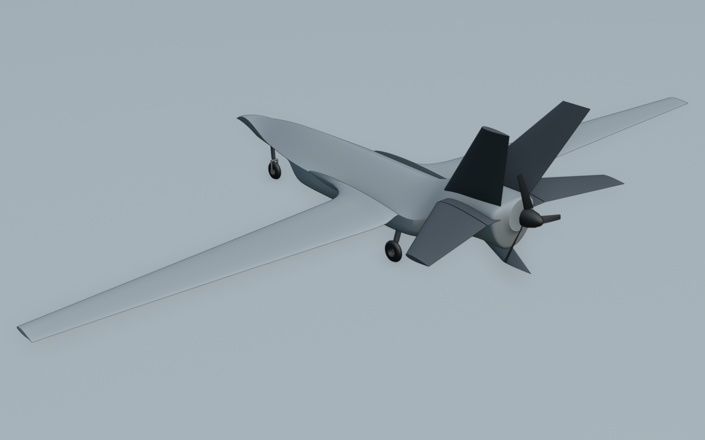
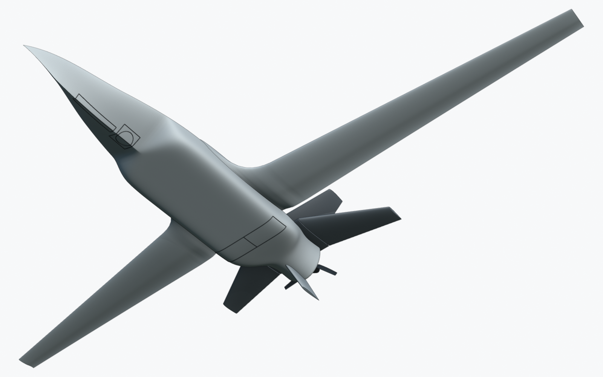
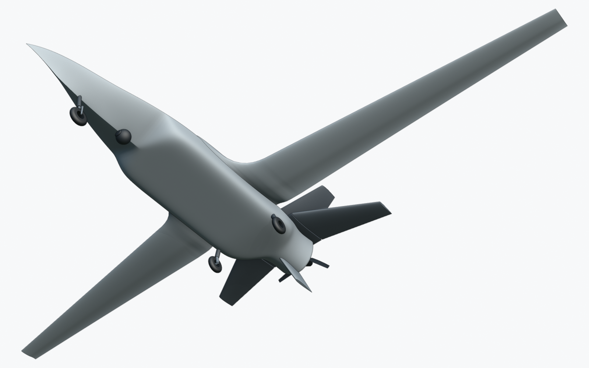

# YK-250 HANÇER — Konsept ve boyutlandırma raporu (faz 2, rev. v1.4)

**Tarih:** 9 Ekim 2026 · **Durum:** üçüncü bağımsız doğrulamanın 8 bulgusu (V2-01…V2-08) yeniden üretildi ve hepsi kodda, spec'te, geometride ve bu raporda işlendi. **R-02 (10 saat dayanım) bu revizyonda karşılanmıyor: 9,90 h.** `--check` 59 gereksinimin 57 tanesini karşılanmış buluyor. Karşılanmayan gereksinimler R-02, R-56; bu yüzden çıkış kodu 1'dir. v1.3'ün "10,06 h" sonucu, kullanıcının onaylamadığı bir R-52 gevşetmesine dayanıyordu (V2-01). v1.4'te bu gevşetme geri alındı: R-52'nin v1.2 yeteneği tasarımla (batarya tepe destek payı) yeniden sağlandı. Ayrıca küt kaporta tabanı nedeniyle itici kurulum katsayısı 0,95 yerine 0,93 alındı (V2-02). Bu iki dürüst düzeltme dayanımı 10 h'in 0,10 h altına indirdi. Hangi kararın R-02'yi kapatacağı §14'te sayılarla verilmiştir; karar kullanıcınındır.

> **Kapsam.** YK-250 HANÇER sivil bir EO/IR gözetleme ve araştırma İHA'sıdır. Faydalı yük yalnızca EO/IR taret ve
> görev donanımıdır. Silah, mühimmat, dış yük bağlantı noktası, pilon ya da yük bırakma mekanizması yoktur ve tasarım
> bunlar için yer ayırmaz. UCAV görünümü yalnızca biçim dilidir.



Bu raporun bütün sayıları tek kaynaktan gelir: [`spec.yaml`](../spec.yaml). Hesap [`analysis/sizing.py`](../analysis/sizing.py) içindedir. Çıktılar [`out/sizing.json`](../out/sizing.json), [`out/sizing.md`](../out/sizing.md) ve [`out/sizing_trades.json`](../out/sizing_trades.json) dosyalarına yazılır.

```
python3 -m ucav250.analysis.sizing --check        # yalnız doğrular: 59 gereksinim + spec'teki her türetilmiş değer + kapanışın yakınsaması (çıkış 1 = ihlal); dosya yazmaz
python3 -m ucav250.analysis.sizing --check --out /tmp/x   # aynı kontrol, çıktılar depo dışına
python3 -m ucav250.analysis.sizing                # çıktıları yazar: out/sizing.json, out/sizing.md, docs/fig/*.png
python3 -m ucav250.analysis.sizing --update-spec  # kapanış + değerlendirme; spec'teki türetilmiş değerleri ve LERX/eldiven kesit dosyalarını yeniden yazar
python3 -m ucav250.analysis.sizing --trades       # ödünleşimler + R-02 karar merdiveni -> out/sizing_trades.json
python3 -m ucav250.analysis.sizing --render       # Workbench görüntüleri (docs/fig, bpy gerekir)
```

---

## Özet

| Büyüklük | Değer |
|---|---|
| Konfigürasyon | Köşeli (chine) taşıyıcı gövde + LERX + yüksek açıklık oranlı NLF kanat; dışa eğik ikiz dikey kuyruk (dümenli), sabit kök parçalı ve kısa milli tamamen hareketli yatay kuyruk (stabilatör), ventral kanatçık/kuyruk tamponu. Açık itici pervane; içeri katlanır üç tekerlekli takım (contalı kapaklar); açıklık halkalı, geri çekilir EO/IR taret |
| MTOM / boş / yakıt / faydalı yük | **149,9 kg** / 100,7 kg / 29,2 kg / 20,0 kg |
| Kanat | açıklık **7,20 m**, alan 3,241 m² (referans yamuk), AR 16,0, λ 0,35, c/4 süpürme 8°, burulma 4°, OAK 0,485 m. Kesitler: dış kanatta NLF(1)-0416, LERX kökünde NACA 0016-34. Dış panel 2,90 m |
| Gövde | boy 4,00 m (pervane göbeğiyle 4,23 m), genişlik 0,80 m, yükseklik 0,46 m |
| Pervane | Mejzlik 31x12 3B, Ø 0,787 m, 5° aşağı itki hattı, statik uç Mach 0,712; kurulum katsayısı 0,93 (küt kaporta tabanı; tam gazda 15 m/s'ye kadar 1,0'dan rampa) |
| Elektrik | SG750 marş/jeneratörü (DC = 800 W × rpm/7500 × 0,94); tampon batarya 12S2P Li-ion (Molicel P45B, 1,98 kg, 389 Wh); E180 tepe yükü bekleme boyunca jeneratör + batarya tepe destek payıyla (R-52 1,029) |
| Dayanım (tasarım görevi, HD59) | **9,90 h ✘** (gereksinim ≥ 10 h; bekleme 7,59 h, 3000 m'de taret dışarıda). E180 büyüme görevi 9,70 h. Feribot menzili 1.096 km |
| Aerodinamik | CD0 0,0351 (temiz), 0,0370 (taret dışarıda); (L/D)maks 17,3 / 16,8 |
| Hızlar | VS 23,95 m/s (temiz, trimli, MTOM, en ön AM). Görev beklemesi 27,94 → 27,74 m/s EAS. Düz uçuş Vmaks 54,0 m/s. VNE 51,3 m/s ve VNO 45,0 m/s EAS; uçuş kontrol sistemi hızı 45 m/s'de sınırlar |
| Tırmanma / tavan | 4,21 m/s (DS), 2,38 m/s (3000 m); servis tavanı 7.105 m |
| Pist | kalkış koşusu 179 m (en ön AM'li MTOM durumu), görev sonu iniş koşusu 184 m, MTOM'da acil iniş 219,7 m |
| Kararlılık | statik marj %10,1–%14,5 OAK; Cnβ 0,0586 1/rad |
| Kumanda | stabilatör Volz DA 30 2,5:1, kanatçık ve dümen Volz DA 26 2:1, flap Volz DA 30 2:1; hepsi dört çubuk bağlantı, her sapmada menteşe momenti kontrolü (R-37, R-47, R-57…R-59) |
| Doğrulama | **57/59 gereksinim** (R-02, R-56 karşılanmıyor). `--check` 1211 türetilmiş değerin hepsini tolerans içinde buluyor, kapanış yakınsıyor; R-02 ve R-56 nedeniyle çıkış kodu 1 |

**Kısa sonuç.** v1.3'te R-02 10,06 h ile karşılanıyor görünüyordu. Üçüncü doğrulama bunun iki şeye dayandığını gösterdi:

* R-52'nin onaylanmamış gevşetmesi (+0,52 h). v1.3 raporu iki yerde "hiçbir gereksinim gevşetilmedi" diyordu; bu doğru değildi.
* Küt kaporta tabanının hemen arkasındaki itici pervane için kanıtlanmamış kurulum katsayısı (0,95).

v1.4'te ikisi de dürüstçe düzeltildi:

* R-52'nin v1.2 yeteneği geri geldi: E180 büyüme taretinin tepe yükü tasarım görevinin bütün beklemesi boyunca karşılanır. Bunu tasarım sağlar: 0,45 kg daha hafif bir Li-ion tampon batarya, jeneratör kaybı yedeğinin üstünde bir tepe destek payı taşır. Bekleme devri, jeneratörün E180 tepesinin en çok 18 W altında kalacağı biçimde sınırlanır.
* Küt taban korundu ve kurulum katsayısı aralığın alt ucuna, 0,93'e indirildi. Bu katsayı tam gaz noktalarına da uygulanır.

Diğer düzeltmeler şunlardır: alçalma motorun jeneratör devir tabanında integre edilir (V2-07); kalkışta gerçek yerden kesilme hesaplanır ve uçuş kontrol sisteminin stabilatör programı bir gereksinim olarak yazılır (V2-05); bütün kumanda yüzeylerinde menteşe momenti ve dört çubuk bağlantı kinematiği kontrol edilir (V2-03, V2-06); metin ve şekiller güncellendi (V2-08).

Bu dürüst modelle dayanım **9,90 h**'tir. R-02 için 0,10 h (≈ %1) eksik vardır. Eksik, gereksinim gevşetilerek kapatılmadı. Kapatma seçenekleri ve her birinin bedeli §14'tedir:

* R-52'nin v1.3 biçimini kullanıcı onaylarsa 10,03 h;
* pervane/gövde kurulum testi k_inst 0,95'i doğrularsa 10,02 h;
* ikisi birlikte 10,18 h.

---

## 1. Başlangıç: konvansiyonel referans kavramlar

Araştırma fazından sonra aynı motor, pervane, polar ve görev denklemleriyle üç konvansiyonel kavram çalışıldı ([`data/concepts/`](../data/concepts/)). Kullanıcı bunları "yine aynı tip" bularak reddetti; bu rapor onları yalnızca **ölçüt** olarak kullanır.

Hesap yöntemleri (pervane tablosu, BSFC, tripli polarlar, görev, kısıt diyagramı, yapı kütlesi) gözden geçirilmiş "Dayanım" çalışmasından alındı. `tests/test_ucav250_sizing.py`, itki modelinin o çalışmayla aynı denklemleri kullandığını sınar. Karşılaştırmada aynı pervane (32x18 2B), aynı elektrik yükü ve çalışmanın kendi kurulum katsayıları kullanılır.

| Kavram | Düzen | MTOM / boş / yakıt (kg) | CD0 | (L/D)maks | Dayanım | Neden reddedildi |
|---|---|---|---|---|---|---|
| Dayanım | omuz kanat AR 15, V-kuyruk, sabit kaportalı takım | 145 / 88,5 / 36,5 | 0,0331 | 16,9 | 14,77 h | klasik MALE görünümü |
| Kimlik | köşeli gövde, orta kanat, LERX tipi kök eldiveni | 145 / 90,5 / 34,5 | 0,0329 | 15,9 | 13,22 h | yine aynı tip |
| Üretim | çift kuyruk kirişi + H-kuyruk, üç parça kanat | 145 / 88,6 / 36,4 | 0,0375 | 14,7 | 13,19 h | yine aynı tip |

Ölçüt değerler `data/concepts/*/concept.yaml` dosyalarındandır. Bu kavramlar v1 yöntemiyle hesaplandı ve sonraki turlarda yeniden hesaplanmadı. Görev yakıtında hâlâ kapalı biçimli Breguet bağıntısını kullanırlar. HANÇER'e uygulanan düzeltmeler onlara da uygulansaydı dayanımları düşerdi: güce bağlı soğutma, kapanış taban sürüklemesi, birleşim sürüklemeleri, elektrik payları (v1.2); doğrudan yakıt akışı integrasyonu ve güç elektroniği verimi (v1.3); küt taban kurulum katsayısı, tam gazda kurulum kaybı ve integre alçalma (v1.4). Karşılaştırma bu yüzden farkın yönünü gösterir, büyüklüğünü göstermez.

## 2. Tasarım yönü çalışması ve kullanıcı seçimi

İkinci turda dört özgün yön aynı ön tahmin denklemleriyle karşılaştırıldı: [`data/concepts_v2/directions.yaml`](../data/concepts_v2/directions.yaml), [`compare.png`](../data/concepts_v2/compare.png). Her yönün ayrı bir sayfası vardır: [MANTA](../data/concepts_v2/manta/sheet.png), [OK](../data/concepts_v2/ok/sheet.png), [HALKA](../data/concepts_v2/halka/sheet.png), [HANÇER](../data/concepts_v2/hancer/sheet.png).

| Yön | Fikir | S (m²) | Açıklık (m) | AR | CD0 | (L/D)maks | Ön dayanım |
|---|---|---|---|---|---|---|---|
| MANTA | kanat-gövde birleşik (BWB) | 4,74 | 6,7 | 9,5 | 0,0255 | 15,8 | 17,0 h |
| OK | kanard-itici, ok kanat, kanat ucu dümenleri | 3,61 | 6,44 | 11,5 | 0,0285 | 15,9 | 15,3 h |
| HALKA | kutu / birleşik kanat | 4,77 | 5,5 | 6,3 | 0,029 | 13,1 | 13,9 h |
| **HANÇER** | köşeli taşıyıcı gövde + LERX + kanallı fan | 3,64 | 6,3 | 10,9 | 0,0312 | 14,8 | 14,3 h |

Ön tahminler kaba bir bileşen toplamı ve sabit 33 kg yakıtla yapılmıştı (±%20). **Kullanıcı D · HANÇER yönünü seçti** ve şu kararları verdi:

* Biçim dili korunacak: elmas benzeri kesitli, keskin kenar çizgili taşıyıcı gövde; kenar çizgileri LERX'e akar ve yüksek açıklık oranlı kanada kaynaşır; dışa eğik ikiz dikey kuyruk; tamamen hareketli yatay kuyruk.
* **Kanal (duct) reddedildi.** Pervane açık iticidir; dikey kuyruklar ve ventral kanatçık/kuyruk tamponu onu kısmen korur (§9).
* **İniş takımı içeri katlanır.** Kütlesi ve hacmi boyutlandırmada sayılır.
* **EO/IR taret gövde altındaki bölmeden indirilir.** Bölme, E180 büyüme zarfına göre boyutlanır.

Ayrıntılı boyutlandırmanın dayanımı ön tahminden belirgin biçimde düşüktür (14,3 h → 9,90 h). Fark şu kaynaklardan gelir:

1. Boş kütle kalem kalem toplandı. Ön tahmin 92 kg kabul etmişti; sonuç 100,7 kg.
2. Bekleme taret dışarıda, 1,2 VS tabanında ve tripli polarlarla uçulur.
3. Görev 2 x 100 km geçiş ve %10 yedek içerir.
4. Doğrulamanın istediği sürükleme kalemleri ve gerçek kalkış fiziği eklendi.
5. Yakıt, her noktadaki yakıt akışının integraliyle bulunur ve jeneratör çıkışına dönüştürme kaybı uygulanır (v1.3).
6. E180 tepe yükü bütün bekleme boyunca karşılanır (R-52) ve küt taban nedeniyle itici kurulum katsayısı 0,93'tür (v1.4).

## 3. Doğrulama bulguları ve düzeltmeler

### 3.1 Üçüncü tur (V2-01…V2-08, v1.4)

Üçüncü doğrulamanın kararı "henüz hazır değil" idi. Doğrulayıcı F1–F19 ve V1 düzeltmelerinin önemli sayılarını kendi bağımsız betikleriyle yeniden üretmişti. Kalan sorunlar şunlardı: R-02'nin bir gereksinim gevşetmesine dayanması, küt arka kapanış, dümen eyleyicisi ve bazı modelleme ayrıntıları. Her bulgu önce yeniden üretildi, sonra düzeltildi. Bu turda hiçbir gereksinim, kontrol ya da test gevşetilmedi. v1.3'ün R-52 gevşetmesi geri alındı. Yeni gereksinimler R-57…R-59 eklendi.

| No | Önem | Bulgu | Yeniden üretim | Düzeltme | Sonuç (v1.4) |
|---|---|---|---|---|---|
| V2-01 | büyük | R-02 yalnız R-52 gevşetildiği için karşılanıyor; doc 02 iki yerde "gevşetilmedi" diyor | Doğru. v1.3 modelinde tasarım görevi E180 devir tabanıyla uçulursa 9,55 h (gevşetmenin katkısı +0,52 h). v1.3 raporunun §3.1 ve §14'teki iki cümlesi gevşetmeyle çelişiyordu | Kullanıcı R-52 değişikliğini onaylamadı; onay kaydedilmedi. R-52 v1.2 yeteneğine döndü: E180 tepe yükü tasarım görevinin (ve E180 görevinin) bütün beklemesi boyunca karşılanır. Bunu tasarım sağlar: LiFePO4 14S2P (2,43 kg, 231 Wh) yerine 12S2P Li-ion Molicel P45B (1,98 kg, 389 Wh; components.yaml). Kullanılabilir 311,2 Wh'den jeneratör kaybı/marş yedeği 186,7 Wh (400 W × 28 dk) ayrılır; kalan 124,5 Wh tepe destek payıdır. Görev çevrimi kredisi yoktur: tepe yükün bütün bekleme sürdüğü varsayılır. Bekleme devri alt sınırı 4.737 rpm'dir; jeneratör E180 tepesinin en çok 18 W altında kalır. İki cümle düzeltildi (§3.2, §14) | R-52 1,029 ✔ (tasarım görevinde 121,1 Wh, E180 görevinde 94,0 Wh). R-02 9,90 h ✘ (§14) |
| V2-02 | büyük | Arka kapanış küt bir "kutu"; açık iticinin önünde 0,112 m² ayrılmış taban; k_inst 0,95 kanıtsız | Doğru: x = 3,91 m'den sonra 59° eğim, taban 0,112 m², görüntüde düz bir halka. Kanıtsız k_inst ile R-02 payı 0,064 h'ti | Gerçek bir sivrilen kuyruk konisi denendi. 15° Hoerner ayrılma ölçütüyle tabanı sıfırlamak için kapanış 0,5 m'ye, pervane 0,45 m geriye gider. Bu durumda CD0 −0,0020 olur, ama boş kütle +1,0 kg artar (kabuk +0,9 kg), R-21/R-26/R-33 bozulur ve mil uzatması hariç dayanım 0,20 h düşer. 0,25–0,30 m'lik bir koni ise 15° ölçütüyle tabanı yalnız %10–20 küçültür. Bu yüzden küt taban korundu. Kurulum katsayısı küt taban değeri olarak aralığın alt ucuna, 0,93'e indirildi (test bekliyor) ve tam gaz noktalarına da uygulanır (V2-04). R-02 duyarlılığı raporlandı. Pervane iz uyarımı açık konulara eklendi | taban 0,112 m² (CD 0,0022); k_inst 0,93; 0,95 olsaydı +0,12 h (§14). Görsel kusur kabul edilen bir ödünleşimdir ve açıkça yazıldı (§6.3) |
| V2-03 | büyük | Dümen eyleyicisinin (DA 26, doğrudan, ±25°) menteşe momenti kontrolü yok; projenin anma kuralını bozuyor | Doğru. Dümen VA'da tam sapmada 6,5 N·m'dir (bütün panel açıklığı, \|Ch\| = 0,6 \|δ\| + 0,09). DA 26 doğrudan bağlantıyla 2,7 N·m verir; 1,1 × H'nin altındadır | Kanatçık, flap, dümen ve stabilatör için aynı biçimde kontrol (`control_hinge_moments`): menteşe momenti (components.yaml tarama katsayıları), dört çubuk bağlantının tam kinematiği, anma (≥ 1,1 H) ve tepe (≥ 1,25 H) torku her sapmada, hareket sınırı ve yüzey hızı. Dümen DA 26 2:1 (uzatılmış hareket seçeneği ±85°; servo ±58°), kanatçık DA 26 2:1, flap DA 30 2:1 (nötr flap açısı 20°). Yeni gereksinimler: R-57 (anma), R-58 (tepe), R-59 (hareket) | R-57 1,235, R-58 1,83, R-59 6,7° ✔; eyleyici kütlesi değişmedi (§9) |
| V2-04 | küçük | Tam gaz noktalarında (kalkış, tırmanma, tavan) kurulum katsayısı yok | Doğru (`Prop.wot` yalnız k_wot uyguluyordu) | Tam gaz itkisi × [1 − (1 − k_inst) min(V/15 m/s, 1)]: statikte 1,0, 15 m/s'den sonra k_inst. Endurance çalışmasının yeniden üretim testi kendi katsayılarıyla sürüyor | tırmanma 4,68 → 4,21 m/s (R-05 ✔), tavan 7.555 → 7.105 m; kalkış koşusu 179 m (yeni kalkış modeliyle, R-06 ✔) |
| V2-05 | küçük | Kalkış dizisi fiziksel değil: V_R düz kalkış hızının üstünde, yerden kesilme tutumu zemin tutumunun altında | Doğru: V_düz 24,01 < V_R 24,8 m/s, θ_LOF 1,79° < 2,5° | Yer koşusu, gerçek tutumda L ≥ W + T sin ε + stabilatör trim kuvveti olduğu anda biter. Uçuş kontrol sisteminin stabilatör programı bir gereksinimdir: ana tekerleri yüklü tutan en küçük aşağı kuvvet, V_R'de tam burun yukarı; dönüş sırasında güç-açık trim; 1,1 VS_TO altında yerden kesilme yok. Dönüş hızı, 1,1 VS_TO trim tutumuna (R-16 tutumu) 1 s'de varacak biçimde seçilir | V_R 24,8, V_LOF 25,1 m/s, θ_LOF 2,8° ≥ zemin tutumu 2,5° (dönüş 0,24 s); aşağı kuvvet 23,6 m/s'den başlar (§7) |
| V2-06 | küçük | Stabilatörün "3:1 bellcrank" hareketi ve hızı doğrusal bir dişli oranı gibi hesaplanmış | Doğru: ±28,3° 3:1 dört çubukla elde edilemez. Simetrik 3:1 dört çubuk uzun itme çubuğu sınırında en çok asin(1/3) = 19,5° verir. 100 mm'lik itme çubuğuyla bir yönde 20,5°'ye çıkar, ama yalnız kilitlenme noktasında (servo ≈ −82°, tork oranı ≈ 12); −20° kullanılabilir bir çalışma noktası değildir | Dört çubuk bağlantının tam kinematiği (`FourBar`). Stabilatör 2,5:1 simetrik dört çubuk: −20/+15° için servo −58°/+40° (DA 30 ±85°). Tork oranı 2,50–4,18. Menteşe momenti her sapmada CN_maks değeriyle alınır (ihtiyatlı). Hız nötrde 60°/s, −20°'de 36°/s | R-37 1,80, R-47 1,13 ✔; R-59 ✔ |
| V2-07 | küçük | Alçalma eski 0,998 kesriyle hesaplanıyor; jeneratör devir tabanını yok sayıyor | Doğru (0,249 kg / 1200 s) | Alçalma da noktadan noktaya integre edilir. Motor, jeneratörün sürekli yükü taşıdığı devirdedir (3.521 rpm). Pervane tablosu ve T − D = −W sin γ kullanılır; alçalma hızı 2,5 m/s'dir, uçuş hızı çözülür | 33,6–35,0 m/s TAS, 20,0 dk, 0,236 kg (0,64–0,79 kg/h) |
| V2-08 | küçük | Bayat metin ve şekil ayrıntıları | Doğru (a–e) | (a) `configuration.reasons_tr` LERX tepesi 1,80 m. (b) VS hedefi iki ondalıkla. (c) AM zarfı başlığı taret durumunu yükleme adına bırakır. (d) Polarlar her yapılandırmanın trimli CLmax'ında kesilir; CL_endurance ve L/D maksimumu CLmax'la sınırlanır. (e) İçeri katlanmış durum alttan, contalı kapak ve açıklık halkası çizgileriyle yeniden çizildi (§10) | ✔ |

### 3.2 İkinci tur (V1-01…V1-11, v1.3)

İkinci doğrulamanın kararı da "henüz hazır değil" idi: v1.2'nin R-02'yi karşıladığı iddiası iki bağımsız model hatası yüzünden tutmuyordu. Her bulgu yeniden üretildi ve düzeltildi. **Düzeltme notu (v1.4, V2-01):** v1.3 raporu bu bölümde "Hiçbir gereksinim, kontrol ya da test gevşetilmedi" diyordu. Bu doğru değildi. v1.3'te R-52 gevşetildi: tasarım görevinde E180 tepe yükü artık istenmiyordu. R-02'nin 10,06 h'lik sonucu bu gevşetmeye dayanıyordu; gevşetmesiz değer 9,55 h idi. v1.4'te gevşetme geri alındı (§3.1, §12).

| No | Önem | Bulgu | Düzeltme | v1.4 durumu |
|---|---|---|---|---|
| V1-01 | kritik | Görev yakıtı, aşağı itkinin kaldırma bileşenini içeren CL/CD ile Breguet bağıntısından hesaplanıyor; yakıt ~%1 az çıkıyor | Kütle değişimi dW/dt = −ṁ(nokta) doğrudan zamanla integre edilir; itki T = D/cos ε. v1.4'te alçalma da integre edilir (V2-07) | ✔ (regresyon testleri) |
| V1-02 | kritik | SG750'nin AC anma gücü DC bara gücü sayılıyor | DC çıkış = 800 W × rpm/7500 × 0,94. v1.3'te R-52 yeniden yapılandırılmıştı (gevşetme); v1.4'te geri alındı (V2-01) | R-32 1,273, R-52 1,029 ✔ |
| V1-03 | büyük | Kütle bütçesi R-02'yi kapatan boş kütleden fazla | Bütçe tek yönlü bir tavandır; R-56 | R-56 −0,361 kg ✘ (R-02 karşılanmadığından, §14) |
| V1-04 | büyük | Gömülü dikey kökü motor silindirleri ve mille çakışıyor | Kuyruk gövdeleri dış yüzeyde budanır; 20 mm'lik bağlantı bandı; R-53 | ✔ |
| V1-05 | büyük | Menteşe momentinde panel CN_maks yerine trim sabiti | Panel kesitinin CN_maks değeri (1,390); v1.4'te bağlantı dört çubuk kinematiğiyle (V2-06) | H_VA 17,73 N·m; R-37 1,80, R-47 1,13 ✔ |
| V1-06 | küçük | LERX–eldiven geçişinde görünür kırık | NACA 0016-34 → NLF(1)-0416 karışımı, aile değişmez | ✔ |
| V1-07 | küçük | Açıklık halkası V yüzeyinde değil | Halka gerçek V yüzeyini izler | ✔ |
| V1-08 | küçük | MTOM 3000 m noktası "bekleme başlangıcı" diye etiketli | Görev beklemesinin başlangıç/bitiş noktaları ayrıca raporlanır | ✔ |
| V1-09 | küçük | VNO/VNE ve hız koruması yok | CS-LUAS 1505; R-54 | ✔ |
| V1-10 | küçük | MTOM'da iniş için gereksinim yok | R-55 | 219,7 m ✔ |
| V1-11 | küçük | Kapanış iki değer arasında gidip geliyor | Yakınsama ölçütü, tek yönlü kuyruk kuralları | ✔ |

### 3.3 Birinci tur (F1–F19)

Birinci doğrulama ilk boyutlandırmayı "henüz hazır değil" olarak değerlendirmişti. On dokuz bulgunun hepsi v1.1/v1.2'de işlendi ve R-33…R-52 eklendi. "Sonuç" sütunu v1.4 tasarım noktasındaki değerdir.

| No | Bulgu (özet) | Düzeltme | Sonuç (v1.4) |
|---|---|---|---|
| F1 | Kalkış koşusu R-06'yı bozuyor; "düz kalkış" fiziksel değil | V_R moment dengesinden; yer koşusu zamanda integre; v1.4'te gerçek yerden kesilme ve stabilatör programı (V2-05) | koşu 179 m ≤ 200 ✔; V_R 24,8, V_LOF 25,1 m/s; ana tekerde 116 N ✔ |
| F2 | Stabilatör mili panel AM'sinin önünde; menteşe momentleri eyleyicinin ~5 katı | Mil VLM AM bandının ön ucunda; DA 30 + 2,5:1 dört çubuk (v1.4) | R-37 1,80, R-47 1,13 ✔ |
| F3 | Stabilatör kökü gövdeye giriyor | Sabit kök parçası; R-38, R-39 | boşluk 8,0 mm, gövdeye pay 23,2 mm ✔ |
| F4 | Dikey kökü gövdeden havada | Kökler gövdeye kapanır, dış yüzeyde budanır (R-40, R-53) | ✔ |
| F5 | Stabilatör kuralı η_t'yi ve tam gaz itki momentini atlıyor | Yerel stabilatör CL'si; tam gazda yerden kesilme ve pas geçme (R-36) | 0,698 ≤ 0,72 ✔; stabilatör 0,622 m² |
| F6 | Pervane yer açıklığı yalnız statik tutumda | R-16 statik/yerden kesilme/teker koyma; R-33, R-34 | R-16 0,184 m ✔; radyal 32,9 mm, boyuna 29,3 mm ✔ |
| F7 | Kök eldiveninde kiriş derinliği yetersiz | Eldiven kalınlığı gerekli derinlikten (R-43, R-44) | ana 90,8 mm, arka 41,1 mm ✔ |
| F8 | LERX/kenar çizgisi geçişinde basamak | Kenar çizgisi kanat düzleminde tutulur (R-45) | 0,0 mm ✔ |
| F9 | Rüzgâr hamlesi yükü yanlış eğimle | Yapılandırma CLα'sı, kütle × irtifa matrisi | kanat tasarım n'si 5,47; en hafif durumda +7,06 g |
| F10 | Eğik dikeyler pervaneyi yandan korumuyor | Koruma eğik disk düzleminde ölçülür (R-41/42, R-48/49, R-51) | yan bölgeler açık; **yan koruma iddia edilmez** (§9) |
| F11 | Flap panel bağlantısının üzerinden geçiyor | Her dış panelde bir flap (R-46) | ✔ |
| F12 | Bu düzene özgü sürükleme kalemleri yok | Taban, taret bölmesi, birleşimler, kapaklar, soğutma, itici kurulumu (v1.4: küt taban için 0,93, tam gazda da) | CD0 0,0351; dayanım 9,90 h ✘ (§14) |
| F13 | Taret görüş testi yalnız gövdeye bakıyor | Işın izleme; engeller kanatlar, kuyruklar, ventral, pervane diski | R-25 −3° ✔ |
| F14 | Bayat sayılar | Rapor sayıları sizing.json'dan; TestDoc02 | ✔ |
| F15 | Spec şemadan sapıyor | Kuyruk kumanda blokları, aero anahtarları | ✔ |
| F16 | R-32 jeneratör payı yalnız 303 W'la | Sürekli yük E180 + araştırma payıyla (R-32); tepe yük R-52'de (v1.4: batarya destekli) | R-32 1,273, R-52 1,029 ✔ |
| F17 | Kaba UIUC naca0010.dat | Analitik NACA 0010 | ✔ |
| F18 | `--check` ve testler depoya yazıyor | `--check` salt okunur | ✔ |
| F19 | Paraşüt bağlantı kaleminin adı | `parachute_attach_fitting` | ✔ |

## 4. Gereksinimler

Gereksinimler `spec.yaml → requirements` altındadır. Her birinin ölçütü `out/sizing.json → metrics` içindeki bir anahtardır ve kaynağı dosyada yazılıdır. R-33…R-46 birinci doğrulamadan, R-47…R-52 v1.2'den, R-53…R-56 ikinci, R-57…R-59 üçüncü doğrulamadan gelir.

| No | Gereksinim | Hedef | Sonuç | |
|---|---|---|---|---|
| R-01 | Azami kalkış kütlesi 150 kg'ın altında (SHT-İHA M2 sınıfı, 149,9 kg tavan) | ≤ 149,9 kg | 149,9 kg | ✔ |
| R-02 | Tasarım görevi dayanımı ≥ 10 h (tırmanma, 2 x 100 km geçiş, 3000 m'de taret dışarıda bekleme, alçalma; %10 yedek ayrıca) | ≥ 10,00 h | 9,90 h | ✘ |
| R-03 | Tasarım faydalı yükü ≥ 20 kg (EO/IR taret + görev bilgisayarı + araştırma yükü payı) | ≥ 20,0 kg | 20,0 kg | ✔ |
| R-04 | Servis tavanı (0,5 m/s) ≥ 4500 m, MTOM | ≥ 4.500 m | 7.105 m | ✔ |
| R-05 | Deniz seviyesi tırmanma hızı ≥ 4,0 m/s, MTOM, tam gaz (4,9 m/s karşılaştırma hedefi pervane sınırlı; bkz. pervane ödünleşimi) | ≥ 4,0 m/s | 4,2 m/s | ✔ |
| R-06 | Kalkış yer koşusu ≤ 200 m (MTOM, ISA deniz seviyesi; 300 m pist / 1,5) | ≤ 200,0 m | 179,4 m | ✔ |
| R-07 | İniş yer koşusu ≤ 200 m (görev sonu kütlesi, ISA deniz seviyesi) | ≤ 200,0 m | 184,3 m | ✔ |
| R-08 | Tutunma hızı ≤ 24 m/s (temiz, trimli, MTOM, deniz seviyesi) | ≤ 24,0 m/s | 23,9 m/s | ✔ |
| R-09 | Statik marj ≥ %10 OAK (tüm yükleme durumları, öndeki nötr nokta) | ≥ 0,100 | 0,101 | ✔ |
| R-10 | Statik marj ≤ %30 OAK (tüm yükleme durumları) | ≤ 0,300 | 0,145 | ✔ |
| R-11 | Yön kararlılığı Cnβ ≥ 0,057 1/rad (0,001 1/derece) | ≥ 0,057 1/rad | 0,059 1/rad | ✔ |
| R-12 | Geri devrilme açısı ≥ 15° (en arka zemin ağırlık merkezi) | ≥ 15,0 deg | 38,3 deg | ✔ |
| R-13 | Yana devrilme açısı ≤ 55° | ≤ 55,0 deg | 54,0 deg | ✔ |
| R-14 | Burun tekerleği yükü ≥ %8 (en arka ağırlık merkezi) | ≥ 0,080 | 0,161 | ✔ |
| R-15 | Burun tekerleği yükü ≤ %20 (en ön ağırlık merkezi) | ≤ 0,200 | 0,171 | ✔ |
| R-16 | Pervane yer açıklığı ≥ 0,18 m: statik tutum, kalkış (yerden kesilme) tutumu ve teker koyma tutumunun en kritiği (MTOM; kalkışta amortisör statik çökmede, teker koymada yüksüz) | ≥ 0,1800 m | 0,1836 m | ✔ |
| R-17 | Sönük ana lastik + dibe oturmuş amortisörde pozitif pervane açıklığı (≥ 0,02 m) | ≥ 0,0200 m | 0,0596 m | ✔ |
| R-18 | Kuyruk tamponu pervaneden önce yere değer (açı farkı ≥ 1°) | ≥ 1,000 deg | 4,122 deg | ✔ |
| R-19 | Kalkış ve flare açısında kuyruk tamponu yere değmez (pay ≥ 2°) | ≥ 2,0 deg | 2,3 deg | ✔ |
| R-20 | Teker koyma açısı ≥ 3° (ana tekerler önce değer) | ≥ 3,0 deg | 4,9 deg | ✔ |
| R-21 | Ana iniş takımı gövde içine toplanır (teker, bacak, mafsal; kanat kutusu ile çakışma yok) | = 1,000 | 1,000 | ✔ |
| R-22 | Burun iniş takımı omurga yuvasına toplanır | = 1,000 | 1,000 | ✔ |
| R-23 | Taret içeride kapakların üstünde kalır (gömülü) | ≥ 0,0000 m | 0,0265 m | ✔ |
| R-24 | E180 büyüme zarfı (0,18 x 0,23 m) taret bölmesine sığar | = 1,000 | 1,000 | ✔ |
| R-25 | Taret dışarıda: nadirden en az −5° yükselime kadar her azimutta engelsiz görüş | ≥ −5,0 deg | −3,0 deg | ✔ |
| R-26 | Yerleşim bölgeleri gövdeye sığar (hata sayısı 0) | = 0,000 | 0,000 | ✔ |
| R-27 | Yerleşim bölgeleri ve yakıt hücreleri çakışmaz (çakışma sayısı 0) | = 0,000 | 0,000 | ✔ |
| R-28 | Yakıt hacmi gereken hacmi karşılar (pay ≥ 0) | ≥ 0,000 | 0,232 | ✔ |
| R-29 | Taşıma: çıkarılabilir dış kanat paneli ≤ 3,4 m | ≤ 3,4 m | 2,9 m | ✔ |
| R-30 | Gövde + LERX orta kesiti ≤ 2,0 m (tek parça taşıma) | ≤ 2,0 m | 1,4 m | ✔ |
| R-31 | Statik pervane uç Mach sayısı ≤ 0,75 | ≤ 0,750 | 0,712 | ✔ |
| R-32 | Jeneratör çıkışı, beklemenin en düşük devrinde, en büyük sürekli elektrik yükünün ≥ 1,2 katı (E180 büyüme tareti ve araştırma yükü güç payı dahil) | ≥ 1,200 | 1,273 | ✔ |
| R-33 | Pervane uçları ile yapı arasında radyal açıklık ≥ 0,026 m (CS-VLA 925(c)(1)) | ≥ 0,0260 m | 0,0329 m | ✔ |
| R-34 | Pervane palaları ile sabit yapı (kaporta, kuyruk yüzeyleri) arasında boyuna açıklık ≥ 0,013 m (CS-VLA 925(c)(2)) | ≥ 0,0130 m | 0,0293 m | ✔ |
| R-35 | Kalkışta dönme yetkisi: stabilatörler burun tekerini ana tekerler hâlâ yüklüyken kaldırır (tekerlek arabası etkisi yok; bütün MTOM yükleme durumları) | > 0,000 N | 116,042 N | ✔ |
| R-36 | Stabilatör trim gereksinimi (yerel CL, η_t dahil; temiz/kalkış CLmax ve tam güçte yerden kesilme/pas geçme, en ön ağırlık merkezleri; yerden kesilmede takım açık) ≤ 0,8 × stabilatör CLmax | ≤ 0,720 | 0,698 | ✔ |
| R-37 | Stabilatör eyleyicisi: tepe tork × dört çubuk bağlantısının o sapmadaki tork oranı ≥ 1,25 × en büyük menteşe momenti, bütün sapma aralığında (CS-LUAS.395(a)(1)) | ≥ 1,000 | 1,804 | ✔ |
| R-38 | Stabilatör kök boşluğu ≤ 10 mm (sabit kök parçasına karşı, bütün sapma aralığında sabit) | ≤ 0,0100 m | 0,0080 m | ✔ |
| R-39 | Stabilatör kökü bütün sapma aralığında gövdeye girmez (gövde yarı genişliği ile pay ≥ 5 mm) | ≥ 0,0050 m | 0,0232 m | ✔ |
| R-40 | Dikey kuyruk ve ventral kanatçık kökleri bütün kök veteri boyunca gövdeye gömülü (boşluk ≤ 0) | ≤ 0,0000 m | −0,0150 m | ✔ |
| R-41 | Pervane koruması (üst-yan): eğik dikeylerin firar kenarı, itki hattı açısıyla eğik pervane disk düzlemini uç çemberinin ≥ 26 mm dışında keser | ≥ 0,0260 m | 0,0750 m | ✔ |
| R-42 | Pervane koruması (üst-yan): eğik dikeylerin firar kenarı disk düzlemini uç çemberinin ≤ 80 mm dışında keser (diski yakından çevreler) | ≤ 0,0800 m | 0,0750 m | ✔ |
| R-43 | Ana kiriş hattında OML derinliği (gövde yanından dış panel bağlantısına) ≥ birleşim kalınlığının %95'i | ≥ 0,950 | 0,977 | ✔ |
| R-44 | Arka kiriş hattında OML derinliği (gövde yanından dış panel bağlantısına) ≥ dış panel bağlantı kesitinin arka kiriş derinliğinin %95'i (arka kiriş kademesiz devam eder) | ≥ 0,950 | 1,002 | ✔ |
| R-45 | Kanat kökü ile köşe çizgisi arasında basamak ≤ 10 mm (LERX/köşe çizgisi geçişi) | ≤ 0,0100 m | 0,0000 m | ✔ |
| R-46 | Flap, sökülebilir dış panelin üzerinde kalır (iç ucu panel bağlantısının dışında) | ≥ 0,0000 m | 0,0301 m | ✔ |
| R-47 | Stabilatör eyleyicisi: anma (sürekli) torku × dört çubuk bağlantısının o sapmadaki tork oranı en büyük menteşe momentinin ≥ 1,1 katı, bütün sapma aralığında (mil, girdap kafesi AM bandının ön ucunda) | ≥ 1,100 | 1,128 | ✔ |
| R-48 | Pervane koruması (alt): ventral kanatçığın firar kenarı eğik disk düzlemini uç çemberinin ≥ 26 mm dışında keser; değiştirilebilir tampon kızağı diskin altındadır | ≥ 0,0260 m | 0,0521 m | ✔ |
| R-49 | Pervane koruması (alt): ventral kanatçığın firar kenarı disk düzlemini uç çemberinin ≤ 120 mm dışında keser (alt bölgeyi yakından korur) | ≤ 0,1200 m | 0,0521 m | ✔ |
| R-50 | Pervane düzlemi kaporta firar kenarının ≥ 0,10 D gerisinde (itici pervane gövde izinde; kaporta tabanı küt olduğu için kurulum katsayısı k_inst aralığın alt ucunda, 0,93 alınır) | ≥ 0,100 | 0,102 | ✔ |
| R-51 | Yanal koruma: uçak kanat ucu yere değene kadar yatarsa pervane ucu yerden ≥ 0,05 m yukarıda kalır (kanat ucu önce değer) | ≥ 0,0500 m | 0,3195 m | ✔ |
| R-52 | E180 büyüme taretinin tepe elektrik yükü (+ temel yük + araştırma yükü payı) tasarım görevinin beklemesi boyunca kesintisiz karşılanır (v1.2 yeteneği): jeneratörün DC çıkışı (güç elektroniği verimi dahil) ile tampon bataryanın tepe destek payı birlikte; tepe yükün bütün bekleme boyunca sürdüğü varsayılır (görev çevrimi kredisi yok); tepe destek payı = kullanılabilir batarya enerjisi − jeneratör kaybı/marş yedeği (400 W × 28 dk); E180 büyüme görevi de aynı kuralla kontrol edilir | ≥ 1,000 | 1,029 | ✔ |
| R-53 | Kuyruk kök yapıları (gövde dış yüzeyinde budanmış dikey, sabit stabilatör kök parçası ve ventral kökleri: kök kaburgası + bağlantı bandı) ve stabilatör milleri iç yerleşim bölgeleriyle ve birbirleriyle çakışmaz (çakışma sayısı 0) | = 0,000 | 0,000 | ✔ |
| R-54 | İşletme sınırları (CS-LUAS 1505): VNE = 0,9 VD, VNO = min(VC; 0,89 VNE); uçuş kontrol sisteminin zarf koruması hızı VNO'nun altında tutar (sınır hız ≤ VNO; tam güçte düz uçuş hızı VNE'yi aşar) | ≥ 0,000 m/s | 0,000 m/s | ✔ |
| R-55 | MTOM'da acil/geri dönüş inişi (flapsız, ISA deniz seviyesi) yer koşusu ≤ 300 m pist uzunluğu (anormal durum: 1,5 alan katsayısı uygulanmaz; normal iniş R-07 ve en büyük iniş kütlesi işletme sınırıdır) | ≤ 300,0 m | 219,7 m | ✔ |
| R-56 | Boş kütle bütçesi (mass.budget, grup tavanları) R-02'yi tam karşılayan boş kütleyi, belirtilen yedek payı düşüldükten sonra aşmaz (pay ≥ 0); her grubun tahmini kendi tavanının altında kalır | ≥ 0,000 kg | −0,361 kg | ✘ |
| R-57 | Kanatçık, flap ve dümen eyleyicileri: anma torku × dört çubuk bağlantısının o sapmadaki tork oranı ≥ 1,1 × menteşe momenti, bütün sapma aralığında (kanatçık ve dümen VA'da tam sapma ve VD'de 1/3 sapma, flap VF'de; R-47 kuralı) | ≥ 1,100 | 1,235 | ✔ |
| R-58 | Kanatçık, flap ve dümen eyleyicileri: tepe tork × dört çubuk bağlantısının o sapmadaki tork oranı ≥ 1,25 × menteşe momenti, bütün sapma aralığında (CS-LUAS.395(a)(1)) | ≥ 1,000 | 1,830 | ✔ |
| R-59 | Bütün kumanda yüzeylerinde (kanatçık, flap, dümen, stabilatör) dört çubuk bağlantısı istenen sapma aralığına eyleyicinin hareket sınırı içinde ulaşır (pay ≥ 0°) | ≥ 0,000 deg | 6,704 deg | ✔ |

**v1.4'te değişen ve eklenen gereksinimler.**

* **R-52 geri getirildi.** v1.3'teki "yalnız takılı taretin tepe yükü" biçimi, kullanıcının onaylamadığı bir gevşetmeydi ve geri alındı. R-52 yine v1.2'deki yeteneği ister: E180 tepe yükü tasarım görevinin bütün beklemesi boyunca karşılanır. Ölçüt artık enerjidir. Tepe yük bütün bekleme boyunca sürseydi bataryadan çekilecek enerji, bataryanın tepe destek payıyla karşılaştırılır. Bu, v1.2'nin "jeneratör tek başına" ölçütünden gevşek değildir: yük aynıdır, kaynağa boyutlandırılmış ve kütlesi sayılmış bir batarya payı eklenir. Doğrulayıcının önerdiği tasarım yolu budur.
* **R-37 ve R-47** dört çubuk bağlantının her sapmadaki tork oranıyla değerlendirilir (V2-06).
* **Yeni:** R-57 (kanatçık, flap, dümen anma torku), R-58 (tepe torku, CS-LUAS.395), R-59 (bütün yüzeylerde bağlantı hareketi).
* R-50'nin metni küt tabanı ve 0,93 kurulum katsayısını söyler; sınır değeri değişmedi.

**R-44 notu.** Arka kiriş derinliği, gövde yanından bağlantıya kadar, dış panel bağlantı kesitinin kendi arka kiriş derinliğinin %95'inden az olamaz. NLF(1)-0416'nın %72 veterdeki derinliği kalınlığın ancak 0,44'üdür; kanat yapısı bu yüzden gerçek derinlikle hesaplanır.

## 5. Boyutlandırma yöntemi

Tasarım, sabit MTOM ile bir **kapanış döngüsüdür** (`sizing.design_closure`). Her yinelemede aşağıdaki adımlar yapılır.

1. **Geometri** girdilerden üretilir.
   * Gövde, kontrol çizgilerinden (Hermite ogive, yumuşak geçişler) kurulan yoğun `oml.Fuselage` istasyonlarından oluşur. Üst fasetlerde n ≈ 1,06, alt fasetlerde n ≈ 1,15'tir; kenar çizgisi, sırt ve omurga keskindir.
   * LERX, kenar çizgisine teğet başlayıp dış kanat hücum kenarına teğet biten kübik bir Bezier'dir. Kesiti NACA 0016-34'ten NLF(1)-0416'ya 0,25'lik adımlarla karışır.
   * Kuyruk gövdeleri dış yüzeyde budanır; yapıları 20 mm'lik bağlantı bandındadır.
   * Stabilatör milinin yeri VLM AM bandından ve motor zarfından türetilir. Dikey ve ventral konumları pervane koruma kuralından gelir.
2. **Aerodinamik.**
   * Taşıyıcı çizgi, LERX dahil gerçek kanatta NeuralFoil kesit polarlarıyla çalışır. Kanat CLmax'ı süpürme için cos Λc/4 ile çarpılır. Kaldırma eğimi, aerodinamik merkez ve Trefftz verimi VLM ile bulunur.
   * Profil sürüklemesi, geçişi x/c 0,075'e zorlanmış polarlar × 1,15 kuralıyla hesaplanır.
   * Sürüklemenin geri kalanı OML ağının açıkta kalan ıslak alanları üzerinden toplanır. Ayrı kalemler: arka kapanış taban sürüklemesi, taret halkası açıklığı, kanat-gövde ve kuyruk-gövde birleşimleri, sabit stabilatör kök parçaları, contalı takım kapakları.
   * Soğutma sürüklemesi her noktada o noktanın hızı, irtifası ve yakıt akışıyla hesaplanır.
   * **İtici kurulumu (v1.4).** Kısmi gaz itkisi × k_inst = 0,93 (küt taban, aralığın alt ucu). Tam gaz itkisi × [1 − 0,07 min(V/15, 1)].
3. **Kütle.** Kalemler tek tek ve kaynaklıdır. Kanat kirişi başlıkları, kütle × irtifa rüzgâr hamlesi matrisinin en büyük taşıma kuvvetinden ve gerçek eldiven derinliğinden boyutlanır. Bütün kalemlere %5 büyüme payı eklenir. Yakıt = MTOM − boş kütle − faydalı yük. Grup bütçeleri tek yönlü tavanlardır (R-56).
4. **Kararlılık.** İki nötr nokta hesaplanır: klasik yöntemle ve bütün konfigürasyonun VLM'siyle; öndeki kullanılır. Kanat, en arka yüklemede statik marj %10,1 olacak şekilde kaydırılır.
5. **Kurallar.**
   * Kanat alanı tutunma hızı kuralından gelir: VS = 23,95 m/s, trimli CLmax, MTOM, en ön AM (R-08 24 m/s).
   * Stabilatör, yerel trim CL'si (η_t dahil) 0,70'i geçmeyecek boyuttadır (R-36 0,72). Temiz ve kalkış CLmax'ında, tam gazda yerden kesilmede (1,1 VS_TO, takım açık) ve pas geçmede aranır.
   * Dikeyler Cnβ ≥ 0,0585 için boyutlanır (R-11 0,057).
   * Kuyruk kuralları tek yönlüdür. Kapanış, ardışık iki yinelemede yakıt 5 g ve x_c4 0,1 mm içinde aynı kaldığında yakınsamış sayılır.
6. **Görev ve performans.**
   * Görev parça parça uçulur: ısınma, kalkış, 3000 m'ye tam gazda tırmanma, 100 km geçiş (en iyi menzil hızı, ≥ 30 m/s), bekleme (en düşük yakıt akışı; 26 m/s EAS, 1,2 VS ve jeneratör devir tabanları), 100 km dönüş, alçalma, iniş, %10 yedek.
   * Yakıt doğrudan integrasyonla bulunur: dW/dt = −ṁ. Tırmanma 500 m'lik enerji yüksekliği adımlarıyla, geçiş 25 km'lik, bekleme ve yedek 30 dk'lık adımlarla uçulur.
   * **Alçalma (v1.4, V2-07):** 500 m'lik adımlar. Motor, jeneratörün sürekli elektrik yükünü taşıdığı devirdedir (rölantiye inemez). Pervane tablosu o devirde itki ve tork verir. 2,5 m/s alçalma hızı için uçuş hızı T cos ε − D = −W sin γ dengesinden çözülür.
   * **Bekleme devri tabanı (v1.4, R-52):** jeneratörün DC çıkışı E180 tepe yükünün en çok 18 W altında kalır (4.737 rpm). E180 büyüme görevi de aynı kuralla uçulur.



Kısıt diyagramında tasarım noktası, VS = 23,95 m/s'ye karşılık gelen kanat yüklemesindedir (kırmızı dikey çizgi). Tırmanma eğrisi R-05'in 4,0 m/s değeriyle, kesikli eğri 4,9 m/s temel hedefiyle çizildi. Yatay siyah çizgi, sabit hatveli pervanenin tırmanma hızında tam gazda emebildiği mil gücüdür. Motorun 18 kW çizgisi bu pervaneyle kullanılamaz.

## 6. Sonuçlar



### 6.1 Geometri

| Kalem | Değer |
|---|---|
| Kanat | b 7,20 m · S 3,241 m² · AR 16,0 · λ 0,35 · c/4 süpürme 8° · dihedral 3° · i 3,5° · burulma 4° |
| Kanat kökü konumu | x_c4 kökü 2,512 m; OAK 0,485 m (ön kenar x = 2,603 m) |
| LERX ve eldiven | Tepe x = 1,80 m (kenar çizgisinde); eldiven/dış panel birleşimi y = 0,70 m. Kök kesiti NACA 0016-34; u = 0,17–0,80 aralığında NLF(1)-0416'ya karışır. Dış panel 2,90 m |
| Gövde | 4,00 m × 0,80 m × 0,46 m |
| Stabilatörler (çift, hareketli) | 0,622 m², NACA 0014 |
| Sabit kök parçaları (çift) | 0,174 m², NACA 0014 |
| Dikey kuyruklar (çift) | 0,794 m² panel, 22° dışa eğik, %30 dümen |
| Ventral kanatçık | 0,057 m², NACA 0010 |
| Pervane | Mejzlik 31x12 3B, Ø 0,787 m; düzlem kaporta firar kenarının 80 mm (0,102 D) gerisinde, göbek z = 0,22 m, 5° aşağı itki |

### 6.2 Kütle

| Grup | Kütle (kg) | Bütçe tavanı (kg) |
|---|---|---|
| Kanat (kirişler, kaburgalar, kaplamalar, panel bağlantıları; kumanda yüzeyleri hariç) | 16,40 | 16,40 |
| Sistemler (paraşüt, Li-ion tampon batarya, PDU, aviyonik, kablo demeti, taret kaldırma mekanizması) | 14,66 | 14,66 |
| İtki (kurulu motor grubu, pervane, soğutma) | 14,30 | 14,31 |
| İniş takımı (SAGITTA referanslı bacaklar, contalı kapaklar, kilitler) | 13,75 | 13,75 |
| Şasi (omurga kirişleri, çerçeveler, kanat geçiş kutusu, stabilatör mil yatakları, bağlantılar) | 11,14 | 11,15 |
| Gövde kabuğu (sandviç kaplama, kenar çizgisi şeritleri) | 10,47 | 10,47 |
| Kumanda (eyleyiciler, dört çubuk bağlantılar, kanatçık/flap/dümen yüzeyleri) | 8,30 | 8,31 |
| Kuyruk (stabilatörler, sabit kök parçaları, dikeyler, ventral) | 7,87 | 7,87 |
| Yakıt sistemi (3 hücre) | 2,34 | 2,35 |
| Bağlantı elemanları | 1,49 | 1,50 |
| **Boş kütle (%5 büyüme payı dahil)** | **100,7 kg** (100,719) | 100,77 |

v1.3'e göre değişimler şunlardır. Sistemler grubu 0,47 kg hafifledi; nedeni 12S2P Li-ion tampon bataryadır (1,98 kg; LiFePO4 2,43 kg). Batarya burundaki aviyonik bölmesinde olduğundan ağırlık merkezi biraz geriye kaydı. Kapanış kanadı buna göre geriye aldı; kuyruk kolu kısaldı, stabilatör ve dikeyler biraz büyüdü (kuyruk +0,08 kg). Eyleyici kütleleri değişmedi: bütün yüzeyler mevcut eyleyicilerle dört çubuk bağlantı üzerinden karşılanıyor. Kumanda grubundaki +0,01 kg, dümen ve kanatçık yüzey alanlarındaki küçük değişimden gelir.

### 6.3 Aerodinamik



Polar eğrileri her yapılandırmanın trimli CLmax'ında biter (V2-08). L/D ve dayanım parametresinin en büyük değerleri de bu sınırın içinde aranır.

| Kalem | Değer |
|---|---|
| CLmax | kanat 1,333 (× cos 8°); trimli temiz 1,292 (en ön AM); 35° kalkış flabıyla 1,531 |
| CD0 | temiz 0,0351 · taret dışarıda 0,0370 · takım açık 0,0476 |
| (L/D)maks | 17,3 temiz, 16,8 taret dışarıda |
| Görev beklemesi başlangıcı (W = 1.416 N, 3000 m) | 32,43 m/s TAS (27,94 m/s EAS), CL 0,92, toplam güç 4,48 kW, 4.852 rpm, 2,56 kg/h, jeneratör 487 W |
| Görev beklemesi sonu (W = 1.234 N, 3000 m) | 32,20 m/s TAS (27,74 m/s EAS), CL 0,81, toplam güç 4,08 kW, 4.737 rpm, 2,38 kg/h, jeneratör 475 W |
| MTOM'da 3000 m bekleme noktası (görevde uçulmaz, karşılaştırma için) | 33,04 m/s TAS (28,46 m/s EAS), CL 0,92, L/D 16,1, mil gücü 4,27 kW, 4.945 rpm, η 0,711, BSFC 563 g/kWh, 2,65 kg/h, jeneratör 496 W |

Temiz sürükleme kalemleri (CD, S_ref'e göre):

| Kalem | CD |
|---|---|
| Gövde | 0,0076 |
| Stabilatörler | 0,0024 |
| Dikey kuyruklar | 0,0022 |
| Arka kapanış taban sürüklemesi | 0,0022 |
| Motor soğutma | 0,0019 |
| Arka gövde yukarı kıvrımı | 0,0012 |
| Sızıntı/çıkıntılar | 0,0010 |
| Kumanda yüzeyi boşlukları | 0,0008 |
| Anten/pito/ışıklar | 0,0008 |
| Kuyruk-gövde birleşimleri | 0,0006 |
| Stabilatör kök parçaları | 0,0004 |
| Contalı takım kapakları | 0,0003 |
| Kanat-gövde birleşimleri | 0,0002 |
| Ventral | 0,0002 |
| Taret kapak boşlukları | 0,0001 |

Kanat profil sürüklemesi CL 0,7'de 0,0134 değerindedir (tripli × 1,15). Bekleme polarına taret dışarıdayken +0,0018 eklenir.

**Arka kapanış (F12, V2-02).** Motor silindirlerinin bittiği yerden pervane düzleminin 80 mm önündeki kaporta ağzına kadar yalnız 0,1 m vardır. Kaporta bu yüzden en dik yerinde 59° eğimle kapanır. Eğimin 15°'yi geçtiği yerden (x = 3,91 m) sonrası ayrılmış taban sayılır: 0,112 m², CD 0,0022 (Hoerner). Bu bir **ödünleşimdir** ve görüntülerde küt bir kaporta ucu olarak görünür. Gerçek bir sivrilen kuyruk konisi denendi; sonuç §13'tedir: 15° ölçütüyle tabanı kaldırmak için pervanenin 0,45 m geriye gitmesi gerekir. Bu, dayanımı düşürür (kabuk +0,9 kg, takım uzar) ve takımın toplanmasını bozar. Küt taban yüzünden itici kurulum katsayısı aralığın alt ucunda, 0,93 alınır. Pervanenin iç bölgesinin ayrılmış izde çalışmasından gelen pala yük değişimi açık bir konudur (§16).

### 6.4 Kararlılık ve ağırlık merkezi



* Nötr nokta x = 2,678 m'dir (VLM; klasik yöntemle 2,689 m). Köşeli ön gövde ve LERX kanadın önünde kaldırma üretir; ağırlık merkezi bu yüzden referans OAK'ın ön kenarına yakındır.
* Statik marj %10,1–%14,5 OAK'tır. En arka durum x = 2,629 m, en öndeki durum (E180 büyüme taretli MTOM) x = 2,608 m'dir.
* V_H 0,437 (kol 1,105 m), V_V 0,0274 (kol 1,097 m). Aşağı sapma dε/dα 0,39.
* Cnβ = 0,0586. Katkılar: dikeyler +0,0942, ventral +0,0029, gövde −0,0386 (DATCOM). Clβ = −0,113.

### 6.5 Performans



| Durum | Değer |
|---|---|
| Dayanım / bekleme / menzil | 9,90 h ✘ / 7,59 h / 1.096 km |
| E180 büyüme görevi (MTOM, tam yakıt, E180 tareti) | 9,70 h (bekleme 7,40 h; aynı devir tabanı ve batarya destek kuralı) |
| 10 h görev için gereken MTOM | 150,5 kg (tasarım 149,9 kg; M2 tavanı 149,9 kg) |
| Tutunma (DS, MTOM) | 23,95 m/s |
| Tırmanma | 4,21 m/s (DS), 2,38 m/s (3000 m); 3000 m'ye 15,3 dk ve 1,57 kg yakıt |
| Alçalma (V2-07) | 20,0 dk, 0,236 kg; 3.521 rpm, 33,6–35,0 m/s TAS |
| Azami düz uçuş hızı | 54,0 m/s (DS). DS'de VNE'yi aşar; uçuş kontrol sistemi hızı 45 m/s EAS'de sınırlar (§6.6) |
| Tavan | servis 7.105 m, mutlak 8.348 m |
| Kalkış (DS, MTOM) | koşu 179 m, 15 m'ye 326 m (§7) |
| Kalkış (1500 m ISA) | koşu 278 m (gereksinim değil, bilgi) |
| İniş (DS, görev sonu, 124,2 kg) | koşu 184 m, teker koyma 25,1 m/s (flapsız) |
| İniş (DS, MTOM, acil/geri dönüş) | flapsız 219,7 m (teker koyma 27,5 m/s), R-55 ✔; 35° flapla 249,1 m. 1,5 katsayılı 200 m kuralı için en büyük iniş kütlesi 135,6 kg |
| Faydalı yük – dayanım | 0 kg 13,11 h · 10 kg 12,69 h · 15 kg 11,84 h · 20 kg 9,90 h · 25 kg 7,97 h |

Duyarlılıklar (dayanım, h):

| Değişiklik | Dayanım |
|---|---|
| BSFC −%12 | 11,28 h |
| BSFC +%12 | 8,81 h |
| Bütün sürükleme +%10 | 9,36 h |
| Boş kütle +%5 | 7,96 h |
| Bekleme 1000 m'de | 9,38 h |
| Taret bütün görevde içeride | 10,02 h |
| Geçişsiz, yalnız bekleme | 9,86 h |
| k_inst 0,95 (pervane kurulum testi bunu gösterirse) | 10,02 h |

Dayanımın sürüklemeye eğimi, her uçuş evresinde +0,001 CD için −0,100 h'tir.

### 6.6 Yapısal yükler ve işletme sınırları



VA = VC = 45 m/s EAS, VD = 57 m/s EAS. Rüzgâr hamlesi bütün kütle × irtifa matrisinde, yapılandırma kaldırma eğimiyle hesaplanır (F9):

| Kütle | İrtifa | n+ / n− |
|---|---|---|
| 105,4 kg | 0 m | +6,54 / −4,54 |
| 105,4 kg | 3.000 m | +6,90 / −4,90 |
| 105,4 kg | 4.500 m | +7,06 / −5,06 |
| 149,9 kg | 0 m | +5,19 / −3,19 |
| 149,9 kg | 3.000 m | +5,38 / −3,38 |
| 149,9 kg | 4.500 m | +5,47 / −3,47 |

Kanat, en büyük taşıma kuvvetine göre boyutlanır (n = 5,47). Nihai kök momenti 9.165 N·m, panel bağlantısında 5.494 N·m'dir; kök kiriş başlığı 306 mm²'dir.

**İşletme sınırları (R-54).** VNE = 0,9 VD = 51,3 m/s EAS ve VNO = 45,0 m/s EAS'dir. Tam güçte düz uçuş hızı DS'de 54,0 m/s EAS, 3000 m'de 44,1 m/s EAS'dir. Uçuş kontrol sisteminin zarf koruması bu yüzden zorunludur: hızı gaz ve yunuslama komutuyla 45 m/s EAS'de sınırlar.

## 7. Kalkış ve iniş (F1, F5, V2-04, V2-05, V1-10)

Kalkış modeli dört adımdan oluşur (v1.4):

1. **Yer koşusu.** 35° flap ve 2,5° zemin tutumunda zaman adımıyla integre edilir. Kuvvetler: tam gaz itki T(V) (kurulum rampasıyla; ileri T·cos ε, aşağı T·sin ε), sürükleme (zemin etkili indüklenmiş + takım + tam güç soğutması), yuvarlanma sürtünmesi μ(W + T sin ε − L + F_t).
2. **Uçuş kontrol sisteminin stabilatör programı (gereksinim).** 23,6 m/s'den itibaren stabilatör, ana tekerleri yüklü tutan en küçük aşağı kuvveti verir; böylece uçak burun tekeri üzerinde "el arabası" gibi kalmaz. Aşağı kuvvet V_R'de en büyük değerine ulaşır (yerel CL 0,9, tam burun yukarı). V_R, bu aşağı kuvvetin burun tekerini kaldırdığı en düşük hızdır; ana teker temas noktasına göre moment dengesinden bulunur.
3. **Dönüş ve yerden kesilme.** V_R'den sonra uçak ana tekerler üzerinde döner. Dönüş hızı, 1,1 VS_TO trim tutumuna (R-16'nın denetlendiği tutum) 1 s'de varacak biçimde seçilir: 1,25°/s. Bu sırada stabilatör güç-açık trim değerine döner. Uçak, o andaki tutumda q S CL(θ) ≥ W + T sin ε + F_t,trim olduğu anda yerden kesilir. 1,1 VS_TO (24,2 m/s) altında yerden kesilme yoktur; gerekirse kontrol sistemi tutumu tutar.
4. **Kontroller.** Bütün MTOM yüklemelerinde (en ön AM belirleyici): V_R'de ana tekerler yüklüdür (R-35); yerden kesilmede güç-açık trim sağlanır (R-36, ihtiyatlı olarak 1,1 VS_TO'da).

| Yükleme (takım açık) | Koşu | V_R | V_LOF | θ_LOF | Ana tekerde yük (V_R) | Yerel stabilatör CL (V_LOF) |
|---|---|---|---|---|---|---|
| MTOM, tasarım yükü, taret içeride | 172 m | 24,2 m/s | 24,8 m/s | 2,9° | 187 N | 0,56 |
| MTOM, tasarım yükü, taret dışarıda | 172 m | 24,2 m/s | 24,8 m/s | 2,9° | 185 N | 0,56 |
| MTOM, E180 büyüme tareti (en ön AM) | 179 m | 24,8 m/s | 25,1 m/s | 2,8° | 116 N | 0,69 |

Belirleyici durumda V_LOF 25,1 m/s, yerden kesilme tutumu 2,8°'dir. Bu tutum zemin tutumundan (2,5°) büyük, 1,1 VS_TO tutumundan (3,8°) küçüktür; dönüş 0,24 s sürer. Stabilatör programı olmasaydı uçak zemin tutumunda 24,0 m/s'de yükselirdi; burun tekeri o hızda yüklü kaldığı için bu durum güvensiz olurdu. Program bunu önler. Statik itki 492 N'dur. 1500 m ISA pistte koşu 278 m'dir.

**İniş (R-07, R-55).** Normal iniş görev sonu kütlesinde (124,2 kg) flapsız yapılır: koşu 184 m'dir. MTOM'da kalkıştan hemen sonra acil ya da geri dönüş inişinde koşu flapsız 219,7 m'dir; bu, 300 m'lik pist uzunluğunun altındadır. 35° flapla koşu 249,1 m'ye uzar; flabın yerdeki kaldırması fren normal kuvvetini azaltır. 1,5 katsayılı 200 m kuralı 135,6 kg'a kadar karşılanır; bu bir işletme sınırıdır.

## 8. Kanat kökü: LERX, kenar çizgisi ve kiriş derinliği (F7, F8, F11, V1-06)

* **Plan formu.** Sivrilme 0,35, eldiven/dış panel birleşimi y = 0,70 m, dış panel 2,90 m, c/4 süpürme 8°, burulma 4°, LERX tepesi x = 1,80 m, tutunma hızı kural hedefi 23,95 m/s (R-08 ≤ 24 m/s).
* **LERX–eldiven kesit geçişi (V1-06).** LERX kesiti NACA 0016-34'tür. LERX açıklığının u = 0,17–0,80 aralığında kesit 0,25'lik adımlarla NLF(1)-0416'ya karışır; komşu kesitler arasında aile değişmez.
* **Kenar çizgisi geçişi.** Kenar çizgisi kanat kökü firar kenarının 30 mm gerisine kadar kanat düzleminde tutulur. Kanat üst yüzeyi ile kenar çizgisi arasındaki basamak 0,0 mm'dir (R-45).
* **Kiriş derinliği.** Gövde yanından bağlantıya kadar en az derinlik ana kirişte 90,8 mm (gerekli 92,9 mm), arka kirişte 41,1 mm'dir (gerekli 41,0 mm).
* **Flap.** Her sökülebilir dış panelde bir flap vardır (η 0,203–0,58), iç ucu panel bağlantısının 30 mm dışındadır. Kanatçıklar η 0,60–0,95 aralığındadır.

## 9. Kuyruk ve kumanda yüzeyleri (F2, F3, F4, F5, F10, V1-04, V1-05, V2-03, V2-06)



* **Stabilatör boyutu.** Yerel trim CL'si en ön AM'lerde 0,70'i aşmaz; belirleyen durum takım açık ve tam gazla yerden kesilmedir (R-36 0,698). Sonuç 0,622 m², NACA 0014.
* **Aerodinamik merkez ve mil (F2).** Panel AM'si girdap kafesiyle bulunur; mil bandın ön ucundadır. Yüzey mil etrafında hiçbir durumda ıraksamaz.
* **Menteşe momentleri (V1-05).** VA'da tam sapmada panelin kesit CN_maks değeriyle (1,390) 17,73 N·m, VD'de 9,48 N·m, sürekli trimde 5,10 N·m.
* **Stabilatör bağlantısı (V2-06).** v1.3'ün "3:1 bellcrank, ±28,3°, 50°/s" ifadesi doğrusal bir dişli oranı varsayıyordu. Simetrik bir 3:1 dört çubuk uzun itme çubuğu sınırında en çok asin(1/3) = 19,5° verir. 100 mm'lik itme çubuğuyla −20°'ye yalnız kilitlenme noktasında (servo ≈ −82°, tork oranı ≈ 12) ulaşır; bu kullanılabilir bir çalışma noktası değildir. v1.4'te bağlantı tam kinematiğiyle modellenir. Simetrik 2,5:1 dört çubuk kullanılır: servo kolu 15 mm, yüzey kolu 37,5 mm, itme çubuğu 100 mm. −20/+15° için servo −58°/+40° döner (Volz DA 30 ±85°). Tork oranı nötrde 2,50 değerindedir ve uçlara doğru 4,18 değerine çıkar. CN_maks menteşe momenti her sapmaya uygulanır (ihtiyatlı). Paylar: tepe 1,80 (R-37, 1,25 katsayısıyla), anma 1,13 (R-47 ≥ 1,1), sürekli trim 3,92. Anma hızında yüzey hızı nötrde 60°/s, −20°'de 36°/s'dir. Bu hızın yeterliliği uçuş kontrol fazında doğrulanmalıdır.
* **Kanatçık, flap ve dümen (V2-03).** Menteşe momenti şeritlerle integre edilir: H = η q |Ch| ∫c_f² dy. Katsayı |Ch| = 0,6 |δ| + 0,09'dur (components.yaml tarama katsayıları: Ch_δ ≈ −0,6/rad artı Ch_α terimi; 20°'de 0,30). Flaplarda 30–40° arasında taramanın üst değeri 0,55 kullanılır. Durumlar: kanatçık ve dümen VA'da tam sapma ve VD'de 1/3 sapma; flap VF = maks(1,4 VS, 1,8 VSF) = 39,6 m/s'de bütün aralık (CS-LUAS.345(b)). Dümen hesabı bütün dikey panel açıklığını kullanır (ihtiyatlı). Her yüzey bir dört çubuk bağlantıyla sürülür; anma ve tepe payı her sapmada hesaplanır:

| Yüzey | Eyleyici | Bağlantı (nötr) | Durum | Menteşe momenti (N·m) | Servo açısı (aralık uçlarında; sınır) | Tork oranı | Anma payı (≥ 1,1) | Tepe payı (≥ 1,0) | Yüzey hızı (°/s) |
|---|---|---|---|---|---|---|---|---|---|
| Kanatçık (çift) | Volz DA 26 | 2,0:1 | 45,0 m/s | 3,26 | −43° / +43° (±50°) | 2,00–2,62 | 2,10 | 3,12 | 76–100 |
| Flap (çift) | Volz DA 30 | 2,0:1 | 39,6 m/s | 11,17 | −43° / +43° (±85°) | 2,00–2,62 | 1,51 | 2,41 | 57–75 |
| Dümen (çift) | Volz DA 26 (her dikeyde bir; uzatılmış hareket seçeneği) | 2,0:1 | 45,0 m/s | 6,52 | −57° / +58° (±85°) | 2,00–3,64 | 1,24 | 1,83 | 55–100 |
| Stabilatör (çift) | Volz DA 30 | 2,5:1 | 45,0 m/s | 17,73 | −58° / +40° (±85°) | 2,50–4,18 | 1,13 | 1,80 | 36–60 |

  v1.3'te dümen DA 26'sı doğrudan bağlıydı: 2,7 N·m anma torku, 1,1 × 6,5 N·m'nin altındaydı. 2:1 dört çubukla ve DA 26'nın uzatılmış hareket seçeneğiyle (±85°) bu sorun eyleyici değiştirmeden ve kütle eklemeden çözüldü. Flapın DA 30'u da doğrudan bağlantıyla VF'de anma kuralını karşılamıyordu; 2:1 bağlantıyla karşılar.
* **Mil düzeni.** İki kısa mil vardır. İç yatak motor bölmesinin halka çerçevesinde, krank/SG750 zarfının yanındadır; dış yatak sabit kök parçasının kaburgasındadır.
* **Stabilatör kökü (F3).** Hareketli kök sabit kök parçasının düz uç yüzüne karşı döner: boşluk 8,0 mm, gövdeye en yakın nokta 23,2 mm.
* **Dikey kuyruk ve ventral kökleri (F4, V1-04).** Kökler en az 21,2 mm (dikey) ve 15,0 mm (ventral) gömülüdür. Dış yüzeyin altındaki yapı 20 mm'lik banttadır (R-53); en yakın çiftler: dikey/stabilatör kök parçası 34,5 mm, dikey/ventral 402,6 mm, dikey/stabilatör mili 59,3 mm, stabilatör kök parçası/ventral 339,0 mm, ventral/stabilatör mili 298,1 mm.
* **Pervane koruması (F10) — dürüst durum.** Disk düzlemi itki hattıyla birlikte 5° eğiktir ve koruma bu düzlemde ölçülür:

| Yapı | Disk düzlemini kestiği açı (tepeden) | Uç çemberinin dışında |
|---|---|---|
| Stabilatör | 90° | 449 mm |
| Stabilatör | −90° | 449 mm |
| Eğik dikey | 36° | 75 mm |
| Eğik dikey | −36° | 75 mm |
| Ventral kanatçık (+ tampon kızağı altta) | 180° | 52 mm |

Dikeylerin firar kenarı diski üst-yan bölgelerde yakından çevreler (R-41/R-42). Ventral kanatçık ve altındaki tampon kızağı alt bölgeyi korur (R-18, R-48/R-49). **Göbek yüksekliğindeki yan bölgeler açıktır.** Uç çemberinin 0,3 m içinde hiçbir yapının bulunmadığı açısal pay: %83. Uçak kanat ucu yere değene kadar yatarsa (10,2°) pervane ucu yerden 0,319 m yukarıda kalır (R-51). Bu düzen **personel koruması sağlamaz**; yer operasyonunda pervane disk bölgesi yasak bölge olarak işaretlenmelidir.

## 10. İçeri katlanır iniş takımı (F6)



Alttan görünüşte burun takımı kapağı, taret bölmesinin iki kapağı ve açıklık halkası, ana takımın iki kapağı birleşim çizgileri olarak görünür. Takım ve taret içeridedir; gövde dış yüzeyi süreklidir. Çizgiler yalnız görüntü içindir; OML'yi değiştirmez.



* **Pervane yer açıklığı (CS-VLA 925(a)).** Statik tutumda 0,208 m, yerden kesilme tutumunda (1,1 VS_TO trim tutumu, ihtiyatlı) 0,184 m, teker koyma tutumunda 0,204 m. Sönük lastik ve dibe oturmuş amortisörde 0,060 m kalır. Yer çizgisi z = −0,429 m'dir.
* **CS-VLA 925(c).** Pala uçlarıyla yapı arasındaki radyal açıklık en az 32,9 mm, boyuna açıklık en az 29,3 mm'dir.
* **Zemin tutumu.** 2,5° burun yukarı.
* **Konum.** Ana takım x = 3,000 m; iz 0,846 m, dingil açıklığı 2,320 m; geri devrilme 38,3°, yana devrilme 54,0°; burun yükü %16,1–%17,1.
* **Kapaklar.** Kapalıyken kaplamayla aynı yüzeydedir ve çevreleri contalıdır.

## 11. Geri çekilir EO/IR taret (F13, V1-07)

* **Taret:** Trillium HD59-LLVV (1,55 kg + 0,20 kg bağlantı). Bölme, Octopus E180 büyüme zarfına göre boyutlanır.
* **İçeride:** HD59 topu kapak iç yüzünün 26,5 mm üstündedir.
* **Dışarıda:** strok 0,12 m. Kapaklar bölme duvarları boyunca içeri katlanır; top ve sap açıklık halkasından iner. Halka gerçek V yüzeyini izler.
* **Görüş alanı.** Pencere merkezinden ve kenarından çıkan ışınlarla bulunur; engeller gövde, iki kanat, kuyruklar, ventral ve pervane diskidir. Azimuta göre engelsiz en yüksek yükselim (0° = ileri):

| Azimut | 0° | 10° | 20° | 30° | 40° | 50° | 60° | 70° | 80° | 90° | 100° | 110° | 120° | 130° | 140° | 150° | 160° | 170° |
|---|---|---|---|---|---|---|---|---|---|---|---|---|---|---|---|---|---|---|
| Üst sınır | −3° | 1° | 5° | 10° | 13° | 17° | 19° | 20° | 21° | 21° | 21° | 20° | 5° | 5° | 1° | −1° | −1° | −1° |

| Azimut | 180° | 190° | 200° | 210° | 220° | 230° | 240° | 250° | 260° | 270° | 280° | 290° | 300° | 310° | 320° | 330° | 340° | 350° |
|---|---|---|---|---|---|---|---|---|---|---|---|---|---|---|---|---|---|---|
| Üst sınır | −3° | −1° | −1° | −1° | 1° | 5° | 5° | 20° | 21° | 21° | 21° | 20° | 19° | 17° | 13° | 10° | 5° | 1° |

En kötü değer −3°'dir. Gereksinim (R-25), her azimutta nadirden en az −5°'ye kadar görüştür ve karşılanır.

## 12. Yerleşim, yakıt ve elektrik (F16, V1-02, V2-01)

Yakıt: 49,6 L kullanılabilir, 40,2 L gerekli; yakıt AM'si x = 2,64 m. Yerleşim bölgeleri `spec.yaml → layout.zones_preliminary` altındadır; hepsi gövdeye sığar ve çakışmaz (R-26, R-27).

**Elektrik (R-32, R-52).**

*Yükler.* Sürekli yük, temel 303 W (HD59 ortalaması 20 W dahil) ile 50 W araştırma yükü payının toplamıdır: 353 W. E180 ile sürekli yük 373 W'tır. Taret tepe yüküyle toplam HD59 ile 433 W, E180 ile 493 W'tır.

*Jeneratör.* DC çıkış = 800 W × rpm/7500 × 0,94 (güç elektroniği verimi tahmindir; iPS750 verisiyle değiştirilecek).

*R-52'nin geri getirilmesi (V2-01).* v1.2'de R-52, E180 tepe yükünün tasarım görevinin beklemesi boyunca jeneratörden karşılanmasını istiyordu. Bunun için tasarım görevi E180 devir tabanında uçuluyordu. v1.3 bunu "yalnız takılı taretin tepesi" diye değiştirdi. Bu bir gereksinim gevşetmesiydi, kullanıcı onaylamadı ve R-02 ona dayanıyordu. v1.4'te R-52 yine E180 tepe yükünü bütün bekleme boyunca ister, ama kaynak tasarımla genişletildi:

* **Tampon batarya:** 12S2P Molicel INR-21700-P45B Li-ion (components.yaml), 389 Wh, 1,98 kg. Kullanılabilir enerji (%80) 311,2 Wh'tir. Jeneratör kaybı ve marş yedeği LiFePO4 paketiyle aynı tutuldu: 400 W × 28 dk = 186,7 Wh. Kalan **124,5 Wh tepe destek payıdır**.
* **Bekleme devri tabanı:** jeneratör E180 tepesinin (18 W'tan fazla) altına düşmez; 4.737 rpm.
* **Ölçüt (R-52):** tepe yük bütün bekleme boyunca sürseydi bataryadan çekilecek enerji tasarım görevinde 121,1 Wh, E180 görevinde 94,0 Wh'tir. Pay: 1,029. Görev çevrimi kredisi alınmadı. Kısa tepeler (≤ 180 s) SG750'nin 1 kW/3 dk kısa süreli anma değeriyle de karşılanabilirdi; bu da kredi olarak kullanılmadı.
* Jeneratör tek başına, tasarım görevinin en düşük bekleme devrinde E180 tepesini 0,963, HD59 tepesini 1,097 payla karşılar. Sürekli yük payı (R-32): 1,273.
* **Güvenlik:** Li-ion'un ısıl kaçak payı LiFePO4'ten küçüktür. Bu yüzden hücre düzeyinde sigorta, havalandırmalı ayrı bir batarya kutusu ve yakıt hücrelerinden 1 m'den uzak burun bölmesi zorunludur. 12S paketin en yüksek gerilimi 50,4 V'tur; PDU girişi 24–55 V'tur. Marş akımı paket için 2 × 45 A = 90 A'dir; SG750'nin marş akımı açık konudur.
* **Neden LiFePO4 değil:** aynı tepe destek payı LiFePO4 ile iki kat batarya kütlesi ister. E180 tepesini yalnız jeneratörle karşılamak ise (v1.2 çözümü) dayanımı 9,44 h'e indirir (§14).

## 13. Ödünleşimler

Komut: `python3 -m ucav250.analysis.sizing --trades` ([`out/sizing_trades.json`](../out/sizing_trades.json)). Her satır tam bir tasarım kapanışıdır. R-25 bu hafif değerlendirmelerde hesaplanmaz.

**Pervane:**

| Pervane | Dayanım | Tırmanma (DS) | Kalkış / iniş koşusu | Statik itki | Karşılanmayan |
|---|---|---|---|---|---|
| Mejzlik 31x12 3B (seçilen) | 9,90 h | 4,21 m/s | 179 / 184 m | 492 N | R-02, R-56 |
| Mejzlik 32x18 2B | 8,29 h | 3,55 m/s | 208 / 184 m | 446 N | R-02, R-05, R-06, R-21, R-26, R-33, R-50, R-56 |

Ara tasarım noktalarında taranan daha ince hatveli Mejzlik pervaneleri (30x13 3B, 30,5x13,5 2B, 32x10 2B) beklemede daha yüksek devirde dönerek devir tabanından kurtulur. Ancak hepsi statik uç Mach sınırını (R-31 ≤ 0,75; 0,83–0,89) bozar.

**İniş takımı ve taret** (kullanıcı kararlarının bedeli; MTOM sabit olduğundan fark yakıta gider):

| Seçenek | Dayanım | Fark |
|---|---|---|
| İçeri katlanır takım, contalı kapaklar (seçilen) | 9,90 h | — |
| Sabit, kaportalı takım | 11,26 h | +1,36 h |
| Geri çekilir taret, açıklık halkası (seçilen) | 9,90 h | — |
| Sabit taret (hep dışarıda) | 10,57 h | +0,67 h |

**Kanat açıklığı ve kanat yüklemesi:**

| Açıklık | VS hedefi | S | AR | Kanat | Boş | (L/D)maks | Dayanım | Kalkış | Dış panel |
|---|---|---|---|---|---|---|---|---|---|
| **7,20 m** | 23,95 m/s | 3,241 m² | 16,0 | 16,40 kg | 100,72 kg | 17,3 | **9,90 h** | 179 m | 2,90 m |
| 6,80 m | 23,95 m/s | 3,234 m² | 14,3 | 15,77 kg | 100,25 kg | 16,5 | 9,86 h | 186 m | 2,70 m |
| 7,60 m | 23,95 m/s | 3,248 m² | 17,8 | 17,07 kg | 101,53 kg | 18,0 | 9,73 h | 174 m | 3,10 m |
| 7,20 m | 23,00 m/s | 3,506 m² | 14,8 | 17,25 kg | 102,62 kg | 17,0 | 9,08 h | 167 m | 2,90 m |
| 7,20 m | 24,50 m/s (R-08 ✘) | 3,098 m² | 16,7 | 15,95 kg | 99,80 kg | 17,4 | 10,25 h | 187 m | 2,90 m |

**Kuyruk kolu (gövde boyu):**

| Gövde uzatma | Gövde boyu | V_H | Boş | Dayanım | Cnβ |
|---|---|---|---|---|---|
| −0,10 m | 3,90 m | 0,430 | 100,79 kg | 9,84 h | 0,0593 |
| 0,10 m | 4,10 m | 0,442 | 100,74 kg | 9,91 h | 0,0589 |

**Arka kapanış (V2-02).** Sivrilen bir kuyruk konisiyle (kapanış 0,05 → 0,50 m, pervane 0,45 m geride, uç eğimi 12°) tam kapanış yapıldı. Sonuç: 15° ölçütüyle taban sıfır, CD0 −0,0020; ama gövde kabuğu +0,90 kg, şasi +0,16 kg (boş kütle +1,0 kg). Daha uzun takım gerektiği için R-21, R-26 ve R-33 bozuldu. Pervane mil uzatmasının kütlesi ve titreşimi hariç dayanım v1.3 modelinde 0,20 h düştü. 0,25–0,30 m'lik bir koni (doğrulayıcının 20–25° önerisi) 15° ölçütüyle tabanı ancak 0,112 → 0,091–0,100 m²'ye indirir. **Reddedildi.** Küt taban ve 0,93 kurulum katsayısı korundu.

**Daha fazla aşağı itki (6–8°).** Stabilatör küçülür, ama dikeyler (eğik disk düzleminde koruma kuralı) büyür: dayanım −0,02…−0,04 h. **Daha küçük kalkış flabı (20–30°).** +0,005…+0,03 h; ama yerden kesilme tutumu artar ve ana takım toplanmaz (R-21, R-26); 25° altında R-06 da bozulur. İkisi de reddedildi.

## 14. R-02: durum, karar merdiveni ve seçenekler

**Durum.** R-02 karşılanmıyor: dayanım **9,90 h**, eksik 0,10 h (≈ %1). v1.3'ün raporladığı 10,06 h'ten fark −0,17 h'tir. Farkın kaynakları:

* R-52'nin v1.2 yeteneğine dönmesi (batarya destekli; LiFePO4 → Li-ion −0,45 kg dahil);
* küt taban kurulum katsayısı 0,93 (kısmi ve tam gaz);
* kapanışın ağırlık merkezi etkisi (hafif burun bataryası → kanat geride, kuyruklar biraz büyük);
* integre alçalma ve yeni kalkış modeli (küçük).

**Düzeltme notu (v1.4, V2-01).** v1.3 raporu §14'te "Gereksinim, sürükleme ve kütle modelleri gevşetilmedi" diyordu. Bu doğru değildi: R-52 gevşetilmişti ve R-02 buna dayanıyordu. v1.4'te gevşetme geri alındı. R-02 karşılanmadığı halde başka bir gereksinim, kontrol ya da test de gevşetilmedi.

**Karar merdiveni.** Her satır, yalnız o değişiklik yapılıp tam tasarım kapanışı yeniden kurulduğunda elde edilen dayanımdır (`out/sizing_trades.json → r02_ladder`). Etkiler tam toplanabilir değildir.

| Değişiklik | Dayanım | Fark |
|---|---|---|
| **v1.4 tasarımı** | **9,90 h** | — |
| k_inst 0,95 (küt taban için alt sınır 0,93 yerine aralığın ortası; pervane/gövde testi bekliyor) | 10,02 h | +0,12 h |
| R-52 v1.3 yeniden yapılandırması (yalnız takılı taretin tepesi; kullanıcı onayı yok) | 10,03 h | +0,13 h |
| v1.2 çözümü: LiFePO4 14S2P batarya, E180 tepesi jeneratörle (E180 devir tabanı) | 9,44 h | −0,46 h |
| k_inst 0,95 ve R-52 v1.3 birlikte (ikisi de karar/test bekliyor) | 10,18 h | +0,28 h |
| c/4 süpürme 8° → 6° (v1.2) | 9,76 h | −0,14 h |
| burulma 4° → 3° (v1.2) | 9,82 h | −0,08 h |
| LERX tepesi x 1,80 → 1,85 m (v1.2) | 9,89 h | −0,01 h |
| kapaklar contalı değil (v1.1: uzatılmış takım sürüklemesinin %10'u) | 9,84 h | −0,06 h |
| eldiven/dış panel birleşimi y = 0,82 m (v1.1) | 9,63 h | −0,27 h |
| sivrilme 0,42 (v1.1) | 9,80 h | −0,10 h |

**R-02'yi kapatma seçenekleri (karar kullanıcınındır; hiçbiri uygulanmadı).**

1. **R-52'nin v1.3 biçimini onaylamak** (yalnız takılı taretin tepe yükü; E180 tepesi yalnız E180 görevinde): 10,03 h. Onaylanırsa bu onay R-52'nin `source` alanına yazılmalıdır.
2. **Pervane/gövde kurulum testi:** küt taban arkasında k_inst ≥ 0,95 ölçülürse 10,02 h. Bu bir karar değil, test sonucudur.
3. 1 ve 2 birlikte: 10,18 h.
4. **Kütle:** boş kütle 0,26 kg azalırsa R-02 karşılanır (eşik boş kütle 100,459 kg). Araştırma notundaki özel eFuse PDU yaklaşık 1 kg kazandırabilir, ama yeterlik çalışması gerektirir. Ayrıca kütle tahmini zayıftır; bu yüzden kredi olarak kullanılmadı.
5. **Gereksinim düzeyinde seçenekler:** tasarım faydalı yükünü 20 kg'dan yaklaşık 19,7 kg'a indirmek (R-03); bekleme irtifasını 1000 m'ye indirmek (9,38 h; R-02'nin görev tanımı değişir); sabit taret (10,57 h; kullanıcının geri çekilir taret kararı değişir).

**Kütle bütçesi (V1-03, R-56).** Grup tavanları ayrıntılı tasarım için kesin sınırdır. Her tavan, o grubun %5 büyüme paylı tahmininin 10 g'a yukarı yuvarlanmış değeridir. R-02 karşılanmadığı için R-56 de karşılanmaz: tavanların toplamı 100,77 kg + 0,05 kg yedek, R-02'yi tam karşılayan boş kütleyi (100,459 kg) aşar. Pay −0,361 kg'dır.

| Grup | Tahmin (kg) | Tavan (kg) | Tavanın tahmin üstündeki payı (kg) |
|---|---|---|---|
| Kanat | 16,399 | 16,40 | 0,001 |
| Sistemler | 14,657 | 14,66 | 0,003 |
| İtki | 14,303 | 14,31 | 0,007 |
| İniş takımı | 13,747 | 13,75 | 0,003 |
| Şasi | 11,143 | 11,15 | 0,007 |
| Gövde kabuğu | 10,469 | 10,47 | 0,001 |
| Kumanda | 8,304 | 8,31 | 0,006 |
| Kuyruk | 7,865 | 7,87 | 0,005 |
| Yakıt sistemi | 2,341 | 2,35 | 0,009 |
| Bağlantı elemanları | 1,491 | 1,50 | 0,009 |

Bilinen yönlü belirsizlikler kredi olarak kullanılmadı:

* arka taban sürüklemesi itici emişi olmadan sayıldı;
* stabilatör CN_maks değeri 3B azaltma almadı;
* E180 tepe yükü bütün bekleme boyunca varsayıldı;
* SG750'nin 1 kW/3 dk kısa süreli değeri kullanılmadı.

Ayrıntılı tasarım fazının ilk ölçümleri şunlar olmalıdır:

* pervane/gövde kurulum testi (k_inst, iz uyarımı);
* rüzgâr tüneli/CFD (taban sürüklemesi, CLmax, birleşimler);
* Limbach düşük yük BSFC haritası;
* ePropelled iPS750 dönüştürücü verimi;
* Octopus E180 arayüz belgesi (tepe yükün süresi).

## 15. Spec ve doğrulama

`spec.yaml` v1.4 şu bölümleri içerir: `meta`, `requirements` (59), `mission`, `engine`, `propeller`, `configuration`, `wing`, `tail`, `fuselage`, `landing_gear`, `payload`, `aero`, `mass`, `stability`, `performance`, `structures`, `materials`, `adhesives`, `layups`, `processes`, `display`, `layout`, `assembly`. v1.4'te eklenen ya da değişen bölümler:

| Bölüm | v1.4 içeriği |
|---|---|
| `requirements` | R-52 geri getirildi (batarya destekli enerji ölçütü); R-37/R-47 dört çubuk; R-50 metni; yeni R-57, R-58, R-59 |
| `mission` | `loiter_rpm_floor: e180_peak_battery_support`, `peak_support_deficit_cap_W` |
| `engine.electrical_budget` | Li-ion tampon batarya (`battery_*`): enerji, kullanılabilir oran, yedek güç ve süresi, kütle |
| `propeller` | `k_inst` 0,93 (küt taban), `k_inst_wot_ramp_speed` |
| `wing.controls`, `tail.surfaces.fin.controls.rudder` | eyleyici verisi, dört çubuk bağlantı, `checks` |
| `tail.surfaces.stabilator.controls` | `linkage_ratio` 2,5, `linkage` |
| `aero` | `hinge_moment_rules` |
| `mass.budget` | yeni tavanlar (tahmin 10 g'a yukarı) |

`--check`, kapanışı spec girdilerinden yeniden kurar ve 1211 türetilmiş değeri spec ile karşılaştırır. Hepsi tolerans içindedir ve kapanış yakınsar. Ardından 59 gereksinim değerlendirilir: 57 tanesi karşılanır, **R-02, R-56 karşılanmaz** ve **çıkış kodu 1'dir**. Bu, tasarımın gerçek durumudur. Kontrol ve testler R-02'yi geçirmek için değiştirilmedi.

`tests/test_ucav250_sizing.py` kontrolü geçici bir dizine çalıştırır ve izlenen dosyaların değişmediğini doğrular. v1.4'te eklenen ya da değişen testler:

* `test_fix_round2_checks`: R-52 artık batarya destekli enerji ölçütüdür (çekilen enerjinin integrali, pay, yedek, tavan, devir tabanı).
* `test_fix_round3_checks`: integre alçalma (jeneratör yükü, adım süresi, kesir), kalkışta tutarlılık (V_LOF ≥ V_R, θ_LOF ≥ zemin tutumu, kaldırma dengesi), kumanda yüzeyi menteşe/bağlantı payları, polarların CLmax ile sınırlanması.
* `TestLinkagesAndInstallation`: dört çubuk sınırı (3:1 ile ±28,3° elde edilemez; −20° uzun çubukta erişilemez, kısa çubukta yalnız kilitlenmede), ikinci mertebe simetri, tork oranı; tam gaz kurulum rampası.
* `TestReproduction`: endurance çalışmasıyla denklem karşılaştırması o çalışmanın kendi kurulum katsayılarıyla yapılır.

R-02'yi doğrudan sınayan üç test (`test_check_exit_code_zero`, `test_all_requirements_pass`, `test_endurance_and_payload_requirement`) **başarısızdır**. Bunun nedeni R-02'nin karşılanmamasıdır; testler gevşetilmedi.

Görüntüler (`docs/fig/yk250_iso.png`, `yk250_rear.png`, `yk250_top.png`, `yk250_side.png`, `yk250_front.png`, `yk250_belly.png`, `yk250_turret_gear_retracted_belly.png`) ve 3 görünüş spec geometrisinden yeniden üretildi ve tek tek incelendi. İçeri katlanmış durum artık alttan çizilir.

## 16. Açık konular

1. **R-02 karşılanmıyor** (9,90 h). Karar seçenekleri §14'tedir: R-52'nin v1.3 biçiminin onayı, kurulum testi, kütle ya da gereksinim düzeyinde değişiklik.
2. **İtici kurulum katsayısı ve pervane iz uyarımı.** Küt kaporta tabanının ayrılmış izi diskin iç bölgesinde çalışır. k_inst 0,93 bir alt sınırdır. Pala yük değişimi ve titreşim (1P/2P/3P), Mejzlik ve Limbach ile birlikte ölçülmelidir.
3. **Arka kapanışın görünüşü.** Küt kaporta ucu bir ödünleşimdir (§6.3, §13). Motor yerleşimi değişmeden tabanı kaldıran bir koni, pervaneyi 0,45 m geriye taşır ve dayanımı düşürür.
4. **Li-ion tampon batarya.** Isıl kaçak önlemleri (hücre sigortası, havalandırma, yakıttan ayrım); marş akımı (90 A sürekli) SG750 ile doğrulanmalı; yaşlanmada kullanılabilir enerji (%80) izlenmeli.
5. **E180 tepe yükünün süresi.** Arayüz belgesi tepe süresini verirse batarya payı ve devir tabanı yeniden boyutlanabilir.
6. **Güç elektroniği verimi.** 0,94 bir tahmindir. iPS750 verisi alınmalı; R-32, R-52 ve devir tabanı buna göre güncellenmelidir.
7. **MTOM payı yok.** MTOM, M2 tavanı olan 149,9 kg'dadır. Her kütle artışı yakıttan düşülür.
8. **Çırpınma ve burulma rijitliği.** AR 16 kanat, tek eyleyicili hareketli stabilatörler ve eğik dikeyler analiz edilmedi.
9. **Kumanda hızları.** Stabilatör yüzey hızı −20°'de 36°/s'ye iner; dümen ve kanatçıkta da uçlara doğru düşer (§9). Uçuş kontrol yasalarının istediği hızlar bu fazda doğrulanmalıdır. Menteşe momenti katsayıları tarama değerleridir (±%50); rüzgâr tüneli ya da CFD ile doğrulanmalıdır.
10. **Kalkış kontrol yasası.** Stabilatör programı (§7) bir uçuş kontrol sistemi gereksinimidir; yazılım gereksinimlerine taşınmalı ve yer koşusu testleriyle doğrulanmalıdır.
11. **İşletme sınırları.** Uçuş kontrol sisteminin hız koruması (45 m/s EAS) zorunludur.
12. **LERX aerodinamiği.** Hücum kenarı girdabının kaldırması sayılmadı; CLmax ve burun kalkması CFD/rüzgâr tüneliyle doğrulanmalıdır.
13. **Taşıyıcı gövdenin yön kararlılığı.** Gövde Cnβ için DATCOM kullanıldı (Raymer'den daha kötü).
14. **Pala modeli.** 925(c) boyuna açıklığı pala veteri ve hatve açısı tahminiyle hesaplandı; Mejzlik çizimiyle doğrulanmalıdır.
15. **Pervane koruması.** Yan bölgeler açıktır ve personel koruması yoktur.
16. **Kuyruk kökleri ve stabilatör milleri.** Kök bağlantı çerçeveleri, motor bölmesi ısısı ve titreşimi ayrıntı fazında tasarlanmalıdır.
17. **Düşük yükte BSFC.** Bekleme %21–%25 güçtedir; Limbach'tan düşük yük haritası istenmelidir.
18. **SG750 marş/jeneratörü.** Üretim durumu belirsizdir; Limbach'ın 28 V alternatörlü yedeği +6,6 kg getirir.
19. **İçeri katlanır takım.** Satın alınabilir birim yoktur; bacak rijitliği, kilitler, acil indirme ve contalar ayrıntı fazında tasarlanmalıdır.
20. **Referans kavramlar.** `data/concepts/*/calc.py` hâlâ kapalı biçimli Breguet bağıntısını kullanır (§1).
21. **Yerleşim fazı.** `layout.zones_preliminary` kutuları ön yerleşimdir. `analysis/mass.py` bütçeyi hâlâ iki yönlü bir bant olarak okur.
