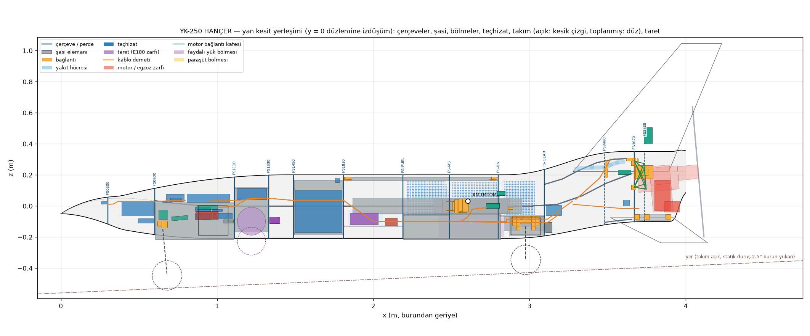
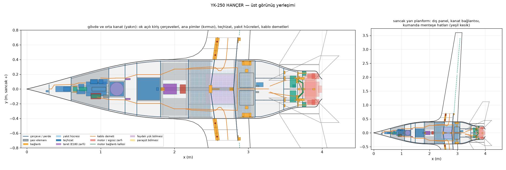
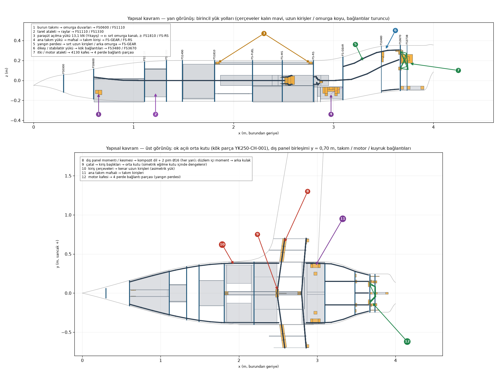
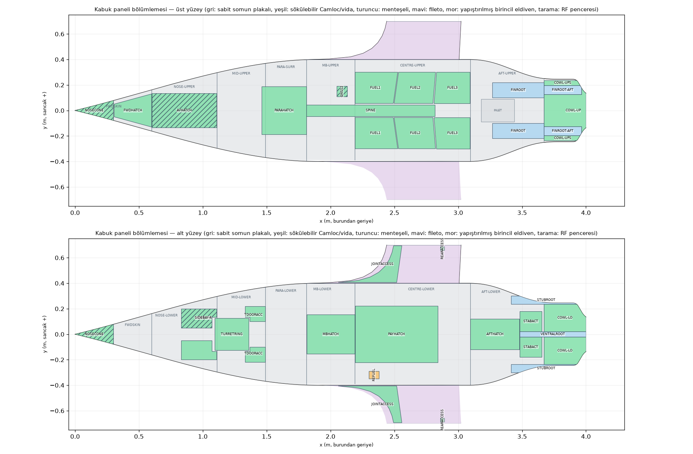
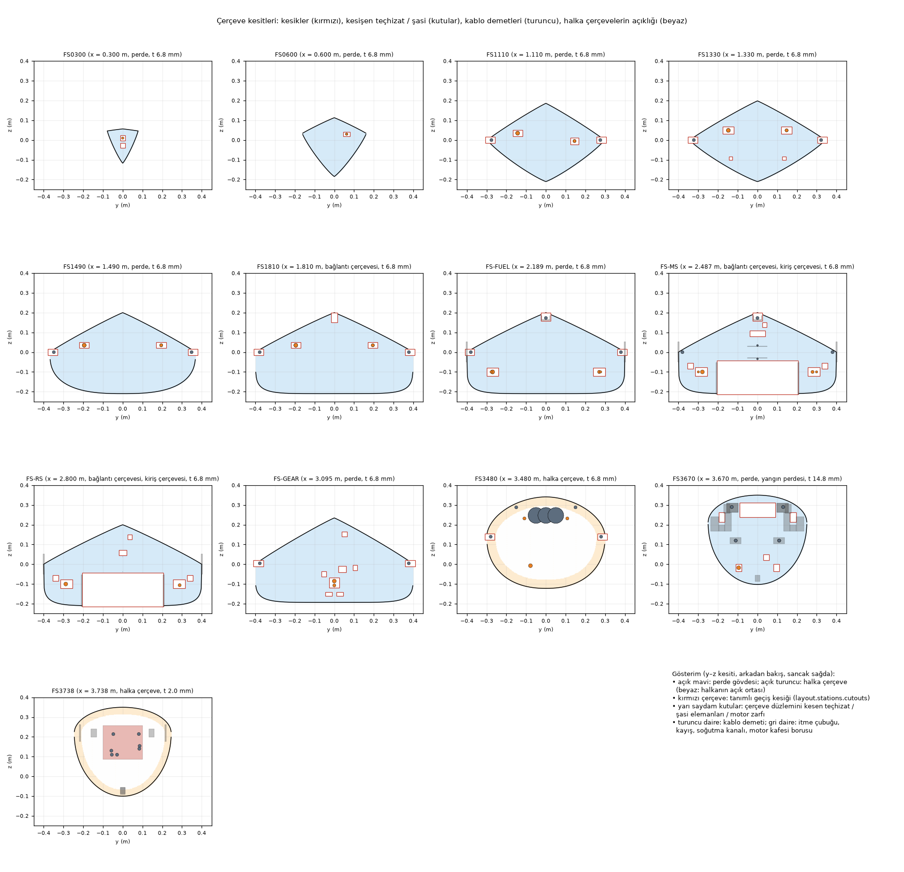

# YK-250 HANÇER — Yerleşim ve yapı arayüzü kontrolleri

Bu rapor `python3 -m ucav250.analysis.layout_check` tarafından `ucav250/spec.yaml` (`layout`, `assembly`) bölümlerinden üretilir; ayrıntılı tasarım modülleri (şasi, kanat, kuyruk, kabuk, itki, yakıt, takım, sistemler, faydalı yük) birbirlerinin geometrisini okumadan bu arayüzden çalışır. Açıklama ve gerekçeler: `docs/03_yerlesim_ve_yapi_konsepti.md`.

**Sonuç: 99/99 kontrol geçti** (155 yerleşim nesnesi, 285 yakın çift).

## 1. Kontrol özeti

| No | Kontrol | Değer | Sınır | Sonuç |
|---|---|---|---|---|
| C01 | parça numarası aralıkları modüller arasında çakışmıyor | – | – | GEÇTİ |
| C01 | parça kimlikleri YK250-<KOD>-NNN kuralına ve modül aralığına uyuyor | 0 | 0 | GEÇTİ |
| C01 | parça kimlikleri yerleşim içinde tekil | 0 | 0 | GEÇTİ |
| C01 | kök parça (orta kanat kutusu) bir şasi elemanı | YK250-CH-001 | YK250-CH-... | GEÇTİ |
| C01 | material / process pairs (99 parts): spec.materials and spec.processes keys, material family matches the process (fix round 3, PK3-08) | 0 | 0 | GEÇTİ |
| C01 | çapraz başvurular çözülüyor (temas, iniş yüzeyleri, RF pencereleri, mafsallar, açıklık seçicileri, kütle kalemleri, erişim kapakları) | 0 | 0 | GEÇTİ |
| C02 | istasyonlar x boyunca sıralı, kimlikler tekil | – | – | GEÇTİ |
| C02 | istasyon türü, malzeme/süreç/katman anahtarları, kalınlık >= süreç alt sınırı, yüzler | 0 | 0 | GEÇTİ |
| C02 | geçiş kesikleri çerçeve gövdesi içinde | 0,9 | >= 0 mm margin | GEÇTİ |
| C02 | edge notches at the frame tops (3): <= 50 mm wide, under a removable cover, U-doubler declared (fix round 2, PK2-02) | 0 | 0 | GEÇTİ |
| C02 | longeron notches (7 member crossings of straight frame webs): every crossing in a declared notch open to the frame edge, member section inside with >= 0.5 mm, insertion + shear clip + U-doubler declared (fix round 3, PK3-04) | 0 | 0 | GEÇTİ |
| C02 | çerçeveler yakıt, taret, takım kuyusu, yük/paraşüt/teçhizat hacimlerini kesmiyor | 0 | 0 | GEÇTİ |
| C02 | yakıt bölmeleri ok açılı kiriş çerçevelerini izliyor (çerçeve gövdesine boşluk) | 6,7 | >= 0 mm | GEÇTİ |
| C02 | fuel bay volume of the chevron bays vs required (mass.fuel_kg, expansion space) | 50,94 | >= 41,75 L | GEÇTİ |
| C02 | fuel system plumbing: every cell has a top vent valve and a floor sump / outlet, the feed pickup is in the feed cell, the interconnects into it carry check valves (fix round 3, PK3-01) | 0 | 0 | GEÇTİ |
| C02 | ok açılı bölmelerin kullanılabilir yakıt hacmi >= gerekli hacim | 50,51 | >= 41,75 L | GEÇTİ |
| C02 | unusable fuel (layer below the outlets x efficiency + contents of the non-vent lines, line OD as bore: conservative) <= trapped fuel booked by the sizing mission model (fuel_kg f / (1 + f), mission.trapped_fuel_fraction; fix round 3, PK3-01) | 0,494 | <= 0,594 kg | GEÇTİ |
| C02 | kablo, yakıt hattı, itme çubuğu ve kayış geçişleri tanımlı çerçeve kesiklerinden | 0 | 0 | GEÇTİ |
| C03 | teçhizat zarfları dış yüzeyin (OML) içinde, 10 mm pay | 1,1 | >= max(10 mm, skin + 2 mm) (value: worst margin, mm) | GEÇTİ |
| C03 | şasi elemanları OML içinde (kaplamaya oturan yüzler hariç) | 0 | >= skin (skin faces trimmed) (value: worst margin, mm) | GEÇTİ |
| C03 | bağlantı parçaları OML / kuyruk içinde | 0,3 | >= skin (value: worst margin, mm) | GEÇTİ |
| C03 | kanat / dikey eyleyicileri kesit içinde, 3 mm pay | 0,7 | >= skin + 2 mm (value: worst margin, mm) | GEÇTİ |
| C03 | antenna envelopes inside the inner skin surface (true distance to the OML vs the local skin; fix round 2, PK2-01/06/10) | 0,1 | >= skin + 2 mm (value: worst margin, mm) | GEÇTİ |
| C03 | kablo demetleri OML içinde (yarıçap + 3 mm) | 6 | >= 0 mm margin | GEÇTİ |
| C03 | yakıt hatları OML içinde (yarıçap + 3 mm) | 12,1 | >= 0 mm margin | GEÇTİ |
| C03 | motor bağlantı kafesi kaporta içinde | 18,4 | >= 0 mm margin | GEÇTİ |
| C03 | taret büyüme zarfı (toplanmış) OML içinde | 0 | 0 | GEÇTİ |
| C04 | içerik / yapı çakışması yok | 0 | 0 | GEÇTİ |
| C04 | harness corridors: trunk diameter + 10 mm free of every other object except the clamping members ('supports'), declared penetrations and the 30 mm terminations (layout.systems.harness.rules, KO-CORRIDOR-HARNESS; fix round 3, PK3-05) (114 close pairs) | 0 | 0 | GEÇTİ |
| C04 | yapı – yapı (elemanlar, bağlantı parçaları): çakışma yalnız parçaların bildirdiği temaslarda ('touch'; düzeltme turu 1, VPK-01/VPK-06) | 0 | 0 | GEÇTİ |
| C04 | bağlantı parçası zarfları kendi cıvata düzenlerini taşıyor: kenar >= 2 D metal / 2,5 D kompozit, aralık >= 3 D (düzeltme turu 1, VPK-07) | 0 | 0 | GEÇTİ |
| C05 | takım toplama dizisi (21 durum): ana takım lastiği – yapı / içerik | 12 | >= 12 mm | GEÇTİ |
| C05 | takım toplama dizisi (21 durum): burun takımı lastiği – yapı / içerik | 13,5 | >= 12 mm | GEÇTİ |
| C05 | takım toplama dizisi (21 durum): ana takım bacağı – yapı / içerik | 12 | >= 10 mm | GEÇTİ |
| C05 | takım toplama dizisi (21 durum): burun takımı bacağı – yapı / içerik | 15,8 | >= 10 mm | GEÇTİ |
| C05 | takım toplama dizisi (21 durum): ana takım bacağı door – yapı / içerik | 28,6 | >= 10 mm | GEÇTİ |
| C05 | takım toplama dizisi (21 durum): main trunnion door – yapı / içerik | 10,4 | >= 10 mm | GEÇTİ |
| C05 | takım toplama dizisi (21 durum): nose steering actuator – yapı / içerik | 14,5 | >= 10 mm | GEÇTİ |
| C05 | takım toplama dizisi (21 durum): ana takım iç kapağı – hareketli takım | 22,7 | >= 10 mm | GEÇTİ |
| C05 | takım toplama dizisi (21 durum): main trunnion door – hareketli takım | 12,3 | >= 10 mm | GEÇTİ |
| C05 | takım toplama dizisi (21 durum): nose doors – hareketli takım | 13 | >= 10 mm | GEÇTİ |
| C05 | taret E180 zarfı strok boyunca bölme duvarları / tavan / çerçevelere | 16,1 | >= 6 mm | GEÇTİ |
| C05 | taret E180 zarfı asansör raylarına / bilyalı vidaya | 30,3 | >= 5 mm | GEÇTİ |
| C05 | taret E180 zarfı kayar kapaklara (bağlı dizi) | 9 | >= 5 mm | GEÇTİ |
| C05 | HD59 topu ile açıklık halkası arası (radyal) | 5 | >= 5 mm | GEÇTİ |
| C05 | stabilatörler (tüm sapma) egzoz zarflarına | 123,5 | >= 50 mm | GEÇTİ |
| C05 | stabilatörler egzoz duman konisinin dışında | 193 | >= 0 | GEÇTİ |
| C05 | kanatçık / flap (tüm sapma) kanat eyleyicilerine | 74,4 | >= 3 mm | GEÇTİ |
| C05 | paraşüt kapağı (bağlı kapak, prizmatik kalkış, V çatı zarfı) dış antenlere, sondalara, ışıklara | 100 | >= 10 mm | GEÇTİ |
| C05 | dümen kökü (dikey açıklığının eta0 kesri) tüm sapmada gövde / kaporta yüzeyine | 19,6 | >= 8 mm | GEÇTİ |
| C05 | taret kapaklarının kayma bantlarında sökülebilir kesik yok (halka parçası hariç); halka bağlantı sıraları E180 açıklığına >= 10 mm, aralık bildirilen aralıkta (düzeltme turu 1, VPK-08) | 18 | >= 10 mm | GEÇTİ |
| C05 | montaj / bakım yolları (kanat dili, arka kulak, ana pimler ve çektirmeleri, raybalar, arka pim, motor, taret, batarya, paraşüt, görev tepsisi, stabilatörler, pervane) başka parçalardan boş (düzeltme turu 1, VPK-02/VPK-09) | 0 | 0 | GEÇTİ |
| C06 | every mass item whose hardware the layout places ('mass_item' tags) has a layout.mass_placement entry (13 items) | 0 | 0 | GEÇTİ |
| C06 | kütle yerleşimi yerleşim nesnelerinden yeniden hesaplananla aynı | 0 | <= 2 mm | GEÇTİ |
| C06 | spec kütle kalemleri yerleşim konumlarında (sizing --update-spec uygulandı) | 0 | <= 2 mm | GEÇTİ |
| C06 | boş uçak AM'si: spec kalemleri ile yerleşim kalemleri arasındaki fark | [-0; 0; -0] | <= 1 mm | GEÇTİ |
| C07 | taret görüş alanı: bütün dış çıkıntılar -5° konisinin üstünde | -0,39 | >= -5,0° | GEÇTİ |
| C07 | RF pencereleri: iç antenlerin tümü GFRP panel / uç kapağı altında | 0 | 0 | GEÇTİ |
| C07 | GNSS antenleri üst yüzey pencerelerinin altında | 2 | – | GEÇTİ |
| C07 | RF görüş hattı: iç antenler GFRP pencerelerinin >= %50'sini karbon / metal yapıya ve teçhizata takılmadan görüyor (düzeltme turu 1, VPK-10) | 98 | >= 50 % | GEÇTİ |
| C08 | Li-ion tampon batarya ile yakıt hücreleri arası | 1,624 | >= 1,0 m | GEÇTİ |
| C08 | yakıt hücreleri ile yangın perdesi ön yüzü arası (CS-LUAS.967(c)) | 0,6252 | >= 0,013 m | GEÇTİ |
| C08 | hiçbir kompozit eleman ya da bağlantı parçası yangın perdesinden motor bölmesine geçmiyor (elemanlar ön yüzde biter; düzeltme turu 1, VPK-06) | 0 | 0 | GEÇTİ |
| C08 | motor dinamik zarfı ile diğer nesneler arası | 10 | >= 10 mm | GEÇTİ |
| C08 | motor bağlantı kafesi ile SG750 arası | 17,7 | >= 10 mm | GEÇTİ |
| C08 | silindir/kafa sıcak bölgesi ile kompozit yapı arası | 60 | >= 25 mm | GEÇTİ |
| C08 | egzoz zarfı ile kalkansız kompozit yapı arası | 100 | >= 50 mm | GEÇTİ |
| C08 | egzoz zarfı ile kablo demetleri arası | 100 | >= 50 mm | GEÇTİ |
| C08 | ventral kanatçık ile egzoz zarfı / duman konisi | 137,3 | >= 50 mm (kutular) / koni dışında (duman) | GEÇTİ |
| C08 | pervane diski yasak bölgesi boş | 86,9 | >= 0 mm (outside) | GEÇTİ |
| C08 | composite shell panels and exposed tail lofts vs the cylinder-head envelope (KO-CYL-HOT; fix round 2, PK2-09) | 33,7 | >= 25 mm | GEÇTİ |
| C08 | composite shell panels and exposed tail lofts vs the exhaust routing envelopes (50 mm, 25 mm under a declared heat shield; declared stainless inserts replace the composite) | 0,1 | >= 0 mm over the required margin | GEÇTİ |
| C08 | hardware inside the hot zones (25 mm of the heads, 50 mm of the exhaust) is declared metal-only with its temperature basis (layout.heat_protection.hardware) | 0 | 0 | GEÇTİ |
| C08 | pervane diski yasak bölgesi boş | 0 | 0 | GEÇTİ |
| C08 | paraşüt açılma hacmi boş | 0 | 0 | GEÇTİ |
| C09 | kabuk panelleri: kenar payı, aralık, menteşe, RF malzemesi | 0 | 0 | GEÇTİ |
| C09 | erişim kapakları kendi yüzeylerinde (kenar çizgisine >= 25 mm, eldiven hücum kenarına >= 40 mm) | 0 | 0 | GEÇTİ |
| C09 | üst gövde burundan kaporta çıkışına kadar panellerle kaplı | 0 | 0 | GEÇTİ |
| C09 | panel kenar oturma yüzeyleri: sökülebilir / menteşeli her panelin kenar bandı listelenen bir oturma yüzeyinde (düzeltme turu 1, VPK-04/VPK-12) | 0 | 0 | GEÇTİ |
| C09 | panel 'lands' başvuruları geometrik: listelenen her oturma yüzeyi bir kenarın bir kısmını taşıyor | 0 | 0 | GEÇTİ |
| C09 | sökülebilir paneller arasındaki sabit kaplama şeritleri >= 2 × 19 mm rampa + 20 mm bağlantı sırası ya da ortak yapısal oturma yüzeyi | 0 | 0 | GEÇTİ |
| C09 | no interior overlap between removable / hinged panels and closed gear doors on the same surface, shared land or not (6 touching pairs; fix round 3, PK3-02) | 0 | 0 | GEÇTİ |
| C09 | every fixed skin declares (cutouts) each removable / hinged panel or door it overlaps (37 overlaps; fix round 3, PK3-02) | 0 | 0 | GEÇTİ |
| C09 | cradle pads (2 x 2) on fixed lower skin over a frame cap, off the hatches and gear doors, saddle blocks >= 10 mm from the main gear over its retraction (fix round 3, PK3-06) | 27,9 | >= 10 mm | GEÇTİ |
| C09 | sabit kuyruk yüzeyleri (dikey, kök parçası ve ventral kök kesim çizgileri) hiçbir sökülebilir panelden geçmiyor (düzeltme turu 1, VPK-05) | 0 | 0 | GEÇTİ |
| C10 | bakım: her teçhizat ve yakıt hücresi bir kapaktan sökülebilir: aynı yüz, açık geçiş (panel − 2 × 25 mm oturma) >= kalemin kesiti, söküm prizması boş (düzeltme turu 1, VPK-03) | 0 | 0 | GEÇTİ |
| C10 | kanat birleşimi erişim kapakları mevcut (ana pimler, arka pim) | 0 | 0 | GEÇTİ |
| C10 | bakım erişim matrisi: hiçbir kalem için birincil yapı sökülmüyor | 23 | – | GEÇTİ |
| C11 | montaj adımları 1..N, Türkçe başlık/alt montaj/metin/takım/kontrol | 42 | – | GEÇTİ |
| C11 | montaj şasi tezgâhından ayara kadar bütün grupları kapsıyor | 0 | 0 | GEÇTİ |
| C11 | taşıma birimleri R-29 / R-30 ile uyumlu | [2,904; 1,4] | [3,4; 2] | GEÇTİ |
| C11 | outer-panel transport envelope >= loft extents in the panel frame (span, chord-wise, normal) | [3,199; 0,728; 0,11] | [2,904; 0,728; 0,096] | GEÇTİ |
| C11 | sahada montaj ve bakım matrisi mevcut | 7 | – | GEÇTİ |
| C12 | mekanizma tanımları (alanlar, aralıklar, özellikler, ifadeler, L/R çiftleri, diziler) | 0 | 0 | GEÇTİ |
| C12 | rest pose = state at control value 0 of every sequence (physical gear-down / turret-in state); every coupled joint (expr) is in a sequence (fix round 3, PK3-03) | 0 | 0 | GEÇTİ |
| C12 | süpürme hacmi / koridor yasak bölgeleri (takım, kumanda yüzeyleri, kablo, itme çubukları) kayıtlı mafsallara ve aralıklarına başvuruyor | 0 | 0 | GEÇTİ |
| C12 | layout.clearances checks.py LISTE biçiminde | 26 | – | GEÇTİ |
| C12 | montaj yolları (eksen, strok, zarf), kapak / ray dış hatları ve panel kesikleri açık geometriyle tanımlı (düzeltme turu 1, VPK-09) | 0 | 0 | GEÇTİ |
| C13 | bağlantıların ilk ön boyutlandırması: emniyet payları >= 0 | 0,07 | >= 0 | GEÇTİ |

## 2. Kütle yerleşimi ve ağırlık merkezi

Boş kütle 101,6 kg; spec kalemlerinden AM [2,629; -0,0003; 0,048] m, yerleşim nesnelerinden AM [2,629; -0,0003; 0,048] m. Aşağıdaki kalemlerin konumu boyutlandırma evresinde varsayımdı; yerleşim evresinde yerleştirilen nesnelerin ağırlık merkezinden hesaplanır (`layout.mass_placement`) ve `sizing.mass_items` bunu uygular. Boyutlandırma evresi konumları `position_sizing_phase` alanındadır.

| Kütle kalemi | Boyutlandırma evresi x (m) | Yerleşim x (m) | Δx (m) | Esas |
|---|---|---|---|---|
| engine_group_installed | 3,83 | 3,591 | -0,2394 | engine.installed_items_kg at the layout positions (engine on the inclined crank axis; ECU in the mission bay,  |
| cooling_baffles_firewall_cowl_flap | 3,73 | 3,781 | 0,0511 | sizing.cooling_installation_mass components at the layout objects: firewall stainless layer (firewall_stackup. |
| dorsal_cooling_inlet_s_duct | 3,4 | 3,482 | 0,0815 | flush dorsal inlet (P-INLET) + S-duct to the firewall duct cut-out |
| actuators_stabilators_2x_DA30 | 3,737 | 3,619 | -0,1181 | DA 30 lying along y on the cool side of the firewall, pushrods through fireproof boots |
| actuators_nose_steering_brake_2x_DA26 | 1,825 | 0,8404 | -0,9849 | item basis: 2 x DA 26 datasheet + 0.10 installation (half each); the steering actuator travels with the leg (f |
| wiring_harness_connectors_coax | 1,9 | 2,301 | 0,4006 | cables 70 % (estimate) by trunk length x diameter^2 (layout.systems.harness) + outer-panel harnesses; connecto |
| flight_termination_lights | 1,684 | 2,32 | 0,6365 | FTS 0.15 kg + 3 x AveoFlash 0.083 kg at their installed places |
| keel_beams_longerons | 2 | 2,243 | 0,2427 | length-weighted centroid of the longitudinal members (chine longerons, keel walls, keel beams, dorsal longeron |
| frames_bulkheads | 1,88 | 2,408 | 0,5283 | 13 stations, mass ~ net web area (section inside the 6 mm skin inset minus the declared cut-outs and, for the  |
| engine_mount_4130 | 3,67 | 3,716 | 0,046 | mean of the truss tube mid-points and the ring nodes (layout.chassis.engine_mount) |
| parachute_attach_fitting | 1,65 | 2,272 | 0,6223 | dorsal spine channel (structures P-SPINE-*, about 65 % of the bottom-up mass) + two bridle fittings (Y-bridle) |
| floors_trays_rails | 1,4 | 1,766 | 0,3658 | area-weighted decks/floors + trays |
| hatch_frames_quick_access_fasteners | 1,5 | 2,346 | 0,846 | perimeter-weighted removable panels/hatches (frame lands, Camlocs, nutplates) |
| fin_ventral_root_fittings | 3,572 | 3,606 | 0,0341 | fin, stub and ventral root fittings at the frames |
| actuators_ailerons_2x_DA26 | 3,1 | 2,831 | -0,2685 | item basis: 2 x DA 26 datasheet + horns/pushrods 0.10 at the layout actuators (fix round 2, PK2-07) |
| actuators_flaps_2x_DA30 | 3,006 | 2,782 | -0,2242 | item basis: 2 x DA 30 datasheet + installation 0.10 + hinges/horns 0.20 at the layout actuators |
| actuators_rudders_2x_DA26 | 3,921 | 3,764 | -0,1572 | item basis: 2 x DA 26 datasheet + linkages 0.06 at the layout actuators (fin boxes) |
| main_gear_legs_wheels_brakes_emas_pair | 3,001 | 2,97 | -0,0302 | SAGITTA main leg 4.0 kg each (components.yaml) split as TOST wheel assembly 1.79 kg (research estimate) + DA-2 |
| nose_gear_leg_wheel_steering | 0,8443 | 0,8419 | -0,0024 | SAGITTA nose leg 3.5 kg (components.yaml) split as TOST nose wheel 0.365 + tyre 0.45 + tube 0.08 kg + DA-26-cl |
| gear_doors_wells_locks_sensors | 2,499 | 2,369 | -0,1293 | sizing.gear_doors_mass parts (door areas of the sizing door scheme, mass.rules.gear_doors) at the layout door  |
| turret_lift_mechanism_doors | 1,22 | 1,245 | 0,0254 | item basis split (mass.rules.turret_mechanism_kg, estimates) at the layout objects, turret retracted |
| parachute_uavos_200 | 1,65 | 1,65 | 0 | container box centre (components.yaml compartment 0.300 x 0.300 x 0.275 m) |
| fuel_system_3_cells | 2,642 | 2,607 | -0,0353 | components.yaml fuel_system + three-cell interconnection; the item has no published split, so it is placed at  |

## 3. Arayüz bağlantılarının ilk ön boyutlandırması

Yöntem: kapalı biçimli pim kesme / eğilme / ezilme ve cıvata grubu kesmesi, `spec.materials` izin verilen değerleri; yük katsayıları `structures` (FoS 1,5, bağlantı 1,15, pimli bağlantı ezilme 2,0, sık sökülen bağlantı 1,5) ve standards.yaml önerileri. Ayrıntılı tasarım SE/test ile değiştirir.

| Kalem | Uygulanan | İzin verilen | Emniyet payı | Esas |
|---|---|---|---|---|
| kanat birleşimi ana pimi, çift kesme | 134 | 599,8 | 3,48 | R = 35918 N (y = 0,7 m'de M_nihai 5483 N m, V_nihai 4467 N; pimler arası 184 mm) x 1,5 sık sökülen bağlantı katsayısı; MPa |
| kanat birleşimi ana pimi, eğilme | 844,1 | 923,9 | 0,09 | M = R/2 (t_çatal/2 + t_dil/4) = 339 N m; Ftu ile (plastik eğilme kazancı alınmadı); MPa |
| kanat birleşimi CFRP dil: burç ezilme basıncı (dış çap 22 x 30 mm, açık delik bası sınırı) | 107,4 | 175,4 | 0,63 | x 2,0 ezilme katsayısı; %2 kaymalı ezilme değeri e/D >= 3 ister, burç üstte ve altta UD flanşlarla kapalıdır, bu yüzden QI açık delik bası değeri kullanılır (muhafazakâr yerine koyma, eleman testi gerekli); MPa |
| kanat birleşimi CFRP çatal kulakları: burç ezilme basıncı (2 x dış çap 22 x 10 mm) | 163,3 | 175,4 | 0,07 | x 2,0 ezilme katsayısı; dildeki gibi açık delik bası sınırı; MPa |
| kayış bağlantısı çerçeve cıvataları 2 x M5 12.9 (tek kesme, şokun tamamı bu grupta) | 530,5 | 732 | 0,38 | 13,1 kN (GRS 4/240 yayımlanmış açılma şoku) yalnız nihai (CRASH-004) x 1,15 bağlantı katsayısı; ISO 898-1 12.9, gerilme alanında tau = 0,6 Rm; MPa |
| kayış bağlantısı omurga tabanı cıvataları 4 x M4 12.9 (tek kesme, şokun tamamı bu grupta) | 429 | 732 | 0,71 | 13,1 kN (GRS 4/240 yayımlanmış açılma şoku) yalnız nihai (CRASH-004) x 1,15 bağlantı katsayısı; ISO 898-1 12.9, gerilme alanında tau = 0,6 Rm; MPa |
| kayış kilit pimi Ø8 (Ti-6Al-4V, çift kesme) | 149,9 | 599,8 | 3 | MPa |
| kayış kilit pimi Ø8 eğilmesi (Melcon-Hoblit) | 711,8 | 923,9 | 0,3 | elastik, Ftu; MPa |
| kayış U-kulak ezilmesi (7075, 2 kulak 6 mm, e/D 1,94) | 313,9 | 968,5 | 2,09 | x 2,0 ezilme katsayısı; e/D 2'de MMPDS Fbru x (e/D)/2; MPa |
| MTOM'da açılma yük katsayısı (bilgi) | 8,91 | – | – | 13,1 kN / (MTOM g); UAVOS 200 anma değeri 5 g |
| motor bağlantı cıvatası M8 12.9 (tork + 3,8 g / 1,47 g yan / 6 g aşağı durumlarının en kötüsü) | 34,9 | 732 | 19,96 | motor + SG750 + adaptör 7,59 kg, AM bağlantı yüzünün 90 mm önünde (tahmin), x 1,5 (uçuş durumları) x 1,15; gerilme alanında birleşik kesme/çekme, 0,6 Rm ile karşılaştırma; MPa; karter dişi sıyrılması ve sönümleyici kapasitesi açık konu (Limbach verisi) |
| 15 g ileri çarpma tutması (motor kafese basar, kafes basıda) | 1284 | – | – | N; kaynaklı kafes basıyla taşır (4130 boruların ayrıntılı boyutlandırması) |

## 4. İstasyonlar (çerçeveler / perdeler)

| Kimlik | x (m) | Tür | Malzeme / süreç / katman | t (mm) | Kesikler |
|---|---|---|---|---|---|
| FS0300 | 0,3 | bulkhead | cfrp_pw_mtm45_as4 / prepreg_ooa_vacbag / rib_panel | 6,8 | C-PITOT, C-COAX-NC |
| FS0600 | 0,6 | bulkhead | cfrp_pw_mtm45_as4 / prepreg_ooa_vacbag / rib_panel | 6,8 | C-HARN-FWD |
| FS1110 | 1,11 | bulkhead | cfrp_pw_mtm45_as4 / prepreg_ooa_vacbag / rib_panel | 6,8 | C-HARN-1110, C-COAX-1110, C-CHINE |
| FS1330 | 1,33 | bulkhead | cfrp_pw_mtm45_as4 / prepreg_ooa_vacbag / rib_panel | 6,8 | C-HARN-1330, C-TDOOR-SHAFT, C-CHINE |
| FS1490 | 1,49 | bulkhead | cfrp_pw_mtm45_as4 / prepreg_ooa_vacbag / rib_panel | 6,8 | C-HARN-1490, C-CHINE |
| FS1810 | 1,81 | fitting frame | cfrp_pw_mtm45_as4 / prepreg_ooa_vacbag / rib_panel | 6,8 | C-HARN-1810, C-BRIDLE-F, C-CHINE |
| FS-FUEL | 2,189 | bulkhead | cfrp_pw_mtm45_as4 / prepreg_ooa_vacbag / rib_panel | 6,8 | C-HARN-FUEL, C-SPINE-FUEL, C-CHINE |
| FS-MS | 2,487 | fitting frame / spar frame | cfrp_pw_mtm45_as4 / prepreg_ooa_vacbag / rib_panel | 6,8 | C-PAYLOAD-MS, C-FUEL-MS, C-FUEL-MS-LO, C-VENT-MS, C-SPINE-MS, C-HARN-MS |
| FS-RS | 2,8 | fitting frame / spar frame | cfrp_pw_mtm45_as4 / prepreg_ooa_vacbag / rib_panel | 6,8 | C-PAYLOAD-RS, C-FUEL-SAD, C-FUEL-RS-LO, C-VENT-RS, C-HARN-RS |
| FS-GEAR | 3,095 | bulkhead | cfrp_pw_mtm45_as4 / prepreg_ooa_vacbag / rib_panel | 6,8 | C-FUEL-FEED, C-FUEL-RET, C-FUEL-VENT, C-FUEL-DRN, C-HARN-CL, C-DOORLINK, C-CHINE |
| FS3480 | 3,48 | ring | cfrp_pw_mtm45_as4 / prepreg_ooa_vacbag / rib_panel | 6,8 | C-CHINE |
| FS3670 | 3,67 | bulkhead / firewall | cfrp_pw_mtm45_as4 / prepreg_ooa_vacbag / rib_panel | 14,8 | C-DUCT, C-FW-FUEL, C-FW-HARN, C-FW-PUSHROD |
| FS3738 | 3,738 | ring | al_2024_t3_sheet / sheet_metal_aluminium / – | 2 | – |

## 5. Şasi elemanları ve bağlantılar

| Kimlik | Parça | Ad | Malzeme | Yük yolu |
|---|---|---|---|---|
| M-CHINE | YK250-CH-020 (L/R) | kenar çizgisi uzun kirişi | cfrp_ud_mtm45_as4 | skins (shear) -> chine longeron (axial) -> frames / wing box side-of-body rib |
| M-NGSILL | YK250-CH-038 | burun takımı yarık sonu kenar şeridi | cfrp_pw_mtm45_as4 | door edge (air loads, seal pressure) -> land strip -> FS1110 forward flange / keel walls |
| M-KEELWALL | YK250-CH-021 (L/R) | burun takımı omurga duvarı | cfrp_pw_mtm45_as4 | nose-gear loads -> pivot bushings -> keel walls -> FS0600 / FS1110 + avionics deck -> chine longerons |
| M-DECK-NOSE | YK250-CH-022 | aviyonik güverte | cfrp_pw_mtm45_as4 | equipment inertia -> deck -> keel walls + chine longerons -> FS0600 / FS1110 |
| M-TURRETWALL | YK250-CH-023 (L/R) | taret bölmesi yan duvarı | cfrp_pw_mtm45_as4 | turret inertia + elevator reactions -> walls -> FS1110 / FS1330 (belly cut-out edges: frames + skin doublers, not the wa |
| M-TURRETROOF | YK250-CH-024 | taret bölmesi tavanı | cfrp_pw_mtm45_as4 | turret elevator reaction -> roof -> walls / frames |
| M-PARAWALL | YK250-CH-025 (L/R) | paraşüt bölmesi yan duvarı | cfrp_pw_mtm45_as4 | container inertia -> walls/floor -> FS1490 / FS1810 |
| M-PARAFLOOR | YK250-CH-026 | paraşüt bölmesi tabanı | cfrp_pw_mtm45_as4 | container inertia -> floor -> FS1490 / FS1810 / walls |
| M-MIDFLOOR | YK250-CH-027 | görev bölmesi tabanı | cfrp_pw_mtm45_as4 | mission equipment inertia -> tray / floor strips -> frames + chine longerons |
| M-KEEL | YK250-CH-028 (L/R) | omurga kirişi (yük bölmesi duvarı) | cfrp_pw_mtm45_as4 | payload + belly loads -> keel beams -> FS-FUEL / spar frames -> wing box |
| M-FWDDECK | YK250-CH-029 | ön yakıt bölmesi tabanı / yük bölmesi tavanı | cfrp_pw_mtm45_as4 | fuel + payload inertia -> deck -> keel beams / FS-FUEL / main-spar frame |
| M-WELLROOF | YK250-CH-030 | ana takım kuyusu tavanı | cfrp_pw_mtm45_as4 | gear + fuel loads -> well roof -> gear beams / well keel web / rear-spar frame / FS-GEAR |
| M-GEARBEAM | YK250-CH-031 (L/R) | ana takım kirişi | cfrp_pw_mtm45_as4 | trunnion -> gear beam -> rear-spar frame + FS-GEAR + well roof -> wing box / chine longerons |
| M-DORSAL | YK250-CH-032 (L/R) | sırt uzun kirişi | cfrp_ud_mtm45_as4 | fin root fittings -> FS3480 / firewall corner fitting -> dorsal longerons -> FS-GEAR |
| M-PAYWALL-AFT | YK250-CH-034 | faydalı yük bölmesi arka duvarı | cfrp_pw_mtm45_as4 | secondary (closes the bay; payload loads go to the keel beams and the deck) |
| M-WELLWALL-FWD | YK250-CH-035 | ana takım kuyusu ön duvarı | cfrp_pw_mtm45_as4 | secondary (well closure, harness duct wall) |
| M-WELLKEEL | YK250-CH-036 (L/R) | ana takım kuyusu omurga gövdesi | cfrp_pw_mtm45_as4 | well-roof pressure / inner-door hinge loads -> keel webs -> well forward wall + FS-GEAR |
| M-AFTKEEL | YK250-CH-033 | arka omurga kirişi | al_7075_t651_plate | ventral fin / bumper strike -> aft keel beam -> firewall + ring frame |
| M-SPINE | YK250-CH-037 | sırt omurga kanalı (paraşüt kayış bağı) | cfrp_pw_mtm45_as4 | bridle legs -> F-RISER-FWD / F-RISER-AFT -> channel (axial) -> screws -> P-MB-UPPER (shear) -> chine longerons; vertical |
| M-VENTRALKEEL | YK250-CH-039 | ventral omurga şeridi (FS3480 -> yangın perdesi) | cfrp_pw_mtm45_as4 | ventral forward root (side loads) -> keel strip -> FS3480 / firewall |
| M-CTBOX | YK250-CH-001 | orta kanat kutusu (geçiş kutusu) | cfrp_ud_mtm45_as4 | outer panel -> tongue + pins -> fork -> spar caps (bending couple) / webs (shear) -> box -> spar frames + side-of-body r |
| M-CLRIB | YK250-CH-055 | orta kutu orta hat kaburgası (ok kırığı kaburgası) | cfrp_pw_mtm45_as4 | main-cap kink forces -> kink fittings -> bolts -> rib solid lands -> rib web (in-plane couple) -> end clips -> FS-MS / F |
| M-SOB | YK250-CH-050 (L/R) | gövde yanı kaburgası | cfrp_pw_mtm45_as4 | glove skins / fittings -> rib -> spars |
| M-GLOVERIB | YK250-CH-051 (L/R) | eldiven kaburgası | cfrp_pw_mtm45_as4 | glove skins / fittings -> rib -> spars |
| M-JOINTRIB | YK250-CH-052 (L/R) | birleşim kaburgası (orta kesit) | cfrp_pw_mtm45_as4 | glove skins / fittings -> rib -> spars |
| F-TRUNNION | YK250-CH-070 (L/R) | ana takım mafsal bağlantısı | al_7075_t651_plate | machined 7075-T651 fitting: flange (doubler) 8 mm on the inboard face of the gear beam, bolted 5 x M6 12.9 (axis y; 2 fo |
| F-UPLOCK | YK250-CH-072 (L/R) | ana takım yukarı kilit kancası bağlantısı | al_7075_t651_plate | machined bracket bolted 4 x M5 (axis z, 20 mm square) to the underside of the well roof deck (blind potted inserts from  |
| F-NG-PIVOT | YK250-CH-071 | burun takımı mafsal burç blokları | al_7075_t651_plate | two 7075 doubler blocks 64 x 46 x 6 mm on the INBOARD faces of the keel walls (inside the keel slot: the V belly leaves  |
| F-SPINDLE-NODE | YK250-CH-095 (L/R) | stabilatör düğüm bağlantısı (yangın perdesine bağlı) | al_7075_t651_plate | machined 7075-T651 node per side, cantilevered 92 mm aft from the firewall aft face: base flange 8 mm (U-shaped around t |
| F-FW-CORNER | YK250-CH-086 (L/R) | yangın perdesi üst köşe bağlantısı (motor ayağı, dikey arka kirişi, sırt eki) | al_7075_t651_plate | one machined 7075-T651 corner fitting per side replaces the separate upper engine-mount foot fitting, fin rear-spar fitt |
| F-EMOUNT-LO | YK250-CH-087 (L/R) | motor bağlantı parçası (yangın perdesi, alt) | al_7075_t651_plate | mount foot pad 56 x 32 mm bolted through the firewall stack with 2 x M8 12.9 (pitch 24 mm, edge 16 mm), 7075 backing pla |
| F-FIN-FRONT | YK250-CH-096 (L/R) | dikey ön kiriş bağlantısı | al_7075_t651_plate | clevis fitting 42 x 60 mm on the aft face of FS3480: fin front-spar root lug in the clevis on 2 x M6 12.9 (double shear  |
| F-STUB-FRONT | YK250-CH-098 (L/R) | sabit kök parçası ön bağlantısı | al_7075_t651_plate | clevis fitting 40 x 53 mm on the aft face of FS3480 at the body side: stub front-spar root lug on 2 x M6 12.9 (double sh |
| F-VENTRAL-1 | YK250-CH-099 | ventral kök bağlantısı 1 | al_7075_t651_plate | clevis fitting 32 x 24 mm on the aft keel beam (1 x M6 axis z): ventral root lug 1 x M6 12.9 (double shear, axis y) |
| F-VENTRAL-2 | YK250-CH-100 | ventral kök bağlantısı 2 | al_7075_t651_plate | clevis fitting 32 x 24 mm on the aft keel beam (1 x M6 axis z): ventral root lug 1 x M6 12.9 (double shear, axis y) |
| F-VENTRAL-3 | YK250-CH-101 | ventral kök bağlantısı 3 | al_7075_t651_plate | clevis fitting 32 x 24 mm on the aft keel beam (1 x M6 axis z): ventral root lug 1 x M6 12.9 (double shear, axis y) |
| F-KINK-UP | YK250-CH-056 | orta kutu kırık bağlantısı, üst ana başlık | al_7075_t651_plate | fix round 3 (VS3-03): machined 7075-T651 L-fitting: plate 40 x 100 x 2 mm bonded (EA 9394) to the box-side face of the m |
| F-KINK-LO | YK250-CH-057 | orta kutu kırık bağlantısı, alt ana başlık | al_7075_t651_plate | fix round 3 (VS3-03): machined 7075-T651 L-fitting: plate 40 x 100 x 2 mm bonded (EA 9394) to the box-side face of the m |
| F-FORK | YK250-CH-053 (L/R) | dış panel birleşim çatalı (eldiven ana kiriş kutusu, CFRP) | cfrp_pw_mtm45_as4 | layout.chassis.wing_joint.main_spar.fork (the glove main-spar box of the centre wing box: UD caps, two +-45 prongs padde |
| F-REARSLOT | YK250-CH-054 (L/R) | arka kiriş yuva bağlantısı (dış panel kulağı, düşey pim) | al_7075_t651_plate | layout.chassis.wing_joint.rear_spar.slot_fitting |
| F-RISER-FWD | YK250-CH-112 | paraşüt ön kayış bağlantısı | al_7075_t651_plate | U-lug fitting in the dorsal spine channel M-SPINE: flange 6 mm on the frame face with 2 x M5 12.9 (axis x) into the fram |
| F-RISER-AFT | YK250-CH-113 | paraşüt arka kayış bağlantısı | al_7075_t651_plate | U-lug fitting in the dorsal spine channel M-SPINE: flange 6 mm on the frame face with 2 x M5 12.9 (axis x) into the fram |

Dış panel birleşimi y = 0,7 m: pimli kompozit dil-çatal, iki Ø16 mm Ti-6Al-4V pim ([2.552, 0.463, -0.003], [2.578, 0.645, 0.005]), arka kirişte yuva bağlantısındaki kulak ve düşey Ø8 mm bilyalı kilit pimi (veter yönü kuvvet ve düzlem içi moment çifti); takma yolu ana kiriş ekseni boyunca 0,3 m.

Motor bağlantısı: welded 4130 N tube bed mount: 4 feet on the firewall fittings (upper: F-FW-CORNER, lower: F-EMOUNT-LO, R/L) -> a welded ring (4130 tube 15.9 x 0.89 mm) in a plane 30 mm forward of the crankcase mount face; 4 elastomer isolators in the ring cups carry the engine on its 4 rear crankcase bosses — 4 x M8 cıvata, sönümleyici: Limbach optional 'Damper Shock Mount' (engine.yaml installation.mount.isolators; dimensions and stiffness not published); yangın perdesi yığını CFRP sandwich bulkhead (layups.rib_panel) 6,8 mm, air gap on 12 stainless stand-offs (insulation blanket optional) 7,6 mm, AISI 304 stainless sheet 0.4 mm, fireproof without test (>= 0.38 mm, standards.yaml FIRE-001; fix round 2: 0.5 -> 0.4 mm, air gap 7.5 -> 7.6 mm, stack unchanged 14.8 mm) 0,4 mm.

Paraşüt: Y-kayış, ön ayak 1,598 m (F-RISER-FWD), arka ayak 1,36 m (F-RISER-AFT); açılma yükü 13,1 kN tek ayakta, nihai yalnız (CRASH-004).

## 6. Mekanizmalar

| Mafsal | Tür | Eksen | Alt / üst | Özellik / ifade |
|---|---|---|---|---|
| aileron_R | revolute | [0.08, 0.995, 0.056] | -0,3491 / 0,3491 | aileron_deg  |
| aileron_L | revolute | [-0.08, 0.995, -0.056] | -0,3491 / 0,3491 | aileron_deg  |
| flap_R | revolute | [0.08, 0.995, 0.062] | 0 / 0,6981 | flap_deg  |
| flap_L | revolute | [-0.08, 0.995, -0.062] | 0 / 0,6981 | flap_deg  |
| rudder_R | revolute | [0.448, 0.335, 0.829] | -0,4363 / 0,4363 | rudder_deg  |
| rudder_L | revolute | [0.448, -0.335, 0.829] | -0,4363 / 0,4363 | rudder_deg  |
| stabilator_R | revolute | [0.0, 1.0, 0.0] | -0,3491 / 0,2618 | elevator_deg  |
| stabilator_L | revolute | [0.0, 1.0, 0.0] | -0,3491 / 0,2618 | elevator_deg  |
| main_gear_R | revolute | [-1.0, 0.0, 0.0] | 0 / 1,885 | gear_up `1.88496*clamp((gear_up-0.15)/0.7,0,1)` |
| main_gear_L | revolute | [1.0, 0.0, 0.0] | 0 / 1,885 | gear_up `1.88496*clamp((gear_up-0.15)/0.7,0,1)` |
| main_inner_door_R | revolute | [-1.0, 0.0, 0.0] | 0 / 1,658 |  `1.65806*(clamp(gear_up/0.15,0,1)-clamp((gear_up-0.85)/0.15,0,1))` |
| main_inner_door_L | revolute | [1.0, 0.0, 0.0] | 0 / 1,658 |  `1.65806*(clamp(gear_up/0.15,0,1)-clamp((gear_up-0.85)/0.15,0,1))` |
| main_trunnion_door_R | revolute | [1.0, 0.0, 0.0] | 0 / 2,182 |  `2.18166*(1-clamp((gear_up-0.7333)/0.1167,0,1))` |
| main_trunnion_door_L | revolute | [-1.0, 0.0, 0.0] | 0 / 2,182 |  `2.18166*(1-clamp((gear_up-0.7333)/0.1167,0,1))` |
| nose_gear | revolute | [0.0, -1.0, 0.0] | 0 / 1,571 |  `1.57080*clamp((gear_up-0.15)/0.7,0,1)` |
| nose_steer | revolute | [0.0, 0.0, -1.0] | -0,3491 / 0,3491 | steer_deg  |
| nose_door_R | revolute | [0.996, 0.0, -0.088] | 0 / 1,571 |  `1.57080*(1-clamp((gear_up-0.85)/0.15,0,1))` |
| nose_door_L | revolute | [-0.996, 0.0, 0.088] | 0 / 1,571 |  `1.57080*(1-clamp((gear_up-0.85)/0.15,0,1))` |
| turret_elevator | prismatic | [0.0, 0.0, -1.0] | 0 / 0,128 | turret `0.1280*clamp((turret-0.2)/0.8,0,1)` |
| turret_door_R | prismatic | [0.0, 0.899, 0.438] | 0 / 0,12 |  `0.12*clamp(turret/0.2,0,1)` |
| turret_door_L | prismatic | [0.0, -0.899, 0.438] | 0 / 0,12 |  `0.12*clamp(turret/0.2,0,1)` |
| para_hatch | prismatic | [0.0, 0.0, 1.0] | 0 / 0,15 | para_hatch  |
| prop_spin | revolute | [0.996, 0.0, 0.087] | 0 / 2,094 | prop_deg  |

Dizi `gear_retraction`: 21 örnek durum, denetim özelliği `gear_up`.

Dizi `turret_extension`: 13 örnek durum, denetim özelliği `turret`.

## 7. Kabuk

Panel sayısı (L/R ayrı): sökülebilir 31, sabit 18, menteşeli 1, fileto 7; RF pencereleri: P-NOSECONE, P-AVHATCH, P-SIDEBAY-R, P-GNSS2.

## 8. Bakım erişim matrisi

| Kalem | Erişim | Bağlantı elemanı | Birincil yapı sökülür mü |
|---|---|---|---|
| bujiler, silindirler, CHT/EGT algılayıcıları, egzoz, hava yönlendiricileri | P-COWL-UP, P-COWL-UPS, P-COWL-LO | Camloc | hayır |
| motor (sökme) | P-COWL-UP, P-COWL-UPS, P-COWL-LO | Camloc + 4 x M8 bağlantı cıvatası | hayır |
| yakıt pompası/filtresi + boşaltma, iç kapak eyleyicileri, kuyruk konnektörü, motor kablo bağlantısı | P-AFTHATCH | Camloc | hayır |
| motor ECU, görev bilgisayarı / kayıt cihazı | P-MBHATCH | Camloc | hayır |
| stabilatör eyleyicileri (DA 30), itme çubukları ve körükleri, yakıt kesme vanası | P-STABACT | Camloc | hayır |
| stabilatör mili yatakları | P-COWL-UPS, stabilatör sökülerek | Camloc + çapraz cıvata | hayır |
| yakıt hücreleri (muayene, değiştirme) | P-FUEL1, P-FUEL2, P-FUEL3 | M4 somun plakalı vida + conta | hayır |
| PDU, kontaktör/sigortalar, DC-DC, burun kablo demeti | P-AVHATCH | Camloc | hayır |
| Li-ion tampon batarya, bağımsız FTS birimi | P-FWDHATCH | Camloc | hayır |
| jeneratör güç elektroniği, fren eyleyicisi + ana silindir | P-SIDEBAY-L | Camloc | hayır |
| otopilot, veri bağları, transponder | P-SIDEBAY-R | Camloc | hayır |
| burun antenleri, uzaktan kimlik vericisi, pitot hatları | P-NOSECONE | 8 x M4 | hayır |
| EO/IR taret (HD59 / E180) | P-TURRETRING | 14 x M4 + 4 taret bağlantı cıvatası | hayır |
| taret asansörü, kayar kapaklar | P-TURRETRING, P-TDOORACC | M4 / Camloc | hayır |
| paraşüt (12 ayda bir katlama, UAVOS servis ömrü) | P-PARAHATCH | mandal | hayır |
| araştırma faydalı yükü | P-PAYHATCH | Camloc | hayır |
| ana takım bacakları, EMA'lar, kilitler, frenler, orta kablo kanalı | ana takım kuyuları (takım açık, iç kapaklar bakım modunda) | - | hayır |
| ana takım mafsal bağlantıları F-TRUNNION, yukarı kilit bağlantıları F-UPLOCK (bağlantı elemanları) | ana takım kuyuları (takım açık, mafsal kapağı açık) | bağlantı başına 5 x M6 12.9 takım kirişinin yapıştırılmış ankrajlarına (başlar kuyuda) + 4 x M6 12.9 kuyu tavanının yakıt tarafındaki sızdırmaz kubbe somun plakalarına; yukarı kilit 4 x M5 kör dökme insertlere | hayır |
| burun takımı, yönlendirme | omurga yuvası (takım açık), P-SIDEBAY-L, P-SIDEBAY-R | Camloc | hayır |
| kanat birleşim pimleri, emniyetleri, kanat konnektörü | P-JOINTACCESS, P-REARACCESS | Camloc / süngü kapak | hayır |
| kanatçık / flap eyleyicileri | dış panel alt servo kapakları (kanat modülü) | M4 dişli burç | hayır |
| dümen eyleyicileri, dikey uç antenleri, kuyruk ışığı | dikey servo kapakları (iç yüz), dikey uç kapakları | M4 | hayır |
| GNSS antenleri | P-AVHATCH, P-GNSS2 | Camloc / M4 | hayır |

## 9. Montaj ve taşıma

42 montaj adımı (spec.assembly.steps): 1. Ana montaj tezgâhının hazırlanması; 2. Orta kanat kutusunun yerleştirilmesi (kök parça); 3. Ana ve arka kiriş çerçeveleri; 4. Gövde yanı, eldiven ve birleşim kaburgaları; 5. Kompozit kanat çatalı burçları ve arka kiriş yuva bağlantısı; 6. Ön gövde çerçeveleri; 7. Burun kutusu: omurga duvarları, aviyonik güverte, burun takımı mafsalı; 8. Taret, paraşüt ve görev bölmeleri; 9. Kenar çizgisi uzun kirişleri (ön parçalar); 10. Omurga kirişleri, güverteler ve ana takım yapısı; 11. Arka gövde: sırt uzun kirişleri, kuyruk ve ventral bağlantıları; 12. Yangın perdesi, motor bağlantı parçaları ve arka kenar çizgisi uzun kirişleri; 13. Stabilatör düğüm bağlantıları ve motor bölmesi alt U halkası; 14. Paraşüt, taret asansörü, yakıt bölmesi ve teçhizat bağlantıları; 15. Şasi muayenesi ve tezgâhtan ayırma; 16. Sabit gövde kaplamaları; 17. LERX/eldiven kaplamalarının yapıştırılması; 18. Yakıt sistemi; 19. Elektrik tesisatı; 20. Aviyonik ve güç dağıtımı; 21. Antenler ve hava verisi; 22. Paraşüt sistemi; 23. Görev bilgisayarı ve yük tepsisi rayları; 24. Taret asansörü, kayar kapaklar ve HD59; 25. Motorun takılması; 26. Egzoz, soğutma, motor yardımcıları; 27. Pervane göbeği, pervane ve spinner; 28. Ana iniş takımı; 29. Burun iniş takımı; 30. Takım kapakları ve sıralama; 31. Stabilatör kök parçaları, milleri ve eyleyicileri; 32. Dikey kuyruklar ve dümenler; 33. Ventral kanatçık ve tampon kızağı; 34. Stabilatörlerin takılması; 35. Dış kanat panelleri (ilk takma); 36. Kabuğun kapatılması; 37. Kumanda yüzeylerinin ayarı; 38. Fonksiyon testleri; 39. Tartı ve denge; 40. Son muayene ve kabul; 41. Taşıma için sökme; 42. Sahada montaj.

Taşıma dört parçalıdır: kanat eldiveni, dikeyler, kök parçaları ve ventral ile birlikte orta gövde (1,40 m genişlik, 4,23 m boy, takım içeride 1,29 m yükseklik), iki dış kanat paneli (2,90 m açıklık, dil dahil 3,20 m), iki stabilatör ve pervane.

## 10. Şekiller

